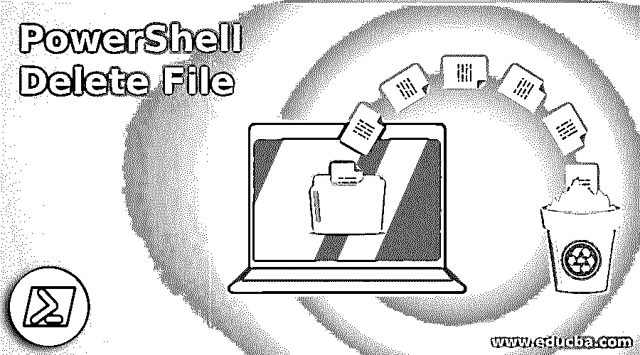
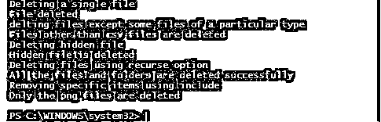
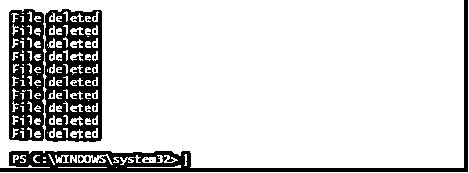

# PowerShell 删除文件

> 原文：<https://www.educba.com/powershell-delete-file/>

## PowerShell 删除文件简介

在 PowerShell 删除文件中，要删除 PowerShell 中的项目，可以使用 Remove-Item cmdlet。此 cmdlet 不仅用于删除文件，还用于删除文件夹、函数、注册表项等。系统管理员最重要的工作之一是确保驱动器上有足够的空间，这个过程被称为内务处理。这些类型的活动可以使用基于特定条件删除文件的脚本来自动化。本文将详细介绍如何使用 Remove-Item cmdlet 删除文件，以及如何实现自动化。

### 句法

下面是 PowerShell 删除文件的语法:

<small>Hadoop、数据科学、统计学&其他</small>

`Remove-Item[-Path] <String[]>[-Filter <String>][-Include <String[]>][-Exclude <String[]>][-Recurse][-Force] [-Credential <PSCredential>][-WhatIf][-Confirm][-Stream <String[]>] [<CommonParameters>] Remove-Item-LiteralPath <String[]>[-Filter <String>][-Include <String[]>][-Exclude <String[]>][-Recurse][-Force][-Credential <PSCredential>][-WhatIf] [-Confirm][-Stream <String[]>][<CommonParameters>]`

#### 因素

以下是参数:

**确认:**在运行 cmdlet 之前，向客户端显示一个确认。这个参数的信息分类是一个开关。这是暗指假定的名称 cf。默认的尊重是无。该参数不承认管道输入，而且不允许使用通配符。

**Exclude:** 执行 cmdlet 时，不会考虑为此参数提供的值。这通常被认为是路径参数的值。它允许传递通配符。只有在使用通配符运行 cmdlet 而不是针对特定文件或项目时，才能使用此选项。该参数的信息排序为 String[]。默认的尊重是无。该参数不确认管道输入，但允许使用通配符。

**Filter:** 用于过滤可以运行 cmdlet 的对象。这是有效的，因为它在开始时应用过滤器，而不是在获取所有对象之后。该参数的信息类型是字符串。默认的尊重是无。该参数不确认管道输入，但允许使用通配符。

**Force:** 授权 cmdlet 清空无法更改的内容，如被覆盖的或只读的记录或只读的别名或因素。cmdlet 无法清空具有常量值的变量和别名。实现因提供程序而异。实际上，利用驱动器参数，cmdlet 不能取消安全限制。该参数的信息类别是开关。默认的尊重是无。该参数不确认管道输入，并且不允许使用通配符。

**Include:** 只有在执行 cmdlet 时，才会考虑为此参数提供的值。这意味着仅由该参数表示的对象不会被删除。只有在使用通配符运行 cmdlet 而不是针对特定文件或项目时，才能使用此选项。该参数的信息排序为 String[]。默认的尊重是无。该参数不确认管道输入，但允许使用通配符。

**LiteralPath:** 表示到一个或多个地点的路。对文学道路的尊重正是因为它是书面的而被利用。单引号用于区分转义序列。应该提供此参数的值，以说明它如何出现在其属性中。该参数的信息排序为 String[]。它被假定的名字暗示了。默认的尊重是无。该参数确认管道输入，不允许使用通配符。

**路径:**这是要删除的项目所在的路径。该参数的信息排序为 String[]。默认的尊重是无。该参数确认管道输入，也允许使用通配符。

**Recurse:** 如果指定的路径有一些文件夹和子文件夹，这表示在执行操作时也需要考虑那些子项。然而，这对于已知的 include 参数来说效果不好。这个参数的信息分类是一个开关。默认的尊重是无。该参数不确认管道输入，也不允许使用通配符。

**流:**此参数仅在文件系统驱动器中使用。此参数的信息排序是字符串[]。默认的尊重是无。该参数不认可管道输入，而允许使用通配符。

### 实现 PowerShell 删除文件的示例

下面是提到的例子:

#### 示例#1

**代码:**

`Write-Host "Deleting a single file"
#Remove-Item -Path "C:\Vignesh\Test\AD Group export to csv.txt"
Write-Host "File deleted" -ForegroundColor Green
Write-Host "delting files except some files of a particular type"
#Remove-Item -Path "C:\Vignesh\Test\*" -Exclude *.csv
Write-Host "Files other than csv files are deleted" -ForegroundColor Green
Write-Host "Deleting hidden file"
#Remove-Item -Path "C:\vignesh\Test\Path.csv" -Force
Write-Host "Hidden file is deleted" -ForegroundColor Green
Write-Host "Deleting files using recurse option"
#Remove-Item -Path "C:\vignesh\Test" -Recurse
Write-Host "All the files and folders are deleted successfully" -ForegroundColor Green
Write-Host "Removing specific items using include"
#Remove-Item -Path "C:\Vignesh\New folder\*" -Include *.png
Write-Host "Only the png files are deleted" -ForegroundColor Green`

**输出:**

#### 实施例 2

自动删除文件:

**代码:**

`Write-Host"Deleting files greater than 60 days"
Get-ChildItem–Path"C:\logs"-Recurse|Where-Object {($_.LastWriteTime -lt (Get-Date).AddDays(-60))} |Remove-Item
Write-Host"File deleted"-ForegroundColorGreen
Write-Host"Deleting files that are greater than 1000 mb"
$path="C:\vignesh\logs"
$allowedsize=1000
$fsize= (Get-ChildItem$path|Measure-Object-propertylength-sum)
$Sizeinmb="{0:N2}"-f ($fsize.sum /1MB) +"MB"
if ($Sizeinmb-ge$allowedsize) {
Get-ChildItem$path-Recurse|Remove-Item–Force
Write-Host"File deleted"-ForegroundColorGreen
}`

**输出:**

**解释:**上面的脚本删除超过 60 天的文件和大于 1000 MB 的文件。通过在任务计划程序中创建一个任务，上面的脚本可以每天自动运行。

### 结论

因此，本文详细解释了如何在 PowerShell 中删除文件。它还解释了在删除文件时可以使用的各种包含和排除场景。它还展示了如何使用脚本和任务调度器来自动化删除操作。要了解更多细节，建议编写示例程序并实践它们。

### 推荐文章

这是 PowerShell 删除文件的指南。这里我们讨论 PowerShell 删除文件的介绍，带参数的语法，例子。您也可以浏览我们的其他相关文章，了解更多信息——

1.  [PowerShell 模块](https://www.educba.com/powershell-modules/)
2.  [有用的 PowerShell 脚本](https://www.educba.com/useful-powershell-scripts/)
3.  [PowerShell 副本-项目](https://www.educba.com/powershell-copy-item/)
4.  [PowerShell 移动项目](https://www.educba.com/powershell-move-item/)

