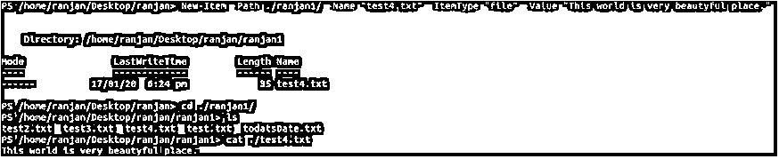
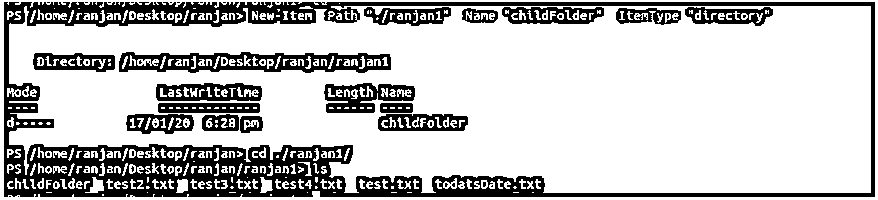
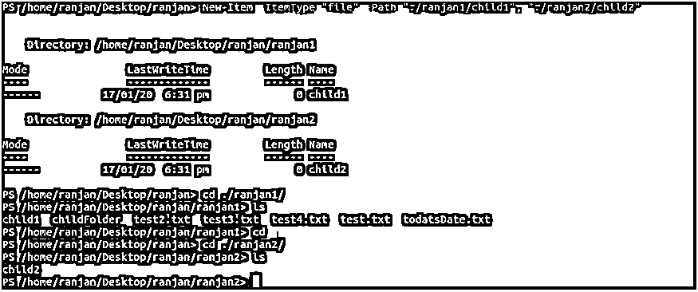
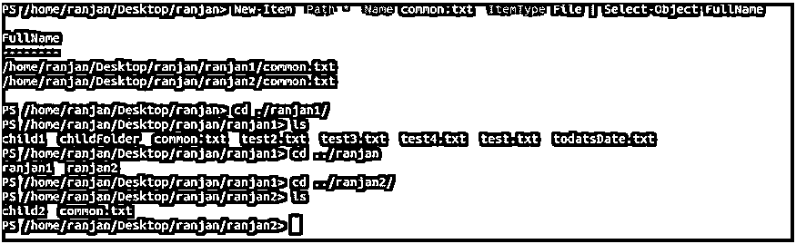
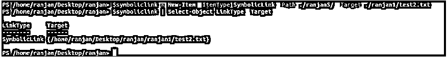

# PowerShell 新项目

> 原文：<https://www.educba.com/powershell-new-item/>

## PowerShell 新项目简介

它的名字本身就说明了它的行为。所以你认为它会创造新的东西，所以你是完全正确的。因此，如果我们想要创建任何新项目，基本上可以使用 new-Item 命令。新项目可以是目录中的任何文件，也可以是一个目录中的多个文件。新项目允许我们在一次执行中在多个目录下创建文件。New-Item 命令的好处是它将在文件夹和注册表中创建一个文件。我们甚至可以编写命令在文件夹中创建一个文件，并在文件中写入一些内容。

### PowerShell 新项目中的语法

以下是 PowerShell 新项目的语法:

<small>Hadoop、数据科学、统计学&其他</small>

**语法#1**

`New-Item
[-Path] <String path where new item will be created>
[-ItemType <Type of item going to be created like file, folder etc>] [-Value <Object of value of new item>] [-Force<create new item even read only access>] [-Credential <PSCredential>] [-WhatIf<display outcome of command execution>] [-Confirm<display prompt for yes or not>] [<CommonParameters>]`

**语法#2**

`New-Item
[[-Path] <String path where new item will be created>] -Name <Name of new item to be created>
[-ItemType <Type of item going to be created like file, folder etc>] [-Value <Object of value of new item>] [-Force<create new item even read only access>] [-Credential <PSCredential>] [-WhatIf<display outcome of command execution>] [-Confirm<display prompt for yes or not>] [<CommonParameters>]`

#### 新项目 PowerShell 中的参数

以下几点解释了 PowerShell 新项目中的参数:

**1。确认:**这是一个非常有用的命令，假设你要运行一个命令，这个命令将创建一个新文件，如果一个文件夹中存在相同的文件，它将替换它。因此，在这种情况下，您可能会替换任何重要的文件。在这种情况下，建议使用 confirm 命令，因为它会在执行命令之前发出警告，并在提示框中要求您输入 yes 或 no 进行确认。如果您输入 yes，它将执行命令，否则将不执行命令。

**2。强制:**当执行权限较少时，强制命令将与新项目创建一起使用。例如，如果您对目录没有写权限，这意味着您只有读权限，在这种情况下，我们可以使用强制创建新项目命令。在现有项目的情况下，也将使用它。它将强制创建一个新项目。

**3。ItemType:** 我们知道我们可以添加一个新项目，但问题是我们可以添加哪些项目。我们可以添加许多东西，比如下面给出的一个新项目。

*   我们可以将任何目录作为一个项目
*   我们可以在一个目录中添加一个或多个文件
*   我们也可以创建一个符号链接
*   我们可以将 Junction 添加为一个新项目
*   我们可以添加一个硬链接作为新项目

除了这些种类的新项目，我们还可以在证书驱动器中添加项目，如下所示

*   我们可以添加任何证书提供者作为新项目
*   我们可以将证书添加为新项目
*   我们可以添加存储一个新项目
*   我们可以添加商店位置作为新项目

**4。名称:**定义将要添加的项目的名称。该名称可以在名称和路径参数值中定义。我们还可以在名称或路径值中定义一个新的条目路径。

**5。Path:** 定义了将要创建的新条目的路径。好的一面是我们也可以使用通配符作为路径名。例如，我们可以将“*”作为路径名，这意味着在根目录的所有文件夹中创建一个新文件或项目。

**6。Value:** 该命令定义了新条目的值，它可以是任何文件或目录的名称。提供的值将被添加到定义的路径中。我们将在示例部分看到更多内容。

**7。****what if:**很多时候当我们要执行任何命令时我们都不知道命令执行的结果，所以借助于-WhatIf 命令，我们将能够预测命令执行的结果。为了安全起见，我们可以使用这个命令。

### 实现 PowerShell 新项目的示例

以下是在 PowerShell 中实现新项目的示例:

#### 示例#1

请看下面的例子，我们在 ranjan1 目录中创建了一个名为 test4.txt 的文件。在执行该命令时，它在 ranjan1 目录中创建了一个文件 test4.txt。我们创建的文件包含文件中的值参数，即“这个世界是一个非常美丽的地方。”

**代码:**

`New-Item -Path ./ranjan1/ -Name "test4.txt" -ItemType "file" -Value "This world is very beautyful place.”`

**输出:**

#### 实施例 2

请看下面的例子，我们在 ranjan1 目录中创建了一个名为 childFolder 的文件夹。在执行该命令时，它在 ranjan1 目录中创建了一个文件 childFolder。见下面的例子和屏幕。

**代码:**

`New-Item -Path "./ranjan1" -Name "childFolder" -ItemType "directory"`

**输出:**

#### 实施例 3

在本例中，我们通过运行一个命令来创建两个名为 child1 和 child2 的文件。在命令中，我们可以看到我们正在传递-ItemType，在 ItemType 中我们正在传递 file。

**代码:**

`New-Item -ItemType "file" -Path "./ranjan1/child1", "./ranjan2/child2"`

**输出:**

#### 实施例 4

在下面的命令中，我们在根目录下的所有目录中创建了一个 common.txt 文件。因为我们在这里使用通配符，这意味着我们使用“*”它将在当前目录的所有目录中创建 common.txt 文件。

**代码:**

`New-Item -Path *`

`-Name common.txt -ItemType File | Select-Object FullName`

**输出:**

#### 实施例 5

在本例中，我们创建了一个符号链接文件，我们将符号链接命令的执行值赋给一个名为$symboliclink 的变量，并将其赋值，我们可以在下面的示例和屏幕中看到。如果你想自动反映一个文件在许多目录中的变化而不改变许多位置，符号链接的创建是有用的，这意味着一个文件中的变化将反映在任何目录中的所有其他符号链接的文件中。

**代码:**

`$symboliclink = New-Item -ItemType SymbolicLink -Path ./ranjan5/ -Target ./ranjan1/test2.txt
$symboliclink | Select-Object LinkType, Target`

**输出:**

### 结论

从本教程中，我们了解到命令 New-Item 可以在多个位置创建各种类型的项目。我们还了解到，我们可以用一个命令在多个地方创建一个项目。这个命令对于在重复的时间基础上执行太多文件的创建非常有用，因为它将在一个命令上创建所有位置。

### 推荐文章

这是 PowerShell 新项目的指南。在这里，我们讨论在 Powershell 中使用适当的代码和输出来实现新项目的语法、参数和示例。您也可以浏览我们的其他相关文章，了解更多信息——

1.  [PowerShell 多维数组](https://www.educba.com/powershell-multidimensional-array/)
2.  [PowerShell 中的 Try-catch](https://www.educba.com/try-catch-in-powershell/)
3.  [PowerShell 版本](https://www.educba.com/powershell-versions/)
4.  [如何实现 PowerShell Rename-Item？](https://www.educba.com/powershell-rename-item/)

