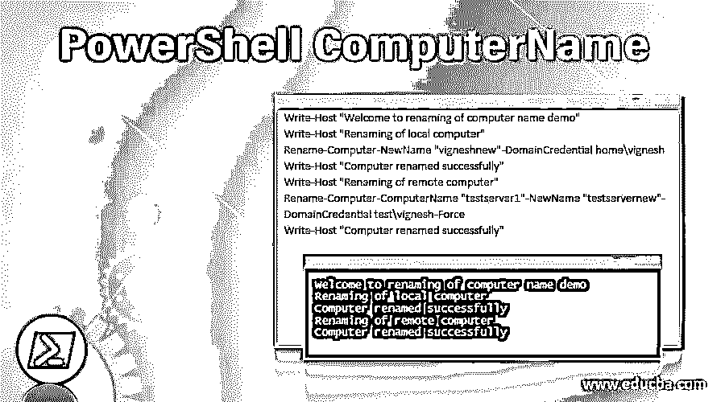

# PowerShell 计算机名称

> 原文：<https://www.educba.com/powershell-computername/>

## PowerShell 计算机简介 Name

知道您登录的系统的计算机名或本地主机总是有用且方便的。运行某些 cmdlets 也需要它，因为它们需要计算机名作为强制参数。当使用远程计算机或者当一些脚本需要在远程计算机上运行时，这也非常重要。本文将介绍使用 PowerShell 查找计算机名称的各种方法。

### 查找计算机名的方法

有许多方法和命令可以识别计算机名。以下是一些方法。

<small>Hadoop、数据科学、统计学&其他</small>

*   从环境变量
*   使用主机名处理方式
*   使用 WMI/CIM
*   使用。机器净值
*   来自内核函数
*   使用的 Gethostname()函数。网

我们将详细了解上述每一项。

#### 1.从环境变量中查找计算机名

找出计算机名最简单的方法是读取环境变量。这是最简单、最有效、最快的方法。它还有一个很大的缺点，因为环境变量很容易被覆盖，这带来了一点风险。结果可能会有偏差。

**输入:**

`$env:computername`

**输出:**

要获取所有环境变量，可以使用以下 cmdlet。

Get-Childitem 环境:

要获取计算机名，可以使用以下 cmdlet。

**输入:**

`get-childitem env:computername`

**输出:**

#### 2.使用主机名处理方式

像 linux 一样，windows 也有一些可以用来获取信息的二进制文件。执行 hostname.exe 将返回计算机名。运行以下命令将显示计算机名称

**输入:**

`hostname.exe`

**输出:**

#### 3.使用 WMI

从 windows 2000 版本开始，Wmi 在 windows 计算机上可用。在它之前的版本中，它是一个外部包。使用 CIM 实例也可以达到同样的效果。

**输入:**

`Get-WMIObject Win32_ComputerSystem | Select-Object -ExpandProperty name
(Get-CIMInstance CIM_ComputerSystem).Name`

**输出:**

#### 4.使用。网络类

可以使用。Net 类。

**输入:**

`[system.environment]::MachineName
Similarly using the gethostname function the computer name can be found out.
[System.Net.Dns]::GetHostName()`

**输出:**

#### 5.重命名计算机名

有时管理员可能需要重命名计算机名称。这种情况下，可以使用 Rename-Computer cmdlet。

**语法:**

`NAME
Rename-Computer
SYNTAX
Rename-Computer [-NewName] <string> [-ComputerName <string>] [-PassThru] [-DomainCredential <pscredential>] [-LocalCredential <pscredential>] [-Force] [-Restart] [-WsmanAuthentication {Default | Basic | Negotiate | CredSSP | Digest | Kerberos}] [-Protocol {DCOM | WSMan}] [-WhatIf] [-Confirm]  [<CommonParameters>] ALIASES
None`

##### 因素

*   **-计算机名称:**表示要重命名的计算机。它可以是本地系统，也可以是远程计算机。默认情况下，它指的是本地系统。要重命名本地计算机，请使用 localhost 或。要重命名远程计算机，请指定远程系统的 ip 地址或 netbios 名称或 fqdn 名称。它的类型是字符串。它接受管道输入，但不支持通配符。
*   **-Confirm:** 这表示在执行 cmdlet 之前必须显示确认消息。数据类型是开关，也可以使用 cf 访问，不接受管道输入，不允许使用通配符。
*   **-domain incredential:**这表示用于连接到域的帐户。如果系统加入了域，则凭据是必需的。其类型为 PSCredential，默认值为 none。不接受管道输入，也不允许使用通配符。
*   **-Force:** 这表示在没有用户确认的情况下运行 cmdlet。
*   **-本地凭证:**表示对计算机有权限的账户。默认情况下，采用当前用户凭据。如果不应出现凭据提示，则应使用域凭据参数。它的类型是 PSCredential。它不接受管道输入，也不允许使用通配符。
*   **-新名称:**这是电脑的新名称。不允许使用空格和句点。允许的最大字符数为 63，并且不能只包含数字。它的数据类型为字符串。接受管道输入。
*   **-PassThru:** 用于显示命令运行时的预览。它不会生成任何输出。此参数的数据类型是开关。默认情况下，该值为 false。
*   **-重启:**这表示系统在更名后需要重启。大多数情况下，需要重新启动才能使名称更改生效。它的类型是开关。其默认值为无。它不接受管道输入，也不允许使用通配符。
*   **-Whatif:** 这不会导致任何输出。这就像一个预览。参数的数据类型是开关，可以作为 wi 访问。如果未提供该值，则认为它是假的。
*   **-WsmanAuthentication:** 表示将用于认证凭证的 WSman 协议的机制。可能的值有 basic、Credssp、Default、Digest、Kerberos 和 negotiate。它的类型是字符串。默认值为无。它不接受管道输入，也不允许使用通配符。

### PowerShell 计算机名称示例

PowerShell 计算机名的示例如下:

**输入:**

`Write-Host "Welcome to renaming of computer name demo"
Write-Host "Renaming of local computer"
Rename-Computer -NewName "vigneshnew" -DomainCredential home\vignesh
Write-Host "Computer renamed successfully"
Write-Host "Renaming of remote computer"
Rename-Computer -ComputerName "testserver1" -NewName "testservernew" -DomainCredential test\vignesh -Force
Write-Host "Computer renamed successfully"`

**输出:**

### 结论

因此，本文详细介绍了如何在 PowerShell 中识别本地计算机名或远程计算机名。它还解释了使用示例获得它的各种方法。本文还详细介绍了更改计算机名的方法。要了解更多细节，建议编写示例脚本并练习它们。

### 推荐文章

这是 PowerShell 计算机名称指南。在这里，我们还讨论了寻找计算机名的介绍和方法，以及一个例子和它的代码实现。您也可以看看以下文章，了解更多信息–

1.  [PowerShell 注册表](https://www.educba.com/powershell-registry/)
2.  [PowerShell 睡眠](https://www.educba.com/powershell-sleep/)
3.  [Windows PowerShell ISE](https://www.educba.com/windows-powershell-ise/)
4.  [PowerShell 重命名文件夹](https://www.educba.com/powershell-rename-folder/)

