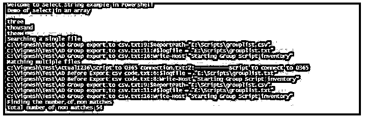

# PowerShell Grep

> 原文：<https://www.educba.com/powershell-grep/>

## PowerShell Grep 简介

Grep 命令不是 PowerShell cmdlet。这是一个在 Linux/Unix 中使用的命令，允许用户基于各种模式进行过滤。在 PowerShell 中，通过 Select-String cmdlet 可以实现同样的功能。它可以被认为是 windows 中的 GREP 等价物。Select-String 用于比较两个文件中的文本和模式以及输入字符串。它使用正则表达式进行匹配。它逐行搜索模式。只要在一行中找到匹配项，就会打印相应的文件名、行号和匹配项。在搜索时，如果用户希望使用一种编码进行比较，甚至可以指定。

### 句法

下面是 Select-String 的语法:

<small>Hadoop、数据科学、统计学&其他</small>

`NAME
Select-String
SYNTAX
Select-String [-Pattern] <string[]> [-Path] <string[]> [-SimpleMatch] [-CaseSensitive] [-Quiet] [-List] [-Include <string[]>] [-Exclude <string[]>] [-NotMatch] [-AllMatches] [-Encoding {unicode | utf7 | utf8 | utf32 | ascii | bigendianunicode | default | oem}] [-Context <int[]>]  [<CommonParameters>] Select-String [-Pattern] <string[]> -InputObject<psobject> [-SimpleMatch] [-CaseSensitive] [-Quiet] [-List] [-Include <string[]>] [-Exclude <string[]>] [-NotMatch] [-AllMatches] [-Encoding {unicode | utf7 | utf8 | utf32 | ascii | bigendianunicode | default | oem}] [-Context <int[]>]  [<CommonParameters>] Select-String [-Pattern] <string[]> -LiteralPath<string[]> [-SimpleMatch] [-CaseSensitive] [-Quiet] [-List] [-Include <string[]>] [-Exclude <string[]>] [-NotMatch] [-AllMatches] [-Encoding {unicode | utf7 | utf8 | utf32 | ascii | bigendianunicode | default | oem}] [-Context <int[]>]  [<CommonParameters>] ALIASES
sls`

### 因素

以下是 PowerShell Grep 的不同参数

**1。-AllMatches:** 这表示必须返回每行中的所有匹配模式。如果没有这个，Select-String 只匹配一行中的第一个匹配模式。它的类型是开关参数。其默认值为 false。它不接受管道输入，也不接受通配符。

**2。-区分大小写:**表示必须执行区分大小写的匹配。默认情况下，匹配不区分大小写。它的类型是开关参数。其默认值为 false。它不接受管道输入，也不接受通配符。

**3。-Context:** 这捕获找到匹配之前的行数和匹配之后的行数。如果只提到一个数字，这个数字决定了匹配前后的行数。如果提到两个数字，第一个数字表示匹配前的行数，匹配后的行数由第二个数字决定。它的类型是 int32[]。其默认值为无。它不接受管道输入，也不接受通配符。

**4。-Culture:** 表示用于匹配目的的文化名称。若要获取可用区域性的列表，可以使用 Get-Culture-list available cmdlet。它最初是在 PowerShell 7 中引入的。它的类型是字符串。默认值是当前 PS 会话的区域性值。它不接受管道输入，也不接受通配符。

**5。-Encoding:** 表示目标文件的编码类型。默认的编码类型是 UTF8NoBOM。其他可接受的值有 ASCII、BigEndianUnicode、OEM、Unicode、UTF7、UTF8、UTF8BOM、UTF8NoBOM、UTF32。它不接受管道输入，也不接受通配符。

**6。-Exclude:** 这表示需要从匹配中排除的项目列表。可以是路径，也可以是模式。它的类型是 String []。其默认值为无。它可以接受通配符，但不允许管道输入。

**7。-Include:** 表示匹配时需要包含的项目列表。可以是路径，也可以是模式。它的类型是 String []。其默认值为无。它可以接受通配符，但不允许管道输入。

**8。-InputObject:** 表示要搜索的文本。它可以是保存文本或表达式的变量。它的类型是 PSObject。其默认值为无。它接受管道输入，而不接受通配符。

**9。-List:** 使用此选项时，只考虑并返回每个文件的第一个匹配实例。它的类型是开关参数。其默认值为 false。它不接受管道输入，也不允许使用通配符。

10。-LiteralPath: 表示要搜索的文件的路径。该值与其键入的方式相同。不允许使用通配符，如果路径包含特殊字符，则必须用单引号括起来。它的类型是 string []。它的别名是 PSPath 和 LP。其默认值为无。它接受管道输入，但不接受通配符。

**11。-NoEmphasis:** 默认情况下选择-String 匹配搜索模式，使用该参数禁用高亮显示。这是 PowerShell 7 中首次引入的。它的类型是开关参数。其默认值为 false。它不接受管道输入，也不接受通配符。

**12。-Pattern:** 这表示需要搜索的模式。它被视为正则表达式。它的类型是 String []。其默认值为无。它不接受管道输入，也不允许使用通配符。

13。-Path: 表示要搜索的文件的路径。其默认值是当前目录。它接受管道输入；此外，也接受通配符。

**14。-NotMatch:** 用于查找不匹配的事件。它的类型是开关参数。其默认值为 false。它不接受管道输入，也不允许使用通配符。

### PowerShell Grep 示例

下面给出了一个例子:

**代码:**

`Write-Host "Welcome to Select String example in Powershell"
$input=@("one","two","three","four","ttt","thousand","theew")
Write-Host "Demo of select in an array"
$input| Select-String -Pattern 'th'
Write-Host "Searching a single file"
Select-String -Pattern Scri -Path "C:\Vignesh\Test\AD Group export to csv.txt"
Write-Host "Matching multiple files"
Get-ChildItem C:\Vignesh\Test\*.txt -Recurse |Select-String -Pattern Scri
Write-Host "Finding the number of non matches"
$result=Select-String -Pattern Scri -NotMatch -Path "C:\Vignesh\Test\AD Group export to csv.txt"
Write-Host "Total number of non matches" $result.Count`

**输出:**

### 结论

因此，本文详细解释了如何使用 Select-String cmdlet 在 PowerShell 中实现 grep。它解释了 cmdlet 可用的各种类型的参数，并提供了适当的示例。

### 推荐文章

这是 PowerShell Grep 的指南。这里我们讨论 PowerShell Grep 的介绍和例子。您也可以看看以下文章，了解更多信息–

1.  [PowerShell 获取进程](https://www.educba.com/powershell-get-process/)
2.  [PowerShell 连接字符串](https://www.educba.com/powershell-concatenate-string/)
3.  [PowerShell 获取项目](https://www.educba.com/powershell-get-item/)
4.  [PowerShell 获取内容](https://www.educba.com/powershell-get-content/)
5.  [PowerShell 通配符的类型](https://www.educba.com/powershell-wildcards/)
6.  [PowerShell If-Not |示例](https://www.educba.com/powershell-if-not/)
7.  [学习 PowerShell 重命名文件夹](https://www.educba.com/powershell-rename-folder/)

