# PowerShell 连接字符串

> 原文：<https://www.educba.com/powershell-concatenate-string/>

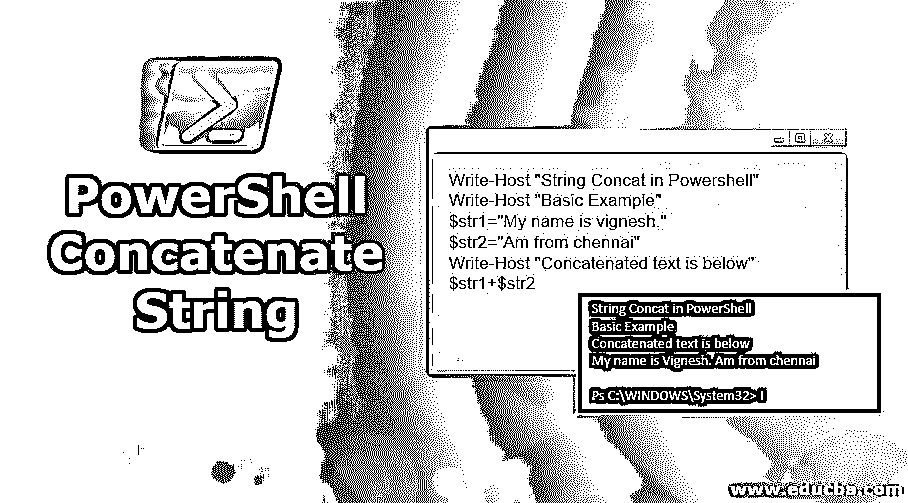

## PowerShell 连接字符串简介

字符串串联是组合一个或多个字符串的过程。在 PowerShell 中，字符串连接主要是通过使用“+”运算符来实现的。还有其他方法，比如用双引号将字符串括起来，使用连接操作符，或者使用-f 操作符。

**语法:**

<small>Hadoop、数据科学、统计学&其他</small>

基本上，'+'运算符用于连接字符串。让我们看看下面的一个示例:

**输入:**

`Write-Host "String Concat in Powershell"
Write-Host "Basic Example"
$str1="My name is vignesh."
$str2="Am from chennai"
Write-Host "Concatenated text is below"
$str1+$str2`

**输出:**

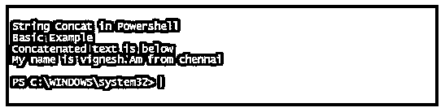

### PowerShell 连接字符串的示例

以下是 PowerShell 连接字符串的示例:

#### 示例#1

用分隔符连接字符串:-

没有必要只使用“+”号来连接字符串。这个例子将展示连接字符串的各种方法。

**输入:**

`Write-Host "String concatenation without + operator"
$str1="first sentence"
$str2="second sentence"
Write-Host "After concatenation"
"$str1$str2"
Write-Host "Example of concatenation with separators"
$str1+ "," +$str2
$str3="Powershell is the most underrated language"
$str4=" it can do many wonders"
Write-Host "Another way"
"$str3!!!!,$str4"`

**输出:**

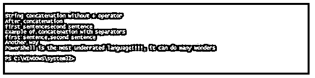

#### 示例 **#2**

字符串和整数串联:-

**输入:**

`Write-Host "String concatenation demo of int and string"
$string1=75
$string2="my name is nandhini"
$string3=$string1 + $string2`

**输出:**

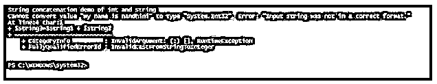

在上面的代码中，如果变量在连接之前被交换，那么就不会发生错误。

**输入:**

`Write-Host "String concatenation demo of int and string"
$string1=75
$string2="my name is nandhini"
$string3=$string2 + $string1
Write-Host $string3`

**输出:**

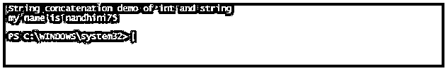

或者，可以通过使用字符串替换来实现上述目的。

**输入:**

`Write-Host "String concatenation demo of int and string"
$int1=75
$string2="my name is nandhini"
Write-Host "string concatenation using string Substitution"
"$($int1) , $($string2)"`

**输出:**

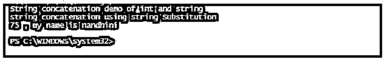

#### 实施例 3

使用-f 运算符的字符串串联:-

**输入:**

`Write-Host "String concatenation using f operator"
$str1=" This is the first sentence"
$str2="This is the second sentence"
$str3="This is the third Sentence"
Write-Host "Concatenated string is below"
"{0}.{1}.{2}." -f $str1,$str2,$str3`

**输出:**

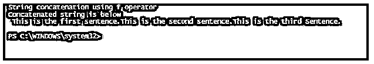

#### 实施例 4

使用连接运算符的字符串串联:-

**输入:**

`Write-Host "String concatenation using Join operator"
$str1=" This is the first sentence"
$str2="This is the second sentence"
$str3="This is the third Sentence"
Write-Host "Concatenated string is below"
$str1,$str2,$str3 -join "!!!!!"`

**输出:**

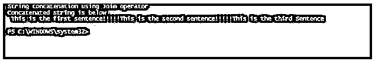

#### 实施例 5

正在删除写主机中的默认空间:-

**输入:**

`Write-Host "String concatenation using Join operator"
$str1=" This is the first sentence"
$str2="This is the second sentence"
$str3="This is the third Sentence"
Write-Host "Concatenated string is below" $str1 $str2 $str3 -Separator ''`

**输出:**

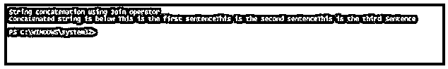

#### 实施例 6

使用 Concat()和字符串生成器连接字符串:-

**输入:**

`Write-Host "String concatenation using concat meth0d"
$str1=" This is the first sentence"
$str2="This is the second sentence"
$str3="This is the third Sentence"
Write-Host "Concatenated string is below"
[System.String]::Concat($str1,".",$str2,".",$str3)
Write-Host "String concatenation using string builder"
$SB = New-Object -TypeName System.Text.StringBuilder
$null = $SB.Append("First Sentence of the example")
$null = $SB.Append("Second sentence of the example")
$null = $SB.Append("third sentence of the example")
$null = $SB.Append("Fourth sentence of the example")
$SB.ToString()`

**输出:**

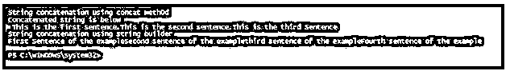

#### 实施例 7

**输入:**

`$string1 = @"
My name is vignesh
Am from chennai
Am a freelancer
"@
$string2 = @"
First sentence of the example
Second sentence of the example
Third Sentence of the example
"@
$string1 , $string2 -join "`n"`

**输出:**

#### 实施例 8

连接 csv 中的两个列值，并将它们导出到新列。在下面的示例中，csv 有两列——名字和姓氏。下面的脚本将合并这两个列值，并将它们导出到名为 FullName 的新列中。

运行脚本前的文件内容:

| **名字** | **姓氏** |
| 维尼什 | 克里希纳库马尔 |
| Nandhini | 维尼什 |
| 桑帕斯 | 查尔斯 |
| 维亚皮尼 | 维尼什 |
| 克里希纳库马尔 | 桑卡兰 |
| 难近母 | 克里希纳库马尔 |

**输出:**

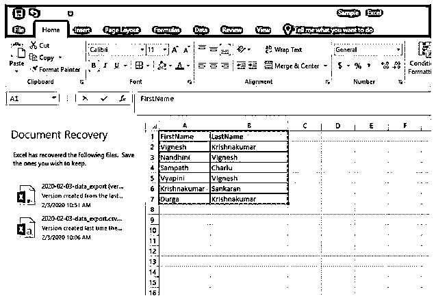

**输入:**

`#Reading the csv by importing
$CSV = import-csv “C:\Users\R003646\Desktop\Sample.csv” | select FirstName,LastName,
@{n=’FullName’;e={$_.FirstName + ” ” + $_.LastName}}
# script @{n=’FullName’;e={$_.FirstName + ” ” + $_.LastName}} will create the new column FullName and concatenate the FirstName and LastName Column Value
# Export the data from the Variable $CSV to the new file
$CSV | export-CSV “C:\Users\R003646\Desktop\Sample.csv”`

**输出:**

**

** 

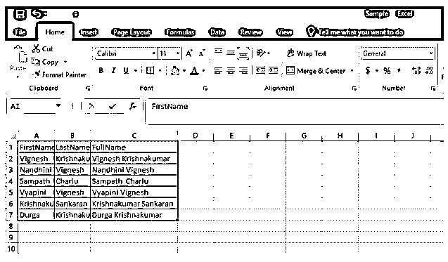

#### 实施例 9

将两条或多条路径连接起来生成一条路径。Join-Path cmdlet 用于将两个或多个路径组合成一个路径。

**语法:**

`NAME
Join-Path
SYNTAX
Join-Path [-Path] <string[]> [-ChildPath] <string> [-Resolve] [-Credential <pscredential>] [-UseTransaction] [<CommonParameters>] ALIASES
None`

#### 例 10

**输入:**

`Write-Host "Welcome to Join PAth example"
$path1= "C:\test"
$path2="D:\test"
$path3= "E:\test"
$path4="F:\test"
$path5="G:\test"
Write-Host "Appending new path"
Join-Path -Path $path1, $path2, $path3, $path4, $path5 -ChildPath test1`

**输出:**

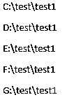

### 其他常用的字符串函数

#### 1..拆分()

这是另一种可以用来将字符串拆分成子字符串的方法。

**语法:**

`.Split(strSeparator [, MaxSubstrings] [, Options])
String -Split strSeparator [, MaxSubstrings] [, Options] String -Split {scriptblock} [, MaxSubstrings] -Split String
strSeparator: It is character of identification to split the string
MaxSubstrings: The maximum number of substrings that can be generated`

**举例:**

**输入:**

`Write-Host "generating substring using split method"
$teststring="my name is vignesh- am from chennai"
Write-Host "splitting using - character"
$teststring -split "-"
$teststring="domainname\username"
Write-Host "Splitting using \ character"
$teststring -split "\\"
Write-Host "generating substring using space"
$string="string1 string2 strin3"
$string.Split("")
Write-Host "splitting using multiple separators"
$string="domain\systems-test"
$string.Split("\\").Split("-")`

**输出:**

#### 2.替换功能

对于字符串，替换字符串或子字符串的一部分是一个整数运算。PowerShell 用户总是需要找到一个文本并用其他文本替换它。这是通过 Replace()方法实现的。

**语法:**

`Replace(strOldChar, strNewChar)
Stroldchar: Character to be found
Strnewchar: character to be replace the found text`

**举例:**

**输入:**

`Write-Host "replacing a text in string"
$test="old text to be replaced"
Write-Host "going to replace old"
$test.Replace("old","New")
Write-Host "Text is replaced"`

**输出:**

### 结论–PowerShell 连接字符串

本文详细介绍了字符串连接。它演示了除“+”运算符之外组合字符串的各种方式。它还演示了各种示例来说明如何实现字符串连接。它还涵盖了各种字符串方法，如字符串连接、字符串比较、字符串替换等。

### 推荐文章

这是 PowerShell 连接字符串的指南。这里我们讨论 PowerShell 中的简介、示例和其他常用的字符串函数。您也可以看看以下文章，了解更多信息–

1.  [Powershell 写主机](https://www.educba.com/powershell-write-host/)
2.  [PowerShell 操作员](https://www.educba.com/powershell-operators/)
3.  [Windows 操作人员](https://www.educba.com/windows-operators/)
4.  [PowerShell 变量](https://www.educba.com/powershell-variables/)
5.  [PowerShell Grep 示例](https://www.educba.com/powershell-grep/)

