# PowerShell 获取进程

> 原文：<https://www.educba.com/powershell-get-process/>

## PowerShell Get-Process 简介

PowerShell 中的 Get-Process cmdlet 用于检索系统中以及远程系统中运行的进程列表。这些进程可以是应用程序或系统进程。这些流程与您在任务管理器的“流程”选项卡中看到的流程相同。

#### 句法

`Get-Process
[[-Name] <String[]>] -Id <Int32[]>
-InputObject <Process[]>
-ComputerName <String>
[-Module] [-FileVersionInfo] [-IncludeUserName] [<CommonParameters>]`

<small>Hadoop、数据科学、统计学&其他</small>

上述语法可以有不同的组合。并不是所有的组合都能奏效。例如，Module 和 FileversionInfo 参数不能一起使用。

#### 因素

下面给出了一些参数:

*   **-Name:** 如果提供了-Name 参数，PowerShell 将检索具有该名称的所有进程。允许使用通配符(*)。您可以提供多个进程名，用逗号(，)分隔。
*   **-ID:**ID 参数定义进程 ID。如果提供了特定的进程 ID，PowerShell 将检索关于该进程 ID 的信息。进程 ID 始终是一个整数。流程 ID 是 Get-Process 输出的默认值。您也可以从资源管理器获得 PID。
*   **-Module:** 当用 Get-Process 指定该参数时，显示所有已经被进程加载的模块。当 PowerShell 以管理员身份运行时，该参数显示所有用户的所有模块。
*   通过在-ComputerName 参数中提供系统名称或运行 Invoke-Command，可以在远程计算机上运行此命令。
*   不能用此参数管道化 Stop-Process 命令。
*   **-ComputerName:** 您可以提供远程系统名称来检索远程计算机上运行的进程。您可以提供多个计算机名，用逗号(，)分隔。
*   **-IncludeUserName:** 添加此参数时，流程输出会显示运行特定流程所使用的用户名列。
*   **-FileVersionInformation:** 该参数提供负责特定进程的文件或应用程序的版本。要从不同用户处获取所有进程文件版本信息的列表，您需要以管理员身份运行 PowerShell 控制台。
*   您可以使用–computer name 参数或 Invoke-Command 参数从远程计算机检索文件版本详细信息
*   **-InputObject:** 指定流程对象。创建高级函数时，还可以将输入对象指定为管道或包含流程对象的变量。

### Powershell 中 Get-Process 的示例

PowerShell 的示例如下所示:

#### 1.简单的 Get-Process 命令

`Get-Process`

当您仅在没有特定参数的情况下运行上面的命令时，下面的表输出是默认的。

句柄，NPM(K)，PM(K)，WS(K)，Id，SI，ProcessName
**输出:**

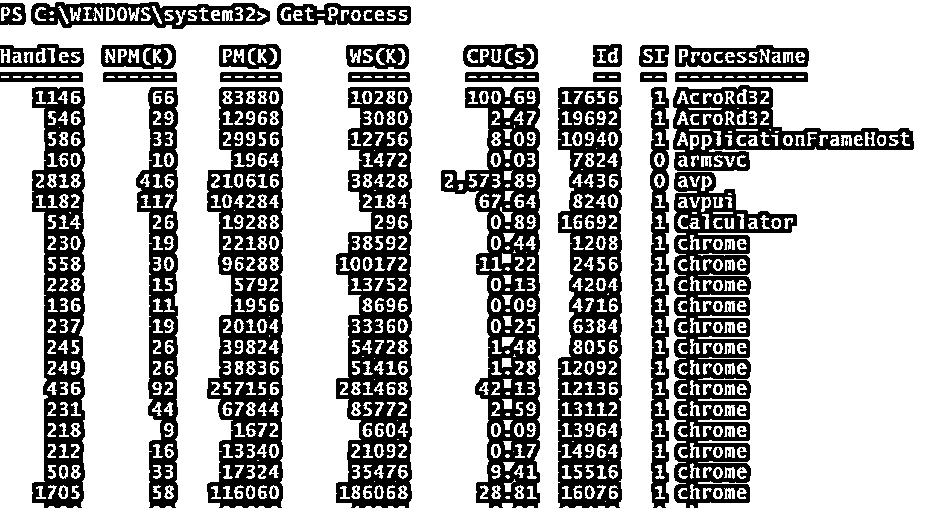

#### 2.使用–Name 参数获取流程

`Get-Process -Name chrome`

**输出:**

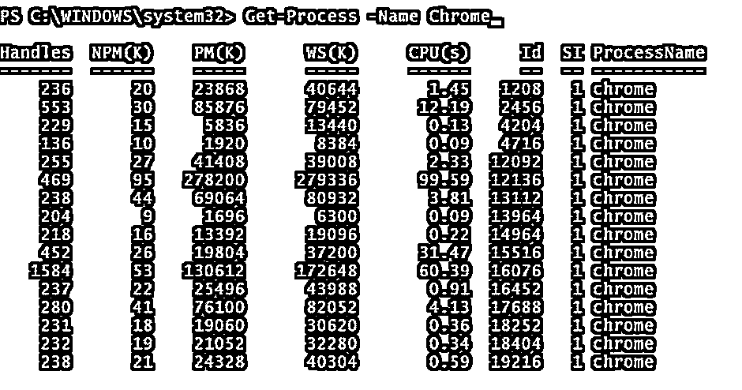

要过滤多个进程，请用逗号(，)分隔进程名称。

`Get-Process -Name chrome,WINWORD,AcroRd32`

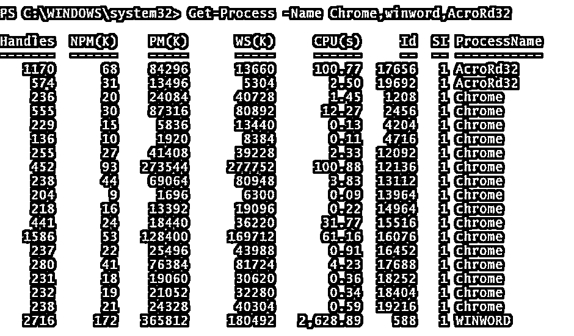

#### 3.使用–ID 参数获取流程

这里的 ID 表示进程 ID (PID)。您可以使用其中一个参数(ID 或 PID)，两者的工作方式相同。

`Get-Process -PID 17656`

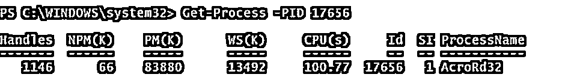

您也可以过滤多个 PID。

`Get-Process -Id 17656,4436,1208`

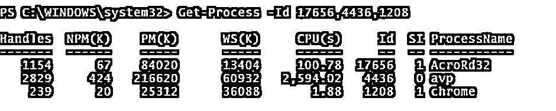

#### 4.使用–模块参数获取流程

`Get-Process -Module`

**输出:**

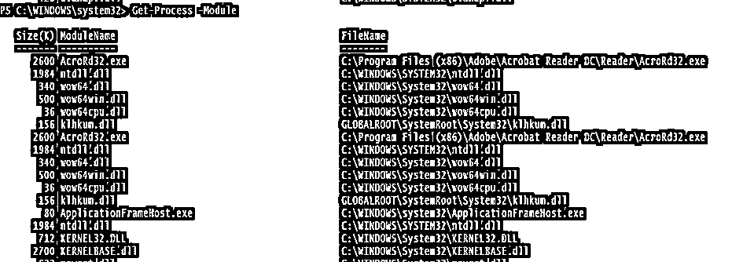

您可以通过提供进程名称来找到特定的进程模块。

举个例子，

`Get-Process Calculator -Module`

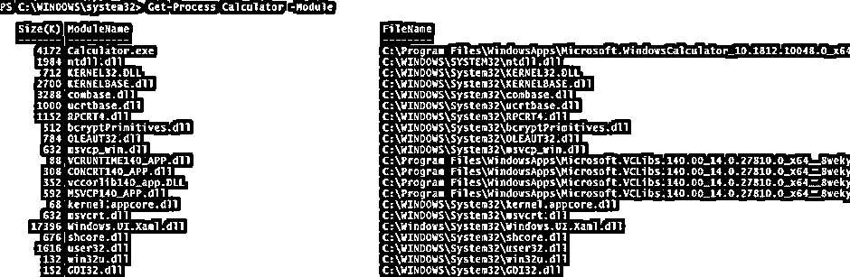

#### 5.get-Process with–file version 信息

要获取特定进程的文件版本，请使用下面的命令。

`Get-Process chrome -FileVersionInfo`

**输出:**

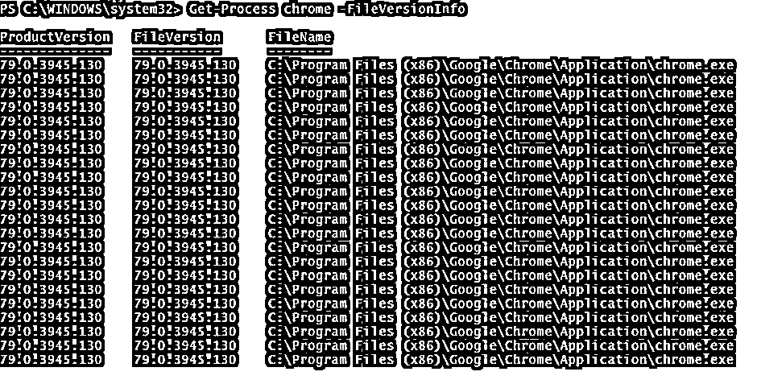

#### 6.使用–include username 命令获取流程

当您使用管理员运行 PowerShell 时，您可以看到不同用户运行的所有进程。

`Get-Process -IncludeUserName`

要检查使用特定用户运行的进程，您可以过滤用户名。

例如，系统运行的进程。

`Get-Process -IncludeUserName | where {$_.Username -like "*System*"}`

**输出:**

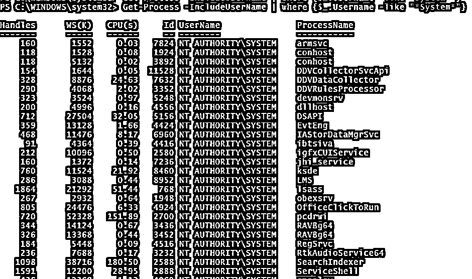

#### 7.使用–computer name 参数获取进程

您还可以使用所有用于远程系统的命令。要获取远程系统上的进程，请使用–computer name 参数。

`Get-Process -ComputerName Test-PC`

要在远程计算机上获得具有特定 PID 的进程，

`Get-Process –PID 12008 -ComputerName Test-PC`

#### 8.限制获取进程显示的输出

您还可以限制从第一个和最后一个进程开始显示的进程数。

如果您想列出前 10 个进程，那么您可以在 Select 命令中使用–First 参数。

`Get-Process | Select -First 10`

**输出:**

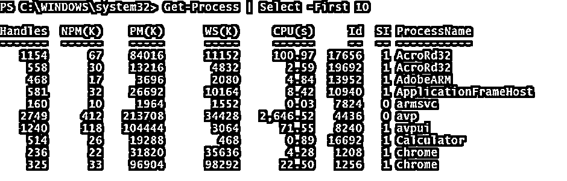

要获取最后 10 个进程，请使用–最后一个参数。

`Get-Process | Select -Last 10`

**输出:**

#### 9.排序 Get-Process 输出

您可以使用 Sort-Object 命令对 Get-Process 的输出进行排序。

在下面的例子中，我们将根据内存利用率(工作集)对进程进行升序和降序排序，并获得前 5 个值。

`Get-Process | Sort-Object WorkingSet | Select -First 5`

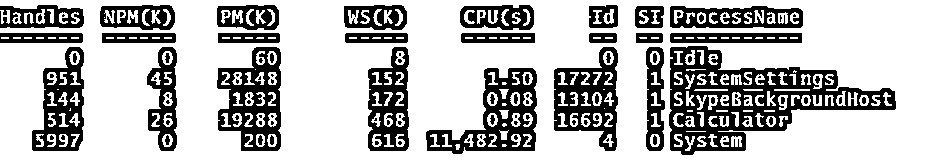

以上输出将按升序排列。要将进程按降序排序，请使用–Descending 参数。

`Get-Process | Sort-Object WorkingSet -Descending | Select -First 5`

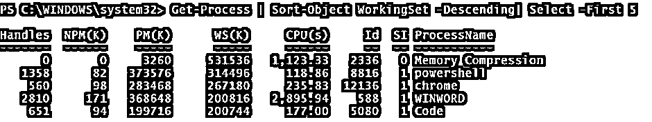

#### 10.将流程分组

您可以将相似的流程按其名称分组，这样您就可以确定有多少个流程实例正在运行。

`Get-Process | Group-Object ProcessName | Select Count, Name`

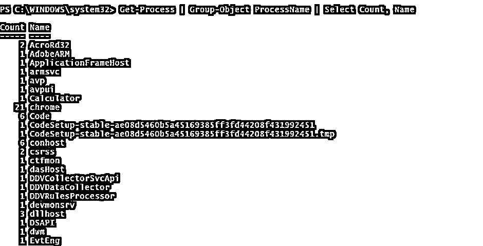

### 结论

Get-Process 是系统管理员监控系统性能的一个很好的工具。管理员可以根据 CPU 和内存利用率对输出进行排序，通过命令行，管理员可以找到特定应用程序和特定用户正在运行哪些进程。您还可以使用管道 Stop-Process 命令来停止进程。

### 推荐文章

这是 PowerShell Get-Process 指南。这里我们讨论简介、Powershell 中 Get-Process 的例子、参数以及语法和输出。您也可以浏览我们推荐的其他文章，了解更多信息——

1.  [PowerShell ForEach 对象](https://www.educba.com/powershell-foreach-object/)
2.  [PowerShell 别名](https://www.educba.com/powershell-alias/)
3.  [PowerShell 出文件](https://www.educba.com/powershell-out-file/)
4.  [PowerShell 测试路径](https://www.educba.com/powershell-test-path/)
5.  [PowerShell Grep |示例](https://www.educba.com/powershell-grep/)
6.  [PowerShell 通配符|类型](https://www.educba.com/powershell-wildcards/)
7.  [PowerShell 的一瞥 If-Not](https://www.educba.com/powershell-if-not/)

