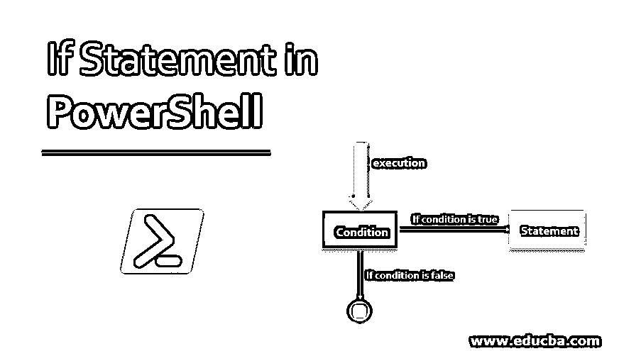
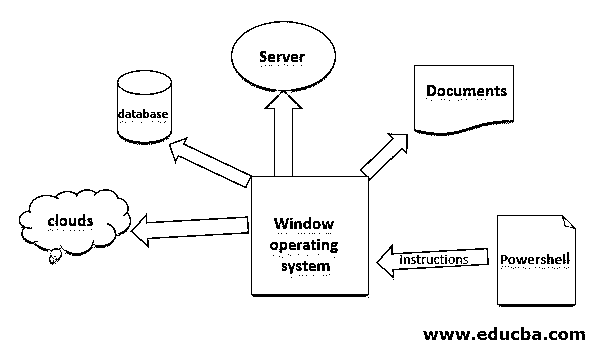
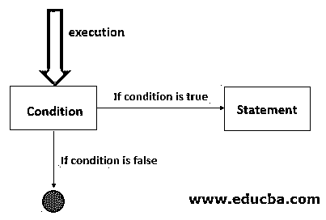

# PowerShell 中的 If 语句

> 原文：<https://www.educba.com/if-statement-in-powershell/>

## PowerShell 中 If 语句介绍

PowerShell 中的 IF 语句允许程序员控制程序的执行流程,“If”语句根据给定的条件表达式是否正确来定义程序是否必须执行一段代码。此处用编程术语表示正确或错误。if 语句的主要用途之一是允许程序根据一个或多个条件做出决定。

而如果一个语句是基于布尔值的，如果布尔条件值为 true，则在 if 块内执行 if 块内的语句行。换句话说，要执行任何语句，它必须测试一个或多个条件，如果条件为真，它将执行该语句。当我们想要检查任何特定案例时，需要“If”语句。

<small>Hadoop、数据科学、统计学&其他</small>

### PowerShell 是什么？

PowerShell 是在 Windows 环境中编写管理命令的一种方法，它类似于 Linux 中的 bash 脚本。它提供了一种自动化 Windows 操作系统及其应用程序以处理各种任务的方法。PowerShell 可用于 windows 和 Linux 操作系统，但在本教程中，我们将重点介绍 Windows。在下图中，我们可以看到 Powershell 如何控制所有 Automation 的工作。

**语法:**

PowerShell 中 if 的语法与其他编程语言非常相似。它检查条件，如果条件表达式为真，它将转到 if 块，如果条件表达式为假，它将转到 else。

`if(condition) {
// Executes when the condition is true
}else {
// Executes when the condition is false
}`

我们也可以使用 elseif，语法如下。

`if(condition 1) {
// Executes when the condition 1 is true
}elseif(condition 2) {
// Executes when the condition 2 is true
}elseif(condition 3) {
// Executes when the condition 3 is true
}else {
// Executes none of the condition is true.
}`

### 流程图

在下面的流程图中，我们可以看到当执行开始时，它首先检查条件。如果条件为真，那么它将转到语句块。这里的条件可以是一个或多个。除零、假、空白之外的任何条件仅被认为是真的。例如，如果任何条件表达式的输出为 0，"，false，则所有这些都被视为 false 语句。

### PowerShell works 中 if 语句如何工作？

`if (<cond1>)
{<statement1>}
[elseif (<cond2>)
{<statement2>}] [else
{<statement3>}]`

在这里，当它开始执行时，它检查 cond1 是否为真，根据该值它将执行语句块。如果 cond1 为真，它将执行语句 1 并退出 PowerShell。但是如果 cond1 为假，那么它将检查块 cond2 是否为假，如果 cond2 为真，那么将执行语句 2。如果条件 1 和条件 2 都为假，或者条件都不为真，那么将执行 else 语句。

例如，条件可以是一个或多个。

`if (<condition 1 -or condition 2>)
{<statement1>}
[elseif (<condition 3 -or condition 4>)
{<statement2>}] [else
{<statement3>}]`

### PowerShell 中 If 语句的示例

下面是 PowerShell 中 If 语句的示例:

#### 示例 1–简单的 if-else 示例

**代码:**

`$x = 40
if($x -le 20){
write-host("value of x is less than 20")
}else{
write-host(“value of x is greater than 20”)
}`

**输出:**

**解释:**上面的代码是检查$x 的值，是否小于 20，如果$x 的值小于 20 就会执行，如果语句阻塞。

#### 示例# 2–有多个条件

**代码:**

`$day = (get-date).dayofweek
if(($day -ne "Saturday") -or ($day -ne "Sunday")){
write-host("Welcome to Our Banks")
}else{
write-host(“Hello friends , Banks are closed today”)
}`

**输出:**

**说明:**

上面的代码将根据今天打印输出。在这里，它匹配$day 的值，因此，如果某一天是星期天或星期六，它将打印“你好，朋友们，今天银行不营业”，如果不是星期天和星期六，它将打印“欢迎来到我们的银行”。

#### 示例 3–if-else if 条件

**代码:**

`$occupation =”engineering”
if($occupation -eq "engineering"){
write-host("engineer")
}elseif($occupation -eq "sales"){
write-host("sales")
}else{
write-host("accounting")
}`

**输出:**

**说明:**

在上面的代码中，它检查$occupation 值，如果它等于 engineering 而不是 print engineering，如果值为$occupation 是 sales，则它将打印 sales，如果$occupation 为 none，则它将打印 accounting。

#### 示例# 4–基于功能

**代码:**

`function check ($VALUE) {
if ($VALUE) {
Write-Host(“TRUE”)
} else {
Write-Host(“FALSE”)
}
}
check $FALSE
check $TRUE
check FALSE //FALSE is a String with length > 0
check TRUE //TRUE is a string length >0`

**输出:**

**Note:** In PowerShell String with length, more than zero is considered as true.

**说明:**

在上面的例子中，首先，它使用参数$true 调用 check 函数，在函数 check 内部，它检查$VALUE，如果它是 TRUE，它将打印 TRUE，以类似的方式再次使用参数$FALSE 调用 check，它检查$VALUE，如果它是 FALSE，它将转到 else 块。

让我给你解释一些我们需要“如果”的真实用例。

如果我们想检查数据库服务器是启动还是关闭(检查数据库是否正在运行),那么我们可以使用 If 语句。因此，如果数据库关闭，那么运行任何服务或命令来启动数据库。这将是完全自动化的，这将检查所有的时间数据库状态。

**代码:**

`$x = Dbconnection()//$x is true or false
if($x){
write-host("Start database services process")
//run some script to handle a situation
}`

很多时候，由于服务器负载过重，它会停止工作，因此要检查服务器的阈值负载能力，我们可以使用 Powershell if 条件和内部条件，我们可以编写所需的语句。

**代码:**

`$x = loadValue()//200000 is threshold load capacity
if($x -le 200000){
write-host("Load is ok")
}else{
write-host("Load is exceed threshold capacity")
//write conditions for handling conditions .
}`

有了上面的例子，我们就清楚了一个语句是否能在真实的软件世界中起到非常关键的作用。

### 推荐文章

这是 PowerShell 中 If 语句的指南。PowerShell IF 是一个非常强大的处理条件语句的工具，这里我们讨论一下什么是 PowerShell？if 语句在 PowerShell 中是如何工作的？以及相应的例子和流程图。您也可以浏览我们的其他相关文章，了解更多信息——

1.  [如果在 PowerShell 中有 Else](https://www.educba.com/if-else-in-powershell/)
2.  [PowerShell 中的哈希表](https://www.educba.com/hashtable-in-powershell/)
3.  [Powershell 写主机](https://www.educba.com/powershell-write-host/)
4.  [PowerShell 运行命令](https://www.educba.com/powershell-run-command/)
5.  [如果使用 C++，则完成 Else 指南](https://www.educba.com/else-if-in-c-plus-plus/)
6.  [Java 中哈希表的方法和构造函数](https://www.educba.com/hashtable-in-java/)

