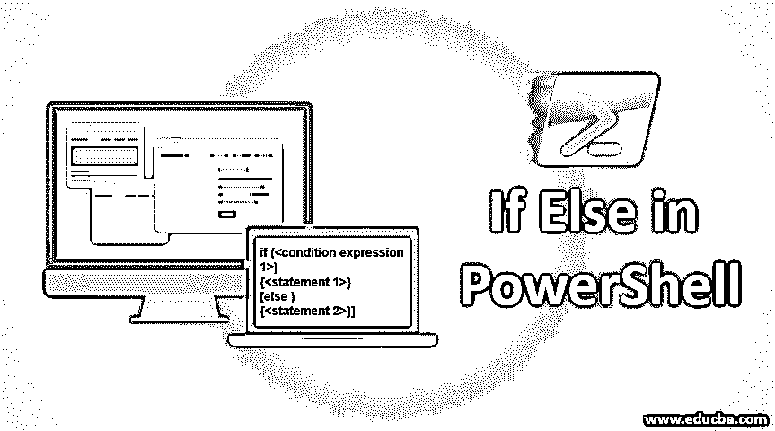
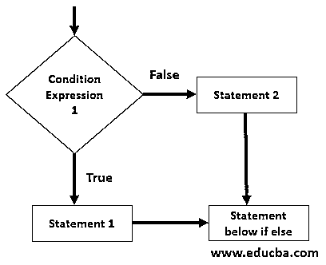
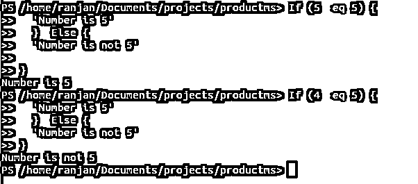
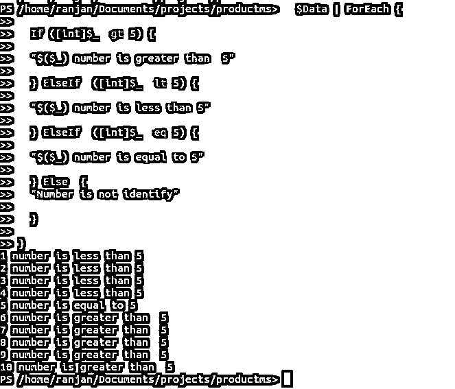
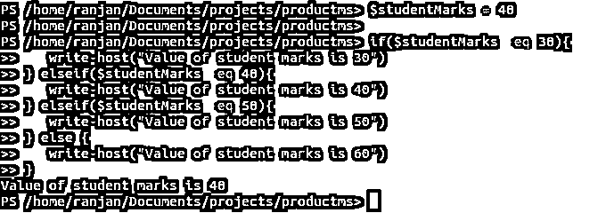
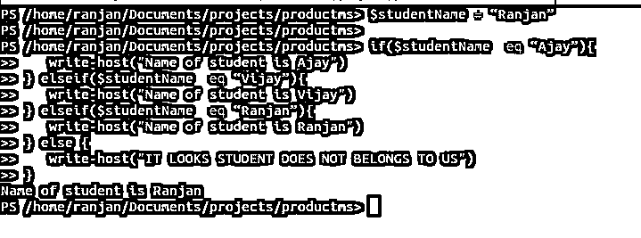
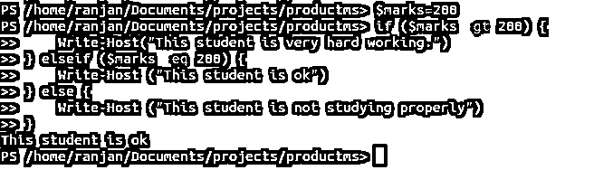

# 如果在 PowerShell 中

> 原文：<https://www.educba.com/if-else-in-powershell/>

## PowerShell 中的 If Else 简介

我们从 PowerShell 中的 [IF 语句中了解到，它赋予了我们根据某些条件决定任何语句执行的权力。但是如果我们想在 if 条件失败的情况下执行另一个语句，或者如果我们有多种情况，如果一个条件失败，那么它应该检查其他条件。让我们举个例子，假设我们想用百分比显示学生成绩。例如，如果等级是 A，则显示 50%的信息，如果等级是 B，则显示 65%，如果等级是 C，则显示 80%，如果等级是 E，则显示 90%。因此，在不同级别的 IF 语句上显示不同的消息是不够的，对于这种情况，我们可以使用 PowerShell 的 IF ELSE。IF ELSE 使我们能够根据天气条件表达式执行一组不同的语句。我们将在示例和语法部分更详细地学习它。](https://www.educba.com/if-statement-in-powershell/)

**语法:**

<small>Hadoop、数据科学、统计学&其他</small>

在下面的语法中，我们检查条件表达式 1，如果该表达式返回 true，则执行语句 1。如果表达式 1 返回 false，则执行语句 2。

`if (<condition expression 1>)
{<statement 1>}
[else )
{<statement 2>}]`

### 流程图

在下面的流程图中，首先，它将检查条件表达式 1，如果条件表达式 1 返回 true，它将执行语句 1。如果条件表达式 1 返回 false，则语句 2 将执行，这意味着如果 if 的条件为 false，它将执行 else 块。

为了更好地理解，请参考下面给出的流程图。让我给你解释一个真实的情况，在那里你需要写。假设您有一个正在运行并连接到数据库 d1 的服务器，我们有另一个数据库 d2。我们正在编写一个脚本来检查数据库 d1 是否是活动的。如果数据库 d1 不活动，则连接到另一个数据库 d2。所以要为此写一个程序，我们可以使用 if-else 语句。在 if 语句中，我们将检查数据库 d1 的状态，如果它返回 true，这意味着它正在运行，因此不需要连接到数据库 d2。如果数据库 d1 的状态为假，那么它将连接到数据库 d2，我们的服务器将继续工作。

### 如果 Else 语句在 PowerShell 中如何工作？

它总是基于条件表达式，这些条件表达式总是返回真或假，例如，如果你想检查数字比较，如果你想检查小于大于，如果你想检查变量的类型(检查变量是否是整数，字符串布尔或浮点)所有这些操作将返回真或假。在下面的例子中，我们检查 5 是否等于 5，所以它是相等的，所以它将打印消息“数字是 5”。

**举例:**

`If (5 -eq 5) {
'Number is 5'
}  Else {
'Number is not 5'
}`

在下面的例子中，我们正在检查 4 是否等于 5，并且条件为假，因此它将打印消息，“数字不是 5”

`If (4 -eq 5) {
'Number is 5'
}  Else {
'Number is not 5'
}`

**输出:**

### PowerShell 中 If Else 语句的示例

以下是 PowerShell 中 If Else 语句的示例:

#### 示例#1

在本例中，我们对数字 1 到 10 运行一个循环，并检查数字是小于 5、等于 5 还是大于 5。因此，每次它将数字与 5 进行比较时，如果 if 块中的条件表达式为真，它将打印语句，否则它将检查下一个 if 条件。最后，如果没有一个条件为真，它将打印 else 块。

**代码:**

`$Data = 1..10
$Data | ForEach {
If ([int]$_ -gt 5) {
"$($_) number is greater than  5"
} ElseIf  ([int]$_ -lt 5) {
"$($_) number is less than 5"
} ElseIf  ([int]$_ -eq 5) {
"$($_) number is equal to 5"
} Else  {
"Number is not identify"
}
}`

**输出:**

#### 实施例 2

在这个例子中，我们有一个学生的分数，我们想打印一条关于他/她的分数的消息。让我们看看下面的例子，我们有学生的分数是 40，我们正在检查他的分数。因此，无论 if 表达式的哪个条件成功，它都将打印 if 语句消息。

**代码:**

`$studentMarks = 40
if($studentMarks -eq 30){
write-host("Value of student marks is 30")
} elseif($studentMarks -eq 40){
write-host("Value of student marks is 40")
} elseif($studentMarks -eq 50){
write-host("Value of student marks is 50")
} else {
write-host("Value of student marks is 60")
}`

**输出:**

#### 实施例 3

让我们使用字符串操作，假设我们有一个学生，基于匹配，我们想要显示关于学生姓名的消息。因此，如果学生的名字是 Ranja，则显示“学生的名字是 Ranjan”。

**代码:**

`$studentName = “Ranjan”
if($studentName -eq “Ajay”){
write-host("Name of student is Ajay")
} elseif($studentName -eq “Vijay”){
write-host("Name of student is Vijay")
} elseif($studentName -eq “Ranjan”){
write-host("Name of student is Ranjan")
} else {
write-host("IT LOOKS STUDENT DOES NOT BELONGS TO US")
}`

参考屏幕下方，这里我们将学生的名字指定为 Ranjan，所以当 IF 条件成功时(即它将打印 IF 块，否则它将打印 else 块。您可以尝试将 Ajay 赋给$studentName，然后检查输出。

**输出:**

#### 实施例 4

在本例中，我们正在检查学生学习图表，这意味着我们正在检查学生的学习是否正常。这里我们假设目前学生的分数是 200 分，如果分数超过 200 分，那么这个学生很努力。如果分数等于 200 分，那么这个学生很好。如果分数低于 200 分，那就意味着这个学生没有好好学习。

**代码:**

`$marks=200
if ($marks -gt 200) {
Write-Host("This student is very hard working.")
} elseif ($marks -eq 200) {
Write-Host ("This student is ok")
} else {
Write-Host ("This student is not studying properly")
}`

**输出:**

### 推荐文章

这是 PowerShell 中 If Else 的指南。这里我们讨论 If Else 语句如何在 power Shell 中工作，以及不同的示例和代码实现。您也可以阅读以下文章，了解更多信息——

1.  [PowerShell 中的 Regex](https://www.educba.com/regex-in-powershell/)
2.  [PowerShell Move-Item 的参数](https://www.educba.com/powershell-move-item/)
3.  [PowerShell 移除-项目](https://www.educba.com/powershell-remove-item/)
4.  [PowerShell 中的比较运算符](https://www.educba.com/comparison-operators-in-powershell/)
5.  [使用 c++编写 Else If 的指南及示例](https://www.educba.com/else-if-in-c-plus-plus/)
6.  [Else if in R 完整指南及示例](https://www.educba.com/else-if-in-r/)
7.  [SQL 中 IF ELSE 语句的例子](https://www.educba.com/if-else-statement-in-sql/)
8.  [elseif 在 PHP |如何工作？](https://www.educba.com/elseif-in-php/)

