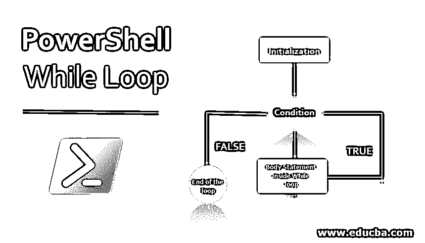
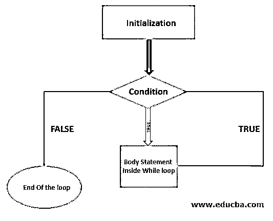
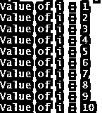
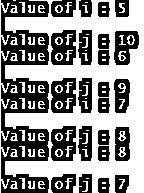
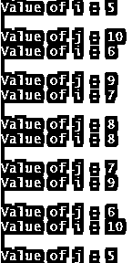
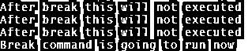
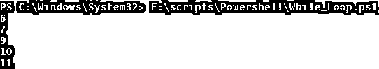
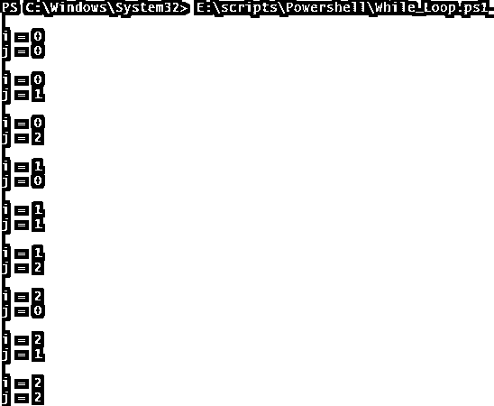
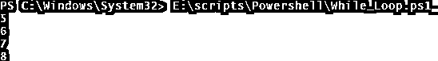

# PowerShell While 循环

> 原文：<https://www.educba.com/powershell-while-loop/>

## PowerShell While 循环简介

PowerShell 中的 While 循环是一个迭代循环，一直运行到条件满足。您可以在 while 块中编写多行代码，并多次运行它，直到满足条件。它类似于 FOR 循环，但结构不同。

**图表:**

<small>Hadoop、数据科学、统计学&其他</small>

**语法:**

`While (condition) {
Operation commands
}`

**参数:**

*   **条件:**在此指定条件参数。这个条件可以是一个或多个，输出将采用布尔格式($True 或$False)。While 循环基于这个条件运行，一旦条件为假，循环自动终止。
*   **操作命令:**这些命令可以是简单命令，也可以是复杂命令。每次满足条件时都会运行。

上面的语法相当于，

`while (true) {
if (!condition)
break;
statements;
}`

### PowerShell While Loop 是如何工作的？

在 PowerShell 的 While 块中，首先初始化变量和其他参数，然后进行条件检查。条件可以是一个或多个，如果条件为真，则执行主体功能，在执行主体部分后再次重复检查，如果条件再次满足，则再次执行主体部分。重复同样的过程，直到条件变为假。一旦条件为假，循环就终止。

如果开始时条件为假，则脚本不会进入主体函数，但要记住指定一个条件或命令，使循环最终终止，否则循环将永远执行下去。还可以在满足特定条件时使用 BREAK 命令终止块的执行，或者使用 CONTINUE 语句跳过当前迭代。

### PowerShell While 循环的示例

让我们看看 PowerShell 中 while 循环的一些示例，如下所示:

#### 示例 1–使用简单的 While 循环

下面的脚本将首先初始化变量$i=1 并执行 while 循环。这里，条件$i 值 1 小于等于 10，因此它进入主体语句并执行 Write-Output 命令，然后将$i 的值增加到 2，然后再次检查条件并进入循环。同样的过程一直工作到$i 值达到 11，条件为假，循环终止。如果不放入$i++，那么循环将永远执行，因为脚本找不到任何终止条件。

**代码:**

`$i=1
while($i -le 10){
Write-Output "Value of i : $i"
$i++
}`

**输出:**

#### 示例# 2–带有–**和**运算符的多个条件

**代码:**

`$i=5
$j=10
while(($i -le 10) -and ($j -ge 7) ){
Write-Output "Value of i : $i"
Write-Output "`nValue of j : $j"
$i++
$j--
}`

**输出:**

在上面的例子中，如果任何一个条件为假(当$i 值变得大于 10 并且$j 值变得小于 7 时),那么循环终止。这里，$j 的值首先达到 6，它不能满足 while 循环条件，循环终止。

#### 示例# 3–使用 OR 运算符的多个条件

**代码:**

`$i=5
$j=10
while(($i -le 10) -or ($j -ge 7) ){
Write-Output "Value of i : $i"
Write-Output "`nValue of j : $j"
$i++
$j--
}`

**输出:**

在这里，在–OR 条件下，如果两个语句中的任何一个满足，那么就执行循环。

#### 示例 4–While 循环中的条件

像普通函数一样，您可以在 while 循环中指定条件。

**代码:**

`$i=5
while($i -ge 10){
if($i -eq 8){
Write-Output "Variable value reached to 8"
}
$i++
}`

**输出:**

#### 示例 5–带有 Break 语句的 While 循环

如上例所示，循环一直执行到 while 条件满足，但是如果我们希望在 if 条件满足时终止循环，那么我们需要使用 Break 命令。一旦执行了 break 命令，就会终止所有循环(父循环和子循环)。

**代码:**

`$i=5
while($i -le 10){
if($i -eq 8){
Write-Output "Break command is going to run now"
Break
}
Write-Output "After break this will not executed"
$i++
}`

**输出:**

在上面的示例中，当 IF 语句中的变量值变为 8 时，IF 块执行，break 也执行，整个循环终止。你可以从上面两个例子中看出区别。

#### 示例# 6–带有 Continue 语句的 While 循环

执行 CONTINUE 语句时，它会跳过当前循环并返回到主循环。在下面的例子中，当值达到 8 时，它跳过程序的其余部分并返回到主 WHILE 循环。

**代码:**

`$i=5
while($i -le 10){
$i++
if($i -eq 8){Continue}
Write-Output $i
}`

**输出:**

#### 示例# 7–嵌套 While 循环

也可以使用嵌套的 WHILE 循环。请参见下面的示例。

**代码:**

`$i=0
$j=0
while($i -lt 3){
While($j -lt 3){
Write-Output "`ni = $i"
Write-Output "j = $j"
$j++
}
$i++
$j=0
}`

**输出:**

在本例中，第一个主 while 循环针对$i 值 0 执行，然后脚本执行完整的内部 while 循环。同样，对于$i=1，脚本执行内部 while 循环，直到$i 的值满足条件。

#### 示例# 8–While 循环使用 **$TRUE**

您还可以如下构造 while 循环。

**代码:**

`$i = 5
while($true){
Write-Output $i
if($i -eq 8){Break}
$i++
}`

**输出:**

在上面的示例中，由于在条件中指定了$true，while 循环将永远执行。要终止循环，请在条件满足时使用 Break 命令。

### 结论

While 循环与 FOR、FOREACH 和 Do-While 循环具有相同的功能。在 Do-While 循环中，首先执行 body 语句，然后检查条件。

### 推荐文章

这是 PowerShell While 循环的指南。在这里，我们讨论 PowerShell While 循环的语法和工作方式，以及示例和代码实现。您也可以看看以下文章，了解更多信息–

1.  [PowerShell 的工具](https://www.educba.com/powershell-tools/)
2.  [PowerShell 排序对象的语法和参数](https://www.educba.com/powershell-sort-object/)
3.  [PowerShell 中逻辑运算符的示例](https://www.educba.com/logical-operators-in-powershell/)
4.  【Hashtable 在 PowerShell 中是如何工作的？

