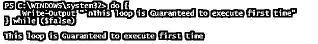
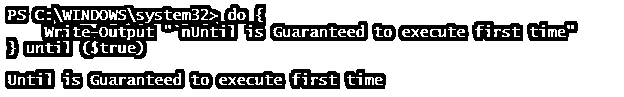
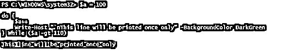
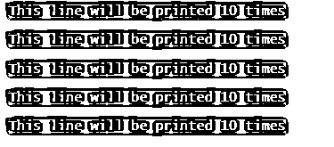
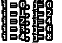
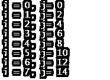
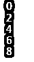
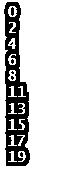
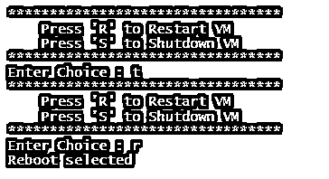

# PowerShell do while

> 原文：<https://www.educba.com/powershell-do-while/>

## PowerShell do while 简介

PowerShell 中的 do-While 循环是一个迭代循环(for、foreach、While、do-while ),它根据提供的条件多次运行块中的内容，一直运行到条件为真，并在条件为假时终止，此外，它还确保循环至少执行一次，并且此循环与 Do-Until 循环相反，Do-Until 循环一直运行到条件为真时停止。大多数情况下，条件是用条件操作符来检查的。

**语法**

<small>Hadoop、数据科学、统计学&其他</small>

Do-While 循环语法

`do {
Statement 1
Statement 2
............
............
Statement N
} while (condition)
Do-Until loop syntax
do {
Statement 1
Statement 2
............
............
Statement N
} until (condition)`

### 流程图

Do-While 循环流程图。

### PowerShell 中的 do-while 循环是如何工作的？

Do-While 循环通过第一次进入循环，确保循环至少执行一次，然后检查条件，如果条件为真则进入循环，反之亦然。举个例子，

`do {
Write-Output "`nThis loop is Guaranteed to execute the first time"
} while ($false)`

**输出:**

如果您看到上面的输出，即使条件为假，循环也会被执行，因为根据设计，它会首先进入循环，然后在下一次运行时，它会检查 While 条件，直到它变为假。

如果我们在条件中使用$true，循环将变得无限，并且永远不会终止，因为条件永远不会变为 false。

相反，相反的循环 do-until 执行，直到条件变为真。举个例子，

`do {
Write-Output "`nUntil is Guaranteed to execute first time"
} until ($true)`

**输出:**

如果我们在这里使用了$false 条件，循环将永远不会退出，因为 while 中的条件永远不会变为 false。

**While、Do-While 循环和 Do-Until 循环的区别。**

**While 循环:**

`$a = 100
While ($a -gt 110) {
$a++
Write-Output "This won't be printed"
}`

在上面 while 循环的例子中，输出不会被打印出来

**Do-While 循环:**

`$a = 100
do {
$a++
Write-Host "`nThis line will be printed once only" -BackgroundColor DarkGreen
} while ($a -gt 110)`

**输出:**

在上面的例子中，输出将只打印一次，因为条件变为假。

**Do-Until 循环:**

`$a = 100
do {
$a++
Write-Host "`nThis line will be printed 10 times" -BackgroundColor DarkGreen
} until ($a -gt 110)`

**输出:**

### 例子

下面举几个例子

#### 示例 1–简单的 **Do-While** 循环。

`$i = 0
do {
$i
$i++
} while ($i -lt 5)`

**输出:**

在上面的例子中，$i 变量被初始化为 0，在 do-while 循环中，每次迭代该值增加 1，当$i 值达到 5 时，循环终止。

#### 示例 2–具有多个条件的 Do-While 循环。

`$i = 0
$j = 0
do {
Write-Output "i = $i, j= $j"
$i++
$j = $j + 2
} While(($i -lt 5) -and ($j -lt 15))`

**输出:**

在上面的例子中，如果任何条件变为假，循环终止。

参见另一个有多个条件的示例。

`$i = 0
$j = 0
do {
Write-Output "i = $i, j= $j"
$i++
$j = $j + 2
} While(($i -lt 5) -or ($j -lt 15))`

**输出:**

在上面的例子中，如果两个条件都为假，那么循环被终止，并且对于任何一个为真的条件，它进入循环。

#### 示例# 3–用数组进行 Do-While 循环。

我们可以用 Do-While 循环遍历每个数组项。在下面的例子中，

`$animals = @("Cow","Dog","Cat","Elephant")
$i = 0
do{
$animals[$i] $i++
}while($i -lt $animals.Length)`

**输出:**

在这个例子中，Animals 数组下的每一项都被打印出来，因为$i 值从 0 开始，一直延续到 Animals 数组的长度。

#### 示例 4–带中断的 Do-While 循环

我们可以使用 Break 语句终止 Do-While 循环。在这个例子中，我们需要如果数组的值满足特定的值，那么循环应该被终止。下面是一个例子。

`$i = 0
do {
$i
$i = $i + 2
if($i -eq 10){ break }
} while ($i -lt 20)`

**输出:**

当$i 值变为 10 时，do-while 循环自动终止。

#### 示例# 5–带继续的 Do-While 循环

为了跳过特定的迭代，使用 Continue 关键字。我们可以在 Do-While 循环中使用 Continue 关键字，如下所示。

`$i = 0
do{
if($i -eq 10) {
$i = $i + 2
Continue
}
$i
$i = $i + 2
}while($i -lt 20)`

**输出:**

在上面的例子中，当$i 值变为 10 时，接下来在该迭代中所有的命令都将被跳过，所以这里没有显示输出 10。

#### 示例 6–带有用户输入提示的 Do-While 循环。

有时我们需要用户输入值，我们需要继续，直到用户输入正确的输入。你可以使用 Do-While 循环来实现。举个例子，

`$choice = ""
do{
Write-Output "*********************************"
Write-Output "`tPress 'R' to Restart VM"
Write-Output "`tPress 'S' to Shutdown VM"
Write-Output "*********************************"
$choice = Read-Host 'Enter Choice '
switch($choice){
'r'  { "Reboot selected"}
's' {"Shutdown selected"}
}
}while(($choice -ne 'r') -and ($choice -ne 's'))`

上面的脚本将提示用户输入，并一直持续到$choice 值没有变成‘R’或‘S’为止。

**输出:**

### 结论

与任何其他循环函数(For、Foreach、While)一样，Do-While 循环在 PowerShell 或各种脚本语言中也非常有用。您可以将此循环用于各种程序，在这些程序中，您需要循环至少执行一次，然后检查条件。例如，您可以在服务器重新启动后在此循环中使用 Test-WSMan 命令来检查是否建立了 WINRM 连接。

### 推荐文章

这是 PowerShell do while 的指南。这里我们讨论 do-while 循环在 PowerShell 中是如何工作的，以及示例和输出。您也可以看看以下文章，了解更多信息–

1.  [PowerShell 匹配](https://www.educba.com/powershell-match/)
2.  [PowerShell 布尔型](https://www.educba.com/powershell-boolean/)
3.  [PowerShell 等待](https://www.educba.com/powershell-wait/)
4.  [PowerShell 子串](https://www.educba.com/powershell-substring/)

