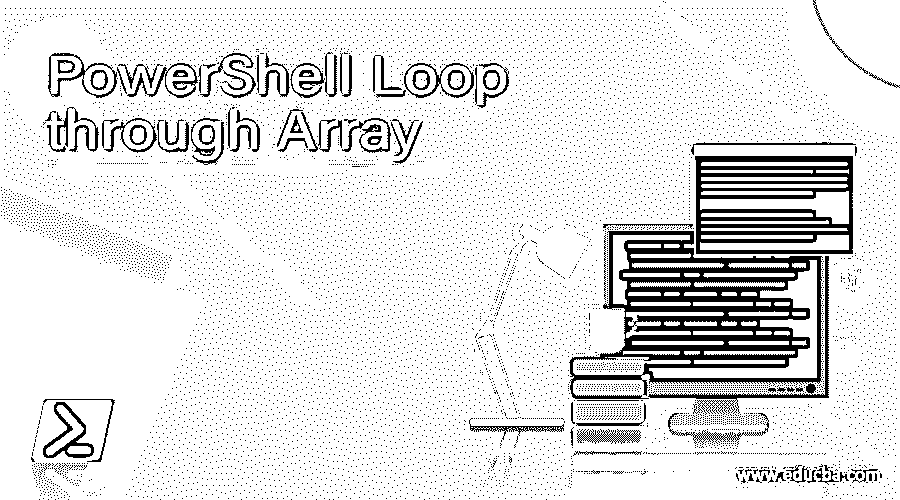
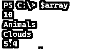
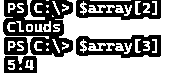
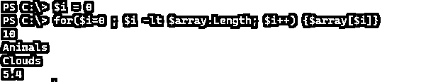
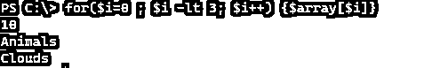
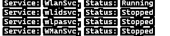
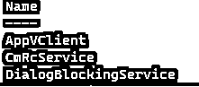
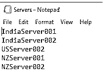
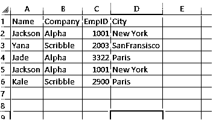
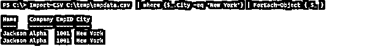

# PowerShell 循环通过阵列

> 原文：<https://www.educba.com/powershell-loop-through-array/>

## PowerShell 阵列的定义

PowerShell 数组是单个数据类型或多个不同数据类型值的集合，遍历数组意味着使用 PowerShell 中不同的可用循环(如 While、For、Foreach、Do-While 等)逐个扫描每个值，并在需要时对每个项目执行操作，此循环操作通常在后台使用索引 1。

**语法:**

<small>Hadoop、数据科学、统计学&其他</small>

*   带有数组的 Foreach 循环语法。

`Foreach ($item in $collections) { $item}`

*   带有数组的 For 循环语法。

`for($i=0; $i -lt $Collection.Length; $i++) { $collection[$i] }`

*   数组的 While 循环语法:

`$i=0
while($i -lt $Collection.Length) { $Collection[$i]; $i++ }`

*   带有数组的 Do-While 循环语法:

`$i=0
while($i -lt $Collection.Length) { $Collection[$i]; $i++}`

*   带有数组语法的 Foreach-Object -Parallel 循环(适用于 PowerShell 7)。

`$Collection | ForEach-Object -Parallel { $_ }`

### 通过 PowerShell 阵列的循环是如何工作的？

假设我们有这个样本数组。

`$array = 10, "Animals" , "Clouds" , 5.4
$array`

**输出:**

我们知道数组只不过是对象的集合。数组基于索引的概念工作。要访问特定的数组值，我们需要索引该项。举个例子，

`$array[2] $array[3]`

**输出:**

While、For、Do-While 等循环使用相同的概念。他们浏览数组的每个索引。下面是 For 循环的例子。

`$i = 0
for($i=0 ; $i -lt $array.Length; $i++) { $array[$i] }`

**输出:**

在这个例子中，循环增加一个索引的值，直到该值变成数组的长度并终止，这样，它打印整个数组。如果您只需要打印几个成员，那么请提供最大长度。举个例子，

`for($i=0 ; $i -lt 3; $i++) { $array[$i] }`

**输出:**

同样的循环概念也适用于 **While** 和 **Do-While** 循环。

`$i = 0
while( $i -lt $array.Length ) { $array[$i]; $i++ }`

用一个 **Do-While** 循环。

`$i = 0
do{ $array[$i]; $i++ } While( $i -lt $array.Length )`

**foreach** 循环的工作方式略有不同。它对索引概念不起作用。让我们看看下面的例子。

`foreach( $arr in $array ) { $arr }`

这里， **Foreach** 循环遍历每一项，直到数组变为 Null。这使得 Foreach 循环更加容易和灵活，因为我们不想指定任何索引或任何条件，并且 **$arr** 变量包含每一项。

当我们处理大的数组值链时，Foreach 循环并行循环使执行更快。

仅 PowerShell 版本 7 或更高版本支持 **Foreach-Object -Parallel** 命令。该命令对数组的作用如下。

`$array | ForEach-Object -Parallel { $_ }`

它从管道中获取数组值， **$_** 存储每个值。

### 例子

#### 示例#1:带有循环的服务数组示例。

当我们使用变量来存储 Get-Service 输出时，该变量现在是多个服务的数组。

`$services = Get-Service
$services.GetType()`

**输出:**

这意味着我们可以通过变量 **$services** 使用不同的循环。

这就是我们如何对上面的数组使用 Foreach 循环。

foreach($ ser in $ services){ Write-Output " Service:$($ ser . name)，Status: $($ser.status)" }

上面的命令通过一个$services 数组循环，而$ser 变量逐个存储服务的每个实例。

**输出:**

我们也可以直接使用下面的命令，

`foreach( $ser in (Get-Service) ) { Write-Output "Service: $($ser.name), Status: $($ser.status)" }`

在上面的例子中， **Get-Service** 是直接传递的，它已经成为一个数组输入。当我们使用带有循环的**数组**时，我们可以通过在同一个 **foreach** 或其他循环中执行操作来最小化工作量。

举个例子，

不是像下面这样写多行，

`$service = Get-Service | where { $_.StartType -eq 'Automatic' }
foreach( $ser in $service) { Write-Output "Service: $($ser.name), Status: $($ser.status)" }`

我们可以在 **Foreach** 循环中直接使用下面的命令。

`foreach( $ser in (Get-Service | where{$_.StartType -eq 'Automatic'}))
{
Write-Output "Service: $($ser.name), Status: $($ser.status)"
}`

#### 示例 2:将数组作为管道传递给 Foreach-Object 循环。

我们可以使用的另一种方法是通过管道传递数组。举个例子，

`Get-Service | ForEach-Object { $_ }`

这里是一行一行的处理，变量 **$_** 在每次循环处理时存储当前行。我们可以对每个项目进行操作，如下所示。

`Get-Service | ForEach-Object {
$_ | where {$_.StartType -eq 'Disabled'} | Select Name
}`

**输出:**

PS7 版本也可以使用 **-Parallel** 参数。

`Get-Service | ForEach-Object -Parallel {
$_ | where {$_.StartType -eq 'Disabled'} | Select Name
}`

#### 例子#3:遍历一个文件。

当我们处理文件内容时，我们使用 **Get-Content** 存储它们，文件内容存储变量变成了字符串数组，我们可以单独处理它们。举个例子，

我们有下面的 **servers.txt** 文件，我们需要测试服务器的连接性，这样我们就可以使用下面的代码。

**Servers.txt** 文件

`foreach( $Server in (Get-Content .\Servers.txt)) {
if( Test-Connection $Server -Count 1 -Quiet -EA Ignore){
Write-Output "$server connection successful"
}
else{
Write-Output "$server connection failed"
}
}`

#### 例子#4:遍历 CSV 文件。

假设我们有一个 EmpData.csv 文件，我们需要将它传递给循环，一旦我们从中获得内容，它就成为一个数组，我们可以用循环处理每个内容。

`Import-CSV C:\temp\empdata.csv| where {$_.City -eq 'New York'} | ForEach-Object { $_ }`

**输出:**

### 结论

PowerShell Array 和 PowerShell 在日常活动中单独循环，并与 scripter 使用的组合一起循环，因为几乎所有内容都是以对象的形式存在的，甚至像 TXT、JSON、CSV 等文件都可以通过数组循环，这使得在没有用户干预的情况下处理多个数据变得更加容易。

### 推荐文章

这是 PowerShell 循环通过阵列的指南。在这里，我们讨论简介、语法、PowerShell 阵列的循环是如何工作的？代码实现示例。您也可以看看以下文章，了解更多信息–

1.  [PowerShell 匹配](https://www.educba.com/powershell-match/)
2.  [PowerShell 更改目录](https://www.educba.com/powershell-change-directory/)
3.  [PowerShell 卸载模块](https://www.educba.com/powershell-uninstall-module/)
4.  [PowerShell 等待](https://www.educba.com/powershell-wait/)

