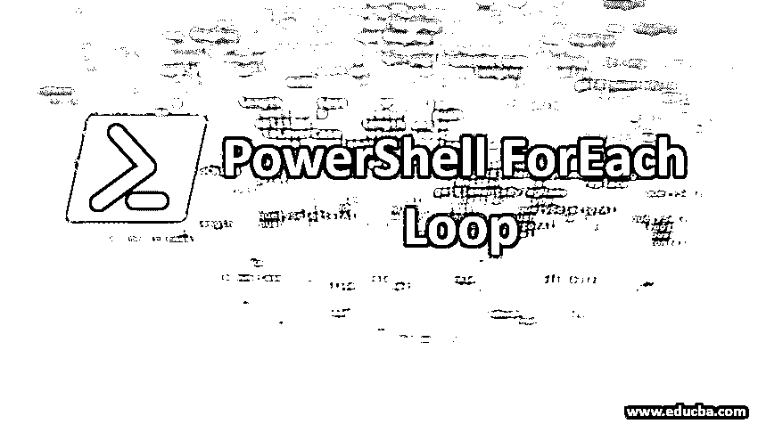
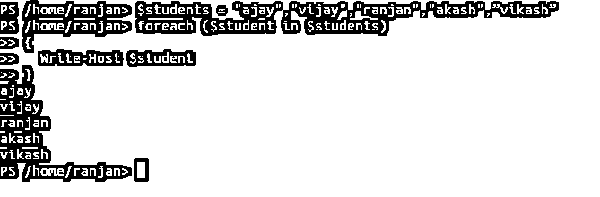
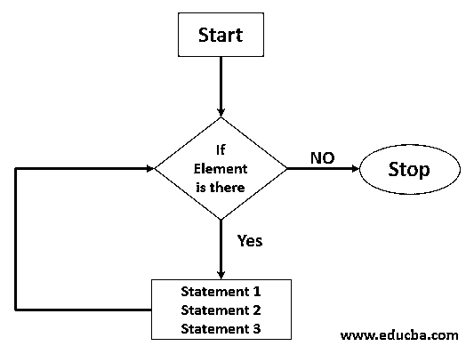
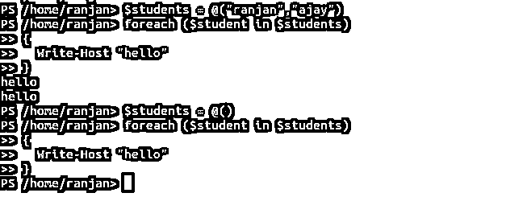
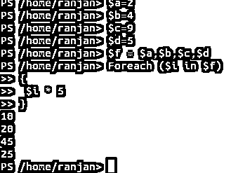
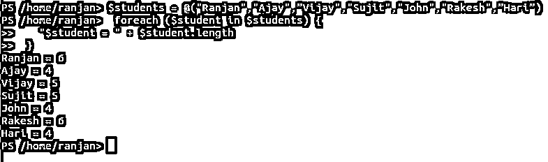
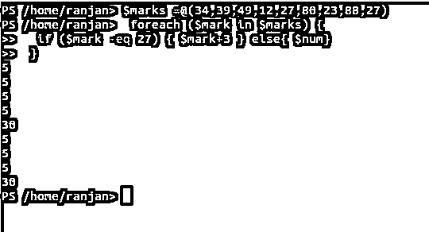
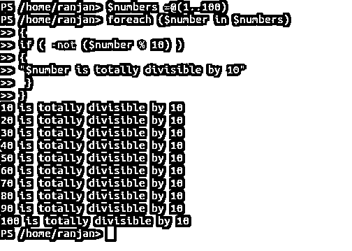

# PowerShell ForEach 循环

> 原文：<https://www.educba.com/powershell-foreach-loop/>

## PowerShell ForEach 循环简介

了解 ForEach 循环在 PowerShell 中，ForEach 和 forLoop 都执行相同的任务，它们都是为了重复操作和执行同一段代码。如果你正在读取一个数组的每个元素，或者它可能正在读取一个文件的每一行，在这种情况下，我们使用 foreach。例如，一个包含用户的数组，我们希望检查名为“Vijay”的用户，因此我们需要检查每个元素，为此，我们需要一个“foreach”循环，一旦用户“Vijay”找到，循环将退出。如果在采取行动之前需要查看每个用户的城市属性，可以使用 ForEach 循环，并且可以对每个城市执行各自的工作。与 for 循环相比，ForEach 节省的内存和时间很少。在 PowerShell 4.0 和更高版本中，ForEach 方法提供了更快的性能。

### ForEach 循环的语法

下面是语法

<small>Hadoop、数据科学、统计学&其他</small>

`foreach ($<item> in $<Actualarray>)
{
<statement 1>
<statement 2>
<statement 3>
<statement ...>
}`

在上面的语法中，我们可以看到，每次都会从 Actualarray 中选取一项，该项将在 foreach 循环中进行处理。如果$ <actualarray>为空或者里面没有项目，则不会执行语句。当 Foreach 循环运行时，PowerShell 会自动创建变量$ <item>。例如，以下示例中的 Foreach 循环显示$students 数组中的值。在 for 循环中，我们需要编写逻辑来检查数组是否为空，如果数组中有任何元素，foreach 循环将执行语句块。</item></actualarray>

**代码:**

`$students = ""
PS /home/ranjan> foreach ($student in $students)
{
Write-Host $student
}
output nothing, which means checking of array elements attributes are done internally by foreach loops.
$students = "ajay","vijay","ranjan","akash",”vikash”
foreach ($student in $students)
{
Write-Host $student
}`

**输出和代码屏幕:**

### PowerShell ForEach 循环的流程图

下面是 PowerShell ForEach 循环的流程图:

**上面的流程图说明:**上面的流程图非常清晰的表示了流程，一旦执行首先开始，它将检查数据(检查元素是否在数组中)，如果是空循环将会停止。但是如果有数据，它将继续执行，执行语句 1、语句 2、语句 3，直到数组的最后一个数据。一旦数组变空，循环就停止执行。

**输出:**

**解释上面的输出:**上面的屏幕显示，如果数组中有两个属性，它将打印两次 hello，但是如果我们将$students 作为空数组，则没有 hello print，这意味着如果$students 数组中有任何属性可用，它将执行语句块，否则它不会执行。

### ForEach 循环在 PowerShell 中是如何工作的？

假设我们有 4 个元素，我们想把每个数乘以 5。假设我们有$a，$b，$c，$d，我们必须将每个都乘以 5，那么我们要做的是，看下面的例子:

**样本代码:**

`$a=2 ,$b=4,$c=9,$d=5
$a * 5 =10,$b *  $5=20 ,$c * 5=45,$d*5=25`

因此我们得到了我们的结果。但它很好，直到我们只有 4 个项目乘以 5，假设将有 10000 个元素需要乘以 5，那么这将是一个非常乏味的任务。

那么有什么简单的解决方法呢？我们需要做的就是，创建一个包含所有元素的数组，通过 foreach 传递该数组，并将每个元素乘以 5。要将数字 5 乘以数组中的每个元素，我们需要使用 ForEach 命令遍历数组。

以下是完整的脚本:

**代码:**

`$a = 2 ,$b = 4 ,$c = 9 ,$d =5
$f = $a,$b,$c,$d
Foreach ($i in $f)
{
$i * 5
}`

**输出:**

**上面代码的解释:**在上面的例子中我们可以看到，我们定义了另一个变量$f，并将所有 4 个变量赋给它，这使它成为一个数组。最后，我们从 foreach 循环中传递它，结果是 10，20，45，25。这种方式使我们的生活更容易，因为在现实生活中会有数十万条记录需要修改，所以我们不能一个一个地做，所以我们使用 foreach 循环来处理这些。只需运行一次，并根据需要修改尽可能多的记录。

### PowerShell ForEach 循环中的示例

以下是 PowerShell ForEach 循环中的示例:

#### 示例#1

遍历包含学生姓名的字符串数组，并找出数组中每个字符串的长度。

**代码:**

`$students = @("Ranjan","Ajay",”Vijay","Sujit","John","Rakesh",”Hari”)
foreach ($student in $students) {
"$student = " + $student.length
}`

**输出:** Ranjan = 6，Ajay = 4，Vijay = 5，Sujit = 5，John = 4，Rakesh = 6，Hari = 4。

#### 实施例 2

让我给你一个真实的例子，在考试中，你看到 100 分中有 30 分是及格。假设有 10 万学生，有一个规则，如果任何学生得了 27 分，给他 30 分，这意味着只需在他的 27 分中增加 3 分。因此，我们循环遍历一个学生分数数组，如果他们的分数是 27 分，则增加 3 分，并让他们通过考试，因为 30 分是及格分数。

**代码:**

`$marks =@(34,39,49,12,27,80,23,88,27)
foreach ($mark in $marks) {
if ($mark -eq 27) { $mark+3 } else{ $num}
}`

**输出:**有两个学生，但手动检查 10 万名学生的 27 分是一个有点乏味的任务，我们解决了这个问题。

#### 实施例 3

再举一个例子，找出 1 到 100 之间所有能被 10 整除的数。

**代码:**

`$numbers =@(1..100)
foreach ($number in $numbers)
{
if ( -not ($number % 10) )
{
"$number is totally divisible by 10"
}
}
10 is totally divisible by 10
20 is totally divisible by 10
30 is totally divisible by 10
40 is totally divisible by 10
50 is totally divisible by 10
60 is totally divisible by 10
70 is totally divisible by 10
80 is totally divisible by 10
90 is totally divisible by 10
100 is totally divisible by 10`

**输出:**

### 结论

总之，foreach 循环语句允许我们多次执行一条语句或一组语句，同时检查数组中元素的可用性，这意味着如果有任何元素，就运行下一条语句。Foreach 循环仅在数组中有任何元素时运行，这与 for 循环不同。

### 推荐文章

这是 PowerShell ForEach 循环指南。这里我们讨论 ForEach 循环在 PowerShell 中是如何工作的？，用不同的例子。您也可以浏览我们的其他相关文章，了解更多信息——

1.  [为 R 中的循环](https://www.educba.com/for-loop-in-r/)
2.  [什么是 PowerShell](https://www.educba.com/what-is-powershell/)
3.  [Powershell 的用途](https://www.educba.com/uses-of-powershell/)
4.  [如何安装 PowerShell](https://www.educba.com/install-powershell/)
5.  [PowerShell 中的数组|示例](https://www.educba.com/array-in-powershell/)
6.  [Powershell 写主机指南](https://www.educba.com/powershell-write-host/)

