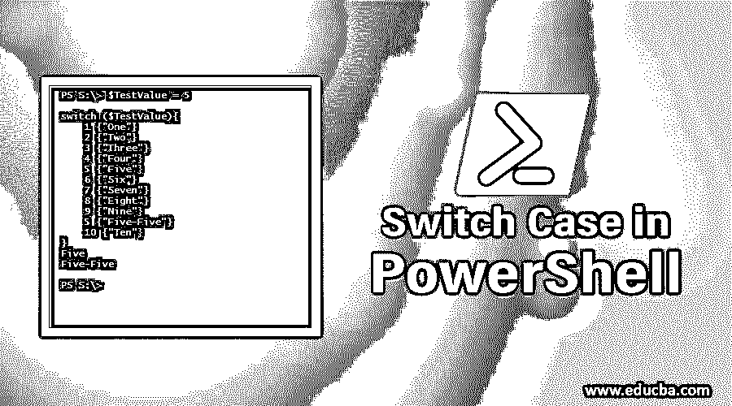
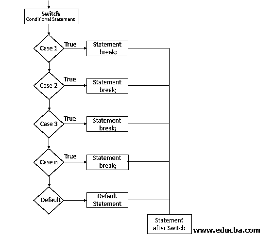
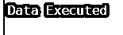
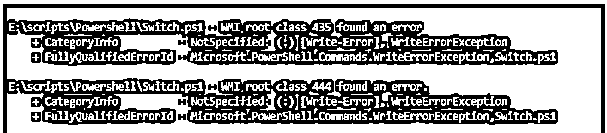
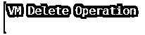

# PowerShell 中的开关盒

> 原文：<https://www.educba.com/switch-case-in-powershell/>

## PowerShell 中**到** S **女巫案简介**

PowerShell 中的 Switch 函数用于处理多个 If 语句，或者换句话说，它是多个条件 If/Else If/Else 的替换。要检查脚本或函数中的单个条件，可以使用 If/else 语句，但如果要评估更多 If 语句，则使用 Switch。

与多个 If 语句相比，Switch 更好，且易于实现，简单地用于编码。每个语句下有多个条件，当其中一个条件满足时，就执行操作。

<small>Hadoop、数据科学、统计学&其他</small>

**语法:**

`Switch (<Value>)
{
<Condition1> {Action1}
<Condition2> {Action2}
}`

**完整语法:**

`Switch [-regex | -wildcard | -exact ] [ -casesensitive ]  ( <value> ) {
"String" | Number | Variable | { expression } {  statementlist  }
default { statementlist }
}`

运筹学

`Switch [-regex | -wildcard | -exact ] [ -casesensitive ]  -file  [filename]{
"String" | Number | Variable | { expression } {  statementlist  }
default { statementlist }
}`

### PowerShell 中交换机外壳的参数

*   **Regex** :也叫正则表达式。根据条件值执行正则表达式检查。如果使用 Regex，通配符和 Exacts 将被忽略。此外，如果 match 子句不是字符串，则忽略此参数。
*   **通配符**:表示条件是通配符字符串。如果使用通配符，Regex 和 Exacts 将被忽略。此外，如果 match 子句不是字符串，则忽略此参数。
*   **精确**:对精确字符串执行匹配。如果使用 Exact，通配符和正则表达式将被忽略，如果 match 子句不是字符串，则此参数将被忽略。
*   **区分大小写:**该参数将检查与传递的值完全匹配的条件(区分大小写)，如果不匹配，则忽略该参数。它还需要一个字符串值。
*   **File** :将文件路径作为输入值，而不是字符串值。如果传递了多个文件参数，则只接受最后一个。文件的每一行都被读取并根据条件进行评估，如果条件匹配，那么它就执行该值或显示一条书面消息。

### 流程图

### PowerShell 中的 Switch 是如何工作的？

如上图所示，无论何时任何值(字符串、整数、浮点或其他数据类型)、数组、通配符、文件等。然后它开始逐个匹配条件，当条件匹配时，脚本执行该块。对于多个匹配值，将执行多个脚本块，如果没有找到匹配值，并且指定了默认条件，则执行该块，否则输出为空。

### PowerShell 中的交换机案例示例

让我们看看给出的例子:

#### 示例# 1

1.带字符串的简单开关函数，传递整数值。

**代码:**

`switch (3) {
1 {"One"}
2 {"Two"}
3 {"Three"}
}`

**输出:**

**代码:**

`switch("data"){
"abc"{"Abc executed"}
"xyz"{"Xyz Executed"}
"data"{"Data Executed"}
}`

**输出:**

现在，如果参数和表达式不匹配呢。作为下面给出的例子，5 与任何开关情况都不匹配。在这种情况下，输出将为 null。

**代码:**

`switch (5) {
1 {"One"}
2 {"Two"}
3 {"Three"}
}`

为了克服上述问题，default 需要指定，当没有参数匹配时，default 块执行。

**代码:**

`switch (5) {
1 {"One"}
2 {"Two"}
3 {"Three"}
default{"No Match Found"}
}`

**输出:**

#### 实施例 2

让我们看看给出的例子:

if / else if /else 和 Switch 的区别。从下面的例子中，你可以理解用 Switch 函数写一个脚本是多么容易。

**代码:**

`$time = 3
if($time -eq 1){"It's 1 O'Clock"}
elseif ($time -eq 2) {"It's 2 O'Clock"}
elseif ($time -eq 3) {"It's 3 O'Clock"}
else {"No Match Found"}`

`$time = 3
switch ($time) {
1 {"It's 1 O'Clock"}
2 {"It's 2 O'Clock"}
3 {"It's 3 O'Clock"}
default{"No Match found"}
}`

**输出:**

**两种方法的执行时间。**

**代码:**

`$time = 3
Measure-Command {
if($time -eq 1){"It's 1 O'Clock"}
elseif ($time -eq 2) {"It's 2 O'Clock"}
elseif ($time -eq 3) {"It's 3 O'Clock"}
else {"No Match Found"}
}`

**总毫秒数:**

**代码:**

`$time = 3
Measure-Command {
switch ($time) {
1 {"It's 1 O'Clock"}
2 {"It's 2 O'Clock"}
3 {"It's 3 O'Clock"}
default{"No Match found"}
}
}`

**总毫秒数:**

**差值:** 31.3154 毫秒

当您在交换机内部编写大量脚本或函数时，这种差异变得非常大。

**1。带正则参数的开关**

如果在 switch 中提到了 Regex，它将使用传递的值计算表达式，如果部分条件匹配，那么它将执行该操作。

考虑下面的例子。

**代码:**

`Switch ("Donkey"){
"Dog" {"Dog is Mentioned"}
"Cat" {"Cat is Mentioned"}
"Don" {"Donkey is Mentioned"}
"key" {"Donkey is mentioned again"}
default {"Nothing is mentioned"}
}`

**输出:**

添加 Regex 后。

**代码:**

`Switch -Regex ("Donkey"){
"Dog" {"Dog is Mentioned"}
"Cat" {"Cat is Mentioned"}
"Don" {"Donkey is Mentioned"}
"key" {"Donkey is mentioned again"}
default {"Nothing is mentioned"}
}`

**输出**:

**2。带通配符参数的开关**

通配符的工作方式类似于 Like 参数。

**代码:**

`$msg = "Error, WMI connection failed"
Switch -Wildcard ($msg) {
"Error*" {"WMI Error"}
"Warning*" {"WMI Warning"}
"Successful*" {"WMI Connection Successful"}
}`

**输出:**

**3。带精确参数的开关**

确切的功能在开关中是默认的。用不用都无所谓。但是当你同时使用两个参数时，最后一个参数优先。

**代码:**

`Switch -Regex -Exact ("Hello"){
"He" {"Hello World"}
"Hi" {"Hi World"}
Default {"No World"}
}`

**输出:**

**代码:**

`Switch -Exact -Regex ("Hello"){
"He" {"Hello World"}
"Hi" {"Hi World"}
Default {"No World"}
}`

**输出:**

**4。带文件参数**的开关

您可以将文件路径作为参数直接提供给开关。您可以使用带有文件路径的 File，而不是给它一个变量表达式。

**代码:**

`Switch -Wildcard -File C:\temp\switchtest.txt {
"*Warning*"{Write-Warning $PSItem}
"*Error*"{Write-Error $PSItem}
}`

**输出:**

您可以使用$PSItem 或$_ 来处理当前项目。

**5。带区分大小写参数的开关**

当在开关中使用区分大小写的参数时，条件必须与每个字符完全匹配。

**代码:**

`switch -CaseSensitive ("Hello") {
"HeLlo" {"This is different HeLlo"}
Default {"This is not Matching"}
}`

**输出:**

**6。将数组值传递给开关函数**

简单数组:

`switch (10,12) {
9 { "Nine" }
10 { "Ten" }
11 {"Eleven"}
12 {"Twelve"}
Default {"None"}
}`

**输出:**

传递数组对象

**代码:**

`$VMOps = @(
"VM_Delete"
"VM_Create"
)
switch ($VMops) {
"VM_Delete" {"VM Delete Operation"}
"VM_Create" {"VM Create Operation"}
"VM_Shutdown" {"VM Shutdown Operation"}
}`

**输出:**

**7。中断条件**

当您指定中断条件时，操作会在循环中中断，无法继续进一步执行。当条件满足且执行时间变得更快时，如果您不想检查进一步的步骤，这非常有用。

**代码:**

`$VMOps = @(
"VM_Delete"
"VM_Create"
)
switch ($VMops) {
"VM_Delete" {
"VM Delete Operation"
break }
"VM_Create" {
"VM Create Operation"
break}
"VM_Shutdown" {
"VM Shutdown Operation"
break
}
}`

**输出:**

如果您注意到，只执行了一个块，然后它从 switch 函数中退出。

**8。继续条件**

Continue 参数用于跳过特定的迭代。例如，如果有 3 个项目匹配，那么它将首先执行，当条件匹配时，它将跳过其他步骤，进入下一步。

**代码:**

`switch ('Hello') {
"hello" {'First Block Executes'
continue}
'HELLO' {'Second Block Executes'
continue }
'HeLLo'  {'Third Block Exectues'
continue }
Default {'Nothing executed'}
}`

**输出:**

如您所见，只传递了一个参数(' Hello ')，它只执行第一个块，因为表达式是匹配的，并且没有其他要执行的参数，脚本将结束。

*   开关中断并继续的另一个混合示例。

**代码:**

`switch ('Alpha','Beta','Delta') {
"Alpha" {'First Block Executes'
continue}
'Beta' {'Second Block Executes'
break }
'Delta'  {'This will not Execute'}
}`

**输出:**

### 结论

总而言之，Switch 比实现多个 If 条件好得多，它提供了更多的功能，并减少了执行时间。

### 推荐文章

这是 PowerShell 中开关盒的指南。在这里，我们还将讨论 Powershell 中 switch case 的语法、参数和示例。你也可以看看下面的文章来了解更多-

1.  [什么是 Shell 脚本？](https://www.educba.com/what-is-shell-scripting/)
2.  [PowerShell 命令](https://www.educba.com/powershell-commands/)
3.  [PowerShell 操作员](https://www.educba.com/powershell-operators/)
4.  [Powershell 的用途](https://www.educba.com/uses-of-powershell/)
5.  [PowerShell 中的阵列指南及示例](https://www.educba.com/array-in-powershell/)
6.  [PowerShell 中的正则表达式示例](https://www.educba.com/regex-in-powershell/)
7.  [外壳脚本功能完整指南](https://www.educba.com/function-in-shell-scripting/)
8.  [学习 Shell 脚本中的 Echo](https://www.educba.com/echo-in-shell-scripting/)
9.  [Shell 脚本中的开关案例示例](https://www.educba.com/switch-case-in-shell-scripting/)
10.  [Python Switch 案例|如何实现？](https://www.educba.com/python-switch-case/)

