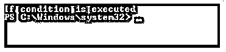
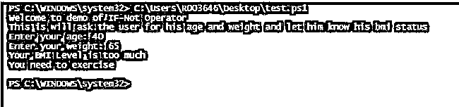
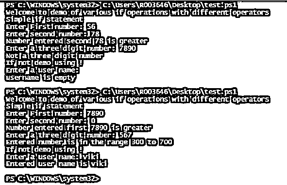
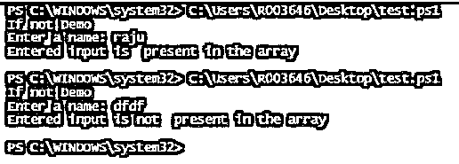

# PowerShell If-Not

> 原文：<https://www.educba.com/powershell-if-not/>

## PowerShell 简介，如果不是

下面的文章提供了 PowerShell 的概要。在大多数脚本中，需要进行一些比较，并根据比较的结果做出一些决定。这就是所谓的条件生成，在 PowerShell 中，这是在条件运算符的帮助下实现的。条件运算符用于比较两个或多个值或条件，并根据这些条件执行适当的操作。If 条件是一种条件运算符。if 运算符有一个需要计算的语句或值，并根据结果执行相应的操作。

if 语句后面通常有一个或多个 else 语句。如果条件的评估为真，则执行 If 块中的代码，否则执行 else 部分中的代码。在 If-Not 的情况下，它只是否定 If 块。这意味着如果条件不满足，则执行 if 部分，如果条件满足，则执行 else 部分。这也被称为 if 运算符的反转。这里我们将看到各种 if 条件运算符和 If-Not 运算符。

<small>Hadoop、数据科学、统计学&其他</small>

### If-Not 运算符的语法

Not 运算符用于将表达式结果从 false 更改为 true 或从 true 更改为 false。——不是的别名是！.

**语法如下:**

`If(-not(statement)){}`

或者

`If(!(statement)){}`

或者

`If(-not($test)){}`

或者

`If(!($test)){}`

**举例:**

**代码:**

`Write-Host "IF-Not example"
if( -not(1 -lt 2))
{
Write-Host "If condition is executed"
}
else
{
Write-Host "else condition is executed"
}`

**输出:**

*   在上面的示例中，if 条件首先检查 1 是否小于 2。是真的。
*   然后 not 运算符使其为假。
*   因此，控制转移到 else 语句，并执行该块。
*   在上面的 if 条件中，if 从 1 变为 3，那么 if 条件将变为 false，而 not 之后将变为 true。

那么 if 语句将如下执行。

**代码:**

`Write-Host "IF-Not example"
if( -not(3 -lt 2))
{
Write-Host "If condition is executed"
}
else
{
Write-Host "else condition is executed"
}`

**输出:**

### PowerShell If-Not 示例

下面是一些例子:

#### 示例#1

**代码:**

`Write-Host "Welcome to demo of IF-Not Operator"
Write-Host "This is will ask the user for his age and weight and let him know his bmi status"
$age=Read-Host "Enter your age"
$weight= Read-Host "Enter your weight"
if(-not($age -gt 40 -and $AGE -LT 50) -and $weight -le 50)
{
Write-Host "Your BMI Level is normal"
Write-Host "You are safe"
}
ElseIf(-not($age -gt 40 -and $AGE -LT 50) -and ($weight -Gt 50 -and $weight -le 60))
{
Write-Host "Your BMI Level is CLOSE TO normal"
Write-Host "You are safe, but please take care"
}
ElseIf(($age -gt 40 -and $AGE -LT 50) -and ($weight -Gt 60 -and $weight -le 70))
{
Write-Host "Your BMI Level is NOT normal"
Write-Host "You need to exercise"
}
Elseif(($age -gt 50 -and $AGE -LT 60) -and $weight -le 50)
{
Write-Host "Your BMI Level is normal"
Write-Host "You are safe"
}
ElseIf(($age -gt 50 -and $AGE -LT 60) -and ($weight -Gt 50 -and $weight -le 60))
{
Write-Host "Your BMI Level is CLOSE TO normal"
Write-Host "You are safe, but need to monitor"
}
ElseIf(($age -gt 50 -and $AGE -LT 60) -and ($weight -Gt 60 -and $weight -le 70))
{
Write-Host "Your BMI Level is absolutely normal"
Write-Host "You are safe, please keep up the good work"
}
Elseif(($age -gt 60 -and $AGE -LT 70) -and $weight -le 50)
{
Write-Host "Your BMI Level is not normal"
Write-Host "You are not safe. Please consult doctor"
}
ElseIf(($age -gt 60 -and $AGE -LT 70) -and ($weight -Gt 50 -and $weight -le 60))
{
Write-Host "Your BMI Level is perfect"
Write-Host "Keep up the good work"
}
ElseIf(-not($age -gt 60 -and $AGE -LT 70) -and ($weight -Gt 60 -and $weight -le 70))
{
Write-Host "Your BMI Level is too much"
Write-Host "You need to exercise"
}
else
{
Write-Host "Please enter appropriarte age and weight"
}`

**输出:**

#### 实施例 2

**代码:**

`Write-Host "Welcome to demo of various if operations with different operators"
Write-Host "Simple if statement"
$no1=Read-Host "Enter First number"
$no2= Read-Host "Enter second number"
if($no1 -gt $no2)
{
Write-Host "Number entered first" $no1 "is greater"
}
else
{
Write-Host "Number entered second" $no2 "is greater"
}
$number=Read-Host "Enter a three digit number"
if(($number -ge 100) -and ($number -lt 300) -and ($number.Length -lt 4))
{
Write-Host "Entered number is in the range 100 to 299"
}
elseif(($number -ge 300) -and ($number -lt 700) -and ($number.Length -lt 4))
{
Write-Host "Entered number is in the range 300 to 700"
}
elseif(($number -ge 700) -and ($number -lt 999) -and ($number.Length -lt 4))
{
if($number.Length -eq 3)
{
Write-Host "Entered number is in the range 700 to 999"
}
else
{
Write-Host "Not a three digit number"
}
}
else
{
Write-Host "Not a three digit number"
}
Write-Host "If not demo using !"
$username= Read-Host "Enter a user name"
if(!$username)
{
Write-Host "username is empty"
}
else
{
Write-Host "Entered user name is" $username
}`

**输出:**

#### 

#### **例 3**

**代码:**

`Write-Host "If not Demo"
$array=@("viki","ravi","raju")
$input=Read-Host "Enter a name"
if(-not($array -contains $input))
{
Write-Host "Entered input is not  present in the array"
}
else
{
Write-Host "Entered input is  present in the array"
}`

**输出:**

### 结论

因此，本文详细介绍了 PowerShell 中的 If-Not 条件运算符。它展示了如何使用 if 条件操作符进行各种比较检查的各种例子。本文还介绍了如何使用 if 循环和多个 if else 语句检查各种场景。要了解更多关于 if 语句和 if 语句的各种比较操作符，建议编写示例脚本并练习它们。

### 推荐文章

这是 PowerShell 的指南，如果不是。在这里，我们讨论 PowerShell If-Not 的介绍以及相应的示例，以便于更好地理解。您也可以看看以下文章，了解更多信息–

1.  [PowerShell 转换为字符串](https://www.educba.com/powershell-convert-to-string/)
2.  [PowerShell 连接字符串](https://www.educba.com/powershell-concatenate-string/)
3.  [有用的 PowerShell 脚本](https://www.educba.com/useful-powershell-scripts/)
4.  [PowerShell 通配符|类型](https://www.educba.com/powershell-wildcards/)
5.  [PowerShell 重命名文件夹(示例)](https://www.educba.com/powershell-rename-folder/)
6.  [PowerShell 发送邮件的例子](https://www.educba.com/powershell-send-mail/)
7.  [PowerShell 获取服务|示例](https://www.educba.com/powershell-get-service/)
8.  [PowerShell 指南继续](https://www.educba.com/powershell-continue/)

