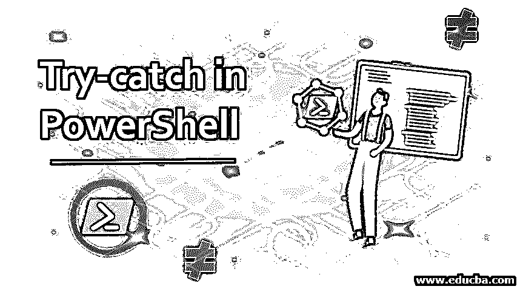
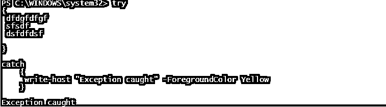
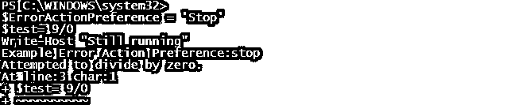
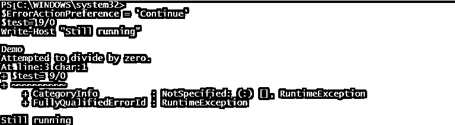
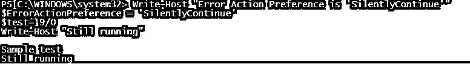

# 在 PowerShell 中尝试捕捉

> 原文：<https://www.educba.com/try-catch-in-powershell/>

## PowerShell 中的 Try-catch 简介

在处理任何脚本或程序时，一个好的做法是拥有一个错误处理机制。虽然这可能需要一点额外的时间，但它的回报是无价的。在本文中，任何脚本或程序都不可能 100%地运行而不出现任何错误或问题。没有必要因为脚本中的逻辑错误而总是发生错误。许多外部因素也可能影响脚本的成功运行。为了避免这种意外，最好实现错误处理机制。

脚本执行过程中可能会出现两种类型的错误。它们是终止错误和非终止错误。顾名思义，终止错误将停止程序的进一步执行，而非终止错误不会停止执行。终止错误的一个例子是语法错误，而非终止错误的一个例子是丢失文件。

<small>Hadoop、数据科学、统计学&其他</small>

### 理解尝试捕捉

在 PowerShell 中，错误处理是通过 trial 和 catch 块完成的。try 块将包含代码，这可能会抛出一个错误。catch 块包含在 try 块引发错误时要执行的代码或操作。此外，可以使用最后一个块来释放资源。大多数情况下，PowerShell 无法处理非终止性错误。为了处理这样的错误，需要将它们专门转换为终止错误。这可以使用 ErrorActionPreference 来完成。

**语法:**

try-catch 块的一般语法如下

`Try
{
//code1 that may generate exception
//code2 that may generate exception
//code3 that may generate exception
//to catch non-terminating error, convert them to terminating error
}
Catch(error)
{
//code to be executed
//multiple catch blocks can be included, or the same catch block can be used to catch multiple exceptions
// the error information is present inside the $_ variable
//The error can be logged to a text file or can trigger an email to inform some user about the error
}
Finally
{
//code to be executed
//this is an optional block of code
}` 

**多重捕捉的语法:**

`try
{
//code to be executed
}
catch [System.IO.DirectoryNotFoundException] {
Write-Output "Directory Not Exception"
}
catch [System.IO.IOException] {
Write-Output "Input/output Exception"
}
catch [System.IO.FileNotFoundException] {
Write-Output "File Not Found Exception"
}`

#### 因素

可以通过多种方式设置错误操作参数。以下是 ErrorAction 参数的可能值。

*   **If -ErrorAction Stop:** 抛出错误，停止程序的执行。
*   **If-error action Inquire/Continue:**抛出错误但继续执行程序。
*   **If-Error action silently continue:**不抛出错误，继续执行
*   **If–Error action Ignore**:不抛出错误，继续执行

静默继续和忽略之间的区别在于，静默将错误细节存储在$error 变量中，而忽略不会这样做。

### PowerShell 中的 Try-catch 示例

下面是 Try，catch 块的一个示例用法:

**代码:**

`try
{
dfdgfdfgf
sfsdf
dsfdfdsf
}
catch
{
write-host "Exception caught"
}`

**输出:**

#### 示例#1

ErrorActionPreference 的各种参数。

**代码:**

`Write-Host "Example Error Action Preference: stop"
$ErrorActionPreference = 'Stop'
$test= 9/0
Write-Host "Still running"`

**输出:**

如您所见，错误发生后，执行会立即停止。

让我们把它改成继续

**代码:**

`Write-Host " Demo"
$ErrorActionPreference = 'Continue'
$test= 9/0
Write-Host "Still running"`

**输出:**

如果您在上面的输出中看到，即使在发生错误后，仍会打印“仍在运行”

让我们看看 ErrorActionSet 设置为“静默继续”的相同输入

**代码:**

`Write-Host " Sample test"
$ErrorActionPreference = 'SilentlyContinue'
$test= 9/0
Write-Host "Still running"`

**输出:**

如您所见，屏幕上没有显示任何错误，执行继续进行。

#### 实施例 2

将错误消息写入控制台。

**代码:**

`Try {
Get-ThisWontWorktestcommand
}
Catch  {
Write-Host "The command ran is not found"`n -ForegroundColor Blue
Write-Host "Message: [$($_.Exception.Message)"] -ForegroundColor Red -BackgroundColor DarkBlue
}`

**输出:**

### 错误处理最佳实践

*   如果有一个异常出现在你面前，试着找到一个解决方案来完全避免它，而不是去处理异常。
*   检查代码的功能，以防同样的错误频繁发生。
*   尝试捕获 trying 块将要返回的特定类型的异常，如果不知道将要发生的异常的类型，请创建一个通用 catch 块。
*   最好将异常消息连同时间戳和异常消息一起捕获到输出文件中。
*   建议不要创建空的 catch 块。

### 结论

因此，本文详细介绍了 PowerShell 中的 try block 特性。对于任何渴望成为 PowerShell 优秀开发人员的人来说，对错误处理机制有非常深刻的理解是非常重要的。在自动化作业的情况下，如果代码中没有实现错误处理机制，管理员将很难理解问题是什么或者问题是何时发生的。

### 推荐文章

这是一个在 PowerShell 中尝试捕捉的指南。在这里，我们讨论了对尝试捕捉、错误处理最佳实践的理解，并给出了示例。您也可以阅读以下文章，了解更多信息——

1.  [PowerShell 中的循环](https://www.educba.com/loops-in-powershell/)
2.  [PowerShell 环境变量](https://www.educba.com/powershell-environment-variables/)
3.  [如何在 Powershell 中格式化表格？](https://www.educba.com/powershell-format-table/)
4.  [7 种不同 PowerShell 工具指南](https://www.educba.com/powershell-tools/)

