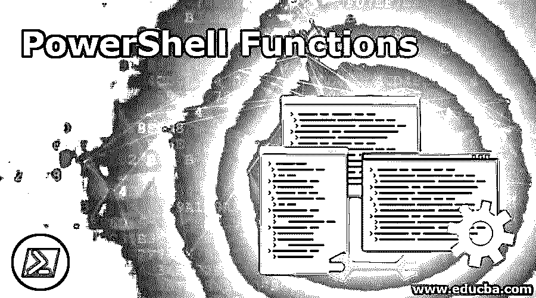
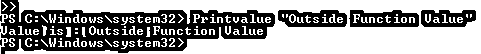
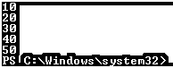
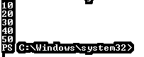
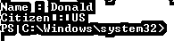

# PowerShell 函数

> 原文：<https://www.educba.com/powershell-functions/>

## PowerShell 函数简介

PowerShell 函数用于代码重用。当你写一个大程序时，很多时候你有机会多次使用这些代码，所以我们可以创建一个包含所有代码的函数，并在需要的时候调用它，而不是一遍又一遍地写。PowerShell 有两种类型的功能。正常功能和高级功能。

**语法:**

<small>Hadoop、数据科学、统计学&其他</small>

`function [<scope:>]<name> [([type]$parameter1[,[type]$parameter2])] {
param([type]$parameter1 [,[type]$parameter2])
dynamicparam {<statement list>}
begin {<statement list>}
process {<statement list>}
end {<statement list>}
}`

**调用函数的语法:**

`functionname Argument1 Argument2`

### PowerShell 函数的参数

**1。作用域:**函数的作用域，用于阻止其他对象、变量、函数、alises 等。以免被系统内的脚本无意中更改。

**2。名称:**函数的名称。

**3。参数:**当您将参数传递给函数时，这些参数捕获参数并在函数内部传递它们。此参数与实参具有相同的数据类型。

**4。Param:** Param 对于声明函数内部的变量很有用。它也与高级功能一起使用。

**5。Dynamicparam:** 动态参数用于高级功能。因为仅在需要时才包括。

### PowerShell 中的函数是如何工作的？

该函数包含代码，可以调用其他函数。要创建一个函数，正如上面的语法所提到的，您首先需要创建函数，然后在程序中调用它，或者您可以在程序执行后在程序外调用该函数。例如:

**代码:**

`function Printvalue($value1){
Write-Output "Value is : $value1"
}
Printvalue "Hello World"`

**输出:**

**解释**:在这里，我们首先声明了一个名为 PrintValue 的函数，它打印数据，我们将用函数名并通过传递参数“Hello World”来调用该函数，$Value1 捕获它并将其传递给函数。

您也可以只编写函数，并通过 PowerShell 控制台中的函数名来执行它。举个例子:取上面同样的函数但是不打印函数内部的值，但是我们会在程序执行后从控制台打印出来。

**代码:**

`function Printvalue($value1){
Write-Output "Value is : $value1"
}`

**输出:**

### 实现 PowerShell 函数的例子？

以下是 PowerShell 函数的示例:

#### 示例#1

没有参数的 PowerShell“函数”。下面是一个没有任何自变量和参数的函数示例。

**代码:**

`function callfunct{
Write-Output "Function called"
}
callfunct`

**输出:**

#### 实施例 2

只有一个参数的 PowerShell“函数”。将一个参数传递给 function 和 function 的示例用一个参数捕获它。

**代码:**

`function callfunct($param1){
Write-Output "Value : $param1"
}
callfunct 20`

**输出:**

#### 实施例 3

具有多个参数的 PowerShell“函数”。您可以向一个函数传递多个参数。

**代码:**

`function addition($value1, $value2){
$value = $value1 + $value2
Write-Output "Total : $Value"
}
addition 20 30`

**输出:**

类似地，您可以向函数传递更多的参数。举个例子，

**函数名参数 1 参数 2 参数 3……参数 N**

#### 实施例 4

PowerShell "函数 **"** 带有"返回 **"** 值。您可以使用 return 参数将函数的输出返回给调用。

**代码:**

`function addition($value1, $value2){
return $value1 + $value2
}
$output = addition 20 30
Write-Output "Sum : $output"`

**输出:**

在这里，函数返回值，并由$output 变量捕获。

#### 实施例 5

将数组传递给函数。我们也可以将整个数组传递给函数。

**代码:**

`$a = @(10,20,30,40,50)
function arrayfunct($values){
Write-Output $values
}
arrayfunct $a`

**输出:**

#### 实施例 6

从函数中返回数组。函数也可以返回一个数组。请参见下面的示例。

**代码:**

`function callarray{
$a = @(10,20,30,40,50)
return $a
}
$arr = callarray
Write-Output $arr`

**输出:**

在上面的示例中，函数返回数组值，这些值由变量$arr 捕获。

#### 实施例 7

嵌套函数。您也可以在函数内部调用函数。在下面的例子中，我们将向一个函数传递两个值，这两个值将被求和，然后传递给另一个函数，以获得其值的两倍。

**代码:**

`function square($a){
return $a * $a
}
function addition($value1,$value2){
$sum = $value1 + $value2
$sqr = square $sum
return $sqr
}
$out = addition 5 6
Write-Output "Square : $out"`

这里，将两个值 5 和 6 传递给函数 addition，将它们相加，然后将输出传递给 square 函数(值:11)以获得它的平方，最后，输出将返回 121。

**输出:**

#### 实施例 8

PowerShell 函数内部的参数声明。您可以在函数内部声明参数。所以在函数开始时，参数会被初始化。它类似于为变量赋值，但在使用高级函数时看起来更有条理。

**代码:**

`function parametertest{
param(
$name = "Donald",
$Citizen = "US"
)
Write-Output "Name : $name"
Write-Output "Citizen : $citizen"
}
parametertest`

**输出:**

### 结论

毫无疑问，function 提供了具有高级功能的代码的极大的可重用性。函数也是任何编程语言的重要组成部分，因为它创建了一个更加结构化的程序，并且易于理解程序的流程。大多数人在编写大量代码时使用高级函数，因此它也有助于捕获错误输出和用于调试目的。

### 推荐文章

这是 PowerShell 函数的指南。在这里，我们讨论 PowerShell 函数的介绍、示例及其代码实现。您也可以浏览我们推荐的其他文章，了解更多信息——

1.  [Switch Case 在 PowerShell 中工作？](https://www.educba.com/switch-case-in-powershell/)
2.  [PowerShell 工具](https://www.educba.com/powershell-tools/)
3.  [PowerShell 预定任务](https://www.educba.com/powershell-scheduled-task/)
4.  [PowerShell 转换为字符串](https://www.educba.com/powershell-convert-to-string/)
5.  [PowerShell 发送邮件](https://www.educba.com/powershell-send-mail/)

