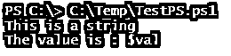
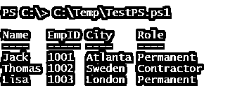
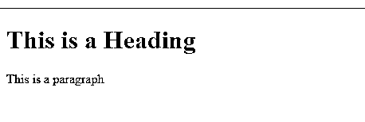

# PowerShell here 字符串

> 原文：<https://www.educba.com/powershell-here-string/>

## PowerShell 简介此处字符串

PowerShell Here-String 是在附件中插入多行字符串或命令的方法，也称为字符串数组，用自由文本和字符串块表示数据的最佳方式是用带有单引号或双引号的 **@" "@** 表示，其中可以执行文本、表达式、子表达式，并创建不同格式的文件。

**语法**

<small>Hadoop、数据科学、统计学&其他</small>

PowerShell 这里——String 用附件 **@" "@，**表示，有些人也将其称为 PowerShell String 数组。

### PowerShell“Here String”是如何工作的？

双引号代表 Powershell here-string**@ " " @**或单引号 **@' '@，**但两者并不相同；当涉及到变量或表达式的扩展时，它们有很大的不同。

首先，让我们简单地尝试我们的多线弦封闭，以检查它是如何工作的。

`@"
This is a string block with multiple lines.
This is the second line
This is the third line
"@`

**输出:**

我们前面提到过；这是自由文本，所以你可以把 string 放在块中的任何地方，它将会像提到的那样显示。

`@"
This is the first line
This is the second line
This is the third line
"@`

**输出:**

当您声明 here-string 块 **@" "@，**时，空白对它来说是一个非常重要的因素。您可以在语法 **@"** 的开头提供空白，但不能在语法 **"@** 的结尾提供空白，这被视为无效。参见下面的例子，

`@"
This is the first line
This is the second line
This is the third line
"@`

结束块 **"@** 包含空白，输出会产生错误。

这里——写文本时，带单引号的字符串类似于双引号。我们也可以编写上面的字符串输入，如下所示。

`@'
This is the first line
This is the second line
This is the third line
'@`

我们也可以将这里的字符串存储到变量中。

`$str = @"
This is the first line
This is the second line
This is the third line
"@
$str`

单引号和双引号之间的显著区别在于我们何时在它们内部使用变量。这里的单引号-字符串不能扩展变量的名称。

`$val = 10
@"
This is a string
The value is : $val
"@`

**输出:**

使用单引号括起来时。

`$val = 10
@'
This is a string
The value is : $val
'@`

**输出:**

你可以看到单引号不能扩展变量名。类似地，当展开变量时，单引号 here-string 命令无法展开它，如下所示。

`@'
This is a string
Today's date is : $(Get-Date)
Total: $(4 + 5 + 6)
'@`

**输出:**

当我们在这里使用双引号字符串。

`@"
This is a string
Today's date is : $(Get-Date)
Total: $(4 + 5 + 6)
"@`

**输出:**

here-String 方法并不局限于显示多行字符串或变量或表达式的扩展，我们还可以创建 CSV、JSON、HTML 等。文件及其数据，然后将它们转换为各自的文件格式，它们显示在下面的示例中。

### PowerShell 字符串示例如下

以下是 PowerShell 字符串的示例:

#### 示例 1–使用 Here-String 创建一个 CSV 文件。

要创建 CSV 文件格式和数据，我们可以使用 Here-string 方法，如下所示。

`$csv = @"
Name, EmpID, City, Role
Jack, 1001, Atlanta, Permanent
Thomas, 1002, Sweden, Contractor
Lisa, 1003, London, Permanent
"@
$csv | ConvertFrom-Csv`

**输出:**

要将输出存储在 CSV 中，可以使用下面的命令。

$ Csv | convert from-Csv | Export-Csv C:\ temp \ EMP data . Csv-NoTypeInformation

#### 示例 2——使用 Here-String 命令创建一个 JSON 文件。

用这里的字符串创建一个 JSON 文件。

`@"
{
"Type": "Fruits",
"Fruits": [
"Apple",
"Grapes",
"Mango"
],
"Country": [
"India",
"US"
] }
"@ | ConvertFrom-Json`

**输出:**

#### 例 3——用 Here-String 创建哈希表。

我们可以转换的另一种数据类型是哈希表。要使用 Here-String 命令创建哈希表，请使用下面的方法。

`$hash = @"
Name = Jackson
Employer = BigData
EmpID = 2032
Type = Permanent
"@
$hash | ConvertFrom-StringData`

**输出:**

#### 示例 4——使用 here-string 创建一个 HTML 文件。

我们可以使用 PowerShell here-string 命令创建一个 HTML 文件，如下所示。

`$html = @'
<!DOCTYPE html>
<html>
<head>
<title> PowerShell HTML Page </title>
</head>
<body>
<h1> This is a Heading </h1>

 This is a paragraph 

</body>
</html>
'@
$html | Out-File C:\Temp\testhtml.html`

**输出:**

#### 示例 5–使用 Here-String 创建新的 PowerShell 函数。

Here-String 命令非常有用，您甚至可以创建一个 PowerShell 函数并将其存储在新文件中。如下图。

`@'
function PrintName{
param(
[Parameter(Mandatory=$true)] [String]$Name
)
Write-Output "Here-String.. Print Name: $Name"
}
'@ | Out-File C:\Temp\PrintName.ps1`

我们在这里使用单引号字符串，因为我们不想打印$Name 变量，但是我们需要将它存储到文件中。如果不使用函数直接存储文件，可以直接从命令行传递参数，如下所示。

`@'
param(
[Parameter(Mandatory=$true)] [String]$Name
)
Write-Output "Here-String.. Print Name: $Name"
'@ | Out-File C:\Temp\PrintName.ps1`

**输出:**

有如此多的例子，以至于您几乎可以用 here-string 命令创建任何类型的文件、函数、表达式，这一特性使得 here-string 更加强大。不仅在 PowerShell 中，其他编程语言也因其灵活性而使用 here-string 命令。

### 结论

PowerShell here-string 是编写多行字符串的最有效方法之一，包括扩展外壳内的变量、表达式、子表达式。我们还可以使用 here-string 创建 CSV、JSON、HTML 等结构。，letter 将它们转换为各自的格式。

### 推荐文章

这是 PowerShell 的一个指导字符串。在这里，我们讨论 PowerShell“Here String”如何与示例和输出一起工作。您也可以看看以下文章，了解更多信息–

1.  [PowerShell 等待](https://www.educba.com/powershell-wait/)
2.  [PowerShell XML](https://www.educba.com/powershell-xml/)
3.  [PowerShell 更改目录](https://www.educba.com/powershell-change-directory/)
4.  [PowerShell 类操作员](https://www.educba.com/powershell-like-operator/)

