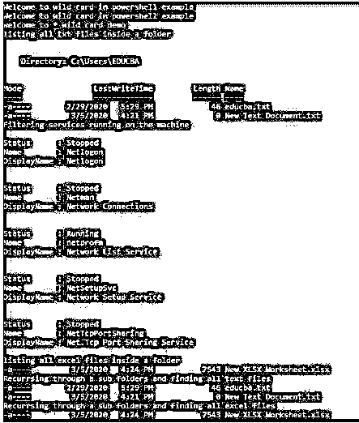
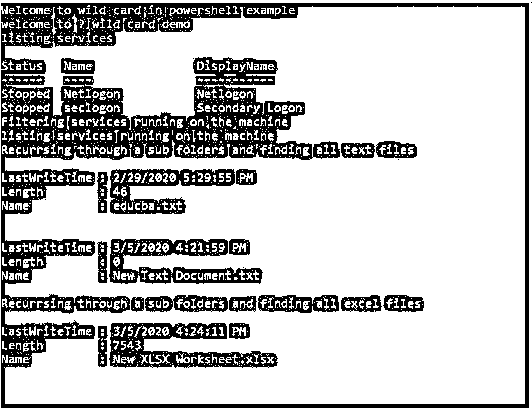
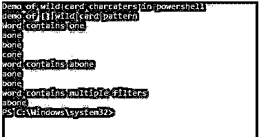
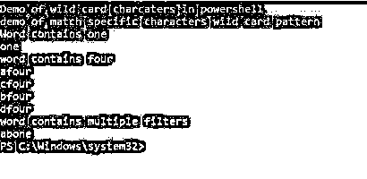
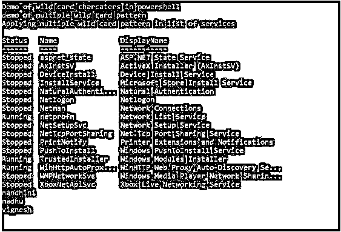
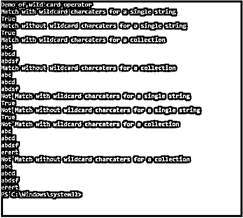
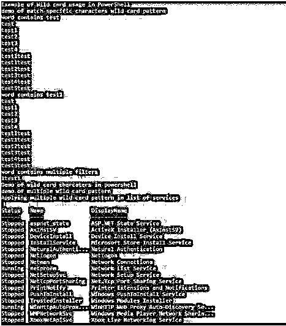
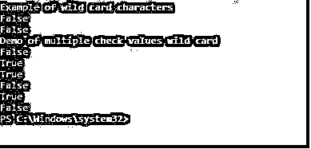
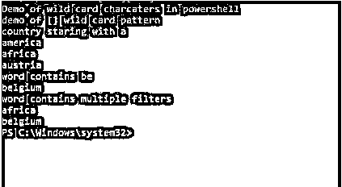

# PowerShell 通配符

> 原文：<https://www.educba.com/powershell-wildcards/>

## PowerShell 通配符简介

通配符是用于匹配多个字符的模式。它们用于指定 cmdlets 中的某些模式，以筛选结果或仅返回与指定通配符匹配的结果。PowerShell 中有四种类型的通配符。它们被表示为*、？，[m-n]和[abc]。可以一起使用多个通配符模式。PowerShell 中的许多 cmdlets 都接受通配符参数。接受通配符作为输入的 Cmdlets 不区分大小写。也可以在 cmdlet 中使用通配符来筛选 cmdlet 结果中可用的属性。本文将详细介绍通配符、其类型、用法以及各种示例。

### PowerShell 中通配符的类型

PowerShell 中有四种类型的通配符。

<small>Hadoop、数据科学、统计学&其他</small>

**语法:**

**1) *:** 表示匹配模式必须是零个或多个字符。如果只使用*号，则返回所有匹配的字符。

**例:** Ba*它会返回巴古巴利，巴特查，巴塞尔。它不会像美国、非洲那样回归。

**2)？:**表示该位置的字符必须匹配。

**举例:**？b 会返回 ab，cb，db 不会返回 aa，ac，aj。

**3) []:** 这表示必须检查范围内的模式是否匹配。

**例:** [a-c]de 会返回 ade，bde，不会与 zde 匹配。

**4) []:** 只匹配范围内提到的特定字符。

**举例:**tef 会匹配 atef 和 btef。

### 实现 PowerShell 通配符的示例

以下是 PowerShell 通配符的示例:

#### 示例#1

**代码:**

`Write-Host "Welcome to wild card in powershell example"
Write-Host "Welcome to wild card in powershell example"
Write-Host "welcome to * wild card demo"
Write-Host "listing all txt files inside a folder"
Get-ChildItem C:\Users\EDUCBA\*.txt
write-host "Filtering services running on the machine"
Get-Service | Where-Object {$_.Name -like "net*"}
Write-Host "listing all excel files inside a folder"
Get-ChildItem C:\Users\EDUCBA\*.xlsx
Write-Host "Recurrsing through a sub folders and finding all text files"
Get-ChildItem -Path C:\\Users\EDUCBA\*.txt -Recurse -Force
Write-Host "Recurrsing through a sub folders and finding all excel files"
Get-ChildItem -Path C:\\Users\EDUCBA\*.xlsx -Recurse -Force`

**输出:**

#### 实施例 2

**代码:**

`Write-Host "Welcome to wild card in powershell example"
Write-Host "welcome to ? wild card demo"
Write-Host "listing services"
Get-Service | Where-Object {$_.Name -like "???logon"}
write-host "Filtering services running on the machine"
Get-Service | Where-Object {$_.Name -like "??logon"}
write-host "listing services running on the machine"
Get-Service | Where-Object {$_.Name -like "?logon"}
Write-Host "Recurrsing through a sub folders and finding all text files"
Get-ChildItem -Path C:\\Users\EDUCBA\*.txt -Recurse -Force
Write-Host "Recurrsing through a sub folders and finding all excel files"
Get-ChildItem -Path C:\\Users\EDUCBA\*.xlsx -Recurse -Force`

**输出:**

#### 实施例 3

**代码:**

`Write-Host "Demo of wild card charcaters in powershell"
Write-Host "demo of [] wild card pattern"
$input=@("one","two","three","four","five","oneone","onetwo","onethree","aone","bone","cone")
Write-Host "Word contains one"
$input -like "[a-z]one"
$input=@("abone","two","three","abfour","five","aboneone","onetwo","onethree","aone","bone","abonethree")
Write-Host "word contains abone"
$input -like "[ab]one"
$input=@("abone","two","three","abfour","five","aboneone","onetwo","onethree","aone","bone","abonethree")
Write-Host "word contains multiple filters"
$input -like "[a-d][b-f]one"`

**输出:**

#### 实施例 4

**代码:**

`Write-Host "Demo of wild card charcaters in powershell"
Write-Host "demo of match specific characters wild card pattern"
$input=@("one","two","three","four","five","oneone","onetwo","onethree","aone","bone","cone")
Write-Host "Word contains one"
$input -like "[o]ne"
$input=@("abone","two","three","afour","five","aboneone","onetwo","onethree","aone","bone","abonethree","cfour","bfour","dfour")
Write-Host "word contains four"
$input -like "[abcd]four"
$input=@("abone","two","three","abfour","five","aboneone","onetwo","onethree","aone","bone","abonethree")
Write-Host "word contains multiple filters"
$input -like "[a-d][b-f]one"`

**输出:**

#### 实施例 5

**代码:**

`Write-Host "Demo of wild card charcaters in powershell"
Write-Host "demo of multiple wild card pattern"
Write-Host "Applying multiple wild card pattern in list of services"
Get-Service | Where-Object {$_.Name -like "*n?t*"}
$inout=@("vignesh","nandhini","vyapini","ashiwini","hini","madhu")
$inout -like "[a-z][a-d]*"
$inout=@("vignesh","nandhini","vyapini","ashiwini","hini","madhu")
$inout -like "*ne[s-z]?o*"
$inout=@("vignesh","nandhini","vyapini","ashiwini","hini","madhu")
$inout -like "*ne[s-z]?"`

**输出:**

#### 实施例 6

**代码:**

`write-host "Demo of wild card operator"
Write-Host "Match with wildcard charcaters for a single string"
$input="My name is ramesh"
$input -match "na*"
Write-Host "Match without wildcard charcaters for a single string"
$input -match "na"
Write-Host "Match with wildcard charcaters for a collection"
$input="abc", "abcd", "abdsf","erert"
$input -match "ab*"
Write-Host "Match without wildcard charcaters for a collection"
$input="abc", "abcd", "abdsf","erert"
$input -match "ab"
Write-Host "Not Match with wildcard charcaters for a single string"
$input="My name is sacinn tendulkar"
$input -notmatch "za*?"
Write-Host "Not Match without wildcard charcaters for a single string"
$input -notmatch "za"
Write-Host "Not Match with wildcard charcaters for a collection"
$input="abc", "abcd", "abdsf","erert"
$input -notmatch "za[-z]*"
Write-Host "Not Match without wildcard charcaters for a collection"
$input="abc", "abcd", "abdsf","erert"
$input -notmatch "za[u]"`

**输出:**

#### 实施例 7

**代码:**

`Write-Host "Example of Wild card usage in PowerShell"
Write-Host "demo of match specific characters wild card pattern"
$input=@("test","test1","test2","test3","test4","test1test","test1test","test2test","test3test","test4test","test5test")
Write-Host "Word contains test"
$input -like "[t]est*"
$input=@("test","test1","test2","test3","test4","test1test","test1test","test2test","test3test","test4test","test5test")
Write-Host "word contains test1"
$input -like "test*"
$input=@("test","1test1","test2","test3","test4","test1test","test1test","test2test","test3test","test4test","test5test")
Write-Host "word contains multiple filters"
$input -like "?test1"
Write-Host "Demo of wild card charcaters in powershell"
Write-Host "demo of multiple wild card pattern"
Write-Host "Applying multiple wild card pattern in list of services"
Get-Service | Where-Object {$_.Name -like "*n?t*"}
$inout=@("test","test1","test2","test3","test4","test1test","test1test","test2test","test3test","test4test","test5test")
$inout -like "[a-z][a-d]*"
$inout=@("test","test1","test2","test3","test4","test1test","test1test","test2test","test3test","test4test","test5test")
$inout -like "*ne[s-z]?o*"
$inout=@("test","test1","test2","test3","test4","test1test","test1test","test2test","test3test","test4test","test5test")
$inout -like "*ne[s-z]?"`

**输出:**

#### 实施例 8

**代码:**

`Write-Host "Example of wild card characters"
$input= "sdfsdfdsf","adsadsad","test","test1"
$input -contains "test*"
$input= "sdfsdfdsf","adsadsad","test","test1"
$input -contains "dfsdf?*"
Write-Host "Demo of multiple check values wild card"
$input="one","two","three","four","five"
$input -contains "one?","two*"
$input="one","two"
$input, "three","four" -ccontains $input
$input= "sdfsdfdsf","adsadsad","dfdf","sdf"
$input -notcontains "test"
$input= "sdfsdfdsf","adsadsad","test","test1"
$input -notcontains "test"
$input="one","two","three","four","five"
$input -notcontains "one","two"
$input="one","two"
$input, "three","four" -notcontains $input`

**输出:**

#### 实施例 9

**代码:**

`Write-Host "Demo of wild card charcaters in powershell"
Write-Host "demo of [] wild card pattern"
$input=@("india","china","america","africa","thailand","sweden","germany","poland","austria","belgium","srilanka")
Write-Host "country staring with a"
$input -like "a*"
$input=@("india","china","america","africa","thailand","sweden","germany","poland","austria","belgium","srilanka")
Write-Host "word contains be"
$input -like "be*"
$input=@("india","china","america","africa","thailand","sweden","germany","poland","austria","belgium","srilanka")
Write-Host "word contains multiple filters"
$input -like "[a-d][b-f]*"`

**输出:**

### 结论

因此，本文详细介绍了 PowerShell 中的通配符表达式。它还解释了可用的通配符表达式的类型及其用法，并给出了相应的示例。本文用相应的示例程序详细解释了每种通配符表达式类型。同时使用多个通配符表达式也将在一个适当的演示程序中详细解释。要了解更多细节，建议编写并练习示例程序。

### 推荐文章

这是 PowerShell 通配符指南。这里我们讨论 PowerShell 中不同类型的通配符及其示例和代码实现。您也可以浏览我们推荐的其他文章，了解更多信息——

1.  [PowerShell 调度任务的不同命令](https://www.educba.com/powershell-scheduled-task/)
2.  [PowerShell 转换为字符串的示例](https://www.educba.com/powershell-convert-to-string/)
3.  [PowerShell If-Not |示例](https://www.educba.com/powershell-if-not/)
4.  [PowerShell 重命名文件夹指南](https://www.educba.com/powershell-rename-folder/)
5.  [PowerShell 发送邮件|示例](https://www.educba.com/powershell-send-mail/)
6.  [PowerShell 获取服务](https://www.educba.com/powershell-get-service/)
7.  [PowerShell 指南继续](https://www.educba.com/powershell-continue/)

