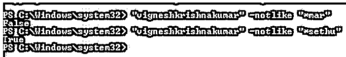
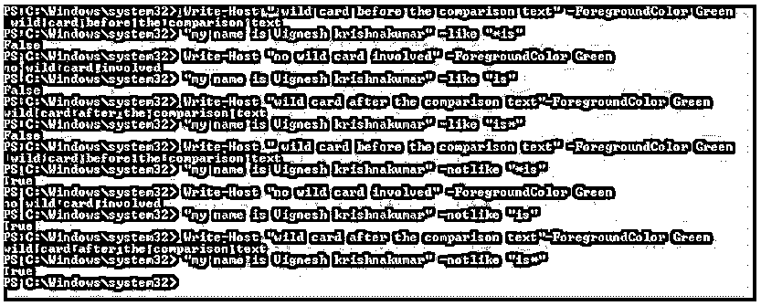
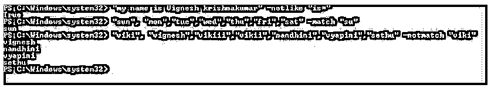
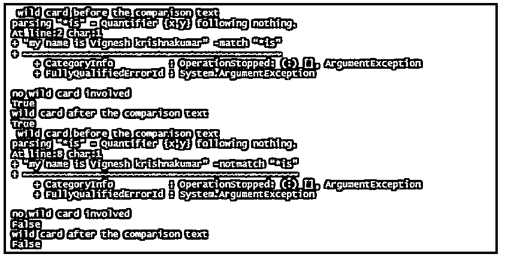
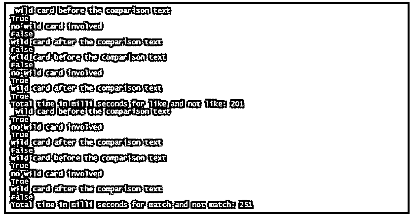

# PowerShell 不喜欢

> 原文：<https://www.educba.com/powershell-not-like/>

## PowerShell 简介不喜欢

以下文章提供了 PowerShell not like 的概述。比较运算符让用户指出比较值和查找满足上述条件的值的条件。要使用比较运算符，请指出您只需要比较的值以及隔离这些值的运算符。不相似运算符是一种匹配比较运算符。这连同 like、match 和 not match 运算符都是匹配比较运算符类型的一部分。如果字符串与指定的条件不匹配，则 not like 运算符返回 true。这里我们将看到不相似操作符以及其他匹配操作符。

**不相似运算符的语法:**

<small>Hadoop、数据科学、统计学&其他</small>

下面给出了不相似运算符的语法:

`<string[]> -notlike <wildcard-expression>`

**举例:**

**代码:**

`"vigneshkrishnakumar" -notlike "*mar"
"vigneshkrishnakumar" -notlike "*sethu"`

**输出:**

### 不同操作员的工作

like 运算符使用通配符表达式进行比较。比如让我们考虑一句话“你多大了？”如果我们执行 cmdlet“你多大了”-像“*你”，cmdlet 将返回 true，但是如果 cmdlet 被修改为“你多大了”-像“你”，cmdlet 将返回 false。这是由于你面前的星号。星号符号代表通配符表达式。

如果通配符出现在比较文本的开头，则意味着任何内容都可以出现在被搜索的表达式之前，而如果星号出现在末尾，则意味着被搜索的表达式后面应该有一些内容。在上面的例子中，如果星号放在文本之后，它将返回 false。不相似运算符与相似运算符完全相反。当条件为假时返回真，当条件匹配时返回假。

**举例:**

**代码:**

`Write-Host " wild card before the comparison text" -ForegroundColor Green
“my name is Vignesh krishnakumar” -like “*is”
Write-Host "no wild card involved" -ForegroundColor Green
“my name is Vignesh krishnakumar” -like “is”
Write-Host "wild card after the comparison text"-ForegroundColor Green
“my name is Vignesh krishnakumar” -like “is*”
Write-Host " wild card before the comparison text" -ForegroundColor Green
“my name is Vignesh krishnakumar” -notlike “*is”
Write-Host "no wild card involved" -ForegroundColor Green
“my name is Vignesh krishnakumar” -notlike “is”
Write-Host "wild card after the comparison text"-ForegroundColor Green
“my name is Vignesh krishnakumar” -notlike “is*”`

**输出:**

### 用匹配和不匹配比较相似和不相似

另一种类型的比较运算符是匹配/非匹配运算符。虽然与 Like 比较，但它更像 PowerShell(不过更复杂一点)。匹配或非匹配运算符管理员使用惯用表达式(regex)。这通常是一个巨大的优势，并给予坐标一个明确的支持。在任何情况下，如果你最近一段时间没有使用习惯用语，计划一下你自己。让我们再看一遍过去的插图。

**匹配和不匹配运算符的语法:**

`<string[]> -match <regular-expression>` 

`<string[]> -notmatch <regular-expression>`

#### 示例#1:

**代码:**

`"sun", "mon","tue","wed","thu","fri","sat" -match "su"
"viki", "vignesh","vikiii","vikii","nandhini","vyapini","sethu" -notmatch "viki"`

**输出:**

#### 示例 2:

**代码:**

`Write-Host " wild card before the comparison text" -ForegroundColor Green
“my name is Vignesh krishnakumar” -match “*is”
Write-Host "no wild card involved" -ForegroundColor Green
“my name is Vignesh krishnakumar” -match “is”
Write-Host "wild card after the comparison text"-ForegroundColor Green
“my name is Vignesh krishnakumar” -match “is*”
Write-Host " wild card before the comparison text" -ForegroundColor Green
“my name is Vignesh krishnakumar” -notmatch “*is”
Write-Host "no wild card involved" -ForegroundColor Green
“my name is Vignesh krishnakumar” -notmatch “is”
Write-Host "wild card after the comparison text"-ForegroundColor Green
“my name is Vignesh krishnakumar” -notmatch “is*”`

**输出:**

正如您在上面的输出中看到的，匹配操作符不支持通配符表达式。

#### 例 3:

**代码:**

`$start=(Get-Date).Millisecond
Write-Host " wild card before the comparison text" -ForegroundColor Green
“corona originated in china but now it is cured there” -like “*there”
Write-Host "no wild card involved" -ForegroundColor Green
“corona originated in china but now it is cured there” -like “there”
Write-Host "wild card after the comparison text"-ForegroundColor Green
“corona originated in china but now it is cured there” -like “there*”
Write-Host "wild card before the comparison text"-ForegroundColor Green
“corona originated in china but now it is cured there” -notlike “*there”
Write-Host "no wild card involved" -ForegroundColor Green
“corona originated in china but now it is cured there” -notlike “there”
Write-Host "wild card after the comparison text" -ForegroundColor Green
“corona originated in china but now it is cured there” -notlike “there*”
$end=(Get-Date).Millisec
Write-Host "Total time in milli seconds for like and not like: $($start-$end)" -ForegroundColor Yellow
$start1=(Get-Date).Millisecond
Write-Host " wild card before the comparison text" -ForegroundColor Green
“corona originated in china but now it is cured there” -match “there”
Write-Host "no wild card involved" -ForegroundColor Green
“corona originated in china but now it is cured there” -match “now”
Write-Host "wild card after the comparison text"-ForegroundColor Green
“corona originated in china but now it is cured there” -match “america”
Write-Host "wild card before the comparison text"-ForegroundColor Green
“corona originated in china but now it is cured there” -notmatch “america”
Write-Host "no wild card involved" -ForegroundColor Green
“corona originated in china but now it is cured there” -notmatch “sweden”
Write-Host "wild card after the comparison text" -ForegroundColor Green
“corona originated in china but now it is cured there” -notmatch "china”
$end1=(Get-Date).Millisec
Write-Host "Total time in milli seconds for match and not match: $($start1-$end1)" -ForegroundColor Yellow`

**输出:**

从上面的输出可以看出，like 和 not like 的执行时间更短。

### 结论–PowerShell 不喜欢

因此，在本文中，我们详细了解了不相似操作符。在这里，我们看到了语法、用法和它的优点以及适当的例子。在这里我们还看到了匹配和不匹配运算符及其与不像运算符的异同。

### 推荐文章

这是一个指南 PowerShell 不喜欢。在这里，我们讨论不相似操作符的工作，以及用匹配和不匹配来比较相似和不相似。您也可以看看以下文章，了解更多信息–

1.  [PowerShell 继续](https://www.educba.com/powershell-continue/)
2.  [Windows PowerShell ISE](https://www.educba.com/windows-powershell-ise/)
3.  [PowerShell 重命名文件夹](https://www.educba.com/powershell-rename-folder/)
4.  [PowerShell 获取服务](https://www.educba.com/powershell-get-service/)

