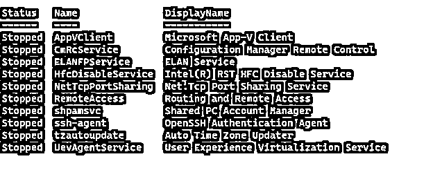
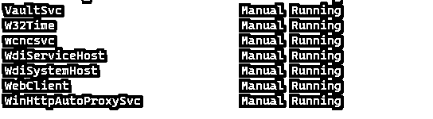
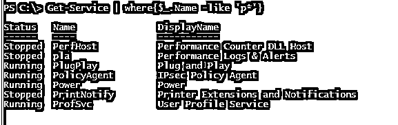
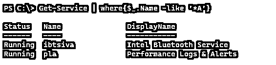
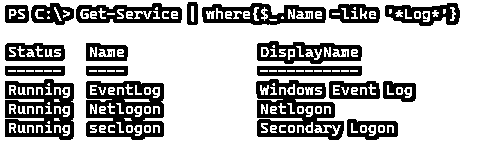
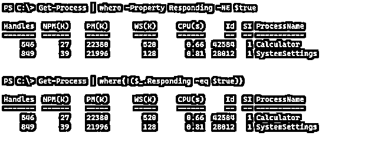

# PowerShell 在哪里

> 原文：<https://www.educba.com/powershell-where/>

## PowerShell 简介，其中

PowerShell Where-Object cmdlet(别名:Where)根据使用管道传递给它的值选择或筛选出对象的特定属性，例如根据名称或用法筛选出特定进程，或者根据启动类型、状态等筛选出服务。此 Where-Object 从 PowerShell 管道中获取输入并对其进行处理，它使用比较运算符以及属性值，并基于脚本块或比较语句工作。

### 句法

Where 对象命令的语法。

<small>Hadoop、数据科学、统计学&其他</small>

**语法 1:**

`Where-Object
[-InputObject <PSObject>] [-Property] <String>
[[-Value] <Object>] [-Comparision Operator] [<CommonParameters>]`

这里的比较运算符是:

| 情商 | 大型旅行车 |
| 比赛 | confédération générale du travail 总工会 |
| council on environmental quality 改善环境质量委员会 | 书信电报(letter message) |
| 经认证的 netware 工程师 | 计算机语言翻译程序 |
| 通用电气公司 | 法国通用电器公司 |
| 低爆速炸药（Low Explosive） | 小叶中心性肺气肿 |
| 喜欢 | 克里凯 |
| NotLike | 不像 |
| 比赛 | 不匹配 |
| CNotMatch | 包含 |
| 包含 | 不包含 |
| CNotContains | 在…里 |
| CIn | 不在 |
| contin | 是 |
| 不是 | 不 |

**语法 2:**

`Where-Object
[-InputObject <PSObject>] [-FilterScript] <ScriptBlock>
[<CommonParameters>]`

两种语法的公共参数。

| 调试(数据库) | 输出变量(ov) |
| 错误操作(ea) | 输出缓冲器 |
| 误差变量 | 管道变量(pv) |
| 信息行动 | 详细(vb) |
| 信息变量(iv) | WarningAction (wa) |
|  | 警告变量(wv) |

### PowerShell 中的 Where-Object 命令是如何工作的？

PowerShell 中的 Where-Object cmdlet 从管道中获取输入，并处理输入对象属性。输入对象可以是由方法和属性组成的对象，也可以是数组。使用 where-object cmdlet 后，它将使用对象的属性以及比较运算符进行筛选。

有两种方法可以构造 Where-Object 命令。

#### 1.脚本块

在这个方法中，我们使用属性名、比较操作符或逻辑操作符以及属性值从对象中过滤出数据。Where-Object 返回特定脚本块语句为真的所有对象。

举个例子，

`Get-Process | Where-Object {$_.Name -eq "Chrome"}`

#### 2.比较语句

这个特性是在 PowerShell 3.0 中引入的，在此之前，只有一个 scriptblock 方法。该方法使用自然语言通过提供属性值来过滤掉对象。

举个例子，

`Get-Process | Where-Object -Property "Name" -EQ -Value "Chrome"`

当只提供属性的名称而不提供值时，它将 Where-Object 视为布尔表达式。举个例子，

`('Hello','','PowerShell') | Where-Object Length`

在示例一节中，我们将看到更多的示例。

我们也可以用“？”符号，而不是 Where-Object 命令。举个例子，

`Get-Service | ?{$_.StartType -eq 'Disabled'}`

我们在 Where-Object 命令中提供的值不区分大小写，但可以使用以“C”开头的几个运算符(ceq、clike、Ccontains 等)来区分大小写。

### 例子

下面举几个例子

#### 示例 1–使用-EQ 运算符。

在此示例中，Where-Object 使用-EQ 运算符来获取处于禁用状态的服务的启动类型。

`Get-Service | where{$_.StartType -eq 'Disabled'}`

或者

`Get-Service | Where-Object -Property Starttype -EQ -Value Disabled`

**输出:**

#### 示例 2–使用多个比较运算符和一个逻辑运算符。

我们可以组合多个比较操作符和一个逻辑操作符，用 Where-Object 命令过滤出结果。举个例子，

`Get-Service | Where{($_.StartType -eq 'Manual') -and ($_.Status -eq 'Running')} | Select Name, Starttype, Status`

**输出:**

#### 示例 3–使用通配符。

我们可以在 Like 操作符中使用通配符来获得相似的结果。举个例子，

获取以“P”开头的服务名。

``Get-Service | where{$_.Name -like 'P*'}``

 `**输出:**

以“A”结尾的服务名。

`Get-Service | where{$_.Name -like '*A'}`

**输出:**

包含“日志”的服务名。

`Get-Service | where{$_.Name -like '*Log*'}`

**输出:**

#### 示例 4–区分大小写。

PowerShell 及其命令不区分大小写，但可以使用一些比较运算符区分大小写，它们以“C”开头。

`Get-Service | where{$_.Name -ceq 'Netlogon'}`

上面的命令给出了输出，但是因为 Netlogon 与服务的名称完全匹配，而下面的命令不产生输出，因为使用了-CEQ 运算符，名称区分大小写。

`Get-Service | where{$_.Name -ceq 'netlogon'}`

**输出:**

#### 示例# 5–根据长度过滤数组。

假设我们有下面的数组，为了过滤非空输出，我们可以使用下面的命令。

`"John","","Alex","" | Where-Object Length -gt 0`

**输出:**

同样，您也可以过滤文件。

#### 示例 6–使用(大于、小于)比运算符。

我们也可以使用一些运算符来进行长度比较。例如，下面的命令将获取句柄大于等于 1000 的所有进程，在下一个示例中，它小于 5000。

`Get-Process | ?{$_.Handles -ge 1000}
Get-Process | ?{$_.Handles -lt 1000}`

同样，可以使用运算符-Gt(大于)，-le(小于等于)来比较整数属性。

#### 例 7–使用真或假属性。

在上面的示例中，我们使用了带有属性的 PowerShell Where-Object 命令，但是带有 True 或 False 输出的属性可以直接在 Where 命令中使用。我们将看到基于命令和基于脚本块的例子。

`Get-Process | where Responding`

上面的例子将得到所有正在响应的进程，同样的命令可以用下面的脚本块编写。

`Get-Process | Where-Object{$_.Responding -eq $true}`

对于没有响应的进程，

`Get-Process | where -Property Responding -NE $true`

使用脚本块，

`Get-Process | where{!($_.Responding -eq $true)}`

**输出:**

#### 示例 8–Where-Object with-Contains 运算符。

要获得对象或数组值，我们可以使用操作符 Contains。例如，下面的命令将使用-Contains 运算符从流程输出中进行搜索。

`Get-Process | where{$_.Name -contains "Chrome"}`

要使用区分大小写的内容进行筛选，请使用-CContains 运算符。

#### 例 8–无对象属性的 Where-Object 用法。

像数组这样的对象没有属性名，在这种情况下，我们可以使用$_ 来过滤 Where-Object 的结果，而不需要指定属性名。

`"Hello","PowerShell","Azure","Office365" | where{$_ -eq 'PowerShell'}`

**输出:**

### 结论

Powershell 中的 Where-Object 被认为是 PowerShell 结果的主干，因为它可以在几秒钟或几分钟内从文件或对象中筛选出数千个结果，这有助于 PowerShell 更快地处理结果。这对数据处理和内容过滤非常有帮助。

### 推荐文章

这是 PowerShell 的指南。在这里，我们将讨论 Where-Object 命令在 PowerShell 中是如何工作的，并给出示例和输出。您也可以看看以下文章，了解更多信息–

1.  [PowerShell 睡眠](https://www.educba.com/powershell-sleep/)
2.  [PowerShell 过滤器](https://www.educba.com/powershell-filter/)
3.  [PowerShell 注册表](https://www.educba.com/powershell-registry/)
4.  [PowerShell 继续](https://www.educba.com/powershell-continue/)

`