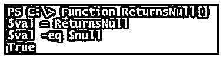
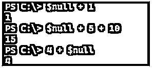
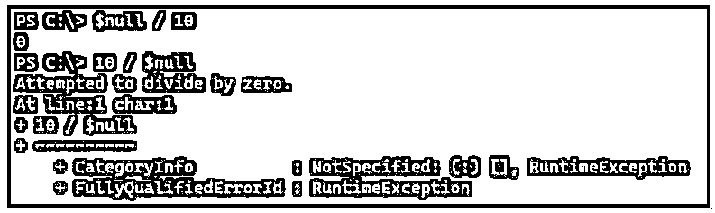
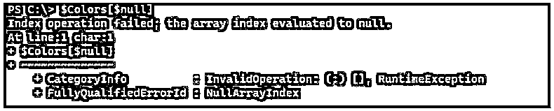

# PowerShell 空

> 原文：<https://www.educba.com/powershell-null/>

## PowerShell null 简介

以下文章提供了 PowerShell null 的概述。PowerShell $Null 是一个自动变量，除了无法识别的值或不存在的值之外，它什么也不包含，它也被视为一个对象。PowerShell 将$Null 对象视为空值，有些命令需要生成一些输出，如果有任何错误，它们会生成空值，并且在脚本中检查命令是否生成任何值的故障排除目的中也很有用。

**语法:**

<small>Hadoop、数据科学、统计学&其他</small>

尽管 null 没有特定的语法，但我们可以使用自动和预定义的变量$NULL 来实现。

### $null 变量在 PowerShell 中是如何工作的？

当您键入$Null 时，它不会产生任何内容，如下所示。

**代码:**

`$null`

当您声明一个变量并且没有赋值时，默认情况下它保存的值是$NULL。

**代码:**

`$a
$a -eq $null`

**输出:**

您也可以显式地将$null 值赋给一个变量，如下所示。

**代码:**

`$val = $null
Write-Output "The value is : $val"`

**输出:**

很多时候，当编写脚本时，我们需要发现值是否为空，但它在控制台中不可见。要发现变量是否将保存空值，我们需要使用特殊字符或我们可以识别变量保存空值的东西。我们将在这里使用它{}。你可以像其他支架一样使用任何东西。

**代码:**

`$val = $null
Write-Output "The value is : {$val}"`

**输出:**

### PowerShell null 的示例

以下是 PowerShell null 的示例:

#### 示例#1

“”和$NULL 之间的差异。

虽然(“”和$NULL)都表示空值，但它们之间有很大的区别。

首先，两者并不平等。

**代码:**

`"" -eq $null`

**输出:**

当您声明一个没有任何值的变量时，它的输出是$NULL。

**代码:**

`$a
$a -eq $null`

**输出:**

但是当你把它和""值比较时，输出会是假的。

**代码:**

`$a -eq ""`

**输出:**

“”代表空白。这意味着当您将该值赋给变量时，它的输出将是一个空行，而$null 输出什么也不是。

**代码:**

`$a = ""
$a`

**输出:**

现在$a 不是$null。

**代码:**

`$a -eq $null`

**输出:**

另一种检查方法是使用。$null 值与使用字符串类的“”不同。

**代码:**

`$null -eq [String]::Empty`

**输出:**

#### 实施例 2

Null 是一个未定义的变量。

任何值未初始化的变量都被视为未定义变量。

在本例中，$service 没有在前面定义，所以它的值没有初始化，被认为是 Null。

**代码:**

`$null -eq $service`

**输出:**

#### 实施例 3

函数为空。

当函数不返回任何值时，其输出为空。

**代码:**

`Function ReturnsNull{}
$val = ReturnsNull
$val -eq $null`

**输出:**

上面的输出是真的，因为函数不返回任何东西。

上面的例子类似于下面的例子，因为它们不返回任何东西。

**代码:**

`Function ReturnsNull{ return }
$val = ReturnsNull
$val -eq $null`

**输出:**

函数的另一个例子。

**代码:**

`Function ReturnsNull{
$svc = Get-Service NonExist -EA Ignore
if($svc){ return $svc }
}
$val = ReturnsNull
$val -eq $null`

**输出:**

这里，服务不存在，所以函数返回 Null。

#### 实施例 4

PowerShell 函数范围的空值。

当变量在其作用域之外被调用时，它们的值总是空的，因为它们是作用域之外的未初始化值。

**代码:**

`Function TestScope($a){
Write-Output "Value of a : $a"
$b = 20
}
$a = 10
TestScope $a
Write-Output "Value of b : [$b]"`

**输出:**

在上面的示例中，函数 TestScope 知道$a 变量的值，因为它是在函数外部声明的，但是$b 值是在函数内部声明的，因此函数外部不知道它，因此$b 变量的值显示为 NULL。要在函数外部获取$b 值，您需要使用 return 命令，并且需要从函数中捕获值。当您将$b 定义为函数外部的全局变量并在作用域中更改它的值时，这也是可行的。

#### 实施例 5

带有数字等式的空值。

当我们在数值等式中使用$null 值时，它的行为类似于值 0。

**代码:**

`$null + 1
$null + 5 + 10
4 + $null`

**输出:**

对于乘法，它取决于$Null 值的位置。

**代码:**

`$null * 4
4 * $null`

**输出:**

这对于除法运算是一样的，并且$null 被认为是 0。

**代码:**

`$null / 10
10 / $null`

**输出:**

#### 实施例 6

数组为空值。

当我们调用数组边界外的索引时，它给出空输出。

**代码:**

`$Colors = "Red","Yellow","Pink"`

在这个例子中，我们有一个包含 3 个值的数组，如果我们调用索引为 4 的 Colors 数组，它将给出一个空值，因为那个索引不存在。

**代码:**

`$Colors[4] $Colors[4] -eq $null`

**输出:**

在数组的情况下，$null 不被视为 0。当用于索引时，它会生成异常。

**代码:**

`$Colors[$null]`

**输出:**

### 结论

每个变量赋值和函数返回值都以 null 开始，直到它们被定义。它们对于任何脚本来说都是可以忽略的，因为它不显示任何输出，但是如果您将一个输出的值用于另一个输出，并且输出为空，那么它们对于脚本来说是一个很大的威胁。对于大型脚本，如果没有正确处理空值，故障排除会很麻烦。

### 推荐文章

这是 PowerShell null 的指南。这里我们讨论一下入门，$null 变量在 PowerShell 中是如何工作的？和示例。您也可以看看以下文章，了解更多信息–

1.  [PowerShell 睡眠](https://www.educba.com/powershell-sleep/)
2.  [PowerShell 子串](https://www.educba.com/powershell-substring/)
3.  [PowerShell 不像](https://www.educba.com/powershell-not-like/)
4.  [否则如果在 PowerShell 中](https://www.educba.com/else-if-in-powershell/)

