# PowerShell 字典

> 原文：<https://www.educba.com/powershell-dictionary/>

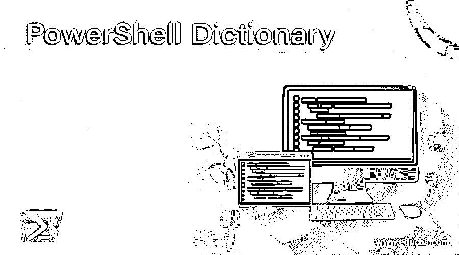

## PowerShell 字典的定义

PowerShell 字典也称为哈希表或关联数组，是一种紧凑的数据结构，由键和值对组成。Hashtable 是一个. Net 命名空间系统。而字典来自名为 Systems 的. Net 命名空间。collection . specialized . ordered dictionary，区分它们的是输出的顺序，有序字典有有序输出，而哈希表没有有序输出。

**语法:**

<small>Hadoop、数据科学、统计学&其他</small>

哈希表的语法:

`@{ <name> = <value>; [<name> = <value> ] ...}`

有序字典的语法:

`[ordered]@{ <name> = <value>; [<name> = <value> ] ...}`

PowerShell v3.0 中引入了这个[Ordered]属性。

当我们创建一个散列表或字典时，它以 at 符号(@)开始，并用花括号{}括起来。在大括号内，我们定义了键和值。值使用等号(=)赋给键，多个键值用分号('；'分隔).

如果哈希表是有序格式(字典),那么[Ordered]应该写在它的前面。

### PowerShell 中的字典是如何工作的？

PowerShell dictionary 或 hashtables 在方式上是相同的，但唯一的区别是 dictionary 产生有序的输出，而 Hashtable 输出不是有序的。你可以使用下面的命令创建一个空哈希表，

`$htable = @{}`

当您检查哈希表的类型时，它的基本类型是 System。对象，它是哈希表。

`$htable.GetType()`

**输出:**

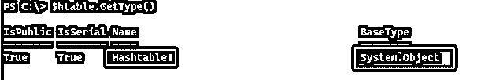

我们可以通过添加键和它们的值来简单地将值插入哈希表。

`$htable = @{Name='Chirag';EmpID="001";City="Pune"}
$htable`

**输出:**

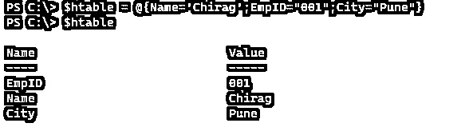

一旦哈希表被创建，如果你想从它创建一个有序字典，你不能直接转换一个哈希表，它会抛出一个警告。

`[Ordered]$htable`

**输出:**

即使我们创建一个新的空哈希表，并为其分配和强制转换哈希表，也不会起作用。

`$dict = @{}
$dict = [ordered]$htable`

**输出:**

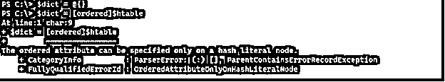

要创建一个字典，我们首先需要在赋值时转换[Ordered]哈希表，如下所示。

`$htable = [Ordered]@{Name='Chirag';EmpID="001";City="Pune"}`

**输出:**

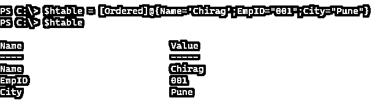

输出将按照我们给它们赋值的顺序出现。我们可以在这里反转类型转换。这是可能的。

`$hash = [hashtable]$htable`

**输出:**

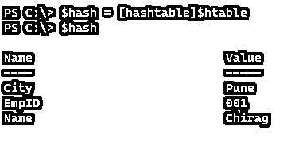

哈希表或字典还支持一些方法和属性来执行操作或从哈希表中检索数据。

`$htable | Get-Member`

**输出:**

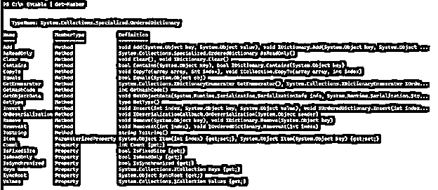

### 例子

让我们讨论 PowerShell 字典的例子

#### 示例 1:创建一个哈希表并添加值。

此示例创建了一个服务表，用于存储有关特定服务的信息。

`$servicetable = @{Name='Spooler'; Starttype='Manual'; Status='Disabled'}
$servicetable`

**输出:**

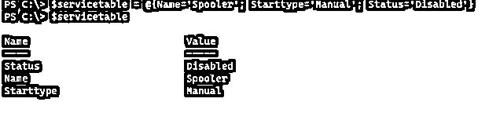

输出不是输入的有序格式，所以我们创建了一个字典(有序哈希表)。

`$servicetable = [Ordered]@{Name='Spooler'; Starttype='Manual'; Status='Disabled'}
$servicetable`

**输出:**

在其他例子中，我们将使用这个创建的哈希表。

#### 示例 2:检索哈希表值和键。

要获得哈希表键，我们需要选择它的属性键，如下所示。

`$servicetable.Keys`

**输出:**

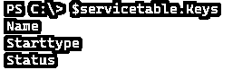

为了检索哈希表值，

`servicetable.Values`

**输出:**

为了从键中检索特定的值，我们可以提供键名。

`$servicetable.Name`

**输出:**

#### 示例 3:向哈希表添加新的键和值

要向哈希表添加新的键和相关值，我们可以使用下面的方法。

`$servicetable += @{DisplayName='Print Spooler'}
$servicetable`

**输出:**

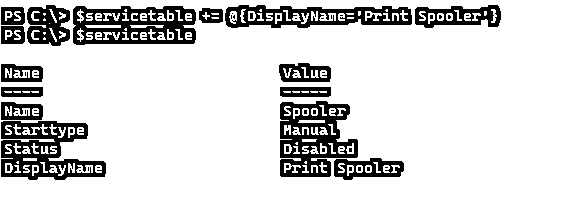

上面的方法是显式方法，我们也可以使用 Add()方法。

`$servicetable.Add("CanStop","True")
$servicetable`

**输出:**

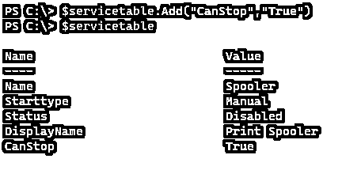

#### 示例 4:删除哈希表键

要移除 hashtable 键，我们需要使用 Remove()方法。我们只需要在 Remove()函数中提供 Key。

`$servicetable.Remove("CanStop")
$servicetable`

**输出:**

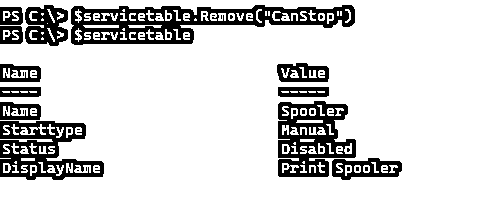

#### 示例 5:修改哈希表键值。

要修改特定哈希表的键值，我们只需要访问该键并为其赋值。

`$servicetable.Status = "Stopped"
$servicetable`

**输出:**

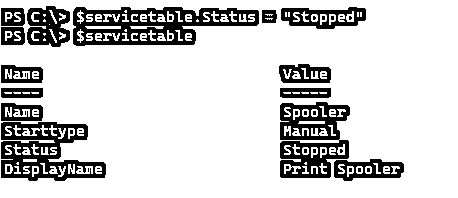

#### 例子#6:给 hashtable 键分配多个值。

我们不能直接给 hashtable 键分配多个值，因为单个键被认为是一个字符串，如下所示。

`$servicetable.Name += "Winrm"
$servicetable`

**输出:**

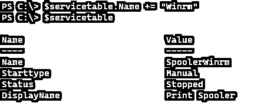

为了解决这个问题，我们将特定的键初始化为数组，然后创建多个值，但问题是，如果我们在创建哈希表后将键初始化为数组，它现有的值将被清除，我们需要再次创建它。

`$servicetable.Name = @()
$servicetable`

**输出:**

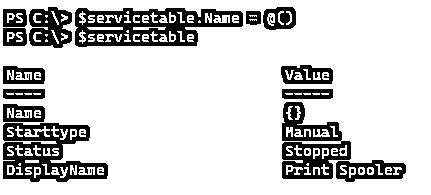

我们现在需要增加价值。

`$servicetable.Name += "Spooler"
$servicetable.Name += "WinRM"
$servicetable`

**输出:**

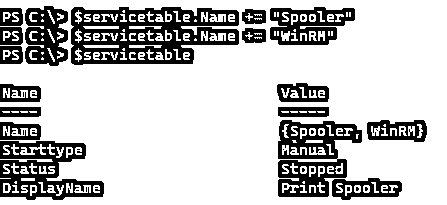

Name 属性现在将给出多个值。

`$servicetable.Name`

#### 示例 7:将字符串数据转换成哈希表。

要将字符串输出转换为哈希表，我们可以使用 ConvertFrom-StringData 命令。

`$stringdata = @"
Book = The Owl
Genre = Fiction
Author = Greg Truth
"@`

**输出:**

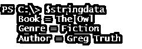

要转换成哈希表，

`$stringdata | ConvertFrom-StringData`

**输出:**

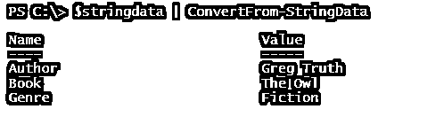

#### 例子 8:对象类型的哈希表。

在这个方法中，我们将对象(有多个键和值)存储在 Value 字段中。

`$ObjectHash = @{
'PowerShell'= (Get-Process notepad++)
'Winrm' = (Get-Service WinRM)
}`

**输出:**

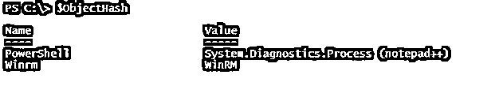

当我们检查单个键的值时，我们可以使用这个值作为一个单独的哈希表，如下所示。

`$ObjectHash.PowerShell`

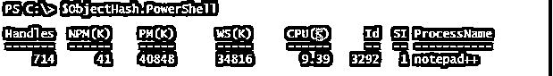

`$ObjectHash.winrm`

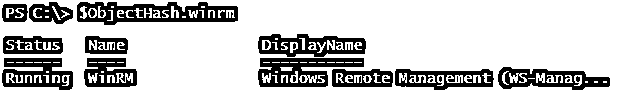

进一步扩大，

`$ObjectHash.PowerShell.Id`

`$ObjectHash.Winrm.DisplayName`

#### 示例 9:将 Hashtable 输出转换为 JSON / XML 格式。

我们可以使用 ConvertTo-JSON 或 ConvertTo-XML 命令将哈希表的输出转换为 JSON 或 XML 格式。

`$servicetable | ConvertTo-Json`

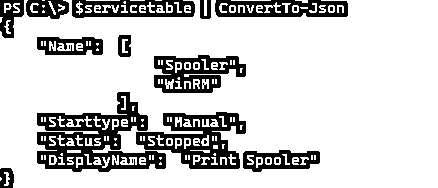

对于 XML，

`$servicetable | ConvertTo-Xml`

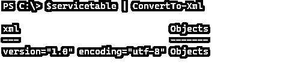

### 结论

由于哈希表的灵活性，它在 PowerShell 语言中被大量使用。我们可以轻松地存储值、搜索值和检索值，最有用的是输出是表格格式，因此也可以转换为 JSON 格式。ConvertFrom-StringDate 将输出转换为 hashtable 格式。

### 推荐文章

这是 PowerShell 字典指南。这里我们讨论定义、语法、字典在 PowerShell 中是如何工作的？还有例子。您也可以看看以下文章，了解更多信息–

1.  [PowerShell 类操作员](https://www.educba.com/powershell-like-operator/)
2.  [PowerShell 匹配](https://www.educba.com/powershell-match/)
3.  [PowerShell 布尔型](https://www.educba.com/powershell-boolean/)
4.  [Powershell 复制文件](https://www.educba.com/powershell-copy-file/)

