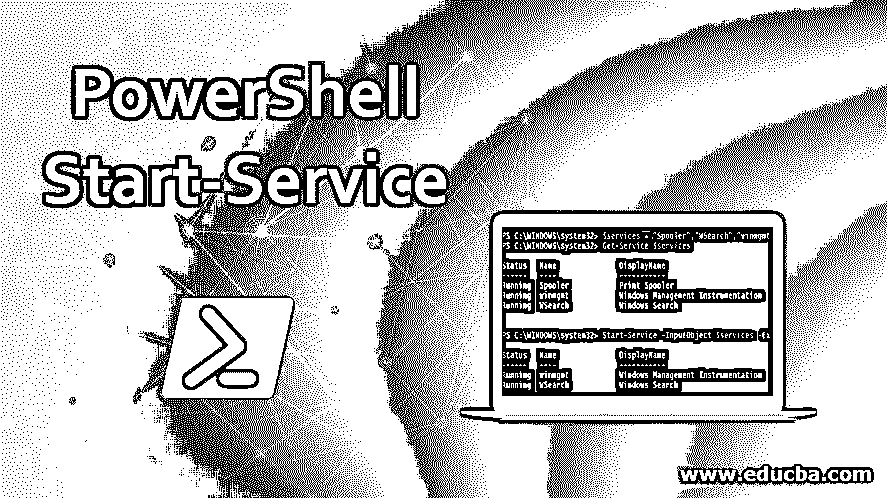
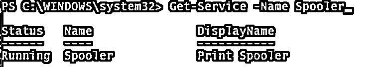
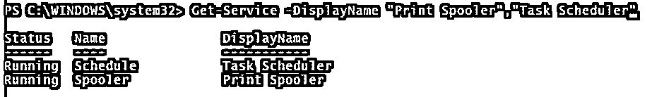
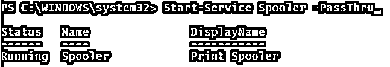
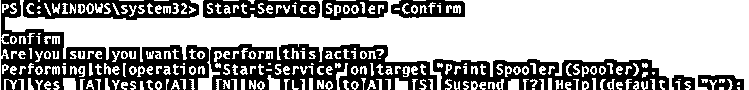
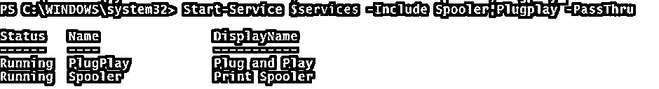
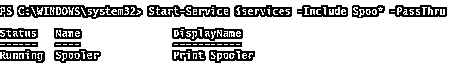
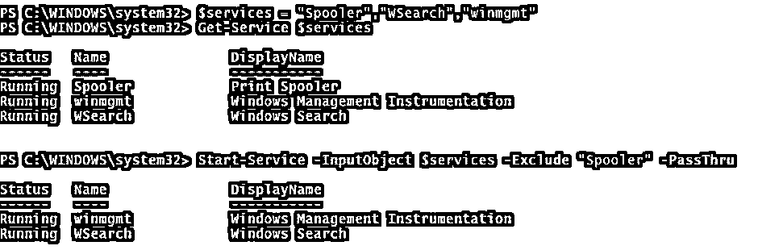
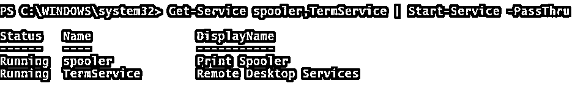
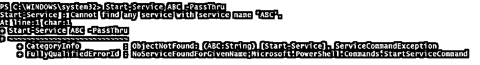

# PowerShell 启动服务

> 原文：<https://www.educba.com/powershell-start-service/>

## PowerShell 启动服务简介

Start-Service 是 PowerShell 中的 cmdlet，用于启动 PowerShell 中已停止的服务。如果服务已经在运行，此命令将被忽略，并且不会显示任何错误消息。您可以提供服务名称、显示名称或服务作为启动服务的输入对象。

**语法:**

<small>Hadoop、数据科学、统计学&其他</small>

`Start-Service
[-Name] <String[]>
[-DisplayName] <String[]>
[-InputObject] <ServiceController[]>
[-PassThru] [-Include <String[]>] [-Exclude <String[]>] [-WhatIf] [-Confirm] [<CommonParameters>]`

### PowerShell 启动服务中的参数

下面给出了一些参数:

**–名称:**该参数指定要启动的服务名称。您可以使用服务名或别名。接受通配符(*)。

**DisplayName:该参数对于**使用服务的显示名称启动服务很有用。允许使用通配符。

**–input object:**该参数指定代表要启动的服务的服务控制器对象。对象可以是变量。

**–Passthru:**该参数返回服务控制台中的输出。默认情况下，这个启动服务不生成任何输出。

**–Include:**该参数一般与 name 参数或输入对象一起使用。它指定要启动的服务。允许使用通配符(*)。

**–Exclude:**该参数一般与 name 参数或输入对象一起使用。它指定了需要从一开始就排除的服务。允许使用通配符(*)。

**–what if:**此参数显示 cmdlet 在不执行命令的情况下运行时发生的情况。

**–确认:**运行 cmdlet 前提示用户操作。

### PowerShell 启动服务的示例

PowerShell 的示例如下所示:

**1。使用名称或别名启动单个服务。**

启动后台打印程序服务。除非产生错误，否则下面的命令不会给出任何输出。

`Start-Service -Name Spooler`

若要检查服务是否已启动，请运行以下命令。

`Get-Service -Name Spooler`

**输出:**

**2。使用服务名或别名启动多个服务。**

您可以使用服务名称启动多个服务，用逗号分隔每个服务。

`Start-Service -Name Spooler,Schedule`

**3。使用显示名称启动服务。**

要使用服务显示名称启动服务，请使用–**display name**参数。

`Start-Service -DisplayName "Print Spooler","Task Scheduler"`

**输出:**

**4。使用 Passthru 启动服务。**

当您使用–Passthru 参数启动服务时，它会在控制台中显示输出，您不需要编写 Get-Service 命令来获取服务信息。

`Start-Service Spooler -PassThru`

**输出:**

**5。从假设开始服务。**

当您使用–what if 编写 start-service cmdlet 时，它显示该命令将执行特定的操作，而不执行它。因此，您可以说这个命令充当了一个前置冗余。

`Start-Service  Spooler -WhatIf`

**输出:**

**6。使用–input object 启动服务。**

您可以将服务名作为输入对象传递。例如，可以用一个别名传递多个服务名。

`$services = "Spooler","Task Scheduler"
Get-Service -InputObject $services`

**7。使用–确认开始服务。**

当您使用–confirm 参数时，PowerShell 控制台会在启动服务之前首先与用户确认。

`Start-Service Spooler -Confirm`

**输出:**

如果您选择“是”，则给定的服务将在确认后重新启动，如果有多个服务，则将对下一个服务进行检查。如果您选择“A”，多个给定的服务将在没有确认的情况下重新启动。最后，如果您单击' N '，给定的服务将不会重启，而所有服务的' L '都不会随着用户 concert 重启。

**8。使用–Include 参数启动服务。**

当有多个服务作为输入对象，并且您想要启动要重新启动的特定服务集时，那么您需要使用–include 参数。允许使用通配符(*)。

在下面的例子中，我们将所有的服务作为输入对象，我们将只包括 Spooler 和 Plugplay 服务来启动。

`Start-Service $services -Include Spooler,Plugplay -PassThru`

**输出:**

您可以使用通配符(*)，如下例所示。

`Start-Service $services -Include Spoo* -PassThru`

**输出:**

**9。使用–Exclude 参数启动服务。**

使用 exclude 参数时，将排除一组特定的服务，其余的将重新启动。此参数中允许使用通配符(*)。

例如，从给定的一组服务中，我们需要排除假脱机服务，并需要重新启动剩余的服务。

`$services = "Spooler","WSearch","winmgmt"
Get-Services $services
Start-Service -InputObject $services -Exclude "Spooler" -PassThru`

**输出:**

使用通配符(*)也可以实现上述输出。

`Start-Service -InputObject $services -Exclude spoo* -PassThru`

10。流水线启动服务命令。

还可以使用 Get-Service cmdlet 通过管道传输 Start-Service 命令。这在您使用远程系统时非常有用。举个例子，

`Get-Service spooler,TermService | Start-Service -PassThru`

**输出:**

**11。在远程计算机上启动服务。**

Start-Service 中没有直接支持远程连接的参数。相反，您必须将 Start-Service 管道化到 Get-Service cmdlet，因为它支持–computer name 参数，或者使用带有–computer name 参数的 Invoke-Command cmdlet。

举个例子，

`Get-Service spooler,TermService -ComputerName Test-PC | Start-Service -PassThru`

上述命令将在名为 Test-PC 的远程计算机上重新启动服务。您也可以提供多个计算机名来重新启动远程计算机上的相同服务。

在下面的示例中，Invoke-Command 对于在远程计算机上重新启动服务也很有用。

`Invoke-Command -ComputerName Test-PC, Test2-PC -ScriptBlock{Get-Service Spooler,TermService | Start-Service}`

**12。启动有错误操作的服务**

当您尝试在计算机或远程计算机上启动服务时，如果出现任何错误，如服务不存在或远程连接错误，则会显示错误输出。您可以使用 ErrorAction 参数忽略这些警报。

例如，下面，我们将尝试启动不存在的服务 ABC，抛出错误输出。

`Start-Service ABC -PassThru`

**输出:**

当您添加–error action 参数时，该错误将被忽略。

`Start-Service ABC -PassThru -ErrorAction Ignore`

**输出:**

errorAction 参数在处理脚本时很有用，如果发生错误，您希望忽略它，并希望继续执行下一步。

### 推荐文章

这是 PowerShell 启动服务指南。这里我们讨论简介、Powershell 中启动服务的例子、参数以及语法和输出。您也可以浏览我们推荐的其他文章，了解更多信息——

1.  PowerShell 中的[字符串](https://www.educba.com/string-in-powershell/)
2.  [有用的 PowerShell 脚本](https://www.educba.com/useful-powershell-scripts/)
3.  [PowerShell 别名](https://www.educba.com/powershell-alias/)
4.  [PowerShell 导入模块](https://www.educba.com/powershell-import-module/)

