# PowerShell 装饰

> 原文：<https://www.educba.com/powershell-trim/>

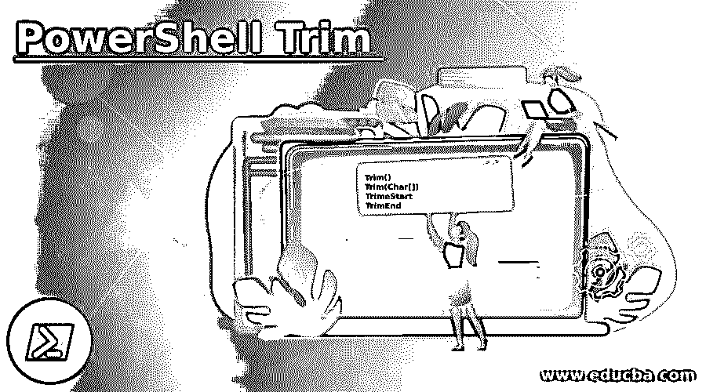

## PowerShell Trim 简介

PowerShell Trim()方法(Trim()、TrimStart()和 TrimEnd())用于从字符串或原始数据(如 CSV 文件、XML 文件或可以转换为字符串并返回新字符串的文本文件)中删除前导空格和尾随空格以及不需要的字符。这些方法是系统的一部分。字符串。Net 类，一旦应用了这些方法，它就会产生新的字符串，而不是操作当前的字符串。

**语法:**

<small>Hadoop、数据科学、统计学&其他</small>

*   **Trim():** 修剪(删除)当前字符串对象的所有前导和尾随空白字符。
*   **Trim(Char[]):** 从当前字符串对象中删除所有前导和尾随字符。
*   **TrimeStart:** 它从当前字符串对象的开头删除一个字符的所有出现。
*   从当前字符串对象的末尾删除所有出现的字符。

### PowerShell 中的 Trim 功能是如何工作的？

Trim()方法是系统。字符串。NET 类方法，用于消除字符串中的前导和/或尾随字符，包括空格。它们仅在 string 类中可用。

**代码:**

`$str = " This is a PowerShell String "
$str | gm`

**输出:**

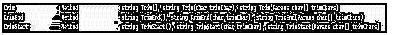

在上面的输出中，所有 Trim()方法都返回一个字符串，该字符串是操作后的新字符串，这就是为什么如果需要对它进行进一步操作，我们需要将它存储到新变量中。其他数据类型不支持 Trim()方法。

### PowerShell 装饰示例

以下是 PowerShell Trim 的示例:

#### 示例 1–Trim()方法。

这个函数将从 string 对象中删除前导和尾随空格，如下所示。

**代码:**

`$str = " This is a PowerShell String "
$str.Trim()`

**输出:**

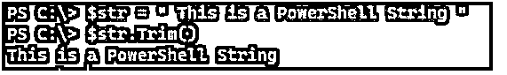

你可能已经注意到它生成了一个新的字符串。我们可以将这个字符串保存到新变量中，以备后用。

**代码:**

`$str = " This is a PowerShell String "
$str1 = $str.Trim()
$str1`

**输出:**

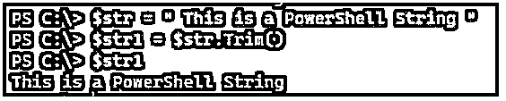

你也可以直接传递一个字符串而不是一个变量，并对其进行操作。

**代码:**

`(" This is a PowerShell String ").Trim()`

**输出:**

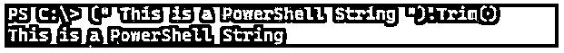

这只是删除空格，因此我们将检查修剪空白前后的输出长度，因为修剪的空白在输出中可能不可见。

**代码:**

`$str = " This is a PowerShell String "
$str.Length
29`

删除空白后。

**代码:**

`$str1 = $str.Trim()
$str1.Length
27`

#### 示例# 2–Trim(Char)方法修剪特定字符。

假设我们有下面的字符串来修剪它的开始和结束字符。

**代码:**

`$str = "aThis is a PowerShell String"
$str.Trim('a')`

**输出:**

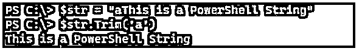

这里我们提供了一个字符' a '来修剪，在字符串中，' a '在字符串的开头，而不是在脚本的结尾。所以它只删除开始字符。如果“a”在两端，那么前导和尾随字符“a”将被删除。

**代码:**

`$str = "aThis is a PowerShell Stringa"
$str.Trim('a')`

**输出:**

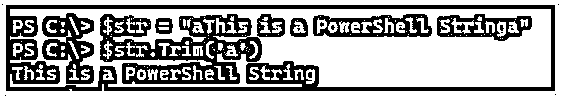

下面也是同样的操作。

**代码:**

`$str.Trim("a"," ")`

**输出:**

问题是，如果我们有前导或尾随空格，如果我们提供要删除的第一个字符。

**代码:**

`$str = " aThis is a PowerShell String"
$str.Trim('a')`

**输出:**

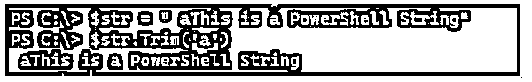

该命令不会对字符串执行任何操作，因为它的前导字符是空白。

请注意，修剪特定字符是区分大小写的操作。

**代码:**

`$str = "aThis is string trimming"
$str.Trim('A')`

**输出:**

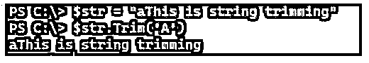

**代码:**

`$str.Trim('G')`

**输出:**

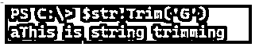

#### 示例 3–修剪特定字符的 Trim (Unicode)方法。

PowerShell 的好处是，我们还可以传递 Unicode 字符，然后将类型转换为字符数据，以修剪前导和尾随字符。

**代码:**

`$str = "aThis is string trimming"
$str.Trim([char]0x0061)`

**输出:**

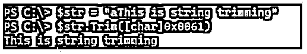

您可以在下面的链接中找到 Unicode 字符列表。

https://en.wikipedia.org/wiki/List_of_Unicode_characters.

上面的例子类似于。

**代码:**

`$str = "aThis is string trimming"
$str.Trim([char]0x0061,[char]0x0020)`

**输出:**

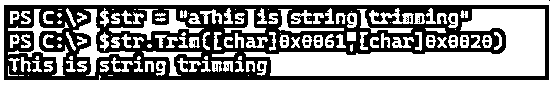

这里 0x0061 代表‘a’，0x0020 代表空白。

#### 示例 4–Trim(Char[])方法删除前导和尾随空格。

在上面的例子中，我们使用了一个单独的字符，如果匹配的话，这个字符从字符串的开头或结尾删除。如果我们提供多个字符，它会将它们从前导和尾随字符中删除。可以用下面的例子来解释。

**代码:**

`("hello world").Trim('hd')`

**输出:**

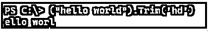

我们提供了两个字符，“hd”，它将检查字符串开头和结尾的字符，如果匹配，它将删除它们。

**代码:**

`("dhello world").Trim('hd')`

**输出:**

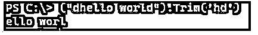

从上面的例子可以看出，字符顺序并不重要。

您也可以使用此方法删除整个单词。

**代码:**

`$str = "PowerShell hello PowerShell"
$str.Trim('PowerShell')`

**输出:**

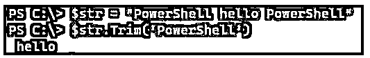

#### 示例 5–trim start(Char)方法。

在 Trim()方法中，我们可以删除前导字符和尾随字符，而 TrimStart()只删除前导字符，如下例所示。

**代码:**

`$str = "PowerShell helloP"
$str.TrimStart('P')`

**输出:**

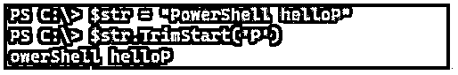

如果里面没有指定字符，它会将空白视为一个字符，并删除开头的空白。

**代码:**

`$str = " Hello World "
$str.TrimStart()`

**输出:**

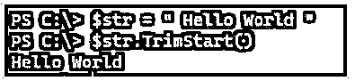

在这个例子中，尾部的空白被删除；我们可以通过计算字数来检查。

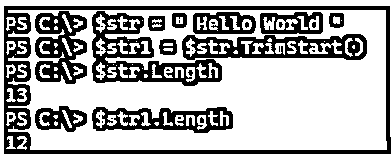

#### 示例 6–trim start(Char[])方法。

我们也可以使用多个前导字符来从字符串中删除。

**代码:**

`$str = "PowerShell hello PowerShell"
$str.TrimStart("PowerShell")`

**输出:**

![(Char[]) method](img/db1f1b8ac5f3cb241ffa066a0f34638f.png)

**Note:** TrimStart() operation is also case sensitive, and we can use Unicode characters by converting them into character datatype for this operation.

#### 例 7–TrimEnd()方法。

我们可以使用 TrimEnd()方法删除尾随字符。

如果我们不指定任何内容，它将删除结尾的空白，但不删除结尾的空白。

**代码:**

`$str = " Hello World "
$str.TrimEnd()`

**输出:**

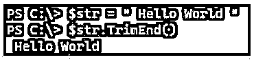

一旦我们在这个方法中指定了任何字符，它将从字符串中删除尾随字符。

**代码:**

`PS C:\> $str = "dHello World"
PS C:\> $str.TrimEnd('d')`

**输出:**

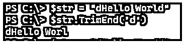

如果在末尾指定了多个相同的字符，它将删除所有尾随的相同字符。

**代码:**

`$str = "dHello Wordd"
$str.TrimEnd('d')`

**输出:**

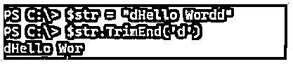

我们还可以消除多个尾随字符。

**代码:**

`$str = "Hello PowerShell Hello"
$str.TrimEnd("Hello")`

**输出:**

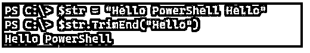

**Note:** This operation is case-sensitive, and you can also use Unicode characters as shown in the earlier example to trim the string.

### 结论

Trim 函数对于字符串操作非常有用，尤其是当我们处理文本文件或 CSV 文件，并且需要从字符串中删除一些条目时。

### 推荐文章

这是 PowerShell Trim 的指南。这里我们讨论一下入门，如何在 PowerShell 中裁剪函数作品？还有例子。您也可以看看以下文章，了解更多信息–

1.  [PowerShell 睡眠](https://www.educba.com/powershell-sleep/)
2.  [PowerShell 子串](https://www.educba.com/powershell-substring/)
3.  [PowerShell 不像](https://www.educba.com/powershell-not-like/)
4.  [否则如果在 PowerShell 中](https://www.educba.com/else-if-in-powershell/)

