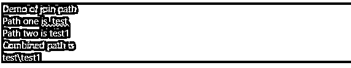
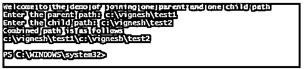
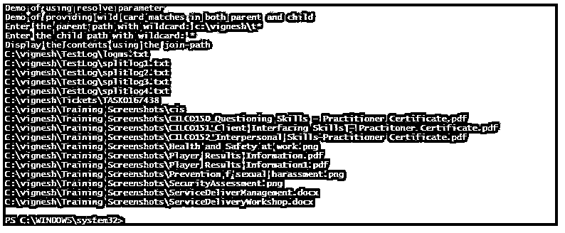
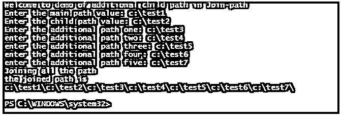
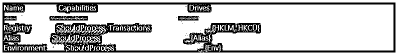
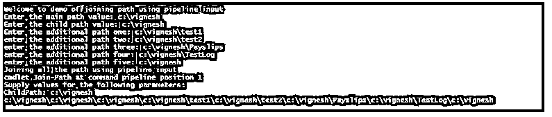

# PowerShell 加入路径

> 原文：<https://www.educba.com/powershell-join-path/>

## PowerShell Join-Path 简介

以下文章提供了 PowerShell 加入路径的概述。有些情况下，用户可能希望将两条路径合并成一条路径；在这种情况下，用户应该使用 join-path cmdlet。将有一个父路径，并且可以将多个子路径附加到父路径以创建新路径。这可以与几个提供者一起使用，例如注册表、文件系统和证书等等。path 参数以 PowerShell 易于识别的格式操作和返回路径。在这里，我们将详细了解连接多条路径的各种参数和方式。

### PowerShell 加入路径的语法

Join-Path cmdlet 的语法如下:

<small>Hadoop、数据科学、统计学&其他</small>

**名称:**

连接路径

**语法:**

`Join-Path [-Path] <string[]> [-ChildPath] <string> [-Resolve] [-Credential <pscredential>] [-UseTransaction] [<CommonParameters>]`

**别名:**

没有人

**举例:**

**代码:**

`Write-Host "Demo of join path" -ForegroundColor Green
$path1="test"
$path2="test1"
Write-Host "Path one is " $path1
Write-Host "Path two is" $path2
Write-Host "Combined path is" -ForegroundColor Green
Join-Path -Path $path1 -ChildPath $path2`

**输出:**

**参数:**

*   **-AdditionalPath:** 该参数的数据类型为 String[]。这表示需要添加到路径中的额外值。尽管这个参数是可选的和指定的，但是子路径参数必须有一个值。使用此参数可以连接无限多的路径。此参数在 cmdlet 中的位置是 2。None 是该参数的默认值。它接受管道输入，但此参数不支持通配符。
*   **-ChildPath:** 该参数为必填项。这表示一个值，该值将附加 path 参数的值。它在 cmdlet 中的位置是 1。此参数的数据类型是字符串。无是其默认值。它接受通配符和管道输入。
*   **-凭证:**此参数仅用于模拟目的。数据类型是 PSCredential，它是可选的。默认值为无。这可以接受管道输入，而不允许使用通配符。
*   **-Path:** 表示子路径将附加到的主路径值。这是一个强制参数。数据类型为 String[]，别名为 PSPath。此参数在 cmdlet 中的位置是 0。默认值为无。它接受管道输入，也允许使用通配符。
*   **-Resolve:** 这向 cmdlet 表示应该使用当前提供程序来解析加入的路径。如果提供了通配符，cmdlet 将返回与连接路径对齐的所有路径。如果不使用通配符，在不匹配的情况下，将抛出一个错误。此参数的数据类型是开关。这是一个可选参数。默认值为无。它不接受管道输入和通配符。

### PowerShell 加入路径的示例

以下是 PowerShell 加入路径的示例:

#### 示例#1

连接一个父路径和一个子路径。

**代码:**

`Write-Host "Welcome to the demo of joining one parent and one child path" -ForegroundColor Green
$parentpath=Read-Host "Enter the parent path"
$childpath= Read-Host "Enter the child path"
Write-Host "Combined path is as follows" -ForegroundColor Green
Join-Path -Path $parentpath -ChildPath $childpath`

**输出:**

#### 实施例 2

使用解析字符和通配符显示组合路径的内容。

**代码:**

`Write-Host "Demo of using resolve parameter" -ForegroundColor Green
Write-Host "Demo of providing wild card matches in both parent and child" -ForegroundColor Green
$parent= Read-Host "Enter the parent path with wildcard"
$childp= Read-Host "Enter the child path with wildcard"
Write-Host "Display the contents using the join-path" -ForegroundColor Green
Join-Path $parent $childp -Resolve`

**输出:**

在上面的例子中，父路径被提供了一个值 c:\vignesh\t*，这意味着在 vignesh 文件夹中，任何以 t 开头的子文件夹都被认为是子路径中的父路径，并给出了“*”，这表示所有内容。因此，输出是符合条件的所有文件的列表显示。

#### 实施例 3

附加路径参数的使用。

**代码:**

`Write-Host "Welcome to demo of additional child path in Join-path" -ForegroundColor Green
$mainpath= Read-Host "Enter the main path value"
$cpath= Read-Host "Enter the child path value"
$apath1= Read-Host "Enter the additional path one"
$apath2 = Read-Host "enter the additional path two"
$apath3 = Read-Host "enter the additional path three"
$apath4 = Read-Host "enter the additional path four"
$apath5 = Read-Host "enter the additional path five"
Write-Host "Joining all the path" -ForegroundColor Green
$path = Join-Path -Path $mainpath -ChildPath $cpath -AdditionalChildPaths($apath1, $apath2,$apath3,$apath4,$apath5)
Write-Host "the joined path is" -ForegroundColor Green`

**输出:**

要查找此 cmdlet 支持的提供程序列表，我们可以运行 get-psprovider cmdlet 来识别这些提供程序。

以下是当前会话中支持的提供程序:

#### 实施例 4

使用管道连接多个路径。

**代码:**

`Write-Host "Welcome to demo of joining path using pipeline input" -ForegroundColor Green
$mainpath= Read-Host "Enter the main path value"
$cpath= Read-Host "Enter the child path value"
$apath1= Read-Host "Enter the additional path one"
$apath2 = Read-Host "enter the additional path two"
$apath3 = Read-Host "enter the additional path three"
$apath4 = Read-Host "enter the additional path four"
$apath5 = Read-Host "enter the additional path five"
Write-Host "Joining all the path using pipeline input" -ForegroundColor Green
Join-Path $mainpath | Join-Path -ChildPath $cpath | Join-Path -ChildPath $apath1 | Join-Path -ChildPath $apath2 | Join-Path -ChildPath $apath3 | Join-Path -ChildPath $apath4 | Join-Path -ChildPath $apath5`

**输出:**

在加入时，在上面的 cmdlet 中，如果指定了子路径参数，将会引发一个错误，指出 cmdlet 不接受管道输入。为了不发生这种情况，从第二个路径开始，所有路径前面都必须有子路径参数。

### 结论

因此，本文详细介绍了 Join-Path cmdlet 及其各种强制和可选参数。它还显示了使用 Join-Path cmdlet 以不同方式连接路径的各种示例。

### 推荐文章

这是 PowerShell 加入路径的指南。为了更好地理解，我们在这里讨论 PowerShell Join-Path 的介绍和示例。您也可以看看以下文章，了解更多信息–

1.  [PowerShell 睡眠](https://www.educba.com/powershell-sleep/)
2.  [PowerShell 子串](https://www.educba.com/powershell-substring/)
3.  [PowerShell 不像](https://www.educba.com/powershell-not-like/)
4.  [否则如果在 PowerShell 中](https://www.educba.com/else-if-in-powershell/)

