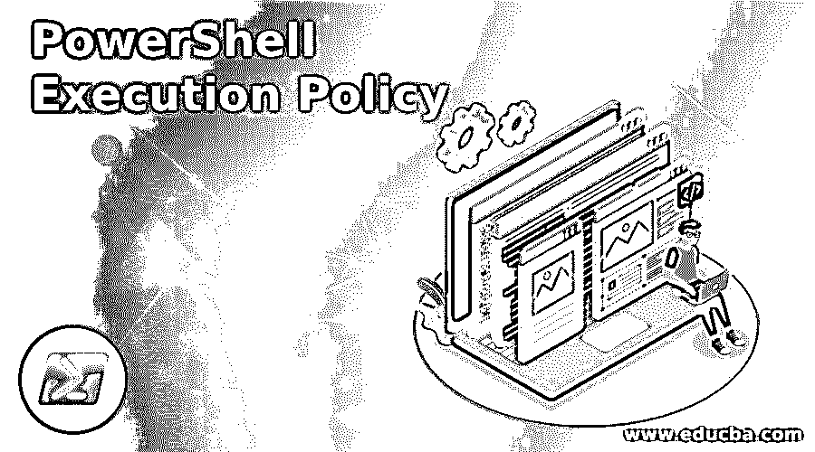
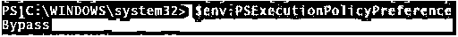
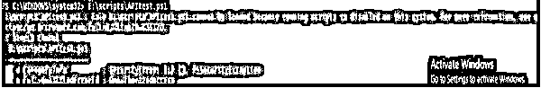
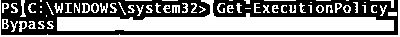
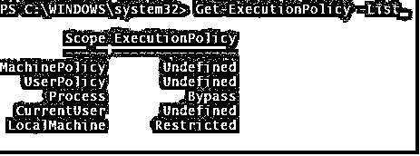

# PowerShell 执行策略

> 原文：<https://www.educba.com/powershell-execution-policy/>

## PowerShell 执行策略简介

PowerShell 执行策略是 PowerShell 环境的安全功能，它决定用户是否可以加载配置文件(如 PowerShell 配置文件、基本配置文件)或用户是否可以运行脚本。它还确定脚本是否应该在运行前进行数字签名，而不是允许任何用户像 VBScript 一样运行脚本。PowerShell 执行策略不是阻止用户操作的核心安全功能，而是阻止恶意代码或脚本在环境中运行。用户可以通过命令行运行脚本来更改执行策略。

### PowerShell 执行策略范围

当应用执行策略时，它被应用于特定的范围。作用域在下面的优先级别中提到。

<small>Hadoop、数据科学、统计学&其他</small>

*   机器策略
*   用户策略
*   流程(当前会话)
*   当前用户
*   本地机器

#### 1.机器策略

该策略由组策略为计算机的所有用户设置。可以通过 GPO 设置:计算机配置->策略->管理模板-> Windows 组件-> Windows PowerShell。

#### 2.用户策略

此策略可以由组策略为计算机的当前用户设置。可以通过 GPO 设置:用户配置->策略->管理模板-> Windows 组件-> Windows PowerShell。

#### 3.流程(当前会话)

在 PowerShell 会话结束之前，此策略一直有效。当会话结束时，此策略将被删除。此策略在 windows 环境变量$ Env:PSExecutionPolicyPreference 中设置。默认情况下，此变量不存在，只有在设置此策略时才会创建。

`$env:PSExecutionPolicyPreference`

#### 4.当前用户

该策略仅适用于当前用户。设置此策略后，它会存储在注册表中

#### 5.本地机器

此策略是为本地计算机设置的。设置此策略后，它存储在注册表 HKEY_LOCAL_MACHINE 中

### PowerShell 执行策略模式

以下是 PowerShell 执行策略模式:

#### 1.受限制的

这是 PowerShell 的 Windows 系统的默认执行策略。这意味着您不能运行任何脚本(. ps1)、配置文件(. ps1xml)和模块脚本(. psm1)，但是您可以运行 cmdlets。当设置了此模式并且您尝试运行脚本时，您将得到如下例所示的错误。

#### 2.全部签名

用户可以运行仅由可信发行商数字签名的脚本。没有数字签名的脚本，用户会得到提示。

#### 3.远程签名

从本地计算机运行的脚本不需要数字签名，但不应从互联网下载并运行。从互联网下载的脚本包括电子邮件应用程序和即时消息应用程序，它们需要数字签名。PowerShell 可以运行从互联网下载的脚本，如果文件被解除阻止，则不会进行数字签名。可以使用 file 属性或通过 Unblock-File 来解除对文件的阻止

#### 4.无限制的

用户可以运行未签名的脚本，但这也可能运行恶意脚本。当用户运行从互联网下载的脚本时，PowerShell 会发出警告。

#### 5.旁路，旁道

设置此执行策略时，没有脚本需要数字签名。用户不会收到任何运行未签名脚本的提示。当有一个大型应用程序需要 PowerShell 作为基本模型并需要运行几个配置文件时，这很有用。通常不建议使用此策略，因为设置此策略后，很容易让 windows 计算机运行恶意代码。

#### 6.不明确的

当设置了未定义的策略时，它将是默认策略。默认策略将被限制为删除当前的执行策略。

### 实现 PowerShell 执行策略的示例

下面是提到的一些例子:

#### 示例#1

获取机器上的当前执行策略

**代码:**

`Get-ExecutionPolicy`

**输出:**

#### 实施例 2

要获取所有的执行策略并检查哪个策略适用于该范围，您需要使用下面的命令。

**代码:**

`Get-ExecutionPolicy -List`

**输出:**

**解释:**这里，根据上面例子的输出，旁路策略被应用于当前会话(流程)范围。

#### 实施例 3

要获取特定范围的执行策略，您需要使用–Scope。例如，要获取进程范围的执行策略，请使用下面的命令。

**代码:**

`Get-ExecutionPolicy -Scope Process`

**输出:**

同样，您可以为不同的范围设置策略。举个例子，

`Get-ExecutionPolicy -Scope MachinePolicy
Get-ExecutionPolicy -Scope UserPolicy
Get-ExecutionPolicy -Scope CurrentPolicy`

#### 实施例 4

要设置执行策略，您需要使用 Set-Execution 策略

**代码:**

`Set-ExecutionPolicy RemoteSigned`

当您设置没有任何作用域的执行策略时，默认情况下将为本地计算机设置该策略。

#### 实施例 5

使用-Scope 设置执行策略

**代码:**

`Set-ExecutionPolicy -Scope LocalMachine -ExecutionPolicy RemoteSigned
Set-ExecutionPolicy -Scope LocalMachine -ExecutionPolicy Restricted`

#### 实施例 6

使用–Force 设置执行策略

当您设置执行策略时，PowerShell 会提示用户确认。要避免这一步，您需要使用力参数。此参数直接将策略应用于特定范围或默认范围。

**代码:**

`Set-ExecutionPolicy -Scope LocalMachine -ExecutionPolicy RemoteSigned -Force`

#### 实施例 7

删除执行策略

要删除任何范围的执行策略，您需要使用未定义的策略。它会将策略设置为默认值。即受限的。

**代码:**

`Set-ExecutionPolicy -Scope LocalMachine -ExecutionPolicy Undefined –Force
Set-ExecutionPolicy -Scope LocalMachine -ExecutionPolicy Undefined -Force`

### 结论

PowerShell 执行策略是 windows 系统安全的关键组件，用于限制用户从控制台随意运行任何脚本。系统管理员可以使用组策略在大型 windows 环境系统中部署执行策略，从而可以防止来自互联网和其他应用程序的运行脚本意外运行。

### 推荐文章

这是 PowerShell 执行策略的指南。在这里，我们讨论 PowerShell 执行策略、范围、模式和编程示例的介绍。您也可以浏览我们的其他相关文章，了解更多信息——

1.  [如何使用 PowerShell？](https://www.educba.com/how-to-use-powershell/)
2.  [PowerShell 操作员](https://www.educba.com/powershell-operators/)
3.  [PowerShell 命令](https://www.educba.com/powershell-commands/)
4.  [PowerShell 继续](https://www.educba.com/powershell-continue/)

