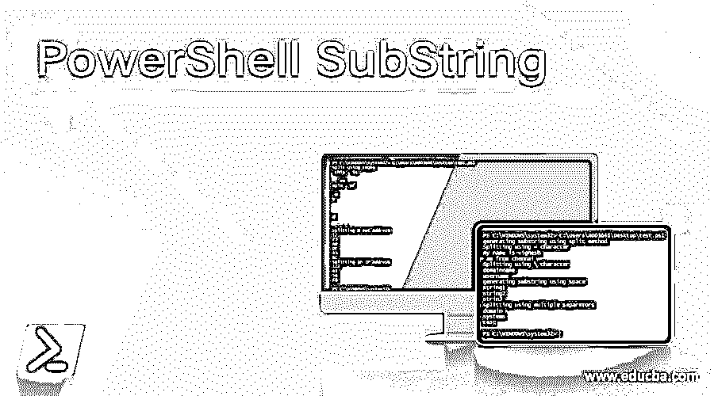
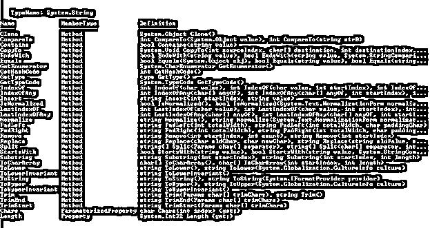
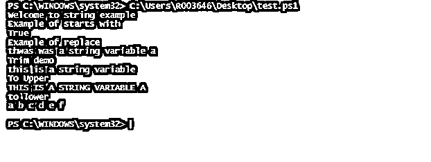
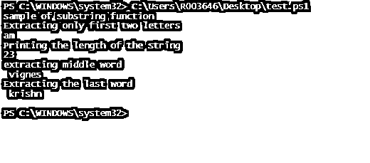
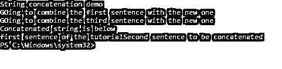
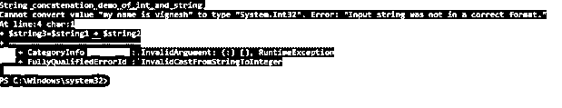
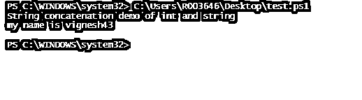
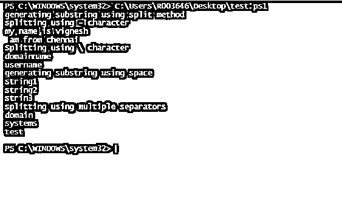
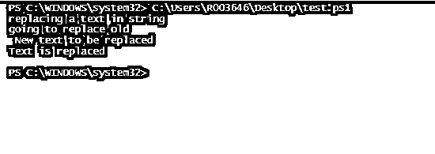
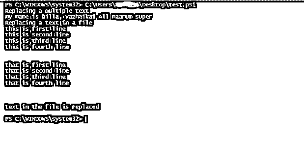

# PowerShell SubString

> 原文：<https://www.educba.com/powershell-substring/>

## PowerShell 子字符串简介

任何语言最常执行的操作或需求之一是字符串操作。字符串函数是 PowerShell 不可或缺的一部分，有各种函数可以处理与字符串操作相关的任务。在 PowerShell 中，一切都是对象，string 也是 System 类型的对象。字符串。字符串什么也不是，而是用单引号(“”)或双引号(“”)括起来的字符的集合。子串是任何字符串的一部分，或者子串只是字符串的子集。本文将深入介绍 PowerShell 中的字符串、与字符串操作相关的各种可用函数、子字符串、与子字符串相关的函数。substring()用于提取字符串的一部分，它可用于 PowerShell 中的每个 string 对象。

**字符串对象上可用的操作:**

<small>Hadoop、数据科学、统计学&其他</small>

在查看 substring()之前，让我们来看看可用于任何 string 对象的操作列表。

**输入:**

`Write-Host "Welcome to string example"
$test="this is a string variable"
Write-Host "below are the available operations available on string object"
$test | Get-Member`

**输出:**

从上面可以看出，substring 是函数之一。有 50 多种字符串操作可用。

一些最常用的操作是 StartsWith、Remove、Split、Replace、Rim。下面是一个例子。

### PowerShell 子字符串示例

**输入:**

#### `Write-Host "Welcome to string example"
$test="this is a string variable a"
Write-Host "Example of starts with"
$test.StartsWith("t")
Write-Host "Example of replace"
$test.Replace("is","was")
Write-Host "Trim demo"
$test.TrimEnd("a")
Write-Host "To Upper"
$test.ToUpper()
$test="A B C D E F"
Write-Host "to lower"
$test.ToLower()`

**输出:**

*   #### substring:

**语法:**

`.Substring( StartIndex [, length] )`

*   **StartIndex:** 字符串的位置，子字符串必须从该位置开始。通常，它应该是 0 或大于 0 且小于字符串的长度。
*   **长度:**子串的长度。

**用途:**

用于获取字符串的一部分。

**举例:**

**输入:**

`Write-Host "sample of substring function"
$test="am vignesh krishnakumar"
Write-Host "Extracting only first two letters"
$test.Substring(0,2)
Write-Host "Printing the length of the string"
$test.Length
write-host "extracting middle word"
$test.Substring(2,7)
Write-Host "Extracting the last word"
$test.Substring(10,7)`

**输出:**

*   #### string concatenation:

在某些情况下，需要组合两个字符串。这是在'+'运算符的帮助下完成的。

**例如:**

`Write-Host "String concatenation demo"
$string1="first sentence of the tutorial"
Write-Host "GOing to combine the first sentence with the new one"
$string2="Second sentence to be concatenated"
Write-Host "GOing to combine the third sentence with the new one"
$string3= $string1 + $string2
write-host "Concatenated string is below"
$string3`

**输出:**

在连接字符串和数字时，建议第一个变量是字符串而不是数字。下面的例子显示了如果第一个变量是整数会发生什么。

**输入:**

`Write-Host "String concatenation demo of int and string"
$string1=43
$string2="my name is vignesh"
$string3=$string1 + $string2`

**输出:**

在上面的代码中，如果变量在连接之前被交换，那么就不会发生错误

**输入:**

`Write-Host "String concatenation demo of int and string"
$string1=43
$string2="my name is vignesh"
$string3=$string2 + $string1
Write-Host $string3`

**输出:**

### 其他常用的字符串函数:

*   #### . Split ():

是另一种可用于将字符串拆分成子字符串的方法。

**语法:**

`.Split(strSeparator [, MaxSubstrings] [, Options])
String -Split strSeparator [, MaxSubstrings] [, Options] String -Split {scriptblock} [, MaxSubstrings] -Split String`

*   **strSeparator:** 分割字符串是识别字符
*   **MaxSubstrings:** 可以生成的子字符串的最大数量

**举例:**

**输入:**

`Write-Host "generating substring using split method"
$teststring="my name is vignesh- am from chennai"
Write-Host "splitting using - character"
$teststring -split "-"
$teststring="domainname\username"
Write-Host "Splitting using \ character"
$teststring -split "\\"
Write-Host "generating substring using space"
$string="string1 string2 strin3"
$string.Split("")
Write-Host "splitting using multiple separators"
$string="domain\systems-test"
$string.Split("\\").Split("-")`

**输出:**

**举例:**

**输入:**

这个例子将展示如何根据正则表达式拆分和生成子串，以及如何拆分 MAC 地址。

`Write-Host "split using regex"
$test=" this . is an . example . of an was an and an . . . ."
$test.Split("an")
Write-Host "splitting a mac address"
$test="12-23-AB-DE-45-BC"
$test.Split("-")
Write-Host "Splitting an IP Address"
$test="122.43.56.78"
$test.Split(".")`

**输出:**

**T2】**

 ***   #### Replacement function:

对于字符串，替换字符串或子字符串的一部分是一个整数运算。PowerShell 用户总是需要找到一个文本并用其他文本替换它。这是通过。Replace()方法。

**语法:**

`Replace(strOldChar, strNewChar)`

*   **Stroldchar:** 要查找的字符
*   **Strnewchar:** 要替换找到的文本的字符。

**举例:**

**输入:**

`Write-Host "replacing a text in string"
$test=" old text to be replaced"
Write-Host "going to replace old"
$test.Replace("old","New")
Write-Host "Text is replaced"`

**输出:**

**举例:**

`Write-Host "Replacing a multiple text"
$string="my name is billa, vazhaikai elam naanum super"
$string-replace "vazhikai", "replaced" -replace "elam", "All"
Write-Host "Replacing a text in a file"
(Get-Content -path C:\Users \Desktop\test.txt -Raw) -replace 'was','is'
Write-Host "text in the file is replaced"`

**输出:**

*   Comparison of

    #### strings:

我们将要看到的最后一个方法是字符串比较方法。大多数情况下，需要比较字符串并检查它们是否相等。这是使用字符串比较方法完成的。

**举例:**

**输入:**

`Write-Host "Welcome to string comparison"
$test=" STRING DEMO"
$test1="string demo"
Write-Host "Comaprison using equal method"
$test.Equals($test1)
$test.ToLower.Equals($test1)
$test.Equals($test1,1)
Write-Host "Comaprison using comaprison method"
$test.CompareTo($test1)`

**输出:**

### 结论

因此，本文详细介绍了字符串操作和子字符串。它详细介绍了 PowerShell 中的 substring 方法，以及以不同方式从字符串中提取子字符串的各种方法。还介绍了各种字符串方法，如字符串连接、字符串比较、字符串替换等。了解这方面更多信息的最佳方式是尝试其他各种方法，并在示例脚本中实践它们。

### 推荐文章

这是 PowerShell SubString 的指南。这里我们分别讨论引言、操作列表和代码实现的例子。您也可以看看以下文章，了解更多信息–

1.  [PowerShell 转义符](https://www.educba.com/powershell-escape-character/)
2.  [PowerShell 不像](https://www.educba.com/powershell-not-like/)
3.  [PowerShell 过滤器](https://www.educba.com/powershell-filter/)
4.  [PowerShell 删除文件](https://www.educba.com/powershell-delete-file/)

**