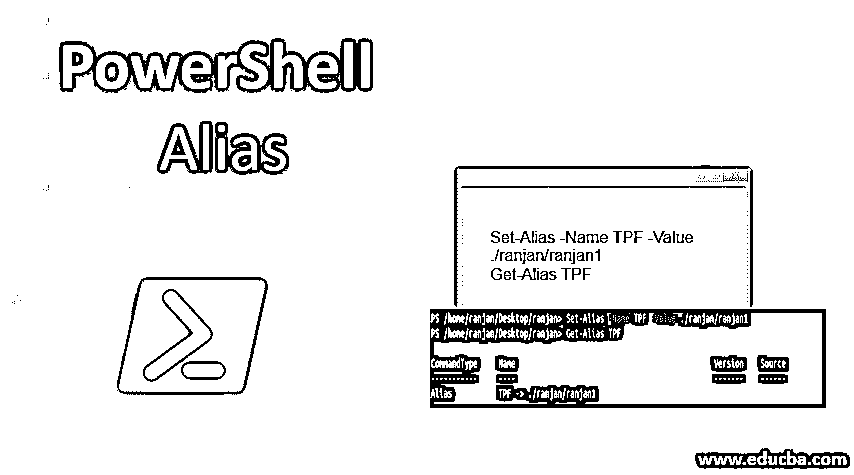
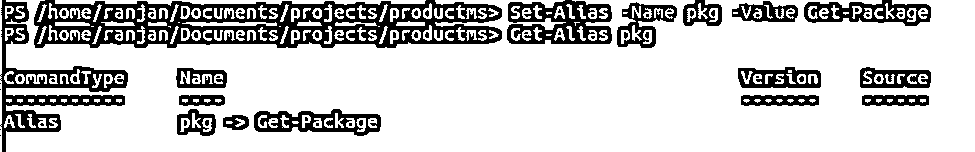
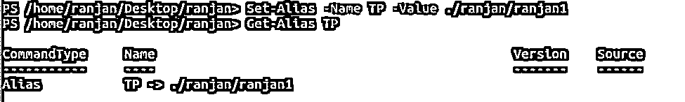
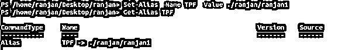
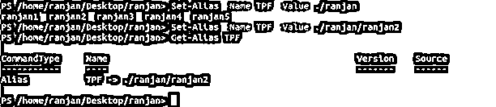
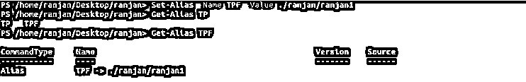
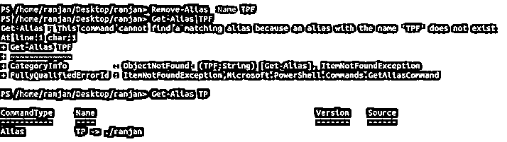

# PowerShell 别名

> 原文：<https://www.educba.com/powershell-alias/>

## PowerShell 别名简介

PowerShell 中的别名允许我们为命令定义短名称，这样我们就可以很容易地记住和编写它，我们还可以为任何可执行文件创建别名。

当我们编写任何命令并使用 Set-Alias 和我们希望用于比内存中更短的命令名称的名称时，它会将命令的完整细节与别名一起保存在内存中。在任何时候，如果我们想要为别名使用定义的较短名称，我们可以用 Get-Alias 调用它。我们可以使用 Set-Alias 和 Get-Alias 命令来设置和获取带有 Alias 的实际命令。我们还有一个用于删除和任何现有别名的命令。如果我们想对现有别名进行任何修改，我们可以覆盖现有别名。

<small>Hadoop、数据科学、统计学&其他</small>

### 如何创建 PowerShell 别名？

要创建别名，我们需要使用 Set-Alias 命令。这个命令允许我们为给定的函数设置别名。假设我们想要查看所有可用包的列表，那么我们可以使用 Get-Package 命令，但是这里我们将为 Get-Package 创建一个别名。参见下面的例子，在这个例子中，我们用“pkg”名称为 Get-Package 设置别名，在下一行中，我们通过 Get-Alias 用“pkg”名称获取它的详细信息。

我们可以使用下面的语法在 powershell 中设置别名。

**语法:**

`Set-Alias
[-Name] <shorter name for command>
[-Value] <actual command which we wanted to shorter>
[-Description <String description of what command will do>] [-Option <access level of command like readonly ,read and write both etc>] [-PassThru
] [-Scope <string value of scope like local or global>] [-Force<we can use it for forced for hidden files>] [-WhatIf<display what will happen without actual impact>] [-Confirm<display a prompt for your confirmation>]`

下面是在 PowerShell 中设置别名的示例。

**举例:**

`Set-Alias -Name pkg -Value Get-Package
Get-Alias pkg`

在上面的例子中，我们已经为 Get-package 命令设置了一个别名，在 Get-Alias 对定义的别名的帮助下，我们能够获得别名的详细信息。

### 如何访问和修改 PowerShell 别名？

这里我们讨论如何访问和修改 PowerShell 别名。

#### 在 PowerShell 中访问别名

要在 PowerShell 中访问别名，我们可以使用名为 Get-Alias 的命令，它将允许我们通过名为 Set-Alias 的命令获取名称集。下面是一个获取别名的例子。要在 PowerShell 中访问任何已定义的别名，我们可以使用以下格式:

**语法:**

`Get-Alias
[[-Name] <array of string name which we set in alias>] [-Exclude <We can exclude with writing array of string>] [-Scope <String value of scope like local or global>]`

**举例:**

`Set-Alias -Name TP -Value ./ranjan/ranjan1
Get-Alias TP`

**输出:**

#### 修改别名

在 PowerShell 中，如果我们想要修改任何别名，那么我们可以用另一个值再次覆盖它，它将被修改，这将改变别名的旧名称**。**一般来说，没有任何可用于修改的命令，我们需要用新的**覆盖现有的别名值。**

设置别名并获取它。

**举例:**

`Set-Alias -Name TPF -Value ./ranjan/ranjan1
Get-Alias TPF`

**输出:**

用新值修改现有别名。

**举例:**

`Set-Alias -Name TPF -Value ./ranjan/ranjan2
Get-Alias TPF`

**输出:**

首先在上面的例子中，我们将别名“TPF”的值设置为路径“/ranjan/ranjan1”，在下一行中，我们通过用不同的值重写相同的命令，将其更改为“ranjan/ranjan2”。

### 如何删除 PowerShell 别名？

我们可以使用名为 Remove-Alias 的 PowerShell 命令删除任何别名。这个命令删除了我们传递给它的别名。请参见下面的格式以删除 PowerShell 中的别名。

**语法:**

`Remove-Alias
[-Name] <String name for the Alias which we want to remove>
[-Scope <String scope name like local>] [-Force<In case we do not have permission or it is hidden than we can run this command to work>]`

设置并获取别名，

**举例:**

`Set-Alias -Name TPF -Value ./ranjan/ranjan1
Get-Alias TPF`

**输出:**

删除上面定义的别名，

**举例:**

`Remove-Alias -Name TPF //removing the the Alias “TPF”
Get-Alias TPF//will through an error as we have removed the Alias “TPF”`

**输出:**

在运行命令 get-Alias 时，将会出现一个错误，因为我们已经删除了别名“TPF ”,并且我们正在尝试获取它的值。

### 重要

让我们明白一件事，当我们要写任何大的脚本时，我们的代码会很长，在那种情况下维护会很困难。还有，代码的可读性也不会很好。例如，如果我们想要编写一些与所有正在运行的进程相关的命令，而不是在 [PowerShell 中，我们将使用“Get-process”](https://www.educba.com/powershell-get-process/)，但是在 PowerShell 中别名概念的帮助下，我们可以编写可读性更好的相同命令，如“process-list”或“PL”。通过编写“PL”而不是“Get-process ”,我们可以节省一些字符。这里“Get-process”的长度是 11,“PL”的长度是 2，所以我们可以在这里保存 9 个字母。

总的来说，我们可以为它的重要性定义几个要点，它们在下面给出。

*   **缩短代码**:因为我们已经掌握了我们想要给 PowerShell 命令取什么名字作为别名，所以我们可以给它们取较小的名字，这样可以使我们的代码比没有别名的代码少一半。
*   **代码可读性更强:**根据命令执行的工作，许多命令的名称并不十分有意义，因此在这种情况下，我们可以为命令定义可读性更强的别名，这样其他人和我们都可以轻松地理解代码。
*   更容易维护:因为代码可读性更强，更容易理解，所以其他人在现有的脚本上工作时，他们可以很容易地理解每一行及其含义

### 推荐文章

这是 PowerShell 别名的指南。这里我们讨论一下简介和如何创建 PowerShell 别名以及如何访问和修改 PowerShell 别名及其重要性。您也可以阅读以下文章，了解更多信息——

1.  [实现 PowerShell Get-Date 的示例](https://www.educba.com/powershell-get-date/)
2.  [在 PowerShell 中获取帮助的快捷方式](https://www.educba.com/get-help-in-powershell/)
3.  [PowerShell 中 cmdlets 的说明](https://www.educba.com/cmdlets-in-powershell/)
4.  [Python 导入模块完整指南](https://www.educba.com/python-import-module/)

