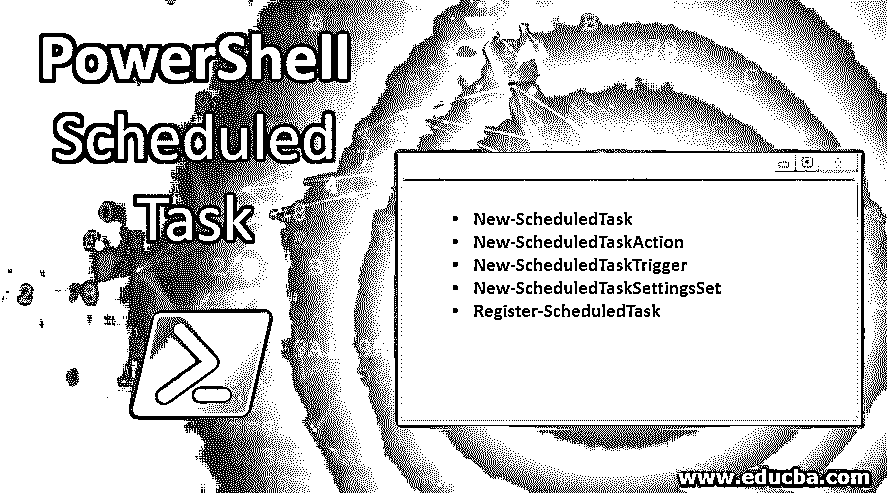
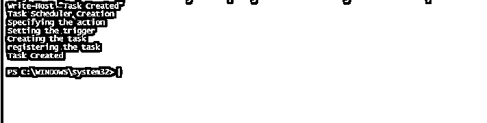
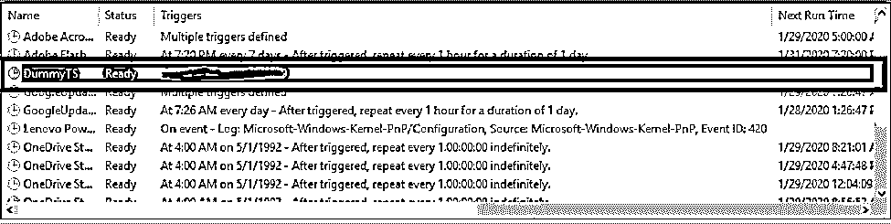

# PowerShell 计划任务

> 原文：<https://www.educba.com/powershell-scheduled-task/>

## PowerShell 计划任务简介

计划任务只不过是自动运行以定期执行某些活动而无需手动干预的操作。活动可以是重启系统、运行批处理命令或运行 PowerShell 脚本。常见且单调的任务是那些通过预定任务更新或实现的任务。这有助于减少花费的工时。根据用户的需要，计划任务可以每小时、每天或每周运行一次。本文将详细介绍如何通过任务调度器和 PowerShell 创建调度任务来运行 PowerShell 脚本。

### 通过 PowerShell 创建计划任务的不同命令

以下是通过 PowerShell 创建计划任务所需的 cmdlets:

<small>Hadoop、数据科学、统计学&其他</small>

*   新计划任务
*   新计划任务
*   新计划任务触发器
*   new-scheduledtasksettingset
*   寄存器调度任务

我们来详细看看上面提到的每一个 cmdlets。

#### 1.新计划任务

此 cmdlet 创建新的计划任务作业实例。

**语法:**

`NAME
New-ScheduledTask
SYNTAX
New-ScheduledTask [[-Action] <CimInstance#MSFT_TaskAction[]>] [[-Trigger] <CimInstance#MSFT_TaskTrigger[]>] [[-Settings] <CimInstance#MSFT_TaskSettings>] [[-Principal] <CimInstance#MSFT_TaskPrincipal>] [[-Description] <string>] [-CimSession <CimSession[]>] [-ThrottleLimit <int>] [-AsJob]  [<CommonParameters>] ALIASES
None`

**参数:**

*   **动作:**表示任务需要执行的动作。它可以是多个操作，如果指定了多个操作，它们将按顺序运行。指定的最大操作数为 32。其类型为 CimInstance[]。默认值为无。它不接受管道输入和通配符。
*   **AsJob:** 这表示作为后台作业运行的任务。它的类型是开关。默认值为无。它不接受管道输入和通配符。
*   **CimSession:** 在远程计算机上运行作业。其类型为 CimSession[]，别名为 Session。默认值为无。它不接受管道输入和通配符。
*   **描述:**表示任务的基本定义。它的类型是字符串，默认值是 none。它不接受管道输入和通配符。
*   **Principal:** 表示任务需要使用的用户账号。其类型为 CimInstance。默认值为无。它不接受管道输入和通配符。
*   **触发器:**表示将启动计划任务的触发器。触发器可以是基于时间的，也可以是基于事件的。一个任务最多可以有 48 个触发器。其类型为 CimInstance[]。默认值为无。它不接受管道输入和通配符。

**举例:**

`$Tasktest = New-ScheduledTask -Action $testAction -Trigger $testTrigger -Settings $testSettings`

#### 2.新计划任务

此 cmdlet 用于创建计划任务的操作。

**语法:**

`NAME
New-ScheduledTaskAction
SYNTAX
New-ScheduledTaskAction [-Execute] <string> [[-Argument] <string>] [[-WorkingDirectory] <string>] [-Id <string>] [-CimSession <CimSession[]>] [-ThrottleLimit <int>] [-AsJob]  [<CommonParameters>] ALIASES
None`

**参数:**

*   **参数:**指定要传递的参数列表。它的类型是字符串。默认值为无。它不接受管道输入和通配符。
*   **AsJob:** 这表示作为后台作业运行的任务。它的类型是开关。默认值为无。它不接受管道输入和通配符。
*   **执行:**表示要执行的文件的路径。它的类型是字符串。默认值为无。它不接受管道输入和通配符。
*   **Id:** 表示动作 Id，用于记录。它的类型是字符串。默认值为无。它不接受管道输入和通配符。
*   **WorkingDirectory:** 表示任务调度器将要运行的目录。默认位置是%windir%\system32 目录。默认值为无。它不接受管道输入和通配符。

**举例**:

`New-ScheduledTaskAction -Execute "Notepad.exe"`

#### 3.新计划任务触发器

这将为计划任务创建一个触发器。触发器可以是基于时间的，也可以是基于事件的。

**语法:**

`NAME
New-ScheduledTaskTrigger
SYNTAX
New-ScheduledTaskTrigger [-Once] -At <datetime> [-RandomDelay <timespan>] [-RepetitionDuration <timespan>] [-RepetitionInterval <timespan>] [-CimSession
<CimSession[]>] [-ThrottleLimit <int>] [-AsJob]  [<CommonParameters>] New-ScheduledTaskTrigger [-Daily] -At <datetime> [-DaysInterval <uint32>] [-RandomDelay <timespan>] [-CimSession <CimSession[]>] [-ThrottleLimit <int>] [-AsJob] [<CommonParameters>] New-ScheduledTaskTrigger [-Weekly] -At <datetime> [-RandomDelay <timespan>] [-DaysOfWeek {Sunday | Monday | Tuesday | Wednesday | Thursday | Friday | Saturday}] [-WeeksInterval <uint32>] [-CimSession <CimSession[]>] [-ThrottleLimit <int>] [-AsJob]  [<CommonParameters>] New-ScheduledTaskTrigger [-AtStartup] [-RandomDelay <timespan>] [-CimSession <CimSession[]>] [-ThrottleLimit <int>] [-AsJob]  [<CommonParameters>] New-ScheduledTaskTrigger [-AtLogOn] [-RandomDelay <timespan>] [-User <string>] [-CimSession <CimSession[]>] [-ThrottleLimit <int>] [-AsJob]  [<CommonParameters>] ALIASES
None`

**参数:**

*   **At:** 指定必须触发任务的日期或时间。它的类型是日期时间。默认值为无。它不接受管道输入和通配符。
*   **AtLogOn:** 表示用户登录时启动的触发器。它的类型是开关参数。默认值为无。它不接受管道输入和通配符。
*   **每日:**表示任务必须每日运行。它的类型是开关参数。默认值为无。它不接受管道输入和通配符。
*   **每周:**表示任务必须每周运行一次。它的类型是一个开关参数。默认值为无。它不接受管道输入和通配符。

**举例**:

`$Sta = New-ScheduledTaskAction -Execute "Notepad"
$Stestjob = New-ScheduledTaskTrigger -Weekly -At 3 am`

#### 4.new-scheduledtasksettingset

这包含计划任务的设置。该对象用于修改设置和管理任务的行为。

**语法:**

`NAME
New-ScheduledTaskSettingsSet
SYNTAX
New-ScheduledTaskSettingsSet [-DisallowDemandStart] [-DisallowHardTerminate] [-Compatibility {At | V1 | Vista | Win7 | Win8}] [-DeleteExpiredTaskAfter <timespan>] [-AllowStartIfOnBatteries] [-Disable] [-MaintenanceExclusive] [-Hidden] [-RunOnlyIfIdle] [-IdleWaitTimeout <timespan>] [-NetworkId <string>] [-NetworkName <string>] [-DisallowStartOnRemoteAppSession] [-MaintenancePeriod <timespan>] [-MaintenanceDeadline <timespan>] [-StartWhenAvailable] [-DontStopIfGoingOnBatteries] [-WakeToRun] [-IdleDuration <timespan>] [-RestartOnIdle] [-DontStopOnIdleEnd] [-ExecutionTimeLimit <timespan>] [-MultipleInstances {Parallel | Queue | IgnoreNew}] [-Priority <int>] [-RestartCount <int>] [-RestartInterval <timespan>] [-RunOnlyIfNetworkAvailable] [-CimSession <CimSession[]>] [-ThrottleLimit <int>] [-AsJob]  [<CommonParameters>] ALIASES
None`

**举例:**

`$Statest = New-ScheduledTaskAction -Execute "Notepad"
$STSettest = New-ScheduledTaskSettingsSet -Priority 7`

#### 5.寄存器调度任务

这用于注册计划任务。使用该脚本可以运行以下类型的应用程序。Windows 应用程序、DOS 应用程序、批处理和 cmd 文件。

**举例:**

`Register-ScheduledTask -TaskName "test task" -Trigger $testTime -User $trestUser -Action $testPS`

### 创建任务的示例脚本

让我们在示例代码的帮助下创建一个任务:

**代码:**

`Write-Host "Task Scheduler Creation"
Write-Host "Specifying the action"
$testAction = New-ScheduledTaskAction -Execute 'powershell.exe' -Argument "-File 'C:\test.ps1'"
Write-Host "Setting the trigger"
$testTrigger = New-ScheduledTaskTrigger -Daily -At 4am
$testSettings = New-ScheduledTaskSettingsSet
Write-Host "Creating the task"
$testTask = New-ScheduledTask -Action $testAction -Trigger $testTrigger -Settings $testSettings
Write-Host "registering the task"
Register-ScheduledTask -TaskName 'Dummy TS' -InputObject $Task -User 'vignesh' -Password 'pass@123'
Write-Host "Task Created"`

**输出:**

### 通过任务计划程序运行脚本

1.通过在 windows 中搜索打开任务计划程序，并选择创建基本任务。为任务命名，然后选择确定

2.设置触发器，可以是每周、每天或每月

3.在“操作”选项卡上选择要运行的文件

4.在“设置参数”选项卡中传递脚本所需的参数(如果有)

5.保存任务

6.该任务将在任务计划程序库中可用。

### 结论

因此，本文详细介绍了如何在 PowerShell 中创建和配置计划任务。它详细解释了创建任务所涉及的各种 cmdlets、它们的语法和各自的参数以及合适的示例。还介绍了如何在任务调度器中直接创建任务。了解更多信息的最佳方式是使用上述步骤创建一个任务调度程序，并自己探索。

### 推荐文章

这是 PowerShell 计划任务指南。在这里，我们讨论 PowerShell 计划任务的介绍、通过 PowerShell 创建计划任务的不同命令以及各自的语法和参数。您也可以浏览我们的其他相关文章，了解更多信息——

1.  [PowerShell 导入模块](https://www.educba.com/powershell-import-module/)
2.  [PowerShell 调用命令](https://www.educba.com/powershell-invoke-command/)
3.  [PowerShell 工具](https://www.educba.com/powershell-tools/)
4.  [PowerShell 版本](https://www.educba.com/powershell-versions/)
5.  [PowerShell 转换为字符串指南](https://www.educba.com/powershell-convert-to-string/)

