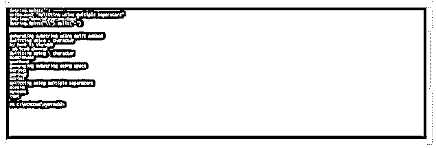
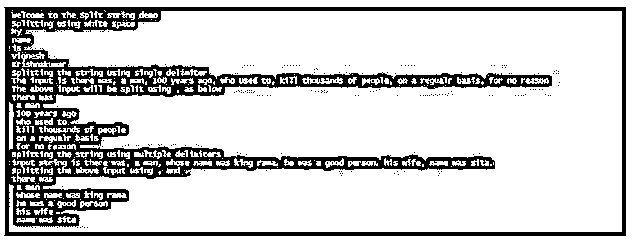
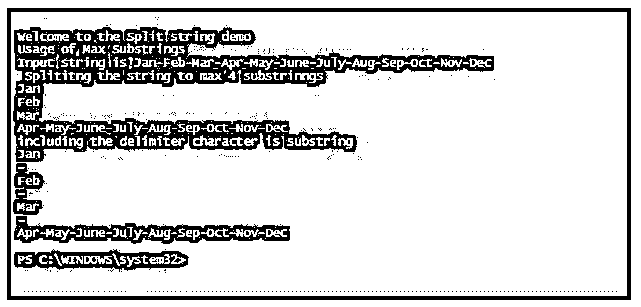
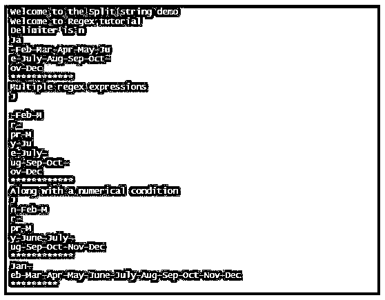
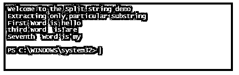
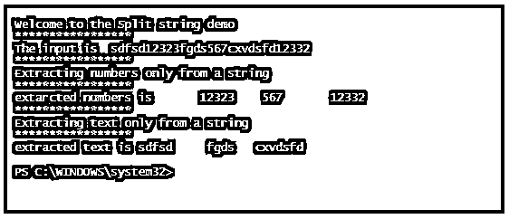
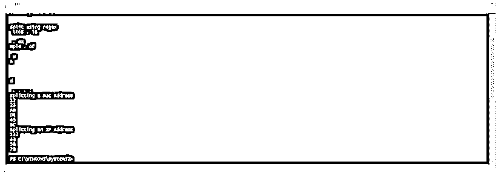
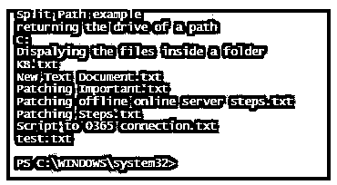

# PowerShell 拆分字符串

> 原文：<https://www.educba.com/powershell-split-string/>

## PowerShell 拆分字符串简介

PowerShell 使用 Split()函数将一个字符串拆分成多个子字符串。该函数使用指定的分隔符将字符串拆分成子字符串。用于分割字符串的默认字符是空格。三种类型的元素与 split 函数相关联。它们是分隔符、子字符串的最大数量以及与分隔符相关的选项(简单匹配或多行)。

**分隔符:**默认分隔符是空格。也可以使用其他分隔符，如模式、制表符和退格。

<small>Hadoop、数据科学、统计学&其他</small>

**子字符串的最大数量:**默认情况下，该函数返回所有可能的子字符串。我们也可以使用这个元素来限制它们。

**语法:**

`.Split(strSeparator [, MaxSubstrings] [, Options])
String -Split strSeparator [, MaxSubstrings] [, Options] String -Split {scriptblock} [, MaxSubstrings] -Split String`

**参数:**

**1。-String[]或 String:** 表示要从实际输入中拆分出来的字符串。也可以指定多个字符串。

**2。-Delimiter:** 这表示用于标识子字符串结尾的字符。默认分隔符是空白，包括制表符和换行符。默认情况下，所有子字符串中都省略了分隔符，要包含它们，必须用括号括起来。

**3。-Max-SubStrings:** 表示输入的子串必须被拆分的次数，即应该产生的子串数量。默认情况下，会生成所有可能的子字符串。如果子字符串多于指定的数目，那么剩余的子字符串将被追加到最后一个子字符串。允许非负值，零返回所有子字符串。

**4。-ScriptBlock:** 表示分隔符的规则。它被括在大括号中，并且必须计算为 true 或 false。

**5。-Options:** 单行只标识字符串的开始和结束，Multiline 标识行的开始和结束以及字符串。

选项的语法如下，只有在使用 Max-SubStrings 参数时才能使用。

`"SimpleMatch [,IgnoreCase]"
"[RegexMatch] [,IgnoreCase] [,CultureInvariant] [,IgnorePatternWhitespace] [,ExplicitCapture] [,Singleline | ,Multiline]"`

除了单行和多行之外，可能的 Regex 选项如下:

*   **RegexMatch** :这是默认选项。它使用正则表达式来计算分隔符。
*   **忽略大小写**:不考虑分隔符的大小写
*   **CultureInvariant** :计算分隔符时，忽略语言中的文化差异。

### PowerShell 拆分字符串的示例

以下是 PowerShell 拆分字符串的示例:

#### 示例#1

**输入:**

`Write-Host "generating substring using split method"
$teststring="my name is vignesh- am from chennai"
Write-Host "splitting using - character"
$teststring -split "-"
$teststring="domainname\username"
Write-Host "Splitting using \ character"
$teststring -split "\\"
Write-Host "generating substring using space"
$string="string1 string2 strin3"
$string.Split("")
Write-Host "splitting using multiple separators"
$string="domain\systems-test"
$string.Split("\\").Split("-")`

**输出:**

#### 实施例 2

**输入:**

`Write-Host "Welcome to the Split string demo"
Write-Host "Splitting using white space"
$string="My name is vignesh Krishnakumar"
$string.Split("")
Write-Host "Splitting the string using single delimiter"
$teststring="there was, a man, 100 years ago, who used to, kill thousands of people, on a regualr basis, for no reason"
write-host "The input is" $teststring
Write-Host "The above input will be split using , as below"
$teststring.Split(",")
Write-Host "splitting the string using multiple delimiters"
$teststring1="there was, a man, whose name was king rama. he was a good person. his wife, name was sita."
Write-Host "input string is" $teststring1
Write-Host "splitting the above input using , and ."
$teststring1.Split(",").Split(".")`

**输出:**

#### 实施例 3

**输入:**

`Write-Host "Welcome to the Split string demo"
Write-Host "Usage of Max Substrings"
$string= "Jan-Feb-Mar-Apr-May-June-July-Aug-Sep-Oct-Nov-Dec"
Write-Host "Input string is" $string
Write-Host " Splititng the string to max 4 substrinngs"
$string -split "-" , 4
Write-Host "including the delimiter character is substring"
$string -split "(-)" , 4`

**输出:**

#### 实施例 4

**输入:**

`Write-Host "Welcome to the Split string demo"
Write-Host "Welcome to Regex tutorial"
$month="Jan-Feb-Mar-Apr-May-June-July-Aug-Sep-Oct-Nov-Dec"
Write-Host "Delimiter is n"
$month -split {$_ -eq "n"}
write-host "************"
Write-Host "Multiple regex expressions"
$month -split {($_ -eq "n") -or ($_ -eq "a")}
write-host "************"
Write-Host "Along with a numerical condition"
$test=5
$month -split {if ($test -gt 4) {$_ -eq "a"} else {$_ -eq "f"}}
write-host "************"
$month -split {if ($test -eq 4) {$_ -eq "z"} else {$_ -eq "f"}}
Write-Host "*********"
$month.Split("[nf]")
Write-Host "**********"`

**输出:**

#### 实施例 5

**输入:**

`Write-Host "Welcome to the Split string demo"
Write-Host "Extracting only particular substring"
$teststring= "hello how are you am fine my name is vignesh krishnakumar am from chennai"
$months=$teststring.Split(" ")
Write-Host "First Word is" $months[0] Write-Host "third word is" $months[2] Write-Host "Seventh Word is" $months[6]`

**输出:**

#### 实施例 6

**输入:**

`Write-Host "Welcome to the Split string demo"
Write-Host "*****************"
$input="sdfsd12323fgds567cxvdsfd12332"
Write-Host "The input is " $input
Write-Host "*****************"
Write-Host "Extracting numbers only from a string"
Write-Host "*****************"
$numbers= $input -split "\D"
Write-Host "extarcted numbers is " $numbers
Write-Host "*****************"
Write-Host "Extracting text only from a string"
Write-Host "*****************"
$numbers1= $input -split "\d"
Write-Host "extracted text is" $numbers1`

**输出:**

#### 实施例 7

**输入:**

这个例子将展示如何根据正则表达式拆分和生成子串，以及如何拆分 MAC 地址。

`Write-Host "split using regex"
$test=" this . is an . example . of an was an and an . . . ."
$test.Split("an")
Write-Host "splitting a mac address"
$test="12-23-AB-DE-45-BC"
$test.Split("-")
Write-Host "Splitting an IP Address"
$test="122.43.56.78"
$test.Split(".")`

**输出:**

### 分离路径

分割路径用于返回路径中提到的部分。它可以是父文件夹、文件名或子文件夹。

**语法:**

`AME
Split-Path
Split-Path [-Path] <string[]> [-Parent] [-Resolve] [-Credential <pscredential>] [-UseTransaction] [<CommonParameters>] Split-Path [-Path] <string[]> [-NoQualifier] [-Resolve] [-Credential <pscredential>] [-UseTransaction] [<CommonParameters>] Split-Path [-Path] <string[]> [-Leaf] [-Resolve] [-Credential <pscredential>] [-UseTransaction] [<CommonParameters>] Split-Path [-Path] <string[]> [[-Qualifier]] [-Resolve] [-Credential <pscredential>] [-UseTransaction] [<CommonParameters>]`

**举例:**

**输入:**

`Write-Host "Split Path example"
Write-Host "returning the drive of a path"
Split-Path -Path "C:\Users\R003646\Desktop\Articles\Jan" -Qualifier
Write-Host "Dispalying the files inside a folder"
Split-Path -Path "C:\Vignesh\Test\Test6\*.txt" -Leaf -Resolve`

**输出:**

### 结论

因此，本文详细介绍了 PowerShell 中的拆分字符串方法。它用适当的例子解释了各种分隔符。它还展示了使用 split 操作生成子字符串的各种方法。它还简要解释了如何使用 split path cmdlet 从给定路径中拆分路径。

### 推荐文章

这是 PowerShell 拆分字符串的指南。这里我们讨论 Powershell 拆分字符串的介绍、参数和不同的示例。您也可以看看以下文章，了解更多信息–

1.  [PowerShell 获取内容](https://www.educba.com/powershell-get-content/)
2.  [PowerShell ForEach 对象](https://www.educba.com/powershell-foreach-object/)
3.  [PowerShell 操作员](https://www.educba.com/powershell-operators/)
4.  [PowerShell 重命名-项目](https://www.educba.com/powershell-rename-item/)
5.  [PowerShell 转换为字符串指南](https://www.educba.com/powershell-convert-to-string/)
6.  [Python 拆分字符串指南](https://www.educba.com/python-split-string/)

