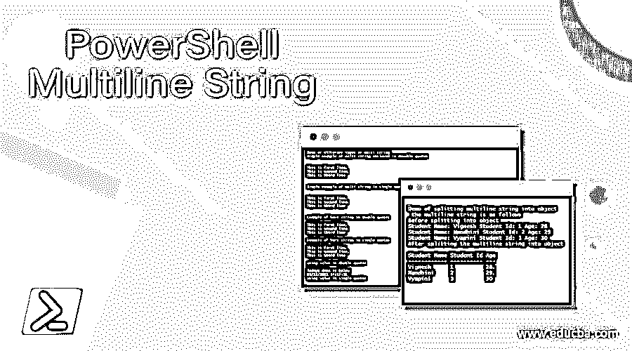
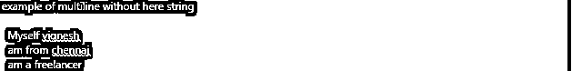
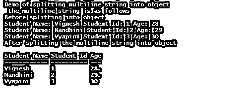
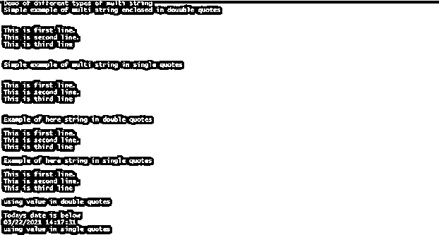

# PowerShell 多行字符串

> 原文：<https://www.educba.com/powershell-multiline-string/>

## PowerShell 多行字符串简介

字符串什么都不是，只是一组包含在。多行字符串是其值超过一行的字符串。在这种情况下，字符串应该用 here-string(@""@)括起来。换行符或回车符也可以用来创建多行字符串。多行字符串也可以通过在双引号中使用换行符来定义。本文将详细解释多行字符串，它的语法使用以及适当的例子。

**语法:**

<small>Hadoop、数据科学、统计学&其他</small>

Here-string 用于如下定义多行字符串。第一行和最后一行不应该包含任何内容。

`@”
First-line
Second line
Third line
“@`

当我们不需要对变量或表达式求值时，字符串值可以用单引号括起来。

**举例:**

`Write-Host "example of multiline string using here string"
$test=@"
First-line
second line
"@
Write-Host $test
Write-Host "example using literal string"
$test1=@'
first line
$(Get-Date)
second line
'@
Write-Host $test1`

**输出:**

即使没有 here-string 多行字符串也可以定义如下

**输入:**

`Write-Host "example of multiline without here string"
$text = {
Myself vignesh
am from chennai
am a freelancer
this is fourth line
}
write-Host $text.ToString()`

**输出:**

### 使用她的字符串处理多行字符串

当 PowerShell 看到@ "后跟一个换行符时，它会将字符串理解为多行。以“@”结尾就结束了。这样做的主要目的是允许用户创建带有引号、符号、换行符或其他格式文本的字符串。每当引用多行字符串时出现错误，明智的做法是首先检查第一行，并且在@和"之间没有空格。像普通的字符串变量一样，多行字符串也可以是文字的或扩展的。单引号表示字面意思，双引号表示扩展。当在单引号多字符串中使用值或表达式时，它将被打印为文字字符串，而如果在双引号多字符串中使用变量或表达式，它将被求值并打印实际值而不是文字值。可以根据用户的需要创建四种可能的多行字符串组合。在下面的例子中，详细讨论了多线串的各种情况。

### 例子

让我们讨论 PowerShell 多行字符串的例子。

#### 示例#1

`Write-Host "Converting multine line string to a single line" -ForegroundColor Green
Write-Host "Get the contents of the file before converting" -ForegroundColor Green
Write-Host "Displaying the contents of the file" -ForegroundColor Green
$input = Get-Content -Path "C:\vignesh\multiline.txt"
foreach($line in $input)
{
Write-Host $line
}
Write-Host "Merging the contents of the file into a single line" -ForegroundColor Green
foreach ($line in $input)
{
$op = $op + $line
}
$op| Out-File C:\vignesh\multiline.txt -Force
Write-Host "After merging" -ForegroundColor Green
$final = Get-Content -Path "C:\vignesh\multiline.txt"
Write-Host $final`

**输出:**

#### 实施例 2

`Write-Host "Demo of splitting multiline string into object" -ForegroundColor Green
Write-Host " the multiline string is as follows" -ForegroundColor Green
$ip = @"
Student Name: Vignesh Student Id: 1 Age: 28
Student Name: Nandhini Student Id: 2 Age: 29
Student Name: Vyapini Student Id: 3 Age: 30
"@
Write-Host "Before splitting into object" -ForegroundColor Green
Write-Host $ip
Write-Host "After splitting the multiline string into object" -ForegroundColor Green
$ip -split "`n" |
Select-String 'Student Name: (\w+) Student Id: (\w+) Age: (.+)' |
ForEach-Object {
New-Object PSObject -Property ([Ordered] @{
"Student Name" = $_.Matches[0].Groups[1].Value
"Student Id"= $_.Matches[0].Groups[2].Value
"Age" = $_.Matches[0].Groups[3].Value
})
}`

**输出:**

#### 实施例 3

`Write-Host "Demo of different types of multi-string" -ForegroundColor Green
Write-Host "Simple example of multi-string enclosed in double quotes" -ForegroundColor Green
$ip = "
This is first line.
This is second line.
This is third line
"
Write-Host $ip
Write-Host "Simple example of multi-string in single quotes" -ForegroundColor Green
$ip = '
This is first line.
This is second line.
This is third line
'
Write-Host $ip
Write-Host "Example of here string in double quotes" -ForegroundColor Green
$ip= @"
This is first line.
This is second line.
This is third line
"@
Write-Host $ip
Write-Host "Example of here string in single quotes" -ForegroundColor Green
$ip= @'
This is first line.
This is second line.
This is third line
'@
Write-Host $ip
Write-Host "using value in double quotes" -ForegroundColor Green
$date=Get-Date
$ip=@"
Todays date is below
$date
"@
Write-Host $ip
Write-Host "using value in single quotes" -ForegroundColor Green
$date=Get-Date
$ip=@'
Todays date is below
$date
'@
Write-Host $ip
Write-Host "in single quotes the string literal is printed and not the value" -ForegroundColor Green
Write-Host "Using double quotes inside a double quotes" -ForegroundColor Green
$ip= @"
This is first line.
This is "second" line.
This is third line
"@
Write-Host $ip
Write-Host "Using single quotes inside a double quotes" -ForegroundColor Green
$ip= @"
This is first line.
This is 'second' line.
This is third line
"@
Write-Host $ip
Write-Host "Using single quotes inside a single quotes" -ForegroundColor Green
$ip= @'
This is first line.
This is 'second' line.
This is third line
'@
Write-Host $ip
Write-Host "Using double quotes inside a single quotes" -ForegroundColor Green
$ip= @'
This is first line.
This is "second" line.
This is third line
'@
Write-Host $ip`

**输出:**

### 结论

因此，本文详细介绍了 PowerShell 中的多行字符串。它还详细解释了如何使用各种方法创建多行字符串，比如 here-string、单引号和双引号方法以及它们的区别。它还演示了各种示例程序，引导我们如何创建多行字符串并使用它们。要了解更多细节，建议编写示例脚本并练习它们。

### 推荐文章

这是 PowerShell 多行字符串的指南。在这里，我们讨论了多行字符串的介绍、语法、使用她的字符串工作，以及例子。您也可以看看以下文章，了解更多信息–

1.  [PowerShell 在哪里](https://www.educba.com/powershell-where/)
2.  [PowerShell 卸载模块](https://www.educba.com/powershell-uninstall-module/)
3.  [PowerShell 匹配](https://www.educba.com/powershell-match/)
4.  [从 cmd 启动 PowerShell】](https://www.educba.com/start-powershell-from-cmd/)

