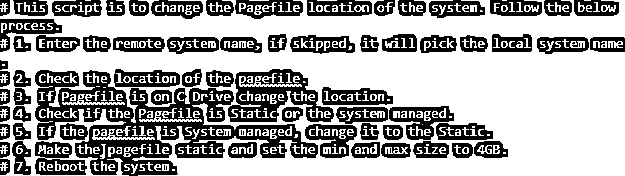
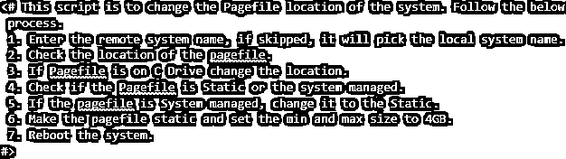
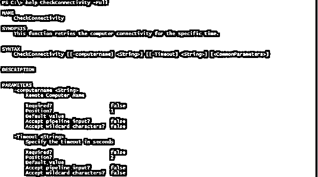
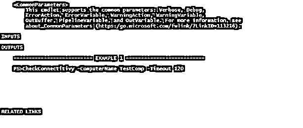

# PowerShell 多行注释

> 原文：<https://www.educba.com/powershell-multiline-comment/>

## PowerShell 多行注释简介

PowerShell 多行注释是添加脚本、函数的描述或编写描述功能的帮助的方式，以便更好地理解和解释脚本或脚本的一部分，而无需执行该部分，此外，通过添加语法、参数、示例等编写关于函数的基于注释的帮助也很有帮助。

**语法:**

<small>Hadoop、数据科学、统计学&其他</small>

块 **< #…# >** 中描述了多行注释

**基于评论的**帮助。

`<#
.<help keyword>
<help content>
#>`

### 多行注释在 PowerShell 中是如何工作的？

为了添加单行注释，我们在行前使用#号，在 **PowerShell 2.0** 或更早的版本中，这是添加多行注释的唯一方式。这意味着如果你有 10 行的描述，那么你需要在这一行前面加上 10 次“#”。

单行注释 **'#'** 仍然存在，用于描述函数或脚本的一小部分。看看下面单行注释的样子。

`# This part won't be executed`

**输出:**

甚至表达式或任何语法都不会在这个块中执行。

`# Get-Date`

**输出:**

每当 PowerShell 找到关键字 **#** 或在 **< #…# >** 关键字之间的任何内容时，它会跳过该部分来执行。

现在，假设我们有一个脚本，需要描述它的一些内容。如果我们使用单行注释，你能想象在每一行的第 **#** 行写注释是多么的荒谬吗？

这就是我们如何在脚本中简单地添加多行注释 **< #…# >** 来将 **#** 符号放在每一行上，我们可以每次都避免 **#** 符号。

**需要注意的几件事:**

*   您不能格式化在块中输入的注释的字体。尝试使字体加粗，改变字体的颜色，这是行不通的，因为这是每个编辑的唯一格式。注释块的颜色显示取决于我们使用的编辑器和您选择的主题。

在 PowerShell ISE 和 Visual Studio 代码中，多行或单行注释可能看起来有所不同。下面是 PowerShell ISE 和 VS 代码的多行注释。

< #此评论来自 PowerShell ISE

字体颜色不同于 VS 代码

#>

从 VS 代码到 Atom 主题。

`<# This comment is from the VS code
Font color is different than PowerShell ISE
#>`

*   不能在多行注释块中传递任何变量值。举个例子，

`$name = "PowerShell"
<#
This $name variable won't expand because
This is a multiline comment
#&gt`；

输出不能扩展名称。

### 例子

让我们讨论 PowerShell 多行注释的例子。

#### 示例 1:添加多行注释来描述脚本

当您编写脚本时，您可以使用如下所示的多行注释来描述脚本信息，如版本、功能，并且您可以使用它任意次，因为它没有限制。

下面是单行和多行注释的组合。

`<#
Script Version: 1.0
Script Author: Chirag Nagrekar
Repo Location: Company Git Location
#>
function StopServices{
<#
Using foreach loop for the script
Getting the name of the servers to stop the Spooler service
#>
foreach($server in $servers){
Stop-Service -Name Spooler -Force -Verbose
}
}
#Calling StopServices Function
StopServices`

#### 示例 2:添加多行注释的快捷方式

在 visual studio 代码中，有一个添加多行注释的快捷方式，即选择我们需要注释的行，然后按下 **ALT + SHIFT + A** 按钮。

举个例子，

`This is the first line
This is the second line
This is the third line`

我们需要对以上几行进行评论。首先，选择这些行并按下**ALT+SHIFT+a。**

**输出:**

#### 示例 3:为帮助描述添加多行注释

多行注释也有助于编写基于注释的帮助，如下所示。它们是特定的，用**描述。帮助名**。

`function CheckConnectivity{
param(
[String]$computername,
[String]$Timeout
)
<#
.SYNOPSIS
This function retries the computer connectivity for the specific time.
.PARAMETER ComputerName
Remote Computer Name
.PARAMETER Timeout
Specify the timeout in seconds
.EXAMPLE
PS> CheckConnectitivy -ComputerName TestComp -Timeout 120
#>
}`

当您查看与该功能相关的帮助时，上述基于注释的帮助对于描述该功能非常有用。

要了解更多关于这个部分，请使用下面的链接。

[https://docs . Microsoft . com/en-us/powershell/module/Microsoft . powershell . core/about/about _ comment _ based _ help？view=powershell-7.1](https://docs.microsoft.com/en-us/powershell/module/microsoft.powershell.core/about/about_comment_based_help?view=powershell-7.1)

### 结论

不仅是 PowerShell，几乎所有其他高级编程语言也使用单行和多行注释，因此当我们编写脚本时，我们不需要在输出控制台上打印所有内容，但我们需要用户或脚本编写人员了解特定脚本的用途，您可以提到脚本版本。此外，您可以添加与脚本相关的帮助。

### 推荐文章

这是 PowerShell 多行注释指南。这里我们讨论定义、语法和参数，多行注释在 PowerShell 中是如何工作的？代码实现示例。您也可以看看以下文章，了解更多信息–

1.  [PowerShell 解压](https://www.educba.com/powershell-unzip/)
2.  [PowerShell 连接字符串](https://www.educba.com/powershell-join-string/)
3.  [PowerShell 退出](https://www.educba.com/powershell-exit/)
4.  [PowerShell 等待](https://www.educba.com/powershell-wait-2/)

