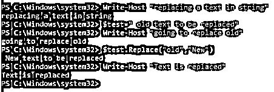
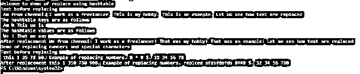
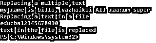
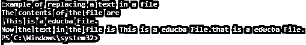

# PowerShell 字符串替换

> 原文：<https://www.educba.com/powershell-string-replace/>

## PowerShell 字符串替换简介

任何编程语言中不可缺少的字符串操作。字符串函数是 PowerShell 不可或缺的一部分，有各种函数可以处理与字符串操作相关的任务。在 PowerShell 中，所有内容都是对象，字符串也是 System.String 类型的对象。要删除字符串的某个部分，或者用其他文本替换部分或整个字符串，可以使用 PowerShell 中的 replace cmdlet 来实现。replace 函数将字符串中要替换的文本作为一个参数，将需要替换的文本作为另一个参数。本文将通过示例详细介绍 replace cmdlet。

**语法:**

<small>Hadoop、数据科学、统计学&其他</small>

`Replace(strOldChar, strNewChar)`

*   **Stroldchar:** 要查找的字符
*   **Strnewchar:** 要替换找到的文本的字符。

### 实现 PowerShell 字符串替换的示例

以下是 PowerShell 字符串替换的示例:

#### 示例#1

**代码:**

`Write-Host "replacing a text in string"
$test=" old text to be replaced"
Write-Host "going to replace old"
$test.Replace("old","New")
Write-Host "Text is replaced"`

**输出:**

#### 实施例 2

**代码:**

`Write-Host "Welcome to Replace function demo in PowerShell"
Write-Host "Demo of single text replacement"
$input="Vignesh Krishnakumar"
Write-Host "Actual text before replace is" $input
Write-Host "The below code will replace vignesh with Viki"
#replace function
$input=$input -replace "vignesh","Viki"
Write-Host "Replaced text is" $input
Write-Host "Replace using replace function"
$input1="this is a nice day"
Write-Host "The actual text is" $input1
Write-Host "The below will replace this with that"
#replace function
$input1=$input1.Replace("this","That")
Write-Host "After replace" $input1
Write-Host "Demo of multiple replace simultaneosly"
$actual="Australia won the world cup in 1999"
#multiple replacement
$actual -replace "Australia","1999" -replace "lost", "-"`

**输出:**

**T2】**

 **### 使用哈希表替换

同时替换多个文本的另一种有效方法是使用哈希表。哈希表是一种数组，它将值存储为键值对。键值必须是唯一的，值可以是不唯一的。哈希表的内置属性是键、值和计数。在使用哈希表替换文本的情况下，键将表示要替换的文本，值将表示要用于替换的文本值。

**语法** **:**

`$hashtable=@
{
Text1=value1;
Text2=value2;
Text3=value3;
Text4=value4
}`

哈希表的值可以按如下方式更改。

*   **向哈希表添加新对:**

`$hashtable.Add(“text5”,”value5”)`

*   **编辑数值:**

`$hashtable.Set_Item(“text5”,”value6”)`

或者

`$hastable.”text5”=”value6”`

*   **删除一个值:**

`$hashtable.Remove(“text5”)`

*   **显示哈希表:**

`$hashtable`

#### 实施例 3

**代码:**

`Write-Host "Welcome to demo of replace using hashtable"
$input="Am from chennai. I work as a freelancer. This is my hobby. This is an example. Let us see how text are replaced"
Write-Host "Text before replacing `n" $input -ForegroundColor Yellow
$hashtable = @{}
$hashtable.'Am'='We'
$hashtable.'This'='That'
$hashtable.'is'='was'
$hashtable.'us'='we'
$hashtable.'.'='!'
Write-Host "The hashtable keys are as follows `n" $hashtable.Keys  -ForegroundColor Yellow
Write-Host "The hashtable values are as follows `n" $hashtable.Values  -ForegroundColor Yellow
#iterate the input string and replace the values
Foreach ($key in $hashtable.Keys) {
$input = $input.Replace($key, $hashtable.$key)
}
Write-Host "After replacement" $input -ForegroundColor Yellow
Write-Host "Demo of replacing numbers and special characters"
$input1="this 1 35 78 90\. Example of replacing numbers. % * # $. 12 34 56 78"
Write-Host "Text before replacing `n" $input1 -ForegroundColor Yellow
$hashtable1 = @{}
$hashtable1.'35'='350'
$hashtable1.'78'='780'
$hashtable1.'90'='900'
$hashtable1.'%'='replced'
$hashtable1.'*'='sfdsfdsfds'
$hashtable1.'#'='####'
Foreach ($key in $hashtable1.Keys) {
$input1 = $input1.Replace($key, $hashtable1.$key)
}
Write-Host "After replacement" $input1 -ForegroundColor Yellow`

**输出:**

#### 实施例 4

**代码:**

`Write-Host "Replacing a multiple text"
$string="my name is billa, vazhaikai elam naanum super"
$string-replace "vazhikai", "replaced" -replace "elam", "All"
Write-Host "Replacing a text in a file"
(Get-Content -path C:\Users\educba.txt -Raw) -replace 'was','is'
Write-Host "text in the file is replaced"`

**输出:**

#### 实施例 5

**代码:**

`Write-Host "Example of replacing a text in a file"
$filePath = 'C:\Users\educba.txt'
$find='this'
$replace='that'
$file=Get-Content -Path $filePath
Write-Host "The contents of the file are `n" $file -ForegroundColor Yellow
(Get-Content $filePath) -replace $Find, $Replace | Add-Content -Path $filePath
$newtext=Get-Content -Path $filePath
Write-Host "Now the text in the file is" $newtext -ForegroundColor Yellow`

 `**输出:**

#### 实施例 6

**代码:**

`Write-Host "Welcome to string comparison"
$test=" STRINGsdfsdfdsfdsf DEMO"
$test1="stringDDDDDDDD demo"
Write-Host "Comaprison using equal method"
$test.Equals($test1)
$test.ToLower.Equals($test1)
$test.Equals($test1,1)
Write-Host "Comaprison using comaprison method"
$test.CompareTo($test1)`

**输出:**

#### 实施例 7

**代码:**

`Write-Host "Replacing using regex expression"
$input="192.10.145.30.456"
Write-Host "Input is `n" $input -ForegroundColor Yellow
Write-Host "Using regex going to replace all trwo digits with **"
$input=$input -replace "\.\d{2}\.","**"
Write-Host "After replacing `n" $input -ForegroundColor Yellow
Write-Host "Example to show interchanging of names"
$input= "Vignesh Krishnakumar"
Write-Host "Going to replace using regex and swap"
$input= $input -replace "([a-z]+)\s([a-z]+)",'$2, $1'
Write-Host "after swap `n" $input -ForegroundColor Yellow`

**输出:**

#### 实施例 8

其他常用的字符串函数:

`.Split()`

这是另一种可以用来将字符串拆分成子字符串的方法。

**语法:**

`.Split(strSeparator [, MaxSubstrings] [, Options])
String -Split strSeparator [, MaxSubstrings] [, Options] String -Split {scriptblock} [, MaxSubstrings] -Split String
strSeparator: It is character of identification to split the string
MaxSubstrings: The maximum number of substrings that can be generated`

**代码:**

`Write-Host "generating substring using split method"
$teststring="my name is vignesh- am from chennai"
Write-Host "splitting using - character"
$teststring -split "-"
$teststring="domainname\username"
Write-Host "Splitting using \ character"
$teststring -split "\\"
Write-Host "generating substring using space"
$string="string1 string2 strin3"
$string.Split("")
Write-Host "splitting using multiple separators"
$string="domain\systems-test"
$string.Split("\\").Split("-")`

**输出:**

**T2】**

 **### 结论

因此，本文详细介绍了 PowerShell 中的字符串替换功能。这篇文章解释了替换字符串的各种方法。它通过示例详细介绍了如何同时替换多个文本，如何使用哈希表替换文本，如何使用适当的示例替换文件中的字符串。它还详细解释了如何使用正则表达式替换字符串中的文本。还介绍了 PowerShell 中的拆分方法。本文还解释了如何在哈希表中存储多个值，以及如何用它替换字符串中的文本。了解这方面更多信息的最佳方式是尝试其他各种方法，并在示例脚本中实践它们。

### 推荐文章

这是 PowerShell 字符串替换指南。在这里，我们讨论 PowerShell 字符串替换的介绍、示例及其代码实现。您也可以浏览我们推荐的其他文章，了解更多信息——

1.  [PowerShell 预定任务](https://www.educba.com/powershell-scheduled-task/)
2.  [转换成字符串](https://www.educba.com/powershell-convert-to-string/)
3.  [PowerShell 发送邮件](https://www.educba.com/powershell-send-mail/)
4.  [PowerShell 获取服务](https://www.educba.com/powershell-get-service/)

**`**