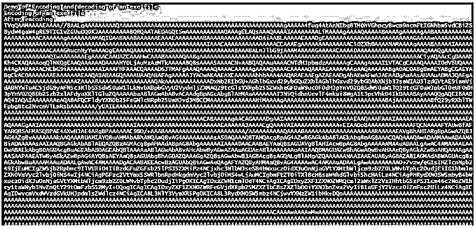
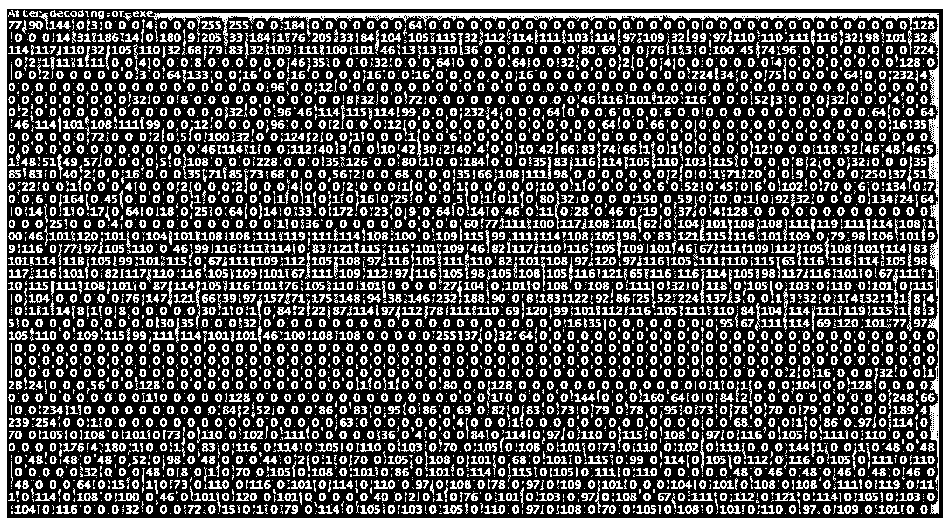
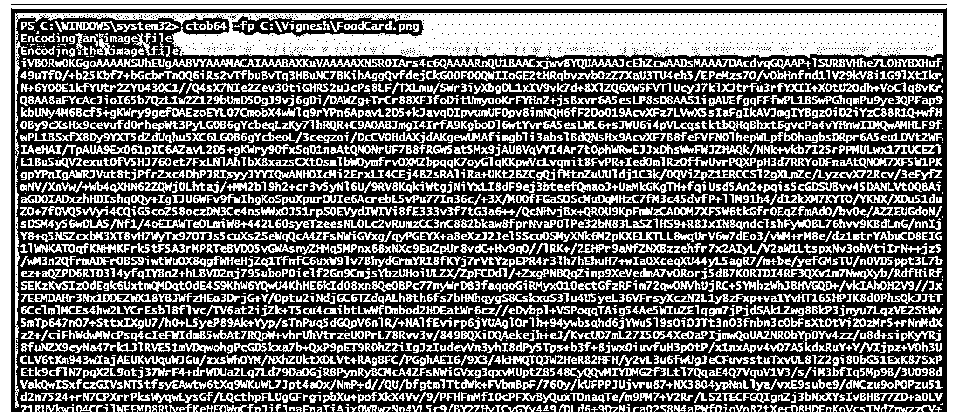
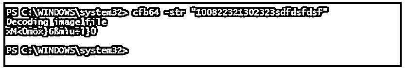
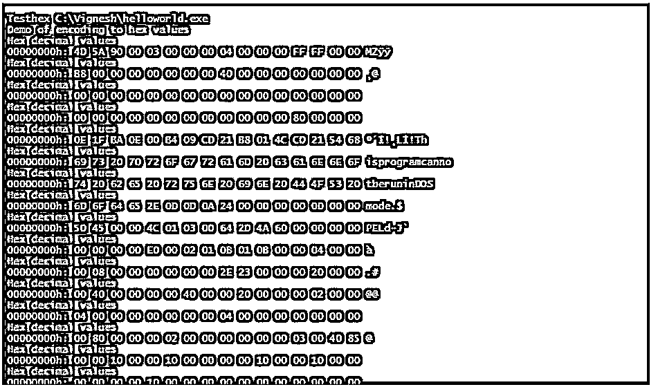
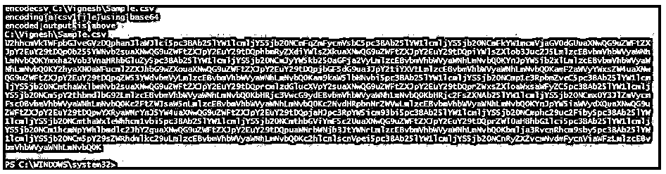
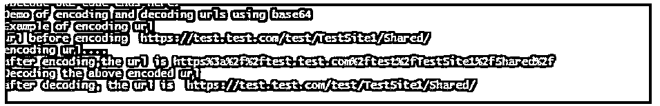
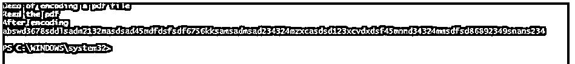

# PowerShell Base64

> 原文：<https://www.educba.com/powershell-base64/>

## PowerShell Base64 简介

PowerShell Base64 是一种用于编码和解码数据的技术或机制。为了防止数据受到恶意软件的攻击，编码和解码非常重要。Base64 编码和解码是加密和解密数据的常用方法。顾名思义，Base64 字符串中将有 64 个字符。它是大写字母、小写字母和数字的组合，末尾最多有两个等号。

**语法:**

<small>Hadoop、数据科学、统计学&其他</small>

以下是 Base64 编码和解码的语法:

**编码:**

`[Convert]::ToBase64String([System.Text.Encoding]::Unicode.GetBytes("TextToEncode"))`

**解码:**

`[System.Text.Encoding]::Unicode.GetString([System.Convert]::FromBase64String(texttobedecoded'))`

### PowerShell Base64 的示例

以下是 PowerShell Base64 的示例:

#### 示例#1

**代码:**

**编码:**

`$input = ‘text to be encoded’
$By = [System.Text.Encoding]::Unicode.GetBytes($input)
$output =[Convert]::ToBase64String($By)
$output`

**输出:**

**解码:**

`$input = “vikivikivikivikivikivyapvyapvyapvyapvyapnandnandnandnandnandviki”
$output = [System.Text.Encoding]::Unicode.GetString([System.Convert]::FromBase64String($input))
$output`

**输出:**

#### 实施例 2

对文件进行编码和解码。

**代码:**

`clear-host
Write-Host "Welcome to the example of powershell base64 encoding and decoding" -ForegroundColor Green
Write-Host "Encoding of a text file"
# Encoding a file content
$inputfile = "C:\Vignesh\Names.txt"
$fc = get-content $inputfile
$By = [System.Text.Encoding]::UTF8.GetBytes($fc)
$etext = [System.Convert]::ToBase64String($By)
Write-Host "ENCODED text file content is " $etext -ForegroundColor Green
# Decoding a file content
Write-Host "Decoding the above converted text"
[System.Text.Encoding]::ASCII.GetString([System.Convert]::FromBase64String($etext)) | Out-File -Encoding "ASCII" c:\vignesh\decoded.txt
$outfile123 = get-content c:\vignesh\decoded.txt
Write-Host "Decoded text is as follows" -ForegroundColor Green
Write-Host "DECODED: " $outfile123`

**输出:**

#### 实施例 3

**代码:**

`clear-host
Write-Host "Demo of Encoding and decoding of an exe file" -ForegroundColor Green
Write-Host "Encoding of an exe file" -ForegroundColor Green
# Encode
$fp = "C:\Vignesh\helloworld.exe"
$encf = [System.IO.File]::ReadAllBytes($fp);
# returns the base64 string
$b64str = [System.Convert]::ToBase64String($encf);
Write-Host "After encoding" -ForegroundColor Green
$b64str
# Decode
#function to decode
function Convert-stob {
[CmdletBinding()] param (
[string] $estr
, [string] $fp = (‘{0}\{1}’ -f $env:TEMP, [System.Guid]::NewGuid().ToString())
)
try {
if ($estr.Length -ge 1) {
Write-Host "After decoding of exe" -ForegroundColor Green
# decodes the base64 string
$barr = [System.Convert]::FromBase64String($estr);
[System.IO.File]::WriteAllBytes($fp, $barr);
Write-Host $barr
}
}
catch {
}
Write-Output -InputObject (Get-Item -Path $fp);
}
$DecodedFile = Convert-stob -estr $b64str -fp C:\Vignesh\helloworld.exe`

**输出:**

#### 实施例 4

解码图像文件。

**代码:**

`Write-Host "Encoding an image file"
#function to encode to base64
function ctob64
{
[CmdletBinding()] param
(
[Parameter(Mandatory = $true, ValueFromPipeline = $true)] [ValidateScript({ Test-Path -Path $_ })] [String]$fp
)
Write-Host "Encoding the image file" -ForegroundColor Green
[System.convert]::ToBase64String((Get-Content -Path $fp -Encoding Byte))
}
#decode function of an image file
function cfb64
{
[CmdletBinding()] param (
[parameter(Mandatory = $true, ValueFromPipeline)] [String]$str
)
try
{
Write-Host "Decoding image file" -ForegroundColor Green
[System.Text.Encoding]::Default.GetString([System.Convert]::FromBase64String($str))
}
catch
{
Write-Host "Error occurred" -ForegroundColor Red
$Error[0].Exception.Message
}
}`

**输出:**

#### 实施例 5

**代码:**

`function Testhex
{
[CmdletBinding()] Param
(
[Parameter(Mandatory = $True, ValueFromPipelineByPropertyName = $True)] [Alias("FN","FP")] $pa,
[Int] $wd = 16,
[Int] $co = -1,
[String] $ph = ".",
[Switch] $noo,
[Switch] $not
)
Write-Host "Demo of encoding to hex values" -ForegroundColor Green
$lc = 0
get-content $pa -encoding by -readcount $wd -totalcount $co |
foreach-object `
{
$pad = $txt = $null
$bys = $_
foreach ($by in $bys)`
{
$byh = [String]::Format("{0:X}", $by)
$pad += $byh.PadLeft(2,"0") + " "
}
if ($pad.length -lt $width * 5)
{ $pad = $pad.PadRight($width * 5," ") }
foreach ($by in $bys)`
{
if ( [Char]::IsLetterOrDigit($by) -or
[Char]::IsPunctuation($by) -or
[Char]::IsSymbol($by) )
{ $txt += [Char] $by }
else
{ $txt += $placeholder }
}
$ottt = [String]::Format("{0:X}", $lc)
$ottt = $ottt.PadLeft(8,"0") + "h:"
$lc += $width # Increment lc.
if (-not $noo) { $pad = "$ottt $pad" }
if (-not $not) { $pad = $pad + $txt }
Write-Host "Hex decimal values" -ForegroundColor Green
$pad
}
}
Testhex C:\Vignesh\helloworld.exe`

**输出:**

#### 实施例 6

**代码:**

`function encodecsv{
[CmdletBinding()] param (
[Parameter(Mandatory=$True)] [string] $fn
)
Write-Host "encoding a csv file using base64" -ForegroundColor Green
if (Test-Path "$fn"){
$ct = [System.Convert]::ToBase64String([System.Text.Encoding]::UTF8.GetBytes([System.IO.File]::ReadAllText("$fn")))
Write-Host "encoded output is below" -ForegroundColor Green
return $fn, $ct
}
throw "File not found $fn"
}
#Example
encodecsv C:\Vignesh\Sample.csv`

**输出:**

#### 实施例 7

**代码:**

`Add-Type -AssemblyName System.Web
Write-Host "Demo of encoding and decoding urls using base64"
Write-Host "Example of encoding url"
$testurl="https://test.test.com/test/TestSite1/Shared/"
Write-Host "url before encoding " $testurl -ForegroundColor Green
#The below code is used to encode the URL
Write-Host "encoding url...."
$utoe = $testurl
$res = [System.Web.HttpUtility]::UrlEncode($utoe)
Write-Host "after encoding,the url is" $res -ForegroundColor Green
#decoding url.
$utod = $res
Write-Host "Decoding the above encoded url" -ForegroundColor Green
$dcu = [System.Web.HttpUtility]::UrlDecode($utod)
Write-Host "after decoding, the url is " $dcu -ForegroundColor Green
#Decode URL code ends here.`

**输出:**

#### 实施例 8

**代码:**

`Write-Host "Demo of encoding a pdf file" -ForegroundColor Green
Write-Host "Read the pdf" -ForegroundColor Green
Write-Host "After encoding" -ForegroundColor Green
$pdffile = Get-Content "C:\Vignesh\Vyapini Birth Certificate.pdf"‬
$bytestest = [System.Text.Encoding]::ASCII.GetBytes($pdffile)
$base641 =[Convert]::ToBase64String($bytestest)`

**输出:**

### 结论

因此，本文详细介绍了 PowerShell 中的 Base64 编码技术。它显示了各种例子编码和解码各种文件类型，字符串，pdf 文件，csv 文件等。

### 推荐文章

这是 PowerShell Base64 的指南。为了更好地理解，我们在这里讨论 PowerShell Base64 的介绍和示例。您也可以看看以下文章，了解更多信息–

1.  [PowerShell 睡眠](https://www.educba.com/powershell-sleep/)
2.  [PowerShell 子串](https://www.educba.com/powershell-substring/)
3.  [PowerShell 不像](https://www.educba.com/powershell-not-like/)
4.  [否则如果在 PowerShell 中](https://www.educba.com/else-if-in-powershell/)

