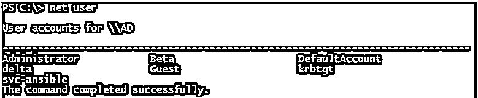
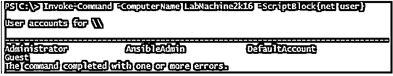
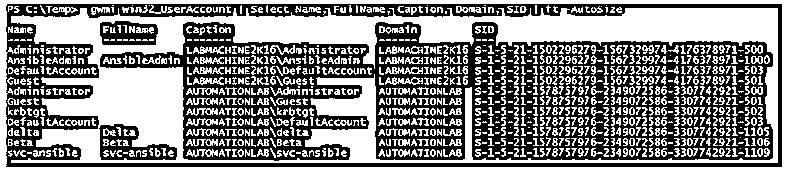
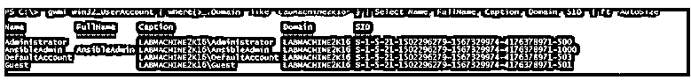
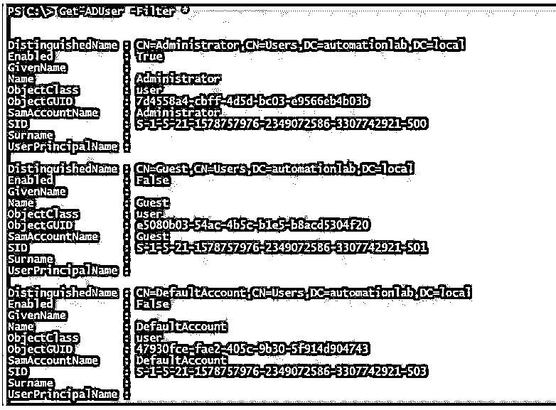
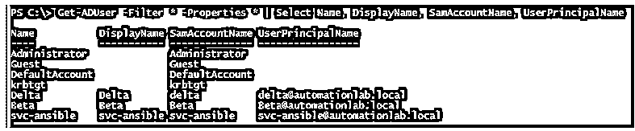

# PowerShell 用户列表

> 原文：<https://www.educba.com/powershell-user-list/>

## PowerShell 用户列表的定义

PowerShell 用户列表是一种从本地 windows 计算机或 active directory 用户中检索用户的方法，它使用特定的 cmdlets，如针对 windows 操作系统上的本地用户的 Get-LocalUser 和针对 active directory 用户的 Get-ADUsers，来检索用户详细信息，如可分辨名称(DN)、GUID、安全标识符(SID)、安全帐户管理器(SAM)或名称，并且可以导出到 CSV 或文本文件。

### 句法

PowerShell 用户列表的语法如下所示:

<small>Hadoop、数据科学、统计学&其他</small>

**Get-LocalUser 语法:**

`Get-LocalUser
[[-Name] <String[]>] [<CommonParameters>] Get-LocalUser
[[-SID] <SecurityIdentifier[]>] [<CommonParameters>]`

**Get-ADUser 语法:**

`Get-ADUser
[-AuthType <ADAuthType>] [-Credential <PSCredential>] -Filter <String>
[-Properties <String[]>] [-ResultPageSize <Int32>] [-ResultSetSize <Int32>] [-SearchBase <String>] [-SearchScope <ADSearchScope>] [-Server <String>] [<CommonParameters>]`

`Get-ADUser
[-AuthType <ADAuthType>] [-Credential <PSCredential>] [-Identity] <ADUser>
[-Partition <String>] [-Properties <String[]>] [-Server <String>] [<CommonParameters>]`

`Get-ADUser
[-AuthType <ADAuthType>] [-Credential <PSCredential>] -LDAPFilter <String>
[-Properties <String[]>] [-ResultPageSize <Int32>] [-ResultSetSize <Int32>] [-SearchBase <String>] [-SearchScope <ADSearchScope>] [-Server <String>] [<CommonParameters>]`

在 Get-ADUser 语法中，可以使用任意组合集，对于 Get-LocalUser 帐户也是如此。不能在 Get-ADUser cmdlet 中同时使用-Filter 和-Identity 属性，也不能在 Get-LocalUser cmdlet 中同时使用-Name 和-SID 属性。

我们还可以使用 WMI 或 CIMInstance 类 Win32_UserAccount 从本地或远程计算机检索本地用户的详细信息。此外，cmd 中的“Net User”命令也有助于检索本地用户列表。

### 如何在 PowerShell 中列出用户？

有多种方法可以通过使用本机命令在 PowerShell 中列出用户，如 Get-LocalUser(从本地计算机或远程计算机检索本地用户帐户详细信息)或 Get-ADUser(从 Active Directory 域检索用户)。

Get-LocalUser 命令是 PowerShell 5.1 中引入的，它是 Microsoft 的一部分。LocalAccounts 模块。在早期的 PowerShell 版本中，要检索用户列表，您要么需要下载本地帐户模块，要么需要使用 cmd 命令，如 Net User(仍然有效)或 WMI 方法类 Win32_UserAccount。

如果您正在远程处理旧版本的 PowerShell 计算机，那么 Get-LocalUser 命令将无法在那里工作。当您在域控制器上运行本地用户命令时，它会为您提供活动目录用户，因为 DC 没有本地用户。

### PowerShell 用户列表示例

下面是一些例子:

#### 示例#1:使用 Cmd 获取本地用户帐户列表

我们可以使用“**Net User**”cmd 命令从 cmd 或 PowerShell 中检索用户列表。

`net user`

**输出:**

*   要从远程计算机获取本地用户列表，请在 PowerShell 中使用 Invoke-Command，

`Invoke-Command -ComputerName LabMachine2k16 -ScriptBlock { net user}`

**输出:**

以上输出来自远程计算机 **LabMachine2k16。**

#### 示例 2:使用 Wmi 方法检索本地用户

我们可以使用 WMI 方法或 CIM 实例方法类 Win32_UserAccount 来检索用户列表。

`gwmi win32_UserAccount | Select Name, FullName, Caption, Domain, SID | ft -AutoSize`

**输出:**

*   要获得远程计算机上的本地用户详细信息，您需要添加 **-ComputerName**

`Invoke-Command -ComputerName LabMachine2k16 { gwmi win32_UserAccount} | Select Name, FullName, Caption, Domain, SID | ft -AutoSize`

也可以使用 **Get-CimInstance** 命令来代替 **gwmi** 方法。

您可以将输出文件导出为文本或 CSV 格式，如下所示。在下面的例子中，输出将被导出到**用户帐户。Csv** 文件。

`gwmi win32_UserAccount | Select Name, FullName, Caption, Domain, SID | Export-Csv C:\Temp\Useracccounts.csv -NoTypeInformation`

导出到文本文件中。

`gwmi win32_UserAccount | Select Name, FullName, Caption, Domain, SID | Out-File C:\temp\UserAccounts.txt`

如果您想检查特定用户或域用户列表，

`gwmi win32_UserAccount | where{$_.Domain -like "LabMachine2k16*"} | Select Name, FullName, Caption, Domain, SID  | ft -AutoSize`

**输出:**

*   要仅使用密码属性检索本地帐户，请使用以下命令，

`gwmi win32_useraccount | where{$_.LocalAccount -eq $true}  | Select Name, LocalAccount, PasswordChangeable, PasswordRequired`

#### 示例#3:检索 ADUsers 列表

要获得域用户列表，可以使用 Get-ADUser 命令。要运行此命令，您需要确保计算机上安装了 RSAT(远程服务器管理工具)。

`Get-ADUser -Filter *`

上述命令将从 active directory 域中获取所有用户。

*   要公开用户的所有属性，可以使用**-属性**

`Get-ADUser -Filter * -Properties *`

*   要过滤特定的属性，

`Get-ADUser -Filter * -Properties * | Select Name, DisplayName, SamAccountName, UserPrincipalName`

**输出:**

*   要获取帐户**被禁用**的用户列表，并将其导出到 CSV 文件，请使用下面的命令。

`Get-ADUser -Filter * | where {$_.Enabled -eq $false} | Export-Csv C:\DisabledUserAccounts.csv -NoTypeInformation`

*   要获得特定用户帐户的详细信息，

`Get-ADUser -Identity beta -Properties *`

您需要在-Identity 参数中使用 SamAccountName 属性。

*   要从特定的组织单位(OU)中检索用户，请使用以下命令。

`Get-ADUser -Filter * -Properties * | where{$_.DistinguishedName -like "*CN=Users*"} | Select Name, DisplayName, userPrincipalName, SAMAccountName`

*   检索 active directory 域中密码已过期或设置为永不过期的用户列表，并在输出中显示密码属性。
*   检索过期的密码用户帐户。

`Get-ADUser -Filter * -Properties * | where{$_.PasswordExpired -eq $true} | Select Name, SAMAccountName, PasswordExpired, PasswordLastSet`

*   检索密码永不过期的用户帐户。

`Get-ADUser -Filter * -Properties * | where{$_.PasswordNeverExpires -eq $true} | Select Name, SAMAccountName, PasswordNeverExpires`

### 结论

如本文所述，PowerShell 使用各种命令从 windows 计算机或 active directory 域中检索用户列表，这对管理员的审核和清理任务很有帮助。您可以使用任务计划程序每月向管理员发送电子邮件，获取已创建、已过期和即将过期的帐户列表。

### 推荐文章

这是 PowerShell 用户列表指南。在这里，我们还将讨论 PowerShell 用户列表的定义和语法，以及不同的示例和代码实现。您也可以看看以下文章，了解更多信息–

1.  [PowerShell 环境变量](https://www.educba.com/powershell-environment-variable/)
2.  [PowerShell 写入控制台](https://www.educba.com/powershell-write-to-console/)
3.  [PowerShell ZIP](https://www.educba.com/powershell-zip/)
4.  [PowerShell 多行字符串](https://www.educba.com/powershell-multiline-string/)

