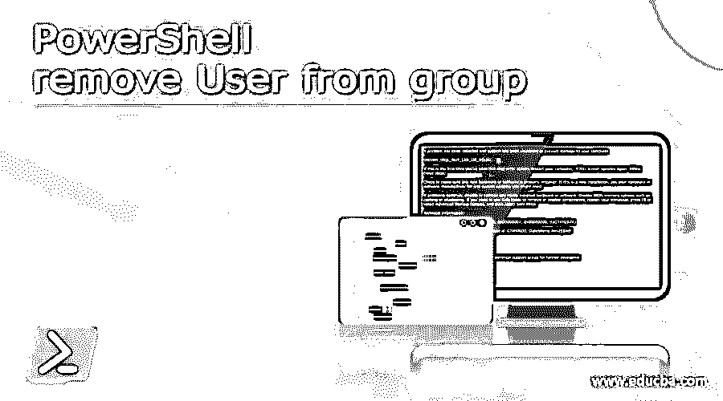

# PowerShell 从组中删除用户

> 原文：<https://www.educba.com/powershell-remove-user-from-group/>

## PowerShell 简介从组中删除用户

当用户离开组织或不再需要成为本地组或 active directory 组的一员时，通常需要从该组中删除用户。手动移除它们可能会很累，并且在大量移除的情况下，这是非常困难的，并且需要极大的注意力。为了克服这个问题，PowerShell 中有 cmdlets 可以从本地组和 AD 组中删除用户。本文将详细介绍这些 cmdlets 以及适当的示例。

**删除-本地组成员:**

<small>Hadoop、数据科学、统计学&其他</small>

此 cmdlet 用于从提到的本地组中删除成员。

**语法:**

**输入:**

`Get-Help -Name Remove-LocalGroupMember
NAME
Remove-LocalGroupMember
Syntax:
Remove-LocalGroupMember [-Group] <LocalGroup> [-Member] <LocalPrincipal[]> [-WhatIf] [-Confirm][<CommonParameters>] Remove-LocalGroupMember [-Name] <string> [-Member] <LocalPrincipal[]> [-WhatIf] [-Confirm] [<CommonParameters>] Remove-LocalGroupMember [-SID] <SecurityIdentifier> [-Member] <LocalPrincipal[]> [-WhatIf] [-Confirm][<CommonParameters>] ALIASES
rlgm`

**参数:**

**-确认:**

这在继续执行之前要求客户确认。参数的数据类型是 switch。其假定名称为 cf，默认值为 False。它不承认管道输入，而且不允许使用通配符。

**-组:**

这表示需要从中删除用户或组的组名。此参数的数据类型是 Microsoft . powershell . commands . local group。这是一个必需的参数。默认值为无。它不接受管道输入，而且不允许使用通配符。

**-成员:**

此参数包含应从所需组中删除的成员。它可以是用户列表、组名、SID 集。这是一个强制参数。此参数的数据类型是 Microsoft。PowerShell . commands . local principal[]。它的位置值是 1。默认值为无。它接受管道输入，但也不允许使用通配符。

**-名称:**

这指定了需要从中删除成员的组。此参数的数据类型是字符串。无是默认值。不接受管道输入，也不允许使用通配符。

**-SID:**

这表示需要删除成员的组的安全性。此参数的数据类型是 SecurityIdentifier。此参数在此 cmdlet 中的位置是 0。它没有任何默认值。默认值为无。它不接受管道输入，而且不允许使用通配符。

**-假设:**

这让用户知道如果运行此 cmdlet 会发生什么结果。此参数的数据类型是 switch。别名是 wi。False 是其默认值。它不接受管道输入，而且不允许使用通配符。

**Remove-ADGroupMember:**

这用于从 active directory 组中删除成员。

**语法:**

remove-adgroup member[-what if][-Confirm][-AuthType<adauthtype>][-Credential<pscredential>][-Identity】<adgroup>[-Members】<adprincipal>[-Partition<string>][-PassThru][-Server<string>][-DisablePermissiveModify][<commonparameters>]</commonparameters></string></string></adprincipal></adgroup></pscredential></adauthtype>

**参数:**

**-认证类型:**

这暗示了用于从广告组中移除项目的认证。它可以是协商(0)或基本(1)。默认情况下，使用协商。基本策略需要建立 SSL 关联。此参数的信息排序是 ADAuthType。默认的尊重是无。管道输入不被确认，而且不允许使用通配符。

**-确认:**

每当运行 cmdlet 之前需要用户确认时，都会使用此参数。别名为 cf，该参数的数据类型为 cf，默认值为 False。不接受管道输入，也不允许使用通配符。

**-凭证:**

这指示将在其下运行 cmdlet 的凭据。默认情况下，会考虑当前用户的简档。如果 cmdlet 是从驱动器运行的，则使用驱动器帐户。此参数的数据类型是 PSCredential。无是默认的尊重。它不承认管道输入，也不允许使用通配符。

**-DisablePermissiveModify:**

这可以防止系统在尝试将现有用户添加到组时引发错误。此参数的数据类型是 switch。默认值为 false。它不接受管道输入，也不允许使用通配符。

**-成员:**

这可以是一组需要从 AD 组中删除的用户、组或对象。它可以将以下各项作为值:DN、安全标识符、SAM 帐户名和 GUID。此参数的数据类型为 ADPrincipal[]。“无”为默认值。它不接受管道输入，也不允许使用万用字元。

**-分区:**

这表示 AD 分区的可分辨名称。在 AD 中，在下列情况之一下设置默认值。如果 identity 参数被分配了一个 DN，那么分区名直接从 DN 生成。如果 cmdlets 是从 AD 驱动器运行的，则分区的值是从驱动器的当前路径派生的。如果上述两种情况中的任何一种都不匹配，则使用目标域值作为分区的值。数据类型是字符串。无是默认的尊重。它不接受管道输入，也不允许使用通配符。

 **这不会生成任何输出。它通常返回我们试图移除的项目的对象。数据类型是切换。无是默认的尊重。它不接受管道输入，也不允许使用通配符。

### 例子

**输入:**

`Write-Host "Example of removing users from an AD group" -ForegroundColor Green
Import-Csv “C:\test\test.csv” | ForEach-Object {
$iden= $_.Identity
$mem=$_.Member
Remove-ADGroupMember -Identity $iden -Members $mem
Write-Host "Member got successfully removed from the AD group" -ForegroundColor Green
}
Write-Host "Removing users from a local admin group" -ForegroundColor Green
Import-Csv “C:\test\test1.csv” | ForEach-Object {
$grp= $_.GroupName
$mem1=$_.MemName
Remove-LocalGroupMember -Group $grp -Member $mem1
Write-Host "Member got successfully removed from the local admin group" -ForegroundColor Green
}`

**输出:**

### 结论–PowerShell 从组中删除用户

因此，本文详细解释了从本地管理组和 AD 组中删除用户的两种方法，并给出了相应的示例。还介绍了各种参数和从组中删除批量用户。要了解更多细节，建议编写示例脚本并练习它们。

### 推荐文章

这是 PowerShell 从组中删除用户的指南。这里我们讨论简介、语法和各种参数。您也可以看看以下文章，了解更多信息–

1.  [PowerShell 多行字符串](https://www.educba.com/powershell-multiline-string/)
2.  [PowerShell 批处理文件](https://www.educba.com/powershell-batch-file/)
3.  [PowerShell do while](https://www.educba.com/powershell-do-while/)
4.  [PowerShell 字典](https://www.educba.com/powershell-dictionary/)

**