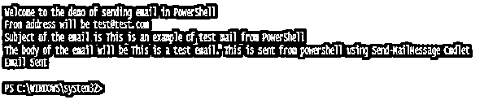
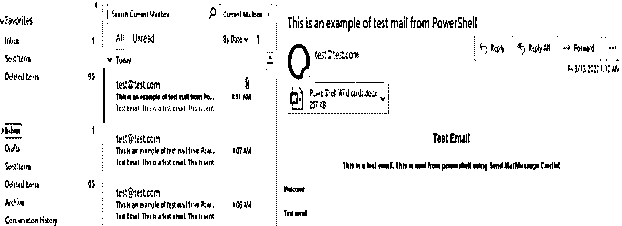

# PowerShell 发送邮件

> 原文：<https://www.educba.com/powershell-send-mail/>

## PowerShell 发送邮件简介

若要从 PowerShell 发送电子邮件，请使用 Send-MailMessage Cmdlet。很多时候，管理员可能需要运行一个脚本来生成一些报告，如上次重启时间、服务器在过去 24 小时内关闭了多少次等。在这种情况下，必须向管理员发送包含报告的电子邮件。为此，使用 Send-MailMessage cmdlet。此 cmdlet 的主要参数是 SMTP 服务器。环境中必须配置有效的 SMTP 服务器，以便能够发送和接收电子邮件。如果没有提到 SMTP 服务器，PowerShell 将采用$PSEmailServer 变量中设置的变量。

### 语法和参数

下面我们将看到语法和参数

<small>Hadoop、数据科学、统计学&其他</small>

#### 句法

下面是语法

**代码:**

`NAME
Send-MailMessage
SYNTAX
Send-MailMessage [-To] <string[]> [-Subject] <string> [[-Body] <string>] [[-SmtpServer] <string>] -From <string> [-Attachments <string[]>] [-Bcc <string[]>] [-BodyAsHtml] [-Encoding <Encoding>] [-Cc <string[]>] [-DeliveryNotificationOption {None | OnSuccess | OnFailure | Delay | Never}] [-Priority {Normal | Low | High}] [-Credential <pscredential>] [-UseSsl] [-Port <int>]  [<CommonParameters>] ALIASES`

#### 因素

以下是参数:

*   **附件:**该参数表示需要作为附件添加到待发送邮件中的文件。它的类型是字符串。它的别名是 PSPath。默认值为无。它接受管道输入，但不接受通配符。
*   **密件抄送:**这表示收件人的电子邮件地址，他们将收到电子邮件，但不会被直接标记。它的类型是字符串。其默认值为无。它接受管道输入，但不接受通配符。
*   **正文:**这表示电子邮件的正文。它的类型是字符串。其默认值为无。它接受管道输入，但不接受通配符。
*   **bodyashhtml:**这表示要转换为 Html 的消息正文。它的类型是开关参数。它的别名是 BAH。其默认值为无。它接受管道输入，但不接受通配符。
*   **抄送:**表示应该收到该邮件抄送的收件人。它的类型是字符串。其默认值为无。它接受管道输入，但不接受通配符。
*   **凭据:**这表示应该用于 send-mailmessage cmdlet 的凭据。默认情况下，采用当前用户凭据。它的类型是 PSCredential。其默认值是当前用户。它接受管道输入，但不接受通配符。
*   **DeliveryNotificationOption:**表示发送邮件的通知状态。它可以是多个值。它的别名是 DNO。其默认值为无。指定的地址将收到通知。它接受管道输入，但不接受通配符。允许的值有
*   **无:**这意味着不发送通知。
*   **OnSuccess:** 这表示如果邮件发送成功，将发送通知。
*   **Onfailure:** 如果邮件没有送达，它会发送一个通知。
*   **延迟:**如果电子邮件发送延迟，它会发送通知。
*   **从不:**表示任何通知。

**编码:**表示编码类型。可接受的值如下:

*   美国信息交换标准代码
*   设备原产商
*   统一码
*   UTF7
*   UTF8
*   UTF8BOM 表
*   UTF8NoBOM
*   UTF32

它的类型是编码，别名是 BE。默认值是 UTF8NoBOM。它接受管道输入，但不接受通配符。

*   **From:** 这是一个强制参数，表示电子邮件中应该包含的地址。这表示发送者。它的类型是字符串。其默认值是当前用户。它接受管道输入，但不接受通配符。
*   **端口:**表示 SMTP 服务器的端口号。默认情况下是 25。它的类型是 Int32。它接受管道输入，但不接受通配符。
*   **优先级:**表示邮件的优先级。默认值是 normal。其他可接受的值是高和低。它的类型是 MailPriority。它接受管道输入，但不接受通配符。
*   **回复:**这表示除了发件人地址之外，收件人可以回复的电子邮件地址。它的类型是字符串，默认值是 none。它接受管道输入，但不接受通配符。
*   **SMTPServer:** 这表示 SMTP 服务器。默认值是$PSEmailServer 环境变量中的值。其类型为 string，别名为 ComputerName。它接受管道输入，但不接受通配符。
*   **主题:**这表示电子邮件的主题。这是一个强制参数。它的类型是字符串。它的别名是 sub。默认值为无。它接受管道输入，但不接受通配符。
*   **To:** 表示收件人的地址。这是一个强制参数。允许多个地址，并用“；”分隔.它的类型是字符串，默认值是 none。它接受管道输入，但不接受通配符。它接受管道输入，但不接受通配符。
*   **UseSsl:** 用于邮件的安全传输。它的类型是开关参数。其默认值为无。它接受管道输入，但不接受通配符。

### 实现 PowerShell 发送邮件的示例

在下面的脚本中，请用适当的值修改发件人地址($from)、收件人地址($to)、smtp 服务器($SmtpServer)和附件路径($testattachment)。

**代码:**

`Write-Host "Welcome to the demo of sending email in PowerShell"
$from="test@test.com"
Write-Host "From address will be" $from
$to="************"
$subject="This is an example of test mail from PowerShell"
Write-Host "Subject of the email is" $subject
$body="This is a test email. This is sent from powershell using Send-MailMessage Cmdlet"
Write-Host "The body of the email will be" $body
$SmtpServer = "***********"
$html=""
$actualbody = "<html>

<body>
<h1 align=""center"">Test Email</h1>
<h3 align=""center"">$body</h3>

Welcome

Test email
 " + $html
$testattachment="C:\Users \Desktop\Articles\Mar\PowerShell Wild cards.docx"
Send-MailMessage -From $from -to $to -Subject $subject -SmtpServer $SmtpServer -Body $actualbody -BodyAsHtml -Encoding ([System.Text.Encoding]::UTF8)
Write-Host "Email Sent"`

**输出:**

下面是收到的电子邮件的样子。

### 结论

因此，本文详细介绍了如何借助 Send-MailMessage Cmdlet 从 PowerShell 发送电子邮件。它解释了所需的不同参数及其类型，并展示了如何发送电子邮件的示例脚本。需要的最重要的参数是 SMTP 服务器，除非配置了 SMTP 服务器，否则不会发送电子邮件。通过编写示例脚本，可以探索更多地了解 cmdlet 的方法。

### 推荐文章

这是 Powershell 发送邮件的指南。在这里，我们讨论 Powershell Send Mail 的介绍以及语法和参数，并附有示例。您也可以浏览我们的其他相关文章，了解更多信息——

1.  [PowerShell 获取项目](https://www.educba.com/powershell-get-item/)
2.  [PowerShell Grep](https://www.educba.com/powershell-grep/)
3.  [PowerShell 转换为字符串](https://www.educba.com/powershell-convert-to-string/)
4.  [PowerShell 别名](https://www.educba.com/powershell-alias/)
5.  [PowerShell 获取服务指南](https://www.educba.com/powershell-get-service/)

