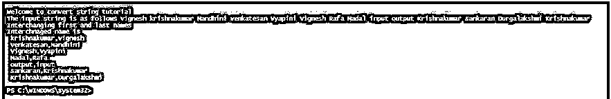
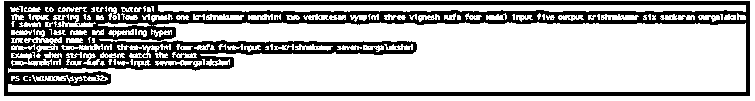
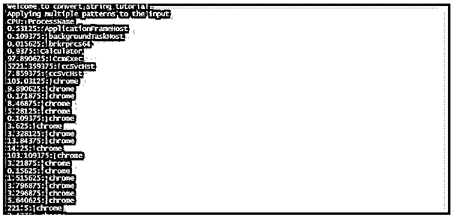
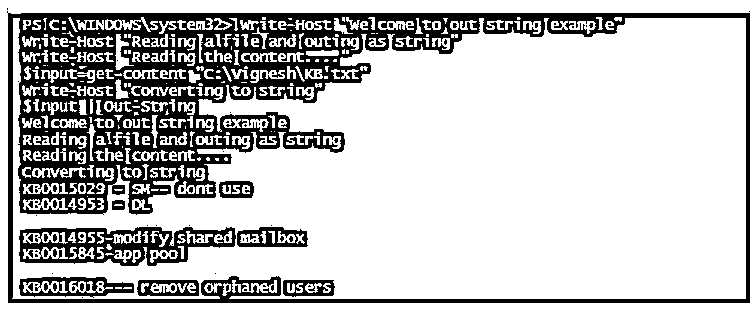
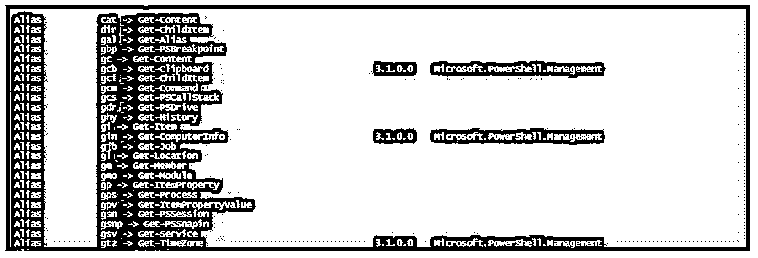
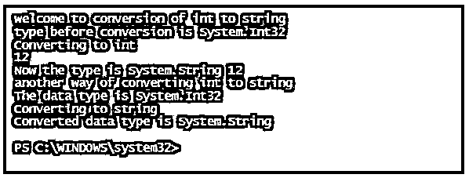
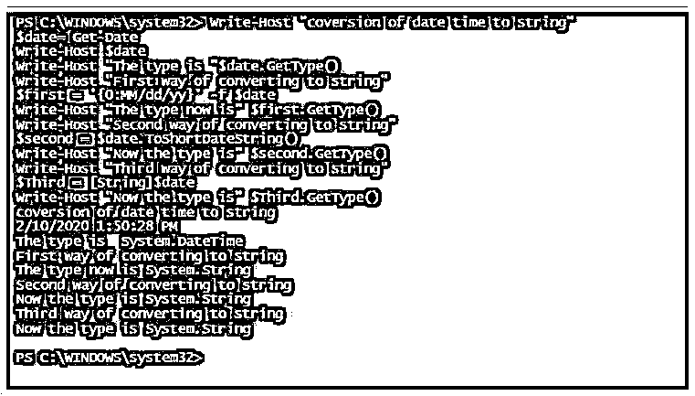

# PowerShell 转换为字符串

> 原文：<https://www.educba.com/powershell-convert-to-string/>

## PowerShell 转换为字符串概述

最常用的字符串操作之一是交换用户的名和姓。也就是说，姓氏必须排在第一位，然后是名字。为了实现这些功能，使用了 PowerShell 中的 Convert-String cmdlet。convert-string cmdlet 最初是在 PowerShell 版中引入的。它也是最被用户低估和探索的 cmdlets 之一。convert-string cmdlet 的用途是它可以根据用户给出的示例格式化字符串。cmdlet 从用户处获取一个样本输入，然后以与输入相同的模式格式化输出。

### 句法

下面是语法:

<small>Hadoop、数据科学、统计学&其他</small>

`NAME
Convert-String
SYNTAX
Convert-String -InputObject <string> [-Example <List[psobject]>] [<CommonParameters>] ALIASES
None`

**上述语法的解释:**

这表示必须产生输出的样本格式。源模式在等号(=)的左边指定，右边表示目标格式。或者，可以使用属性前后的哈希表类型来格式化字符串。必须仔细观察，等号后面不要留空格。它的类型是 PowerShell 对象的一般列表。它的别名是 e。默认值是 none。它不接受管道输入，也不允许使用通配符。

### 转换为字符串的参数

下面是转换为字符串的不同参数:

#### 1.-输入对象

这表示要格式化的输入字符串。它的类型是字符串。默认值为无。它接受管道输入，但不允许使用通配符。

##### 示例#1

**代码:**

`Write-Host "Welcome to convert string tutorial"
$input=@("vignesh krishnakumar", "Nandhini venkatesan", "Vyapini Vignesh", "Rafa Nadal", "input output", "Krishnakumar sankaran", "Durgalakshmi Krishnakumar")
Write-Host "The input string is as follows" $input
Write-Host "Interchanging first and last names"
write-host "Interchnaged name is"
$input | Convert-String -Example "one two= two,one"`

**输出:**

##### 实施例 2

**输入:**

`Write-Host "Welcome to convert string tutorial"
$input=@("vignesh one krishnakumar", "Nandhini two venkatesan", "Vyapini three Vignesh", "Rafa four Nadal", "input five output", "Krishnakumar six sankaran", "Durgalakshmi seven Krishnakumar")
Write-Host "The input string is as follows" $input -ForegroundColor Yellow
Write-Host "Removing last name and appending hypen"
write-host "Interchnaged name is"
$output=$input | Convert-String -Example "one three two=three-one"
Write-Host $output -ForegroundColor Yellow
Write-Host "Example when strings doesnt match the format"
$input=@("vignesh krishnakumar", "Nandhini two venkatesan", "Vyapini Vignesh", "Rafa four Nadal", "input five output", "Krishnakumar sankaran", "Durgalakshmi seven Krishnakumar")
$output=$input | Convert-String -Example "one three two=three-one"
Write-Host $output -ForegroundColor Yellow`

**输出:**

##### 实施例 3

**输入:**

`Write-Host "Welcome to convert string tutorial"
Write-Host "Applying multiple patterns to the input"
$SamplePatterns = @(
@{before='"one","two"'; after='two: one'},
@{before='"world","1"'; after='1: world'},
@{before='"one-two","22"'; after='22: one-two'},
@{before='"hi hello","333"'; after='333: hi hello'}
)
$input = Get-Process  | Select-Object -Property ProcessName, CPU | ConvertTo-Csv -NoTypeInformation
$input | Convert-String -Example $SamplePatterns`

**输出:**

#### 2.串外

此 cmdlet 用于将 PowerShell 对象转换为字符串。

**语法:**

`NAME
Out-String
SYNTAX
Out-String [-Stream] [-Width <int>] [-InputObject <psobject>] [<CommonParameters>] ALIASES
None`

### 串外参数

以下是 out-string 的不同参数:

#### 1.-输入对象

它表示要转换为字符串的对象。它可以是保存对象的变量、表达式或返回对象的 cmdlet。它的类型是 PS 对象。默认值为无。它接受管道字符，但不接受通配符。

#### 2.-非新的

它表示不被添加的换行符，如果字符串对象包含换行符，那么这些换行符不会被删除。它的类型是一个开关参数。默认值为无。它不接受管道字符，也不接受通配符。

#### 3.-溪流

它表示在输出中为每个对象发送一个单独的字符串。它的类型是一个开关参数。默认值为 false。它不接受管道字符，也不接受通配符。

#### 4.-宽度

它表示应该出现在输出中的字符数，多余的字符将被截断。字符的默认值是 80。默认值为无。它不接受管道字符，也不接受通配符。

##### 示例#1

**输入:**

`Write-Host "Welcome to out string example"
Write-Host "Reading a file and outing as string"
Write-Host "Reading the content...."
$input=get-content "C:\Vignesh\KB.txt"
Write-Host "Converting to string"
$input | Out-String`

**输出:**

##### 实施例 2

**输入:**

`Write-Host "Welcome to out string example"
Write-Host "find all the alias with get"
get-alias | out-string -stream | select-string "Get-"
Write-Host "find all the alias with set"
get-alias | out-string -stream | select-string "Set-"
Write-Host "find all the alias with write"
get-alias | out-string -stream | select-string "Write-"
Write-Host "find all the alias with Out"
get-alias | out-string -stream | select-string "Out-"`

**输出:**

##### 实施例 3

**输入:**

`Write-Host "welcome to conversion of int to string"
$int= 12
Write-Host "type before conversion is" $int.GetType()
Write-Host "Converting to int"
Write-Host $int
$new=$int.ToString()
Write-Host "Now the type is" $new.GetType() $new
Write-Host "another way of converting int to string"
$number=1654
Write-Host "The data type is" $number.GetType()
Write-Host "Converting to string"
$str=[String]$number
Write-Host "Converted data type is" $str.GetType()`

**输出:**

##### 实施例 4

**输入:**

`Write-Host "coversion of date time to string"
$date= Get-Date
Write-Host $date
Write-Host "The type is "$date.GetType()
Write-Host "First way of converting to string"
$first = '{0:MM/dd/yy}' -f $date
Write-Host "The type now is" $first.GetType()
Write-Host "Second way of converting to string"
$second = $date.ToShortDateString()
Write-Host "Now the type is" $second.GetType()
Write-Host "Third way of converting to string"
$Third = [String]$date
Write-Host "Now the type is" $Third.GetType()`

**输出:**

### **结论**

因此，本文详细介绍了 Convert-String cmdlet。它还展示了如何使用 cmdlet 及其相关参数的各种示例。本文还详细介绍了 Out-String cmdlet、相关参数以及适当的示例。本文还介绍了如何使用适当的方法并借助[类型转换](https://www.educba.com/what-is-type-casting/)将整数或日期时间对象转换为字符串变量。为了涵盖更多内容并详细学习，建议编写示例脚本并进行实践。

### 推荐文章

这是 PowerShell 转换为字符串的指南。这里我们详细讨论 PowerShell 转换为 String 的参数和示例的基本概念。您也可以看看以下文章，了解更多信息–

1.  [在 Java 中反转字符串](https://www.educba.com/reverse-string-in-java/)
2.  PowerShell 中的[字符串](https://www.educba.com/string-in-powershell/)
3.  [PowerShell 日期](https://www.educba.com/powershell-date/)
4.  [PowerShell ForEach 对象](https://www.educba.com/powershell-foreach-object/)

