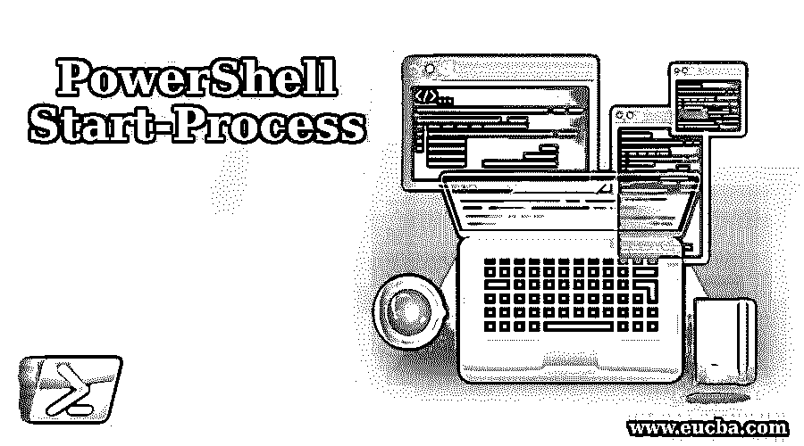
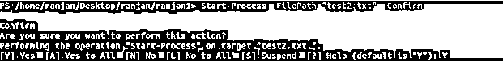

# PowerShell 启动进程

> 原文：<https://www.educba.com/powershell-start-process/>

## PowerShell 启动流程简介

很多时候，当我们使用进程和文件系统时，我们需要某种方法来处理文件的打开、写入和执行。来自命令的 exe 文件。Start-Process 命令允许我们通过命令行打开进程。它有能力捕获任何提到的文件中的错误或命令输出，或者从任何提到的文件中读取输入。除了简单地打开任何进程，它还允许更多的功能，例如，我们可以使用开始进程来定义一些替代方法

*   获取或加载用户(如果未传递任何内容，将获取当前用户配置文件详细信息)配置文件详细信息，
*   允许在新窗口中以各种格式(正常、最小化、最大化等)启动一个新进程。以简单的方式，它定义了一个新进程的窗口状态
*   凭据的替代选项。如果我们不提及凭证部分，那么它将读取当前用户凭证

### 语法和参数

PowerShell 启动进程的语法如下所示:

<small>Hadoop、数据科学、统计学&其他</small>

**语法#1** :

`Start-Process
[-FilePath] <String>
[[-ArgumentList] <defines string parameters value>] [-Credential <related to permission for the user to run the command, it can be PSCredential
also>] [-WorkingDirectory <string value of working directories >] [-LoadUserProfile<Here it will load user profile>] [-NoNewWindow] [-PassThru<Holds the details of process like process id etc>] [-RedirectStandardError <string path  of file where error will be written>] [-RedirectStandardInput <string path of file from where input will be read>] [-RedirectStandardOutput <string path of file to where output will be written>] [-WindowStyle <Allow us to open in various formats like normal ,maximized and minimized>] [-Wait<wait for previous input processing>] [-UseNewEnvironment] [-WhatIf<display what happen on execution of command>] [-Confirm<display a confirmation before execution of command>] [<CommonParameters>]`

**语法#2** :

`Start-Process
[-FilePath] <String>
[[-ArgumentList] <defines parameters value>] [-WorkingDirectory <String>] [-PassThru] [-Verb <String>] [-WindowStyle <ProcessWindowStyle>] [-Wait<wait for previous input processing>] [-WhatIf<display what happen on execution of command>] [-Confirm<display a confirmation before execution of command>] [<CommonParameters>]`

#### 因素

PowerShell 启动进程的参数。

*   **ArgumentList:** 定义命令启动时将使用的参数值。我们也可以在参数之间使用空格，这是我们唯一需要注意的地方，在这种情况下，我们应该将参数放在转义的双引号中。
*   **确认:**它的名字很明确的规定了它的意思。在您运行命令之前，它会提示您进行确认，以便从您的角度进行确认。
*   **Credential:** 它用于安全目的，它定义了有权限运行命令的用户。如果我们不为此命令传递参数，它将获取当前用户的凭据。
*   **FilePath:** 定义将在进程中运行的程序的替代路径和文件名。这里我们需要传递目录和文件名(用于处理的文件)，如果我们不提供路径或目录，它将使用当前工作目录和相同的文件名。
*   **LoadUserProfile:** 它将加载当前 Windows 用户的配置文件，该文件存储在 HKEY 用户注册表中。
*   **nonewindow:**它允许我们在当前的 Windows 控制台中运行一个新进程。请记住，如果我们不为此参数提供值，PowerShell 将始终打开一个新窗口。
*   **RedirectStandardError:** 它定义了一个文件。在这个命令的帮助下，我们可以将我们的命令生成的错误发送到一个文件中，这里我们需要提到捕获这个错误的文件名。因此，如果我们不提及该文件，它将在控制台上发送错误。
*   **RedirectStandardInput:** 假设您希望我们的流程从任何文件中读取输入，那么我们可以使用这个参数。在这个参数中，我们必须提到文件的路径，我们的命令将从这个路径读取输入。如果我们没有提到文件名，那么这个过程将从键盘输入的值中读取输入。
*   **RedirectStandardOutput:** 同样，如果我们想将流程生成的输出捕获到任何文件中，那么我们可以定义文件名和路径，流程的输出将被发布到上述文件中。如果我们不提及文件名，输出将显示在控制台屏幕上。
*   **UseNewEnvironment:** 该命令接受定义流程的任何新环境变量。如果我们不向该命令传递任何参数，它将获取当前计算机和用户的环境变量。
*   **Wait:** 假设您已经向命令中的流程传递了许多输入，在这种情况下，我们使用这个属性(Wait ),因为它将允许流程等待完成对先前输入的处理。
*   **WhatIf** :执行命令后会显示结果。此命令仅在 PowerShell 版本 6 或更高版本之后支持。
*   WindowStyle :它将允许我们根据自己在电脑上的方便程度，以各种格式打开一个新进程。它有几种格式，如正常，隐藏，最小化和最大化。我们需要这个命令，因为它为我们提供了各种打开流程并查看它们的方法。

### 实现 PowerShell 启动进程的示例

以下是 powershell 启动流程:

#### 示例#1

在下面的例子中，我们在 ranjan1 文件夹中，我们想在任何默认编辑器中打开一个名为 test2.txt 的文件。它通过打开文件来启动进程。这是一个简单的例子，我们只是打开一个给定的文件，请查看屏幕上的例子。

`Start-Process test2.txt`

**输出:**

它将打开指定的文本文件。

#### 实施例 2

这是一个基本示例，我们可以看到任何进程的创建和进程 id 为的进程的停止。这里，我们在名为-Passthru 的命令的帮助下捕获流程细节，该命令通常使用对象格式获取当前流程细节。在此示例中，变量$procDetails 包含已启动的进程的详细信息。我们可以通过编写$procDetails.id 从这个变量中获取进程 id，并且使用这个 id 我们可以对当前正在运行的进程执行任何操作。例如，下面我们用唯一的进程 id 来停止进程。qwfile 将被关闭。

`$procDetails = Start-Process test2.txt -Passthru
$procDetails.id`

**输出:**

停止-进程-id 9820

**输出:**

它将根据上面指定的 id 关闭文本文件。

#### 实施例 3

在本例中，我们使用–Confirm，我们可以看到，在执行下面的命令时，它首先询问是(Y)还是不是(N)，因此，如果我们输入 Y，它将打开文件，如果我们输入 N，它将不会打开文件。请按照屏幕上的命令操作。

`Start-Process -FilePath "test2.txt" --Confirm`

### 推荐文章

这是 PowerShell 启动过程指南。在这里，我们还将讨论 powershell 启动过程的介绍和语法，以及不同的示例和代码实现。您也可以看看以下文章，了解更多信息–

1.  [PowerShell 继续](https://www.educba.com/powershell-continue/)
2.  [PowerShell 发送邮件](https://www.educba.com/powershell-send-mail/)
3.  [PowerShell vs PowerShell ISE](https://www.educba.com/powershell-vs-powershell-ise/)
4.  [PowerShell 功能](https://www.educba.com/powershell-functions/)

