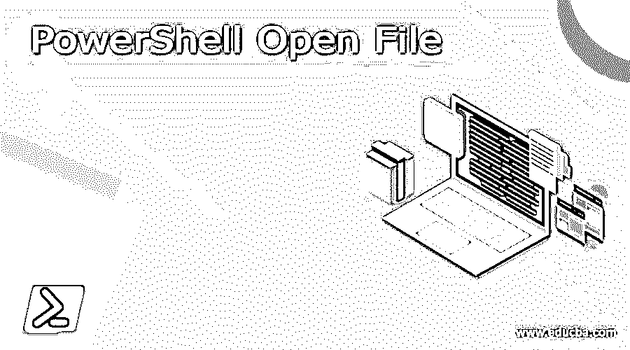
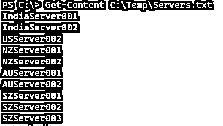
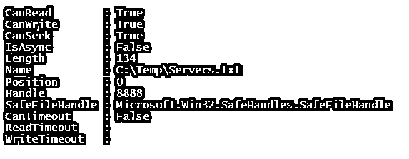
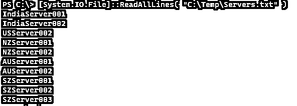
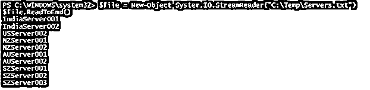
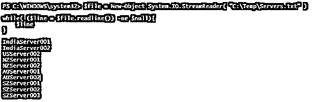

# PowerShell 打开文件

> 原文：<https://www.educba.com/powershell-open-file/>

## PowerShell 打开文件的定义

PowerShell 打开文件命令旨在使用 PowerShell cmdlet 或使用。Net 命名空间，一旦文件被打开，就可以通过读取单行或整个内容来从文件中读取内容，将内容写入文件，然后关闭文件，结束打开文件的运行过程，这些文件可以是各种类型，如文本、JSON、XML 等。

**语法:**

<small>Hadoop、数据科学、统计学&其他</small>

使用 Get-Content 打开并读取文件。

获取内容

`[-ReadCount <Int64>] [-TotalCount <Int64>] [-Tail <Int32>] [-Path] <String[]>
[-Filter <String>] [-Include <String[]>] [-Exclude <String[]>] [-Force] [-Credential <PSCredential>] [-Delimiter <String>] [-Wait] [-Raw] [-Encoding <Encoding>] [-AsByteStream] [-Stream <String>] [<CommonParameters>]`

获取内容

`[-ReadCount <Int64>] [-TotalCount <Int64>] [-Tail <Int32>] -LiteralPath <String[]>
[-Filter <String>] [-Include <String[]>] [-Exclude <String[]>] [-Force] [-Credential <PSCredential>] [-Delimiter <String>] [-Wait] [-Raw] [-Encoding <Encoding>] [-AsByteStream] [-Stream <String>] [<CommonParameters>]`

**使用文件。打开方法**

**a. Open(String，FileMode)**

用各种文件模式从指定的路径打开文件，后面会解释。

**b. Open(String，FileMode，FileAccess)**

使用各种文件模式和文件访问方法从指定路径打开文件。

**c. Open(String，FileMode，FileAccess，FileShare)**

从用指定的文件模式、文件访问权限和指定的共享选项指定的路径打开文件。

**使用文件 StreamReader 类。**

系统。IO.StreamReader("文件路径")

### PowerShell 中的打开文件命令是如何工作的？

当我们使用 Get-Content 方法时，我们可以从我们指定的路径读取文件，而当我们读取文件时，默认情况下 PowerShell 命令会打开一个文件并读取文件的内容。

`Get-Content C:\Temp\Servers.txt`

在使用系统时。IO 命名空间，我们可以使用它的类文件和它的方法 Open()如语法所示。

**a. Open(String，FileMode)**

String:它是打开其内容的文件的路径。

FileMode:下面是文件系统使用的文件模式。

*   Append:打开一个存在的文件或创建一个新文件。这需要追加权限 FileMode。Append 只能与 FileAccess.Write 一起使用。
*   Create:指定操作系统将创建一个新文件，如果存在，它将覆盖该文件，并且应该与 FileMode 一起使用。创建权限。
*   CreateNew:指定操作系统将创建一个新文件，如果存在，将抛出异常。
*   Open:指定操作系统将打开一个存在的文件，否则将抛出异常。
*   指定操作系统是否应该打开一个文件。如果文件存在，它将打开一个新文件，否则它将创建一个新文件。
*   Truncate:指定操作系统应打开现有文件。当文件被截断以使其大小为零字节时。

**b. Open(String，FileMode，FileAccess)**

String:要打开的文件的路径。

FileMode:如前面的语法所解释的。

FileAccess:下面是 FileAccess 方法。

*   读取:对文件的读取权限。可以从文件中读取数据。
*   读写:对文件的读写访问。可以从文件中写入和读取数据。
*   写:对文件的写访问权限。数据可以写入文件。

**C . Open(String，FileMode，FileAccess，FileShare)**

前面已经解释了字符串、文件模式和文件访问。我们将在这里提供关于文件共享的描述。

以下是支持的字段。

*   删除:允许删除文件。
*   可继承:使文件可继承。Win32 系统不支持这种情况。
*   无:拒绝文件共享。
*   Read:允许打开的文件进行读取，直到文件关闭。
*   ReadWrite 允许对打开的文件进行读写，直到文件被关闭。
*   Write:允许打开的文件进行写操作，直到文件关闭。

### 例子

#### 示例 1:使用 Get-Content 打开并读取文件。

`Get-Content C:\Temp\Servers.txt`

**输出:**

当您键入此命令时，它会打开文件进行读取，当文件读取成功时，它会关闭文件。
当您向文件中添加内容时，文件首先被打开，然后数据被写入文件。例如，如果 Servers.txt 文件正在使用中，则不能将服务器名称“AusServer001”添加到该文件中。

`"AUSServer001" | Add-Content -Path C:\Temp\Servers.txt -Force`

#### 例 2:用系统打开文件。IO 命名空间。

要打开文件进行操作，我们可以使用下面的命令。我们要打开的文件是 C:\temp 位置的 Servers.txt。

`[System.IO.File]::Open("C:\Temp\Servers.txt", [System.IO.FileMode]::Open)`

**输出:**

因此，当文件打开，当你试图打开或编辑文件，它会显示以下错误信息。

要在操作完成后关闭打开的文件，请使用 close()方法。

`$file = [System.IO.File]::Open("C:\Temp\Servers.txt", [System.IO.FileMode]::Open)
$file.Close()`

如上面的语法所示，除了打开，您还可以使用各种方法，如创建、创建新的、截断等。

例如，下面的命令将打开 Servers.txt(如果它存在),否则它将创建一个新文件。

`[System.IO.File]::Open("C:\Temp\Servers.txt", [System.IO.FileMode]::OpenOrCreate)`

用系统打开和读取文件的另一种方法。IO.File 命名空间是通过使用 ReadAllLines()命令实现的。

`[System.IO.File]::ReadAllLines( "C:\Temp\Servers.txt" )`

**输出:**

#### 示例 3:使用文件 StreamRead 打开并读取文件。

使用 filestream 方法，我们首先需要创建 FileStream。Net 命名空间，如下所示。

`$file = New-Object System.IO.StreamReader("C:\Temp\Servers.txt")`

您可以使用 ReadToEnd()方法读取该文件。

`$file.ReadToEnd()`

**输出:**

我们也可以使用 ReadLine()方法来读取文件，但是这个命令一次读取一行，所以我们需要使用循环来读取整个文件，如下所示。

`$file = New-Object System.IO.StreamReader( "C:\Temp\Servers.txt" )
while( ($line = $file.readline()) -ne $null){
$line
}`

**输出:**

### 结论

在写脚本时，有时我们需要处理文件。上述 cmdlets 和。Net 命令在使用脚本打开文件和读写文件内容时非常有用，当我们编写脚本来存储日志或事件时，这种方法非常有用。

### 推荐文章

这是 PowerShell 打开文件的指南。这里我们讨论简介，语法，参数，打开文件命令如何在 PowerShell 中工作？.您也可以看看以下文章，了解更多信息–

1.  [PowerShell 循环通过数组](https://www.educba.com/powershell-loop-through-array/)
2.  [PowerShell 多行字符串](https://www.educba.com/powershell-multiline-string/)
3.  [PowerShell 批处理文件](https://www.educba.com/powershell-batch-file/)
4.  [PowerShell do while](https://www.educba.com/powershell-do-while/)

