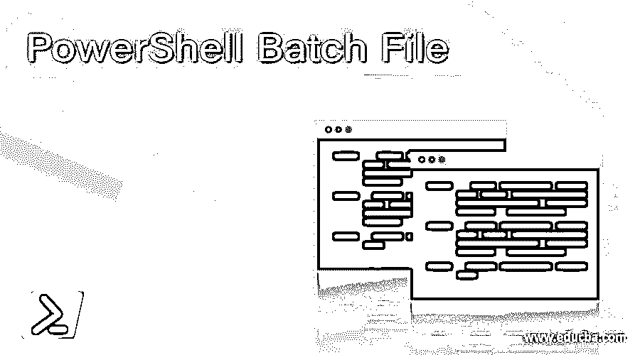
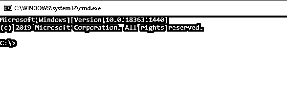
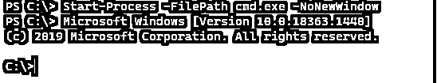
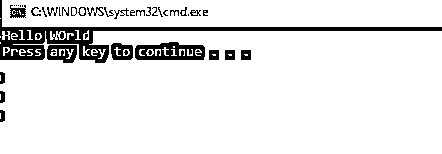
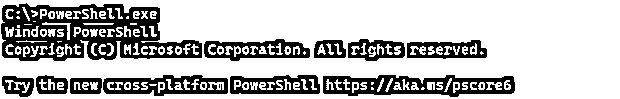
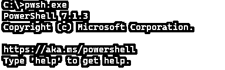
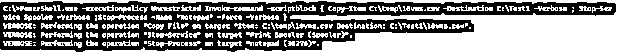

# PowerShell 批处理文件

> 原文：<https://www.educba.com/powershell-batch-file/>

## PowerShell 批处理文件的定义

批处理文件是 Windows 操作系统或 DOS 中的一系列命令或脚本，它可以一次运行一个或多个命令，并在本地或远程机器上执行一系列任务，它有一个. Bat 或。Cmd 扩展。虽然 PowerShell 和 Batch 是不同的语言，但两者都可以相互集成，帮助调用和执行彼此的任务。

**语法:**

<small>Hadoop、数据科学、统计学&其他</small>

要从批处理文件调用 PowerShell 脚本，我们可以在批处理文件中使用下面的语法。

`Powershell.exe -ExecutionPolicy Unrestricted -command "PowerShell file path"`

要从 PowerShell 脚本调用批处理文件，

`Start-Process -FilePath “BatchFilePath”`

要控制命令提示符的执行，

`Start-Process "cmd.exe " "/c Batch File Path"`

### 批处理文件在 PowerShell 中是如何工作的？

批处理文件是我们在命令提示符或 cmd.exe 中单独编写的一系列命令。它们使用不同于 PowerShell 的语法编写，并且在 Windows 操作系统上工作。

要简单地从 PowerShell 调用 cmd.exe，我们可以使用下面的命令。

`Start-Process -FilePath cmd.exe`

此命令将从 PowerShell 控制台打开新的命令提示符窗口。

如果使用-none window 参数，PowerShell 将仅在 PowerShell 控制台内启动 cmd.exe 进程，PowerShell 控制台将转换为 cmd 控制台，如下所示。

`Start-Process -FilePath cmd.exe -NoNewWindow`

**输出:**

类似地，如果我们有批处理文件，我们可以从 PowerShell 控制台调用它。
例如，我们有下面的批处理文件内容，文件名叫做 TestBatch.bat，我们需要使用 PowerShell 执行批处理文件。

**test patch . bat 文件:**

`@echo off
echo Hello WOrld
pause`

**调用批处理文件，**

`Start-Process -FilePath "C:\Temp\TestBatch.bat"`

**输出:**

在同一个控制台中使用-none ww window 参数。

`Start-Process -FilePath "C:\Temp\TestBatch.bat" -NoNewWindow`

**输出:**

在开始如何从批处理文件调用 PowerShell 文件之前，我们将使用如何从命令提示符窗口调用 PowerShell。

当 PowerShell 安装在机器上时，它会在环境变量中创建一个条目，以便您可以从 cmd 执行 PowerShell 和 PowerShell 核心版本。

举个例子，

要从 cmd 调用 PowerShell，只需键入 PowerShell，如下所示。

`PowerShell.exe`

**输出:**

要调用 PowerShell 核心版本(6.0 或更高版本)，请键入 Pwsh.exe。

`pwsh.exe`

**输出:**

如果正确安装和设置了 Powershell 版本，这是我们可以从 cmd 调用 PowerShell 进程的方法。

下一步，我们将在命令提示符下执行 PowerShell 命令。

`Powershell.exe -ExecutionPolicy Unrestricted -Command "Write-Output 'Hello from CMD'"`

**输出:**

在上面的示例中，我们使用 PowerShell.exe 调用 PowerShell，将执行策略设置为无限制，这样当我们运行该命令时，它就不会阻塞，并且第三次使用-Command 参数来写入输出。
现在我们有了上面提到的命令，我们可以把这个命令保存在一个批处理文件(TestPSBatch。Bat)并从 cmd 窗口执行它，它应该工作。

**TestPSBatch。蝙蝠文件:**

`@echo off`

`Powershell.exe -ExecutionPolicy Unrestricted -Command "Write-
Output 'Hello from CMD'"`

**执行批处理文件，**

`C:\Temp\TestPSBatch.bat`

**输出:**

您还可以通过双击该位置来直接执行该批处理文件。
在上面的例子中，我们如果在批处理文件中使用 Pwsh 而不是 PowerShell，那么它应该也能工作。

### 例子

让我们讨论 PowerShell 批处理文件的例子。

#### 示例#1:从批处理文件调用 PowerShell 脚本。

这已经讨论过了，要从批处理文件调用 PowerShell 脚本，我们可以使用下面的例子。假设我们有一个 PS 脚本，它将文件从源复制到目标，我们需要使用批处理文件来执行它。
这是我们需要使用批处理文件执行的 TestPS.ps1 内容。

`Copy-Item C:\Temp\envvariables.csv -Destination C:\Temp\Test\ -Verbose`

我们创建了一个批处理文件 copy.bat，其内容如下。

`@echo off
PowerShell.exe -ExecutionPolicy Unrestricted -File C:\temp\TestPS.ps1`

当我们执行复制时。但是它应该显示如下输出。

#### 示例#2:从 PowerShell 脚本调用批处理脚本

这个例子展示了我们如何从 PowerShell 调用批处理文件。

testbatch . bat 文件。

`@echo off
echo Hello WOrld`

我们需要执行 PowerShell 脚本来运行批处理文件。

`Start-Process -FilePath C:\Temp\TestBatch.bat -NoNewWindow`

**输出:**

执行 Testps.ps1 文件后，

要以管理员身份运行批处理脚本，请使用-Verb 参数。

`Start-Process -FilePath C:\Temp\TestBatch.bat -Verb Runas`

#### 示例#3:从批处理文件运行 PowerShell 命令

例如 1，我们还可以直接使用 cmd 中的批处理文件内容来运行 PowerShell 命令。但是，它是一个单行命令。比方说，如果我们想从 cmd 窗口运行多个 PowerShell 命令，这也是可能的。

在本例中，我们将复制文件，重新启动服务，并使用批处理文件终止记事本进程，该批处理文件执行 PowerShell 命令，如下所示。

`PowerShell.exe -executionpolicy Unrestricted Invoke-command -scriptblock { Copy-Item C:\temp\10vms.csv -Destination C:\Test1 -Verbose ; Stop-Service Spooler -Verbose ; Stop-Process -Name "Notepad" -Force -Verbose }`

**输出:**

要远程运行命令，我们需要提供如下所示的计算机名。它将在名为 TestMachine 的远程服务器上的 C:\CMDDir 路径下创建一个新目录。

`PowerShell.exe -executionpolicy unrestricted Invoke-Command -ComputerName TestMachine -scriptblock {New-Item C:\cmddir}`

#### 示例#4:从 PowerShell 运行批处理命令

要从 PowerShell 运行批处理命令，我们可以使用前面解释过的 Start-Process cmdlet，它在服务器上执行 cmd 命令。

`Start-Process "cmd.exe" '/c mkdir C:\cmddir' -NoNewWindow -Verbose`

以上命令在本地服务器上创建目录 cmddir。

### 结论

PowerShell 和批处理文件的组合非常有用，因为当批处理文件很容易执行时，很多时候新用户不知道如何运行 PowerShell。PowerShell 批处理文件对于第三方软件也很有用，比如 BladeLogic，它不直接支持 PowerShell 扩展，但是支持批处理文件。在这种情况下，我们可以运行批处理作业来远程执行 PowerShell 命令。

### 推荐文章

这是 PowerShell 批处理文件指南。这里我们讨论一下 PowerShell 中的介绍、语法、批处理文件是如何工作的？还有例子。您也可以看看以下文章，了解更多信息–

1.  [PowerShell 类操作员](https://www.educba.com/powershell-like-operator/)
2.  [PowerShell 在哪里](https://www.educba.com/powershell-where/)
3.  [PowerShell 卸载模块](https://www.educba.com/powershell-uninstall-module/)
4.  [PowerShell 匹配](https://www.educba.com/powershell-match/)

