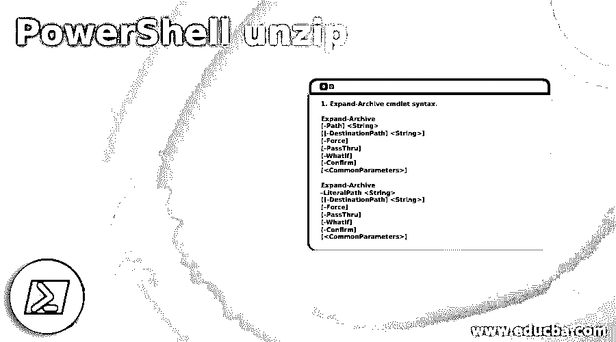
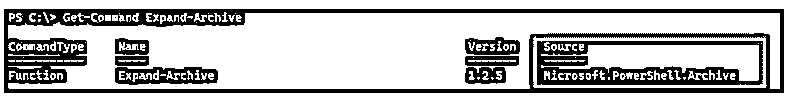
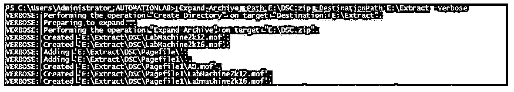
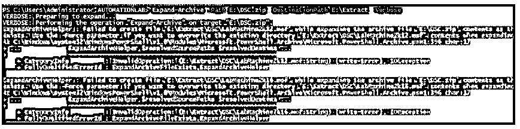
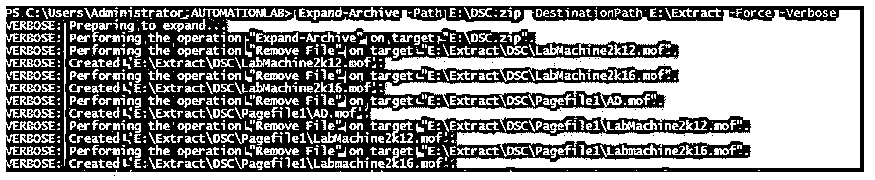
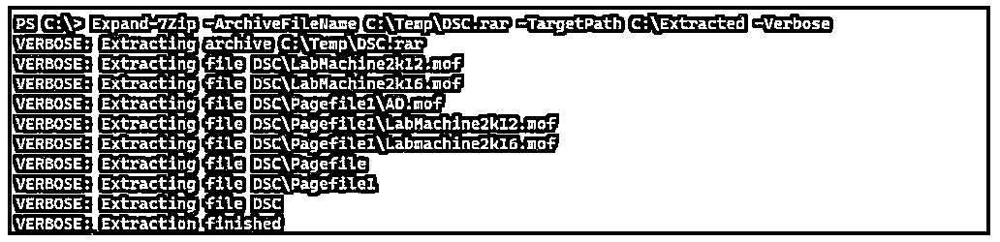

# PowerShell 解压缩

> 原文：<https://www.educba.com/powershell-unzip/>

## PowerShell 解压缩简介

PowerShell unzip 使用 Expand-Archive 命令或 System 命令从 zip 文件所在的同一路径或特定目标路径上的特定 Zip 文件中提取文件和文件夹。IO.Compression 命名空间来解压缩文件和文件夹。

### PowerShell 解压缩的语法

下面给出了提到的语法:

<small>Hadoop、数据科学、统计学&其他</small>

1.Expand-Archive cmdlet 语法

`Expand-Archive
[-Path] <String>
[[-DestinationPath] <String>] [-Force] [-PassThru] [-WhatIf] [-Confirm] [<CommonParameters>]`

`Expand-Archive
-LiteralPath <String>
[[-DestinationPath] <String>] [-Force] [-PassThru] [-WhatIf] [-Confirm] [<CommonParameters>]`

2.使用名称空间解压缩。

`[System.IO.Compression.ZipFile]::ExtractToDirectory(String, String)`

`[System.IO.Compression.ZipFile]::ExtractToDirectory(String, String, Boolean)`

`[System.IO.Compression.ZipFile]::ExtractToDirectory(String, String, Encoding)`

`[System.IO.Compression.ZipFile]::ExtractToDirectory(String, String, Encoding, Boolean)`

3.7ZIP 模块来提取归档内容。

`Expand-7Zip
[-ArchiveFileName] <string>
[-TargetPath] <string>
[-CustomInitialization <scriptblock>] [<CommonParameters>] Expand-7Zip
[-ArchiveFileName] <string>
[-TargetPath] <string>
[-Password <string>] [-CustomInitialization <scriptblock>] [<CommonParameters>] Expand-7Zip
[-ArchiveFileName] <string>
[-TargetPath] <string>
[-SecurePassword <securestring>] [-CustomInitialization <scriptblock>] [<CommonParameters>]`

### 解压缩命令在 PowerShell 中是如何工作的？

Expand-Archive 是一个内置命令，用于从 ZIP 文件中提取内容。此 cmdlet 不支持 RAR、7ZIP 等其他归档文件格式。

ZIP 实用程序命令(Compress-Archive 和 Expand-Archive)是名为 Microsoft.PowerShell.Archive 的 PowerShell 模块的一部分。

**代码:**

`Get-Command Expand-Archive`

**输出:**

对于源路径，PowerShell 使用任何路径或文字路径(如果您不想使用通配符)。您可以使用源和目标路径作为本地路径或 NAS 文件夹路径，并具有相应的读写权限。

如果您的系统中没有安装该模块，您可以从 PowerShell gallery 下载它。

[https://www.powershellgallery.com/packages/Microsoft.PowerShell.Archive/1.1.0.0](https://www.powershellgallery.com/packages/Microsoft.PowerShell.Archive/1.1.0.0)

其次，您可以使用。Net 命名空间[System。IO.Compression]，带有 ExtractToDirectory 方法的 ZipFile 类，在该类中，您可以提供 Zip 文件的源路径和目标路径来提取相同的内容。这个方法要求 IO.Compression.ZipFile.dll 应该出现在系统上。

第三，如果您的文件是 RAR、ISO 或除 Zip 文件之外的 7ZIP 文件，您可以下载 7ZIP 实用程序支持的 PowerShell 的 7Zip 模块。有一个命令 Expand-7Zip 可以提取几乎所有类型的压缩文件。

### PowerShell 解压缩示例

下面是 PowerShell unzip 的示例:

#### 示例#1

Expand-Archive 命令提取本地计算机上的文件和文件夹。

以下命令将提取 DSC。压缩源路径和目标路径 E:\Extract。

**代码:**

`Expand-Archive -Path E:\DSC.zip -DestinationPath E:\Extract -Verbose`

请注意，在上面的命令中，目标文件夹提取可能不存在，但如果它不存在，Expand-Archive 命令会自动创建它。

**输出:**

#### 实施例 2

带-Force 参数的 Expand-Archive 命令。

如果目标路径上已经存在文件，则使用-Force 参数，它会覆盖目标路径上的文件和文件夹。

无外力参数。

带-Force 参数。

`Expand-Archive -Path E:\DSC.zip -DestinationPath E:\Extract -Force -Verbose`

**输出:**

#### 实施例 3

Expand-Archive 命令提取本地路径上的数据。

要提取本地路径上的数据，请使用点(。)作为目标路径，如下所示。

**代码:**

`Expand-Archive E:\DSC.zip -DestinationPath . -Force -Verbose`

上面的命令将提取 E:\DSC。压缩到 C:\temp 文件夹路径。

#### 实施例 4

共享驱动器的 Expand-Archive 命令。

我们还可以使用共享路径作为源和目标，并具有适当的读写权限。

**代码:**

`Expand-Archive -Path \\ad\Shared\Temp\DSC.zip `
-DestinationPath \\ad\shared\temp\extracted -Force -Verbose`

上面的命令提取共享文件夹路径上的 ZIP 文件。

#### 实施例 5

系统。IO.Compression.ZipFile 命名空间。

此方法使用。Net 命名空间系统。从压缩文件中提取数据。

如果这个 ZipFile 类不可用，我们可以添加如下所示的程序集。

**代码:**

`Add-Type -AssemblyName System.IO.Compression.ZipFile`

提取数据。

`[System.IO.Compression.ZipFile]::ExtractToDirectory("C:\Temp\DSC.zip","C:\Temp\Extracted")`

上述命令会将 ZIP 文件内容提取到 C:\Temp\Extracted 路径。如果目标文件夹(“提取的”)不存在，它将创建该文件夹。

当您再次使用同一个目的地提取文件时，它将抛出一个已经存在的目的地文件的异常。

要覆盖目标文件，我们需要添加第三个参数，这是一个布尔值。使用$true 进行覆盖。

**代码:**

`[System.IO.Compression.ZipFile]::ExtractToDirectory("C:\Temp\DSC.zip","C:\Temp\Extracted",$true)`

您还可以使用该编码来读写 zip 文件，为此，您需要添加额外的参数 entryNameEncoding。

要了解关于编码类的更多信息，请查看下面的链接:

[https://docs . Microsoft . com/en-us/dot net/API/system . text . encoding？view=net-5.0](https://docs.microsoft.com/en-us/dotnet/api/system.text.encoding?view=net-5.0)

下面是欧罗巴编码的例子:

**代码:**

`$encode = [System.Text.Encoding]::GetEncoding(29001)
[System.IO.Compression.ZipFile]::ExtractToDirectory(
"C:\Temp\DSC.zip","C:\Temp\Extracted",$encode )`

要用编码覆盖目标文件，请使用$true 布尔参数。

**代码:**

`[System.IO.Compression.ZipFile]::ExtractToDirectory( "C:\Temp\DSC.zip", "C:\Temp\Extracted", $encode,$true)`

#### 实施例 6

使用 7Zip 模块命令。

如果你的文件是用 ZIP 以外的软件压缩的，你可以用 7ZIP 解压压缩文件(甚至是 ZIP 文件)。7ZIP 是非常流行的软件，但你不需要安装该软件，只需要下载和安装模块。

首先需要下载并安装 7Zip 模块 7Zip4PowerShell。

要下载并安装该模块，请使用下面的命令。

**代码:**

`Install-Module 7Zip4PowerShell -Scope CurrentUser -Force -Verbose`

或者，您也可以从 PowerShell gallery 下载该模块，并按照给出的说明进行操作。

[https://www . powershell gallery . com/packages/7 zip 4 powershell/1 . 9 . 0](https://www.powershellgallery.com/packages/7Zip4Powershell/1.9.0)

该模块附带了以下命令。

**代码:**

`Get-Command -Module 7Zip4PowerShell`

**输出:**

为了提取压缩文件，我们将使用 Expand-7Zip 命令。

**代码:**

`Expand-7Zip -ArchiveFileName C:\Temp\DSC.rar -TargetPath C:\Extracted -Verbose`

**输出:**

如果目标文件夹不存在，它会自动创建。

### 结论

文件和文件夹被压缩并存储在一个名为 ZIP 文件的文件中。PowerShell 有各种方法提取它们，而不需要下载和安装任何软件。上述方法适用于跨平台应用程序。

### 推荐文章

这是 PowerShell 解压指南。这里我们讨论一下简介，解压缩命令在 PowerShell 中是如何工作的？和示例。您也可以看看以下文章，了解更多信息–

1.  [PowerShell 睡眠](https://www.educba.com/powershell-sleep/)
2.  [PowerShell 子串](https://www.educba.com/powershell-substring/)
3.  [PowerShell 不像](https://www.educba.com/powershell-not-like/)
4.  [否则如果在 PowerShell 中](https://www.educba.com/else-if-in-powershell/)

