# PowerShell XML 解析

> 原文：<https://www.educba.com/powershell-xml-parsing/>

## PowerShell XML 解析简介

以下文章概述了 PowerShell XML 解析。XML 解析是连接到 XML 文档并读取文档内容、过滤出特定的 XML 文档、导航到节点并验证 XML 文档的库或过程。PowerShell 使用 Select-XML 命令行来解析文档。反过来，它使用 XPath (XML path)方法和另一个名为。Net 方法来解析 XML 文档，以便于 XML 文档的搜索和可读性。

### PowerShell XML 解析的语法

下面给出了提到的语法:

<small>Hadoop、数据科学、统计学&其他</small>

`Select-Xml
[-Xml] <XmlNode[]>
[-XPath] <String>
[-Namespace <Hashtable>] [<CommonParameters>]`

`Select-Xml
[-Path] <String[]>
[-XPath] <String>
[-Namespace <Hashtable>] [<CommonParameters>]`

`Select-Xml
-LiteralPath <String[]>
[-XPath] <String>
[-Namespace <Hashtable>] [<CommonParameters>]`

`Select-Xml
-Content <String[]>
[-XPath] <String>
[-Namespace <Hashtable>] [<CommonParameters>]`

上面 4 个不同的提到一次只能用一对。比如我们不能同时使用-LiteralPath 和-Content 参数。它们可以以上述相同的组合使用。

### 如何在 PowerShell 中进行 XML 解析？

众所周知，XML 解析是分析 XML 文档、语法和导航节点。XML 使用 Select-XML 命令行或。Net 方法。

假设我们有一个示例 XML 文件，如下所示:

样本 XML 文件的一部分取自 MS 网站。

[https://docs . Microsoft . com/en-us/previous-versions/windows/desktop/ms 762271(v = vs . 85)](https://docs.microsoft.com/en-us/previous-versions/windows/desktop/ms762271(v=vs.85))

**代码:**

`<?xml version="1.0"?>
<catalog>
<book id="bk101">
<author>Gambardella, Matthew</author>
<title>XML Developer's Guide</title>
<genre>Computer</genre>
<price>44.95</price>
<publish_date>2000-10-01</publish_date>
<description>An in-depth look at creating applications
with XML.</description>
</book>
<book id="bk102">
<author>Ralls, Kim</author>
<title>Midnight Rain</title>
<genre>Fantasy</genre>
<price>5.95</price>
<publish_date>2000-12-16</publish_date>
<description>A former architect battles corporate zombies,
an evil sorceress, and her own childhood to become queen
of the world.</description>
</book>
<book id="bk103">
<author>Corets, Eva</author>
<title>Maeve Ascendant</title>
<genre>Fantasy</genre>
<price>5.95</price>
<publish_date>2000-11-17</publish_date>
<description>After the collapse of a nanotechnology
society in England, the young survivors lay the
foundation for a new society.</description>
</book>
</catalog>`

要处理 XML 内容，我们首先需要以 XML 格式传递内容。如果我们使用简单的 Get-Content 命令，它将不是实际的 XML 格式，而是原始内容。

**代码:**

`Get-Content C:\Temp\books.xml`

**输出:**

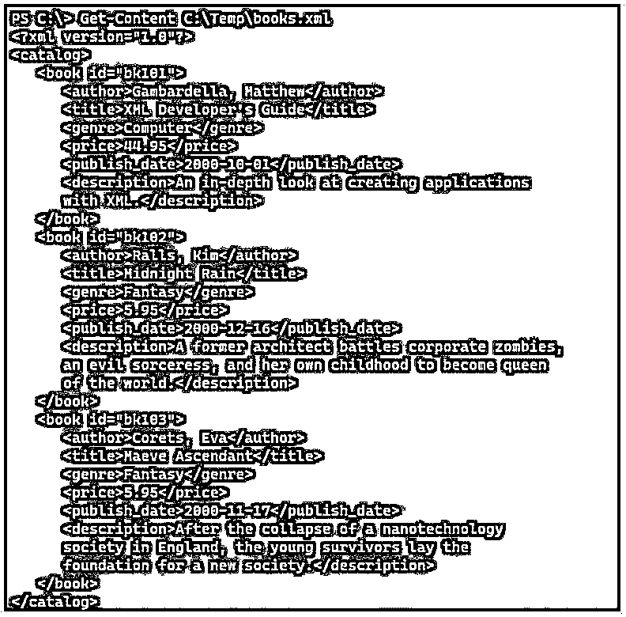

为了使用 Select-XML 方法或 DotNet 方法，我们需要将原始文件转换成 XML 格式。

有两种方法可以将文件转换成 XML。

*   类型变换

`$xmldoc = [xml](Get-Content C:\Temp\books.xml)`

*   使用添加类型方法

`$xml = New-Object -TypeName XML
$xml.Load('C:\Temp\books.xml')`

当我们使用 Select-XML 方法时，XPath 是必需的。

使用 XPath 选择根节点(目录)。

**代码:**

`Select-Xml -Xml $xml -XPath "/catalog"`

**输出:**

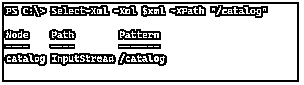

另一种导航方式是使用 DotNet 方法。

**代码:**

`$xml.catalog
book
----
{book, book, book}`

### PowerShell XML 解析示例

下面是提到的例子:

#### 示例#1

展开根节点。

用 Select-XML 方法展开根或第一个父节点(目录)。

**代码:**

`$xmldoc = [xml](Get-Content C:\Temp\books.xml)
Select-Xml -Xml $xmldoc -XPath "/catalog"`

**输出:**

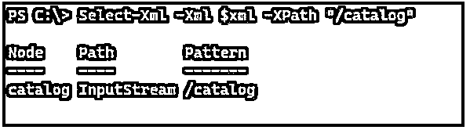

一旦我们得到上面的输出，我们需要扩展节点属性。

**代码:**

`Select-Xml -Xml $xmldoc -XPath "/catalog" | Select -ExpandProperty Node`

**输出:**

#### 实施例 2

使用 SelectNodes 方法。

我们可以使用 SelectNodes 方法从 XML 文件中进行搜索，而不是使用 Select-XML 方法。

**代码:**

`$xmldoc = [xml](Get-Content C:\Temp\books.xml)
$xmldoc.SelectNodes("/catalog")`

**输出:**

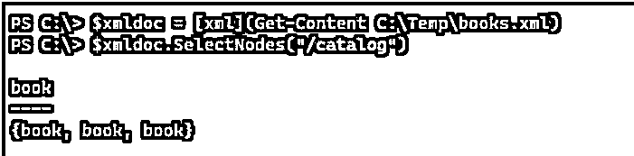

在上面的例子中，'/'提到了从根节点进行选择。在根节点，我们只有“目录”节点可用。如果我们使用“Book”节点，它不会给出任何输出，因为它不在根级别。

当我们在 xPath 方法中使用“//”语法时，它会从整个文档中选择该节点，而不管它们在哪里。

**代码:**

`PS C:\> $xmldoc.SelectNodes("//catalog")`

**输出:**

这将搜索所有目录节点。

上面的命令类似于。

**代码:**

`Select-Xml -Xml $xmldoc -XPath "//catalog" | Select -ExpandProperty Node`

和

**代码:**

`$xmldoc.catalog`

**输出:**

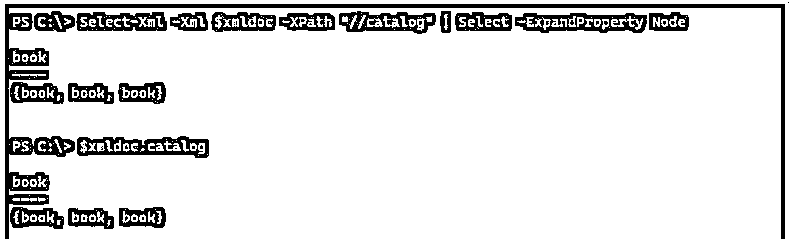

从 XML 文件中选择所有书籍。

**代码:**

`$xmldoc.SelectNodes("//book")`

**输出:**

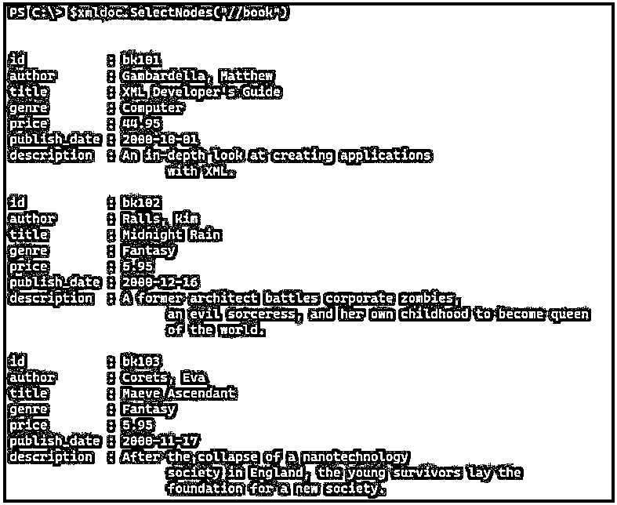

类似的命令

**代码:**

`Select-Xml -Xml $xmldoc -XPath "//book" | Select -ExpandProperty Node`

和

**代码:**

`$xmldoc.catalog.book`

从文件中选择所有作者。

**代码:**

`$xmldoc.SelectNodes("//author")`

**输出:**

类似的命令

**代码:**

`Select-Xml -Xml $xmldoc -XPath "//author" | Select -ExpandProperty Node`

和

**代码:**

`$xmldoc.catalog.Book.author`

**输出:**

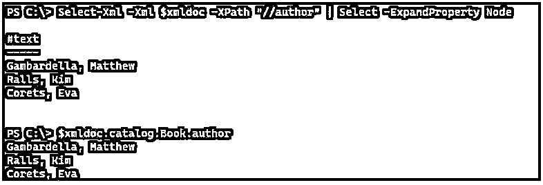

#### 实施例 3

使用 SelectSingleNode 方法。

SelectSingleNode 方法是获取特定节点的输出。默认情况下，如果没有提到索引，并且索引在 XML 中从 1 开始，则该命令选择数组的第一个输出。

**代码:**

`$xmldoc.SelectSingleNode('//book')`

**输出:**

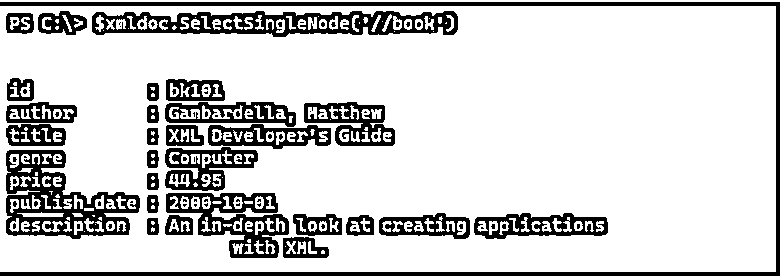

该命令类似于，

**代码:**

`$xmldoc.SelectSingleNode('//book[1]')`

或者

`Select-Xml -Xml $xmldoc -XPath "//book[1]" | Select -ExpandProperty Node`

或者

`$xmldoc.catalog.book[1]`

*   **选择另一个节点:**

假设我们想选择第二本书的作者，我们可以使用下面的例子。

**代码:**

`$xmldoc.SelectSingleNode("//book[2]/author")
Select-Xml -Xml $xmldoc -XPath "//book[2]/author"`

**输出:**

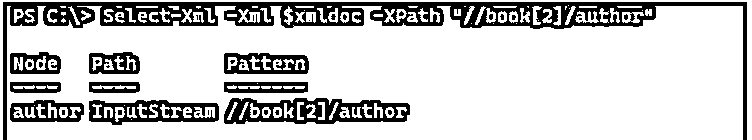

替代命令

**代码:**

`$xmldoc.catalog.book[2].author`

或者

`Select-Xml -Xml $xmldoc -XPath "//book[2]/author" | Select -ExpandProperty Node`

**输出:**

#### 实施例 4

选择特定属性。

在本例中，我们将选择一个特定的属性。我们需要在这里选择图书 id 为 bk103 的节点。

**代码:**

`$xmldoc.SelectNodes( "//book[@id='bk103']" )`

**输出:**

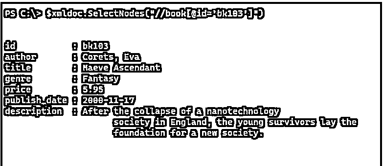

您还可以使用 Select-XML 和 dotnet 方法的替代命令，如下所示。

**代码:**

`Select-Xml -Xml $xmldoc -XPath("//book[@id='bk103']") | Select -ExpandProperty Node`

或者

`$xmldoc.catalog.book | where {$_.id -eq 'bk103'}`

**输出:**

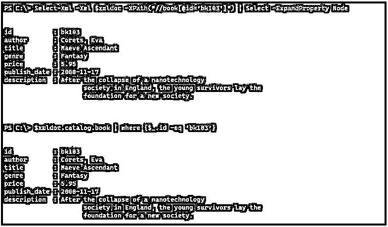

#### 实施例 5

选择多个元素。

要选择多个元素，我们可以使用下面的命令。

**代码:**

`$xmldoc.SelectNodes("//book/title | //book/author")`

或者

`$xmldoc.SelectNodes("//title | //author")`

上面的命令从 XML 文件中选择标题和作者。

**输出:**

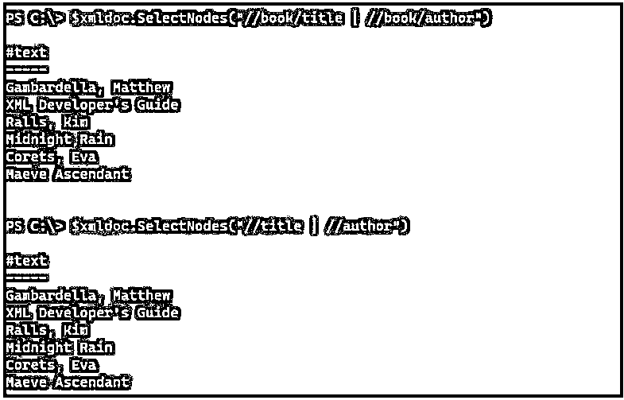

类似的命令

**代码:**

`Select-Xml -Xml $xmldoc -XPath ("//title | //author") | Select -ExpandProperty Node`

`$xmldoc.catalog.book | Select Title, Author`

**输出:**

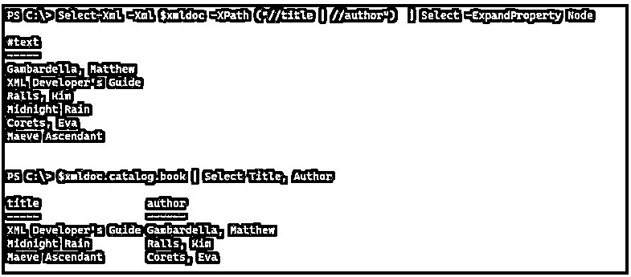

#### 实施例 6

单点和双点语法。

在 XPath 语法中，点(。)表示当前节点，而双点(..)表示当前节点的父节点。

**代码:**

`$xmldoc.SelectSingleNode("//catalog/.")`

**输出:**

上面的例子代表了当前节点。

**代码:**

`$xmldoc.SelectSingleNode("//catalog/..")`

**输出:**

上面的例子代表了父节点。

### 结论

PowerShell XML 解析方法在处理 XML 文档时非常有用，因此一旦在应用程序中使用它，应用程序就可以更容易地快速搜索和导航较大的文档，并且它对于 web 处理来说也非常快。

### 推荐文章

这是 PowerShell XML 解析指南。这里我们讨论一下入门，如何在 PowerShell 中进行 XML 解析？和示例。您也可以看看以下文章，了解更多信息–

1.  [PowerShell 睡眠](https://www.educba.com/powershell-sleep/)
2.  [PowerShell 子串](https://www.educba.com/powershell-substring/)
3.  [PowerShell 不像](https://www.educba.com/powershell-not-like/)
4.  [否则如果在 PowerShell 中](https://www.educba.com/else-if-in-powershell/)

