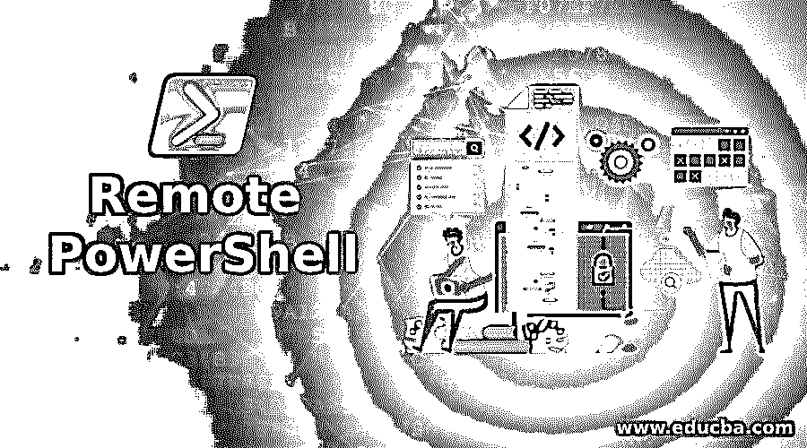
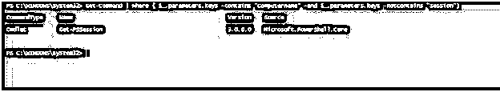
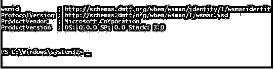
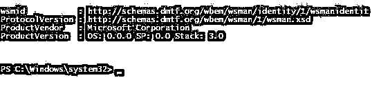
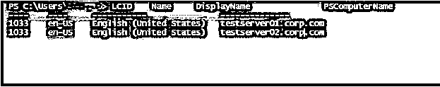
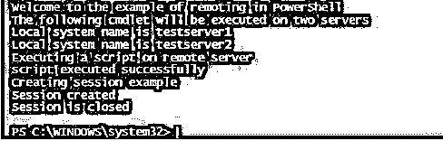

# 远程 PowerShell

> 原文：<https://www.educba.com/remote-powershell/>

## 远程 PowerShell 简介

PowerShell 不仅帮助管理员在本地系统或服务器上运行命令来管理环境，还允许用户连接到远程服务器或机器。PowerShell 的主要优势之一在于它使用各种技术的远程计算能力。PowerShell remoting 允许用户使用远程连接在任何 windows 系统上执行 PowerShell cmdlets 或脚本或执行任何其他操作。PowerShell core 支持并使用 Windows Management Instrumentation(WMI)、Secure Shell(SSH)或 WS- Management 等技术在远程系统中执行任务。本文将详细介绍如何使用 PowerShell 在远程系统中执行命令，以及与远程计算机建立连接的各种方式。

### 连接到远程系统的步骤

连接到远程系统的第一步是在目标机器上启用 PowerShell 远程工具。以上是通过在管理模式下打开 windows PowerShell 并运行以下 cmdlet 来实现的。

<small>Hadoop、数据科学、统计学&其他</small>

#### Enable-PSRemoting -Force

上面的 cmdlet 启动 WinRM 服务。这将允许传入连接到系统，并创建一个防火墙规则来实现这一点。如果不希望每个步骤都有提示，请运行带有 force 参数的 cmdlet。

如果源机器和目标机器在同一个域中，则只需要上述步骤。

如果系统没有连接到同一个域，还需要执行几个步骤。在此之前，必须在源将连接到的计算机上启用远程处理。

要使 PowerShell 远程处理功能正常工作，必须确保网络必须是专用网络，而不是公共网络。

则必须使用计算机上的可信主机设置来建立计算机(源和目标)之间的信任

使用以下 cmdlet 可以实现上述步骤

`Set-Item wsman:\localhost\client\trustedhosts`

在可信主机旁边，我们应该指定需要以逗号分隔的方式列出连接的计算机的 IP 地址。如果您想允许所有计算机连接，那么您应该使用通配符“*”。运行上述 cmdlet 后，必须重新启动 WinRM 服务，设置才能生效。这可以使用以下 cmdlet 来实现

#### 重新启动服务 WinRM

*   两个 cmdelts 都必须在所有源机器和目标机器上运行。
*   配置完成后，可以通过运行以下 cmdlet 来验证与远程计算机的连接:

`Test-WsMan <RemoteCOMPUTERName>`

*   在上面的 cmdlet 中指定必须与之建立连接的计算机名
*   如果连接成功，则返回目标系统的 WiRM 服务的状态。

在没有启用远程配置的情况下，很少有 cmdlets 可以在远程计算机上执行。这是因为这些 cmdlets 将计算机名作为参数。这些类型的 cmdlets 具有特定的通信协议，可以在所有 Windows 机器上工作。

以下是所提到类型的一些 cmdlets

*   重新启动计算机
*   get-wmio object
*   获得 WinEvent
*   测试连接

要在我们的会话中查找此类 cmdlet，可以使用以下 cmdlet

**代码:**

`Get-Command | where { $_.parameters.keys -contains "ComputerName" -and $_.parameters.keys -notcontains "Session"}`

**输出:**

#### 测试连接

为了测试远程配置的状态，我们可以尝试使用以下 cmdlet 连接到远程计算机。test-was man cmdlet 可用于检查 WinRM 服务是否正在目标计算机上运行。如果启用了该服务，将显示一条成功消息以及目标计算机的详细信息，否则将抛出一条错误消息。cmdlet 可以与目标系统的名称或 ip 地址一起使用。要在本地测试中测试 WinRM 服务的状态，可以使用 WSMan。

测试-WSMan 10.20.20.22

测试员

#### 连接和结束会话

要启动与远程计算机的会话，需要建立一个会话。建立会话后，命令提示显示名称将更改为与会话建立的计算机的显示名称。之后，在本地运行的命令在远程机器上执行，结果显示在本地计算机上。

输入-PSSession TestComputer。

要结束会话，请使用下面的 cmdlet

出口压力

#### 在远程计算机上运行命令

在某些情况下，可能需要在多个远程系统上运行相同的命令。为每一个都建立一个会话并执行它们是很乏味的。在这种情况下，可以使用 invoke-command cmdlet。这个 cmdlet 可以将多个计算机名或 IP 地址作为输入参数，执行这些命令并显示输出。

**代码:**

`Invoke-Command -ComputerName testserver1, testserver2 -ScriptBlock {Get-UICulture}`

**输出:**

#### 运行脚本

也有可能从本地系统之外的远程计算机上执行脚本。相同的调用命令可以用于执行相同的操作。该脚本应该位于运行该命令的本地系统上，也可以位于网络驱动器上。

invoke-Command-computer name test server 01，test server 02-file path c:\ Scripts \ test . PS1

在上面的命令中，脚本在提到的两台服务器上运行。

如果会话对象存储在变量中，那么任何命令都可以在其上运行。由于保存了会话，因此一个命令的输入可以传递给另一个命令。在这种情况下，会话不在本地计算机上。

`$test=New-PSSession -ComputerName testServer01, testServer02
Invoke-Command -Session $test {$test1 = Get-HotFix}`

可以使用 WSMan 提供程序建立高级远程处理。

**代码:**

`Write-Host "Welcome to the example of remoting in PowerShell"
Write-Host "The following cmdlet will be executed on two servers"
Invoke-Command -ComputerName testserver1,testeserver2 -ScriptBlock {Write-Host "Local system name is" $localhost}
Write-Host "Executing a script on remote server"
Invoke-Command -ComputerName Server01, Server02 -FilePath c:\Scripts\DiskCollect.ps1
Write-Host "script executed successfully"
Write-Host "Creating session example"
$cr=Get-Credential
$se = New-PSSession -Credential $cr -ComputerName testserver1,testserver2
Enter-PSSession $se
Write-Host "Session created"
Exit-PSSession
Remove-PSSession $sess
write-host "Session is closed"`

**输出:**

### 结论

因此，本文详细介绍了 PowerShell 中的远程处理。它解释了如何建立连接，连接到远程计算机之前需要完成的先决条件。它还用各种例子解释了如何在远程系统上运行命令，如何执行脚本等。为了更详细地了解，建议使用示例脚本。

### 推荐文章

这是远程 PowerShell 的指南。在这里，我们讨论远程 PowerShell 的介绍、连接到远程系统的步骤以及相应的示例。您也可以浏览我们的其他相关文章，了解更多信息——

1.  [PowerShell 获取服务](https://www.educba.com/powershell-get-service/)
2.  [PowerShell 模块](https://www.educba.com/powershell-modules/)
3.  [PowerShell 是什么？](https://www.educba.com/what-is-powershell/)
4.  [PowerShell 工具](https://www.educba.com/powershell-tools/)

