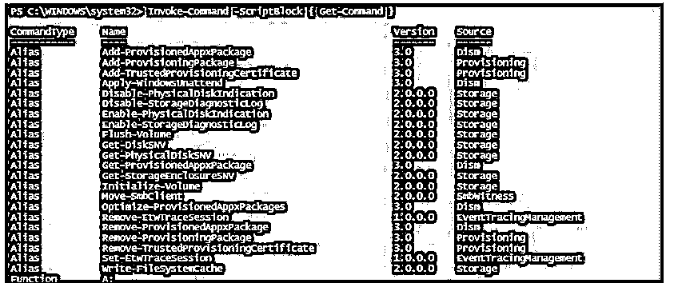
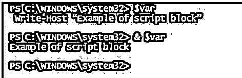
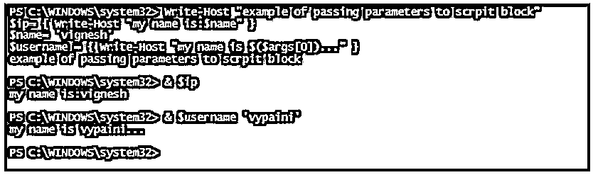
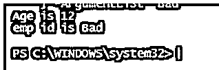
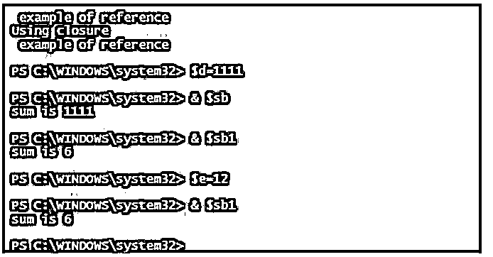
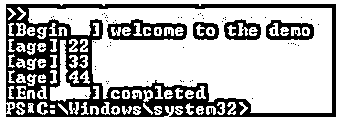
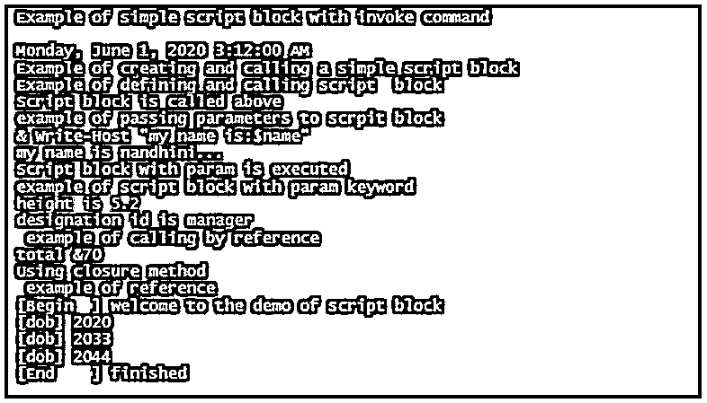

# PowerShell 脚本块

> 原文：<https://www.educba.com/powershell-scriptblock/>

## PowerShell scriptblock 简介

以下文章提供了 PowerShell scriptblock 的概述。包含在{}中的代码或语句的集合称为脚本块。也可以认为是一种表达。这使得开发人员更容易将代码分割成不同的部分，并且相同的代码可以很容易地在不同的地方使用。它就像一个函数，但是 scriptblock 没有名字。我们可以把 scriptblock 看作一个匿名函数。scriptblock 的主要优点是易于移植。像函数一样，scriptblock 可以接受输入参数和返回值。

### PowerShell 脚本块的语法

脚本块的定义如下:

<small>Hadoop、数据科学、统计学&其他</small>

`{
//statement1
//statement2
//statement3
// statement 4
// statement 5
}`

scriptblock 中 cmdlets 的输出以单个对象或数组的形式返回。

param 关键字用于表示 scriptblock 的输入参数，return 关键字表示返回值。一旦到达返回行，控件将从脚本块中退出

`{
Param([type]$Parameter1 [,[type]$Parameter2])
//statement1
//statement2
//statement3
//statement 4
//statement 5
Return
}`

scriptblock 是。某些 cmdlets 将脚本块作为参数。

**举例:**

**代码:**

`Invoke-Command -ScriptBlock { Get-Command }`

**输出:**

### 函数和脚本块的区别

函数和 scriptblock 的主要区别在于，函数不能赋给变量，而 scriptblock 可以作为值赋给变量。scriptblock 易于移植，因此应该明智地使用。

#### 示例:

函数声明和调用。

**代码:**

`Function test
{
Write-host “test function”
Write-host “No parameters to the function”
}`

调用函数。

**代码:**

`Test
Now lets see how to define and call a script block
$var={write-host “Example of script block” }
$var
& $var`

如果调用$var，将显示下面的输出。

**输出:**

要调用脚本块，必须使用符号。

### 将参数传递给 scriptblock

**代码:**

`Write-Host "example of passing parameters to scrpit block"
$ip= { Write-Host "my name is:$name" }
$name= 'vignesh'
$username = { Write-Host "my name is $($args[0])..." }`

**输出:**

#### 示例#1:

**代码:**

`Invoke-Command -ScriptBlock {
param(
$age = "12")
Write-Host "Age is $age" -ForegroundColor Green
}
Invoke-Command -ScriptBlock {
param(
$empid = "123")
Write-Host "emp id is $empid" -ForegroundColor Yellow
} -ArgumentList "Bad"`

**输出:**

假设一个变量在脚本块内部被调用，变量值在脚本块外部被改变，然后在脚本块内部被改变。这叫做引用设置。如果值不需要改变，就必须使用 GetNewClosure()方法。

#### 示例 2:

**代码:**

`write-Host " example of reference"
>$a=1
$b=2
$c=3
$d=$a+$b+$c
$sb= {"sum is $d"}
Write-Host "Using closure"
write-Host " example of reference"
$a1=1
$b2=2
$c3=3
$e=$a1+$b2+$c3
$sb1= {"sum is $e"}.GetNewClosure()`

**输出:**

### 开始流程和结束流程

像函数一样，Begin process 和 End 可以添加到 scriptblock 中。begin 块用于定义变量、路径等。流程块包含用于操作的代码。结束块正在清理代码。

#### 示例#1:

**代码:**

`$test = {
begin { '[Begin  ] welcome to the demo' }
process { "[age] $_" }
end { Write-Output '[End    ] completed' }
}
22, 33, 44 | & $test`

**输出:**

#### 示例 2:

**代码:**

`Write-Host "Example of simple script block with invoke command"
Invoke-Command -ScriptBlock { Get-Date }
Write-Host "Example of creating and calling a simple script block"
$test={write-host “Example of defining and calling script  block” }
& $test
Write-Host "Script block is called above"
Write-Host "example of passing parameters to scrpit block"
$ip= { Write-Host "my name is:$name" }
$name= "suriya"
Write-Host "&$ip"
$username = { Write-Host "my name is $($args[0])..." }
& $username 'nandhini'
Write-Host "Script block with param is executed"
Write-Host "example of script block with param keyword"
Invoke-Command -ScriptBlock {
param(
$height = "5.2")
Write-Host "height is $height" -ForegroundColor Green
}
Invoke-Command -ScriptBlock {
param(
$design = "manager")
Write-Host "designation id is $design" -ForegroundColor Yellow
} -ArgumentList "manager"
write-Host " example of calling by reference"
$age=10
$boy=24
$csa=36
$dsa=$age+$boy+$csa
$sb= {"sum is $dsa"}
Write-Host "total &$dsa"
Write-Host "Using closure method"
write-Host " example of reference"
$a1=1
$b2=2
$c3=3
$e=$a1+$b2+$c3
$sb1= {"sum is $e"}.GetNewClosure()
$inputs = {
begin { '[Begin  ] welcome to the demo of script block' }
process { "[dob] $_" }
end { Write-Output '[End    ] finished' }
}
2020, 2033, 2044 | & $inputs`

**输出:**

### 在脚本块中使用延迟绑定

当参数接受作为值或属性名的输入时，可以对该参数使用延迟绑定。可以使用变量$_ 在 scriptblock 内部引用管道对象。这有助于执行复杂的 cmdlets，其中允许一个对象生成其他参数。使用延迟绑定时，必须显式指定参数名称。参数不应是非类型化的，也不应是 scriptblock 或 object 类型。如果在未输入管道输入的情况下使用延迟绑定，将会引发错误。

### 结论–PowerShell 脚本块

因此，在本文中，我们看到了关于脚本块、定义脚本块、向脚本块添加和传递参数的详细信息。它还通过适当的例子展示了如何定义和调用脚本块。本文还包含了与 scriptblock 相关的各种其他相关示例。我们还看到了 scriptblock 中的延迟绑定及其用法。

### 推荐文章

这是 PowerShell scriptblock 的指南。这里我们讨论了函数和脚本块的简介、区别、向脚本块传递参数、开始进程和结束进程以及在脚本块中使用延迟绑定。您也可以看看以下文章，了解更多信息–

1.  [否则如果在 PowerShell 中](https://www.educba.com/else-if-in-powershell/)
2.  [PowerShell 发送邮件](https://www.educba.com/powershell-send-mail/)
3.  [PowerShell 获取服务](https://www.educba.com/powershell-get-service/)
4.  [PowerShell 字符串替换](https://www.educba.com/powershell-string-replace/)

