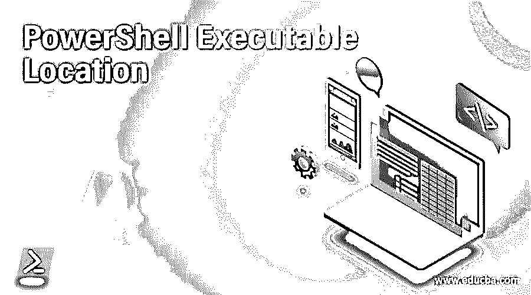
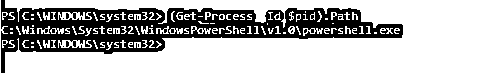

# PowerShell 可执行文件位置

> 原文：<https://www.educba.com/powershell-executable-location/>

## PowerShell 可执行文件简介

PowerShell.exe 是的可执行文件，由系统管理员用于配置管理和其他与任务自动化相关的活动。的。exe 代表可执行文件。一些可执行文件对系统有威胁，但是因为 Powershell.exe 是微软的产品，所以没有这样的危害。可执行文件可以执行 PowerShell cmdlets 和脚本。本文将详细介绍 PowerShell 的 exe 文件。

**语法:**

<small>Hadoop、数据科学、统计学&其他</small>

以下 cmdlet 可用于标识 exe 文件的位置

`(Get-Process -Id $pid).Path`

输出将如下所示

PowerShell.exe 是由微软签署的文件，因此可以相对假定它是安全的文件。这个文件的百分比可以被认为是危险的安全明智的是 3%。该文件的大小为 437 KB。PowerShell_Ise.exe 的大小是 208 KB。

### 64 位操作系统上的位置

以下是 64 位操作系统上的位置。

*   #### 32 位 PowerShell.exe:

它可在以下位置获得。

`%SystemRoot%\SysWOW64\WindowsPowerShell\v1.0\powershell.exe`

*   #### 64 位 Powershell.exe:

它可在以下位置获得。

`%SystemRoot%\system32\WindowsPowerShell\v1.0\powershell.exe`

*   #### 32 位 PowerShell_ISE.exe:

它可在以下位置获得。

`%SystemRoot%\SysWOW64\WindowsPowerShell\v1.0\powershell_ise.exe`

*   #### 64 位 Powershell_ISE.exe:

它可在以下位置获得。

`%SystemRoot%\system32\WindowsPowerShell\v1.0\powershell_ise.exe`

### 32 位操作系统中的位置

以下是 32 位操作系统中的位置。

*   #### 32 位 PowerShell.exe:

它可在以下位置获得。

`%SystemRoot%\system32\WindowsPowerShell\v1.0\powershell.exe`

*   #### 32 位 PowerShell_ISE.exe:

它可在以下位置获得。

`%SystemRoot%\system32\WindowsPowerShell\v1.0\powershell_ise.exe`

从 PowerShell 版本 6 开始，它被称为 PowerShell core，并且已经成为开源的，它使用。网芯。这个二进制文件在 windows 中被重命名为 pwsh.exe，在 mac 和 linux 中被重命名为 pwsh。

### 在系统中查找 PowerShell 位置

下面的 cmdlet 可以用来找出 exe 文件的位置。

**输入:**

`(get-command PowerShell.exe).Path`

**输出:**

**语法:**

`PowerShell[.exe]   [-PSConsoleFile <file> | -Version <version>]    [-NoLogo]    [-NoExit]    [-Sta]    [-Mta]    [-NoProfile]    [-NonInteractive]    [-InputFormat {Text | XML}]    [-OutputFormat {Text | XML}]    [-WindowStyle <style>]    [-EncodedCommand <Base64EncodedCommand>]    [-ConfigurationName <string>]    [-File - | <filePath><args>]    [-ExecutionPolicy <ExecutionPolicy>]    [-Command - | { <script-block> [-args <arg-array>] }     | { <string> [<CommandParameters>] } ]`

**参数:**

*   **-PSConsoleFile < FilePath > :**

这用于在控制台中加载文件指定的 PS 文件。要导入，必须指定 PS 文件的名称和路径。要创建一个新的，应该使用 export-console cmdlet。

*   **-版本< PowerShell 版本> :**

这表示需要启动的 Powershell 版本。可以是 2.0，也可以是 3.0。但是，提供的版本应该在系统上可用，否则将会引发错误。

*   技术:t1]

这用于在启动 PowerShell 时隐藏横幅。

*   **-NoExit:**

这表示 PowerShell 在运行 cmdlets 后不会关闭。

*   **-STA:**

这表示 PowerShell 应该使用单线程概念启动。在 PowerShell 2.0 版中，多线程是默认设置，而在 PowerShell 3.0 版中，单线程是默认设置。

*   **MTA:**

这表示 PowerShell 应该使用单线程概念启动。在 PowerShell 2.0 版中，多线程是默认设置，而在 PowerShell 3.0 版中，单线程是默认设置。

*   **-NoProfile:**

这表示不应加载 PowerShell 配置文件。

*   **非交互式:**

这表示在执行过程中不应该向用户显示提示。

*   **-输入格式{文本\ XML }:**

这指定了发送到 PowerShell 的输入格式。它可以是文本或 xml。

*   **-输出格式{文本\ XML }:**

这指定了从 PowerShell 发送的输出的格式。它可以是文本或 xml。

*   **-窗口样式<窗口样式> :**

这表示 PowerShell 窗口的样式。可接受的值有正常、最小化、最大化或隐藏。

*   **-配置名称<字符串> :**

这表示 PowerShell 的端点配置。这可以是本地计算机上的默认端点，也可以是与用户要求相关的自定义端点。

*   **-文件-|<文件路径> <参数> :**

如果指定了“-”，则考虑标准输入。如果 cmdlet 在没有“-”的情况下运行，则会启动正常会话。这就像在没有文件参数的情况下运行。万一 Record 可能是一种记录方式，脚本将在邻域范围内运行(“点源”)，因此脚本生成的容量和因子可在当前会话中访问。Record 必须是命令中的最后一个参数。在 Record 参数之后写入的所有值都被转换为脚本记录方式，并将参数传递给该脚本。在被当前 shell 翻译后，提供给脚本的参数作为严格的字符串发送。举例来说，如果您在 cmd.exe，需要传递一个环境变量 estimate，可以通过以下方式完成:powershell.exe-File . viki . PS1-test param test。如果该值是一个文件路径，那么它应该作为在参数之后指定的字符在末尾给出，默认情况下被视为文件路径。

*   **-执行策略<执行策略> :**

这用于设置当前会话的默认执行策略，它存储在环境变量$ env:PSExecutionPolicyPreference 中。但是，注册表中设置的值不会因此受到影响。

*   **-命令:**

这表示要执行的命令。这就像在 PowerShell 窗口中运行命令一样。要停止执行，必须设置 NOExit 参数。该参数的值可以是字符串或脚本块。如果该值为“-”，则从标准化输入中读取该值。如果值是字符串，则应该在末尾指定。只有从另一个 PowerShell exe 触发时，才会考虑脚本块。

### 结论

因此，本文详细解释了 PowerShell 可执行文件的各个位置。它还详细解释了 PowerShell.exe 及其各种参数。应该注意如何从命令提示符触发 PowerShell.exe。要了解更多细节，建议从 cmd 提示符下研究从 Powershell.exe 运行文件。

### 推荐文章

这是 PowerShell 可执行文件位置指南。这里我们讨论 PowerShell 可执行文件的介绍，PowerShell 可执行文件的不同位置。您也可以浏览我们的其他相关文章，了解更多信息——

1.  [PowerShell 导出 CSV](https://www.educba.com/powershell-export-csv/)
2.  [PowerShell 计数](https://www.educba.com/powershell-count/)
3.  [远程 PowerShell](https://www.educba.com/remote-powershell/)
4.  [PowerShell 启动进程](https://www.educba.com/powershell-start-process/)

