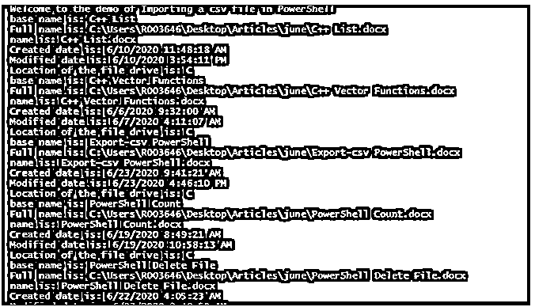
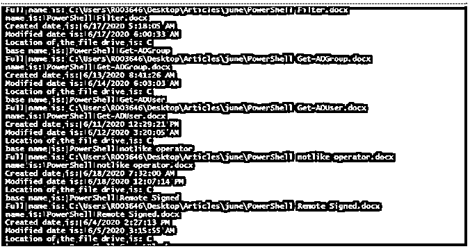
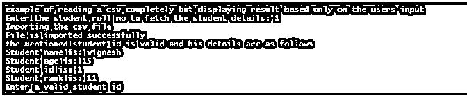
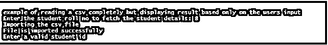
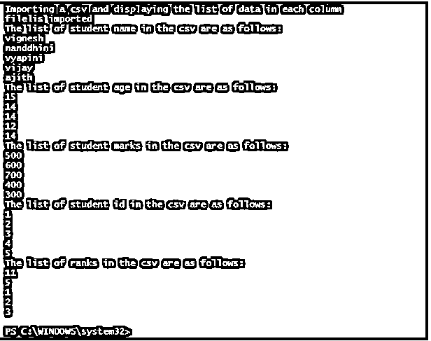

# PowerShell 导入-CSV

> 原文：<https://www.educba.com/powershell-import-csv/>

## PowerShell 导入简介-CSV

import-csv cmdlet 用于获取包含在逗号分隔文件中的信息，并创建类似表格的结构。导入数据后，将使用 foreach cmdlet 以逐行方式迭代 csv 的内容。没有必要导入文件的所有内容，可以应用过滤条件，只获取所需的值。本文将详细介绍如何在 powershell 中导入 csv 文件，对 csv 文件进行排序和过滤，以及不同的实现方式。

### 语法和参数

powershell import-csv 的语法和参数如下所示:

<small>Hadoop、数据科学、统计学&其他</small>

**语法:**

`Import-Csv   [[-Delimiter] <Char>]      [-Path] <String[]>      [-Header <String[]>]      [-Encoding <Encoding>]      [<CommonParameters>] Import-Csv   [[-Delimiter] <Char>      -LiteralPath <String[]>      [-Header <String[]>]      [-Encoding <Encoding>]      [<CommonParameters>]`

导入 csv 文件后，csv 文件中的每一列都被视为一个对象特性，每一行的值都对应于该特性的值。

**参数:**

*   **-分隔符:**表示用于分隔 csv 文件中的值的标记或字符。对于 csv 文件，分隔符的默认值是逗号(“，”)。其他值，如冒号(":")或分号("；")也可以。如果提供的分隔符与文件中存在的分隔符不匹配，则不会导入值，也不会创建相应的对象。此参数属于 char 数据类型。此参数不允许管道输入和通配符。
*   **-编码:**表示用于指定 csv 文件的编码工具。此参数的数据类型是编码。该参数不识别管道输入，并且不允许使用通配符。使用的默认编码类型是 UTF8NoBOM。其他可接受的值如下。
    *   bigendianunicode
    *   原始设备制造商
    *   utf8BOM 表
    *   utf8NoBOM
    *   utf7
    *   utf8
    *   utf32
    *   美国信息交换标准代码
*   **-表头:**表示导入记录的交换列表头推送。这决定了对象属性的名称。标题将以逗号分隔的格式提及。这些不应该用引号括起来。用单引号将每个列标题括起来。如果输入的标题计数小于 csv 中可用的数量，则 csv 中剩余的列将被丢弃。如果输入的值大于 csv 中可用的值，则提到的额外列将添加空值。使用割台参数时，从 CSV 记录中删除初始割台推送。另外，Import-Csv 从 header push 中的内容创建了一个附加问题。该参数的信息排序为 String[]。默认值为无。该参数不识别管道输入，并且不允许使用通配符。
*   **-LiteralPath:** 表示要导入的 csv 文件所在的路径。这不能是任何不同于其原始值的类型。不允许改动。它有两个别名，PSPath 和 LP。默认的尊重是无。它可以接受管道输入，但不允许使用通配符。
*   **-UseCulture:** 这表示当前区域性将被用作项分隔符。该参数的数据类型是 Switch。默认的尊重是无。不接受管道输入，也不允许使用通配符。

### PowerShell 导入示例-CSV

下面是一些例子:

#### 示例#1

**输入:**

`Write-Host "Welcome to the demo of Importing a csv file in PowerShell"
$file= Import-Csv -Path "C:\test.csv"
$i=0
foreach ($f in $file)
{
if ($i -lt 10)
{
Write-Host "base name is:" $f.BaseName
Write-Host "Full name is:" $f.FullName
Write-Host "name is:" $f.Name
Write-Host "Created date is:" $f.CreationTime
Write-Host "Modified date is:" $f.LastAccessTime
Write-Host "Location of the file drive is:" $f.PSDrive
$i+=$i
}
}`

**输出:**

在上面的示例中，file CSV 文件被导入并存储在 file 变量中。然后循环 csv 文件的每一行。$f 表示正在访问的 csv 的当前行，要访问相应的行值$f，使用相应的标题或列。

#### 实施例 2

**输入:**

`Write-Host "example of reading a csv completely but displaying result based only on the users input"
$studentid= Read-Host "Enter the student roll no to fetch the student details"
Write-Host "Importing the csv file"
$file= Import-Csv -Path "C:\Users\R003646\Desktop\Articles\June\Student.csv"
Write-Host "File is imported successfully"
foreach ($row in $file)
{
if ($row.Sid -contains $studentid)
{
Write-Host "the mentioned student id is valid and his details are as follows" -ForegroundColor Green
Write-Host "Student name is:" $row.Sname
Write-Host "Student age is:" $row.Sage
Write-Host "Student id is:" $row.Sid
Write-Host "Student rank is:" $row.Srank
}
else
{
Write-Host "Enter a valid student id"
break;
}
}`

**输出:**

在上面的例子中，用户被提示他想要查看的学生详细信息。如果输入了 csv 中可用的有效学生编号，则会显示相应的学生详细信息。如果输入的学生编号不在 csv 中，则显示第二个输出。

#### 实施例 3

**输入:**

`Write-Host "Importing a csv and displaying the list of data in each column"
$file= Import-Csv -Path "C:\Users\R003646\Desktop\Articles\June\Student.csv"
Write-Host "file is imported" -ForegroundColor Green
write-host "The list of student name in the csv are as follows:" -ForegroundColor Green
$file.Sname
write-host "The list of student age in the csv are as follows:" -ForegroundColor Green
$file.Sage
write-host "The list of student marks in the csv are as follows:" -ForegroundColor Green
$file.Smarks
write-host "The list of student id in the csv are as follows:" -ForegroundColor Green
$file.Sid
write-host "The list of ranks in the csv are as follows:" -ForegroundColor Green
$file.Srank`

**输出:**

### 结论

因此，本文详细解释了 PowerShell 中的 import-CSV cmdlet。它详细解释了各种参数、数据类型和语法，并给出了适当的例子。要了解更多细节，建议编写示例脚本并练习它们。

### 推荐文章

这是 PowerShell 导入指南-CSV。在这里，我们还将讨论 powershell import-csv 的简介、语法和参数，以及不同的示例和代码实现。您也可以看看以下文章，了解更多信息–

1.  [PowerShell 不像](https://www.educba.com/powershell-not-like/)
2.  [PowerShell 过滤器](https://www.educba.com/powershell-filter/)
3.  [PowerShell 删除文件](https://www.educba.com/powershell-delete-file/)
4.  [PowerShell 导出 CSV](https://www.educba.com/powershell-export-csv/)

