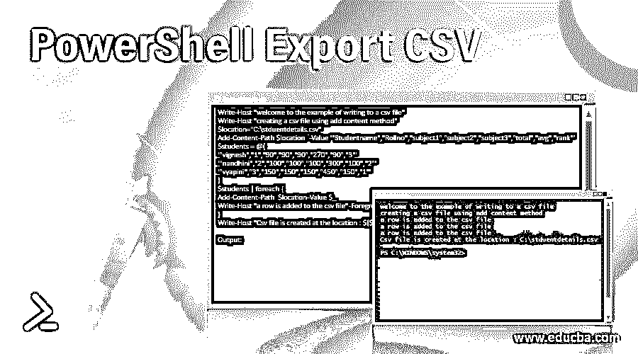
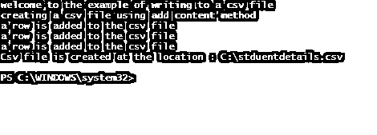
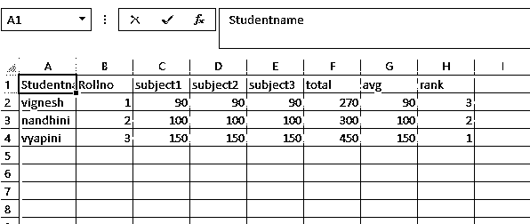
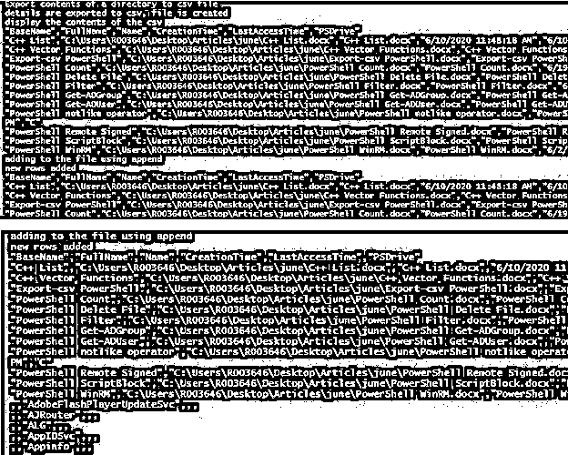
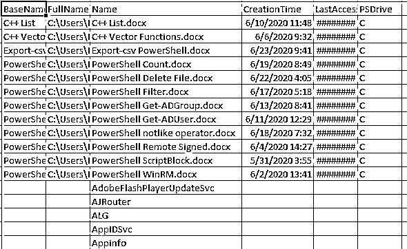

# PowerShell 导出 CSV

> 原文：<https://www.educba.com/powershell-export-csv/>

## PowerShell 导出 CSV 简介

将信息组织成易于阅读的结构的最简单的方法之一是使用逗号分隔值(CSV)文件。一个 CSV 文件可以被认为是一个没有任何杂音的电子表格，它由一行标题组成，显示列标题和每一列的值，用逗号分隔。PowerShell 中有多种方法可以将数据导出到 csv 中。add-content cmdlet 可用于在 csv 中存储值，但最合适的是使用 Export-Csv cmdlet。

### 语法和参数

以下是 PowerShell 导出 CSV 的语法和参数:

<small>Hadoop、数据科学、统计学&其他</small>

#### 句法

`Export-Csv -InputObject <PSObject> [[-Path] <String>] [-LiteralPath <String>] [-Force] [-NoClobber] [-Encoding <Encoding>] [-Append] [[-Delimiter] <Char>] [-IncludeTypeInformation] [-NoTypeInformation] [-QuoteFields <String[]>] [-UseQuotes <QuoteKind>] [-WhatIf] [-Confirm] [<CommonParameters>]`

`Export-Csv -InputObject <PSObject> [[-Path] <String>] [-LiteralPath <String>] [-Force] [-NoClobber] [-Encoding <Encoding>] [-Append] [-UseCulture] [-IncludeTypeInformation] [-NoTypeInformation] [-QuoteFields <String[]>] [-UseQuotes <QuoteKind>] [-WhatIf] [-Confirm] [<CommonParameters>]`

#### 因素

*   **Append:** 该参数表示需要将输出添加到文件中的现有数据中。如果不使用该参数，内容将被覆盖。这个参数的信息分类是一个开关。默认的尊重是无。该参数不承认管道输入，而且不允许使用通配符。
*   **确认:**该参数用于安全目的。如果使用此 cmdlet，将在运行此 cmdlet 之前要求用户确认。这将防止任何灾难的发生。这个参数的信息分类是一个开关。Cf 是表示该参数的另一种方式。默认的尊重是无。该参数不承认管道输入，而且不允许使用通配符。
*   **分隔符:**表示用于区分值的符号或字符。对于 csv 文件，默认情况下是逗号(，)。其他符号，如:或者:也可以。这个参数的信息类型是 char。该参数不承认管道输入，而且不允许使用通配符。
*   **编码:**这表示将值导出到 csv 文件时使用的编码机制。这个参数的信息分类是编码。该参数不承认管道输入，而且不允许使用通配符。使用的默认编码类型是 UTF8NoBOM。其他值是 utf7、utf8、utf32，分别表示 utf7、8 和 32 格式的编码。Ascii，表示 7 位字符集编码格式。其他类型有 bigendianunicodes、oem、utf8BOM 和 utf8NoBOM。
*   **Force:** 当需要覆盖已有的 csv 时，可以使用该参数。当 force 参数与 append 参数一起使用时，不匹配的属性不会写入 csv。该参数的信息类型是开关。该参数不承认管道输入，而且不允许使用通配符。该参数的默认值为 none。
*   **incluteypeinformation:**这表示列的数据类型以及将要存储的值。换句话说，标头包含类型。该参数的信息类型是开关。该参数不承认管道输入，而且不允许使用通配符。这个参数的别名是 ITI。
*   **Inputobject:** 这是指需要传递给 csv 文件的对象或值。这个参数的信息排序是 PSObject。该参数确认管道输入，而且不允许使用通配符。该参数的尊重值为 none。
*   **LiteralPath:** 这表示导出的 csv 将被存储的位置。路径不能包含通配符。该参数有两个别名 PSPath 和 LP。None 是这个参数的值。该参数不承认管道输入，而且不允许使用通配符。
*   **NoClobber:** 当需要不覆盖已有文件时，必须使用该参数。如果不使用，现有文件将被替换，而不要求用户确认。该参数的尊重值为 none。该参数不承认管道输入，而且不允许使用通配符。
*   **路径:**该参数为必选项。这表示将存储文件的存储位置。该参数的信息类型是字符串。该参数不承认管道输入，而且不允许使用通配符。尊重值为无。
*   **QuoteFields:** 这表示需要用双引号括起来的列的字段名称。该参数的信息排序为 string[]。该参数不承认管道输入，而且不允许使用通配符。尊重值为无。这个参数的别名是 QF。
*   **使用报价:**有报价需求时使用。它可以是这三个值中的任何一个。从不，总是和根据需要。它以另一种方式被称为 UQ。该参数不承认管道输入，而且不允许使用通配符。尊重值总是。

### 实现 PowerShell 导出 CSV 的示例

下面是提到的例子:

#### 示例#1

**代码:**

`Write-Host "welcome to the example of writing to a csv file"
Write-Host "creating a csv file using add content method"
$location="C:\stduentdetails.csv"
Add-Content -Path $location   -Value '"Studentname","Rollno","subject1","subject2","subject3","total","avg","rank"'
$students = @(
'"vignesh","1","90","90","90","270","90","3"'
'"nandhini","2","100","100","100","300","100","2"'
'"vyapini","3","150","150","150","450","150","1"'
)
$students | foreach {
Add-Content -Path  $location -Value $_
Write-Host "a row is added to the csv file" -ForegroundColor Green
}
Write-Host "Csv file is created at the location : $($location)" -ForegroundColor Green`

**输出:**

#### 实施例 2

创建并附加到 csv

**代码:**

`Write-Host "Export contents of a directory to csv file"
Get-ChildItem -Path C:\Users\R003646\Desktop\Articles\june  -Recurse | Select-Object BaseName, FullName, Name,CreationTime,LastAccessTime,PSDrive | Export-Csv -Path c:\test.csv -Encoding ascii -NoTypeInformation
Write-Host "details are exported to csv, file is created"
Write-Host "display the contents of the csv"
Get-Content -Path c:\test.csv
Write-Host "adding to the file using append"
Get-Service | Select-Object -First 5 | Foreach-Object {
$_ | Select-Object Name, status,DisplayName | Export-CSV -Path C:\test.csv -Append -Force
}
Write-Host "new rows added"
Get-Content -Path c:\test.csv`

**输出:**

### 结论

因此，本文详细介绍了 PowerShell 中的 export-csv cmdlet。它还用几个例子解释了如何创建一个 csv 文件，以及如何向其中添加一个新行。要了解更多细节，建议编写示例脚本并练习它们。

### 推荐文章

这是 PowerShell 导出 CSV 的指南。这里我们讨论 PowerShell 导出 CSV 的介绍，包括语法、参数和示例。您也可以浏览我们的其他相关文章，了解更多信息——

1.  [PowerShell Set-Location](https://www.educba.com/powershell-set-location/)
2.  [PowerShell 副本-项目](https://www.educba.com/powershell-copy-item/)
3.  [PowerShell 所在对象](https://www.educba.com/powershell-where-object/)
4.  [PowerShell 设置-内容](https://www.educba.com/powershell-set-content/)

