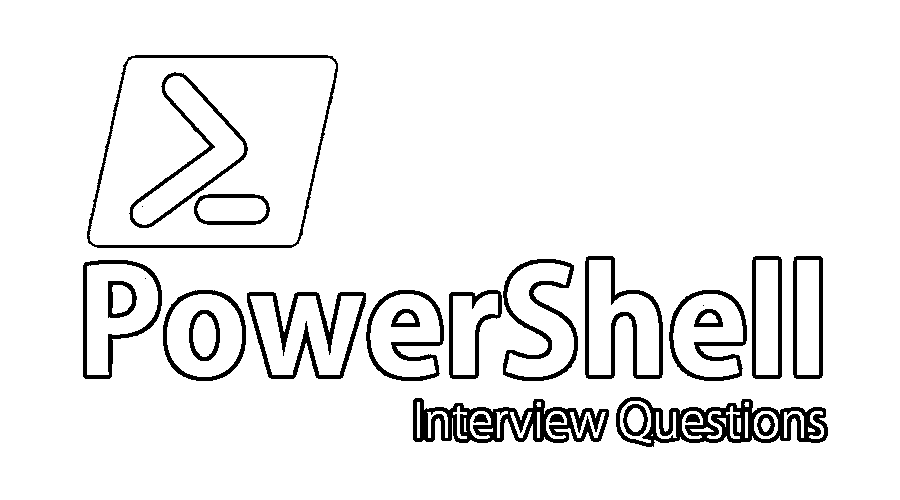

# PowerShell 面试问题

> 原文：<https://www.educba.com/powershell-interview-questions/>

## PowerShell 面试问答介绍

PowerShell 是由著名软件公司微软创建的任务自动化软件和配置管理框架。它由命令行外壳和相关的脚本语言组成。早先，PowerShell 只是一个 Windows 组件，它被称为 Windows PowerShell，但后来它被开源了。之后还推出了 PowerShell Core。现在 PowerShell 是一个跨平台的框架。它建在。最新的版本是建立在。网芯。PowerShell 提供了对 COM 和 WMI 的完全访问等功能，使管理员能够在本地和远程 Windows 系统上执行许多管理任务。它还提供了一个托管 API，PowerShell 运行时可以使用该 API 将其他应用程序嵌入其中。然后，这些应用程序最大限度地利用 PowerShell 功能来实现某些操作，其中可能包括图形界面等。

现在，如果你正在寻找一份与 PowerShell 相关的工作，那么你需要准备 2022 年 PowerShell 面试问题。的确，每个面试都因不同的职位而不同。在这里，我们准备了重要的 PowerShell 面试问题和答案，将帮助您在面试中取得成功。

<small>Hadoop、数据科学、统计学&其他</small>

在这篇 2022 PowerShell 面试问题文章中，我们将提出 10 个最重要和最常用的 PowerShell 面试问题。这些面试问题分为以下两部分:

### 第 1 部分 PowerShell 面试问题(基础)

这第一部分包括基本的面试问题和答案。

#### Q1。解释一下你对 PowerShell 的理解？

**回答**:

*   PowerShell 是一个考虑到系统管理员需求而设计的 Shell。
*   它是开源和平台独立的，即适用于 Windows/Linux/Mac。
*   它是面向对象的，不是基于文本的。
*   它是建立在. NET 框架之上的。
*   它有一个交互式的提示和一个脚本环境。

#### Q2。解释执行策略和执行策略的类型？

**回答** :
这是面试中常见的面试问题。PowerShell 中有 6 种类型的执行策略。这些是:-

*   **受限:**这是默认类型。在这种情况下，PowerShell 也不会运行任何脚本，包括 PowerShell 配置文件。
*   **RemoteSigned:** PowerShell 将只运行任何本地创建的脚本。任何来自 Internet 的脚本都应该使用签名证书代码进行数字签名，并且应该被计算机信任。
*   **AllSigned:** PowerShell 将只运行任何使用可信代码签名证书进行了数字签名的脚本。
*   **无限制:** PowerShell 会运行任何脚本。如果脚本来自不可信的来源，系统会提示用户执行一次。
*   **Bypass:** 该策略将运行任何脚本，没有任何问题或提示。
*   **Undefined:** 在当前范围内没有为此设置执行策略。

#### Q3。PowerShell 评估执行策略的顺序是什么？

**回答** :
Windows PowerShell 有以下优先顺序的执行策略

*   **组策略**:例如计算机配置。
*   **组策略**:例如用户配置。
*   **执行策略**:如流程(或 PowerShell.exe-执行策略)——当前作用域。
*   **执行策略**:比如当前用户——保存在 HKCU 注册表中。
*   **执行策略**:比如本地机器——保存在 HKLM 注册表中。

#### Q4。解释 CIM 与 WMI 的区别。

**回答**:

| **老 WMI** | **新 WMI** | **CIM** |
| 它具有完整形式的 Windows 管理工具。 | 它具有完整形式的 Windows 管理工具。 | 它具有完整形式的公共信息模型。 |
| 老 WMI 实际上是微软对 CIM 的最初实现。 | 新 WMI 与 WMF v3 一起在 2012 年发布，它符合新的 CIM 标准。 | 它是供应商中立的、行业标准的管理信息表示方式。 |
| 它是由微软开发的。 | 它也是由微软开发的。 | 它是由另一家名为 DMTF 的公司开发的。 |
| 从 PowerShell v1 开始就有了。 | PowerShell v3 中引入了它。 | 不可用。 |
| 它使用 DCOM 或分布式 COM)和 RPC 远程过程调用。 | 它使用 WSMan，这样就不会再出现 DCOM 错误。 | 它使用由 DMTF 开发的标准 WSMan。 |
| 它只适用于 Windows。 | 这也仅适用于 Windows。 | 它可以在任何平台上工作。 |
| 它有 RPC 端口- 135 可供使用。 | 它有 WSMan 端口–5985(HTTP)和 5986(HTTPS)可供使用。 | 它使用 WSMan 端口–5985(HTTP)和 5986(HTTPS)来实现其目的。 |

#### Q5。进一步，区分 WMI 的新旧观念。

**回答** :
**老 WMI**

*   使用旧式的本机代码提供程序和自己的存储库。
*   如前所述，仅在 Windows 上可用。
*   它已经或多或少地被弃用，这意味着它没有专注于进一步的改进或开发。

**新 WMI**

*   支持旧式的本机代码提供者和存储库，以及所讨论的新式 MI 提供者。
*   如前所述，仅在 Windows 上可用。
*   这是前进的方向。它与远程机器有着本质上的无状态关系。

### 第 2 部分 PowerShell 面试问题(高级)

现在让我们来看看高级面试的问题和答案。

#### Q6。区分 OMI 和 CIM。

**回答**:
T3】OMI

*   它使用 WS-MAN，其中 OMI 代码包括 WS-MAN 的协议栈。它仅支持新型 MI 提供程序。
*   它可以在任何实现平台上使用。如果某种东西能和 OMI 对话，它也能和新 WMI 对话。

**CIM**

*   它定义了标准。它是由 DMTF 创造的。
*   在这种情况下，早期版本实际上是由微软作为旧 WMI 实现的，但是最新版本由微软和其他公司在新 WMI 和 OMI 实现。

#### Q7。区分 WinRM、WSMan 和 DCOM。

**回答** :
这是在面试中最常被问到的 PowerShell 面试问题。

**WSMan**

*   WS-Management 缩写为 WSMAN 或 Web Services-Management 基本上是一个分布式管理任务组。
*   它是一个开放标准，定义了基于 SOAP(完整形式的简单对象访问协议)的协议，用于管理其服务器、设备、应用程序以及各种 Web 服务。

**WinRM**

*   WinRM 是来自 Windows Vista 的一项功能，它允许管理员远程运行管理脚本。
*   它可以使用 WS-Management 协议处理远程连接。

**DCOM**

*   DCOM 的意思是分布式 COM。
*   它用于连接远程机器上的活动对象。
*   它使用的 RPC 协议是为持续的来回消息传递而设计的。
*   这是网络和内存效率低下。

#### Q8。你所理解的自动变量是什么？

**回答**:

*   自动变量是那些描述存储 PowerShell 状态信息的变量的变量。
*   这些变量主要由 PowerShell 自己创建和维护。

一些非常常见的自动变量如下:

*   **$ $–**此变量包含会话接收的最后一行中的最后一个可用令牌。
*   **$？–**这可能包含上一次操作的执行状态。如果上一次操作成功，其值为 TRUE 如果失败，其值为 FALSE。
*   **$^—**它可能包含会话接收到的最后一行的第一个令牌。

#### Q9。什么是$Error 和$ForEach 变量？

**回答**:
**$ Error**–这个变量包含一个 Error 对象数组，表示最近的错误。最近的错误是数组中的第一个错误。

**$ ForEach**–该变量包含每个循环的枚举器(不应与结果值混淆)。枚举器的属性和方法可以用于$ForEach 变量的值。这种变量仅在 for each 循环处于运行状态时存在，一旦循环完成，它就会被删除。

#### Q10。$Home 和$PID 是什么？

**回答**:
**$ Home**–该变量包含用户主目录的完整路径。该变量可被视为 windows 中的%homedrive%%homepath%环境变量的等效变量，例如 C:\Users < UserName。

**$ PID**–这可能包含托管当前 Windows PowerShell 会话的进程的进程标识符。

### 推荐文章

这是 PowerShell 面试问题和答案列表的指南，以便候选人可以轻松解决这些 PowerShell 面试问题。在这篇文章中，我们研究了在面试中经常被问到的 PowerShell 面试问题。您也可以阅读以下文章，了解更多信息——

1.  [JIRA 面试问题–前 10 名](https://www.educba.com/jira-interview-questions/)
2.  [SOAP Web 服务面试问题](https://www.educba.com/soap-web-services-interview-questions/)
3.  [IT 面试问题–前 10 名](https://www.educba.com/it-interview-questions/)
4.  [Asp.Net MVC 面试问题](https://www.educba.com/asp-dor-net-mvc-interview-questions/)

