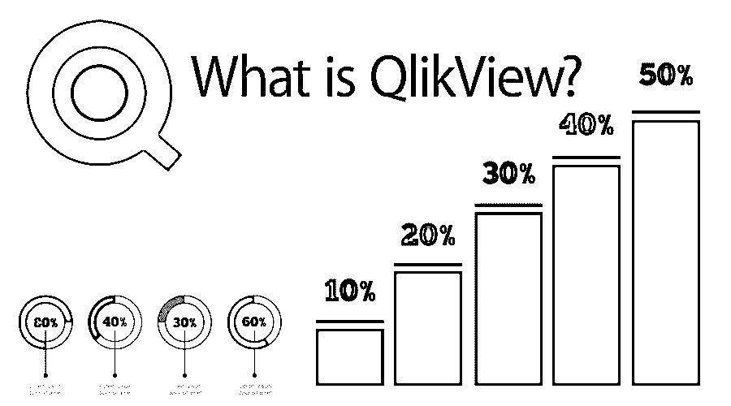

# 什么是 QlikView？

> 原文：<https://www.educba.com/what-is-qlikview/>

## 什么是 QlikView？

QlikView 是一个业务发现平台，为所有企业用户提供自助式 BI。您可以通过 QlikView 分析您的数据并使用您的数据结果来支持决策。它使你能够提出自己的问题并回答它们，跟随自己的洞察力之路，并与你和你的同事一起做决定。我们的专利软件引擎是 QlikView 的核心，可生成新的飞行数据。它压缩信息并存储在内存中，多个用户可以立即搜索它。

### 了解 QlikView

无论是从文件加载还是执行一条 select 语句，这都不会对生成的表产生任何影响。在 QlikView 中，顺序无关紧要；在实施 QlikView 逻辑的情况下，语句所选字段的顺序以及原始数据库表格中可用字段的顺序是任意的。在这种情况下，建立关联是强制性要求之一。因此，必填字段 name 用于标识和帮助创建实现商业智能逻辑的关联。

<small>Hadoop、数据科学、统计学&其他</small>

### QlikView 如何让工作变得如此简单？

在您的系统中学习和实现非常容易。首先，在您的系统中下载 QlikView install 属性。它会在你下载的位置自动附带一个教程文件夹。该教程将包含一些如何根据业务需求轻松设置和执行 QlikView 的 PDF 文件。任何一个有软件基础知识的人都可以开始同样的工作；然后，如果您对特定的业务规则编写技巧有基本的了解，他们可以很容易地在 QlikView 工具中准备一些像样的业务视图。但是，要实现一些高级功能，时间和经验是非常必要的。

### 使用 QlikView 可以做什么？

它是业务规则开发的流行平台之一。它主要为任何组织的任何类型的业务使用提供自助 BI 设施。这主要提供了分析一些数据的工具，并且可以使用它们的数据字典来生成一些决策报告。

### 使用 QlikView

下面提供了一些重要的实用程序:

1.  加载大量数据。
2.  帮助加载和传输需要来自不同数据源的数据。
3.  加载脚本，帮助存储数据信息以及这些数据来自的特定数据源。
4.  其中一个很大的用途是，如果业务用户希望仅使用 QlikView 文件并愿意在该文件上进行分析以准备分析报告，则根本不需要打开脚本文件。他们可以不做任何改变直接使用。

### QlikView 的优势

一些主要优势:

1.  它主要使用内存模型存储数据。
2.  能够非常顺利地处理或修改一些庞大的数据集，并确保准确性。
3.  强大的数据过滤模块。
4.  对所有数据集的强大搜索机制，无论数据是直接还是间接可用。
5.  与任何其他业务发现平台相比，拥有更快和更强大的可视化能力。

### 所需技能

为了更快地理解它，可能需要一些关键知识:

1.  [SQL 查询基础知识](https://www.educba.com/what-is-sql/)要求。
2.  在高级自动化或宏实用程序的情况下，有时需要 VB 脚本知识。
3.  基本的数据模型知识会有所帮助。
4.  理解大数据类型。
5.  很强的业务理解能力，特别是在编写规则的情况下。
6.  设计特定的布局。
7.  努力工作和适当的练习将是任何新工具的关键点。

### 我们为什么要使用 QlikView？

它主要用于存储政府相关的重要数据，保证安全。由于该工具非常易于在任何类型的企业中使用，可以立即开发自己的报告，因此它始终是一个企业就绪产品。它保存着一些关键的治理数据和特定规则，因此它为所有其他组织提供了使用这些特定于政府的数据并在分析时正确定义规则的工具。

### 范围

它是一个非常强大的 BI 工具；目前市场上有各种各样的机会。有经验的候选人能够在像 VB 脚本或 JavaScript 或宏之类的高级水平上专门运用他们的知识。或者他们可以轻松地为特定认证 QlikView 开发人员或管理人员制定计划。否则，任何其他流行的 BI 工具或数据仓库，或 ETL 工具将是他们的一些很好的选择。

### 我们为什么需要 QlikView？

使用它的一些主要原因是:

1.  成本效益。如果我们要与其他可用的流行商业智能工具进行比较，那么它显然成本较低，但提供了比其他工具更好的可视化。
2.  非常方便用户。因此，对于没有任何特定技术背景的商务人士来说很容易理解。
3.  它不使用任何类型的立方体概念。加载所有原始表和数据。
4.  将数据保存在内存中以备将来使用。

### 谁是学习 QlikView 技术的合适受众？

目标受众可以是企业的业务用户和决策者。一些技术人员也包括在内，以获得更高层次的理解。

### 这项技术将如何帮助你的职业发展？

它始终是一个非常受欢迎和强大的 BI 工具，因此在 It 方面的经验肯定会为多个 BI 智能工具的不同机会提供候选人。QlikView 中有一些参加认证的选项，可以随时为他们的职业发展提供娱乐。但是最好去学习一些关键的相关技术，比如 VB Script 或 JavaScript 之类的东西，这样就可以更好地利用这个工具的高级功能。

### 结论

它允许从事多种业务的不同公司分析整个市场数据，以确定哪些特定活动将有助于他们在当前场景中实现更好的销售。它可以提供那些结果非常快和适当的灵活的方法。以便组织销售和市场营销人员可以基于分析结果更灵活地瞄准他们的销售方法。

### 推荐文章

这是什么是 QlikView 的指南？.在这里，我们讨论了 QlikView 的工作原理、范围、优势及其理解。您也可以浏览我们推荐的其他文章，了解更多信息——

1.  [QlikView 面试问题](https://www.educba.com/qlikview-interview-questions/)
2.  [什么是大数据和 Hadoop](https://www.educba.com/what-is-big-data-and-hadoop/)
3.  [Qlikview Dashboard](https://www.educba.com/qlikview-dashboard/)
4.  [QlikView 备选方案](https://www.educba.com/qlikview-alternatives/)
5.  [QlikView 功能](https://www.educba.com/qlikview-functions/)
6.  [如何使用 QlikView Concatenate？](https://www.educba.com/qlikview-concatenate/)
7.  [QlikView 架构指南](https://www.educba.com/qlikview-architecture/)

